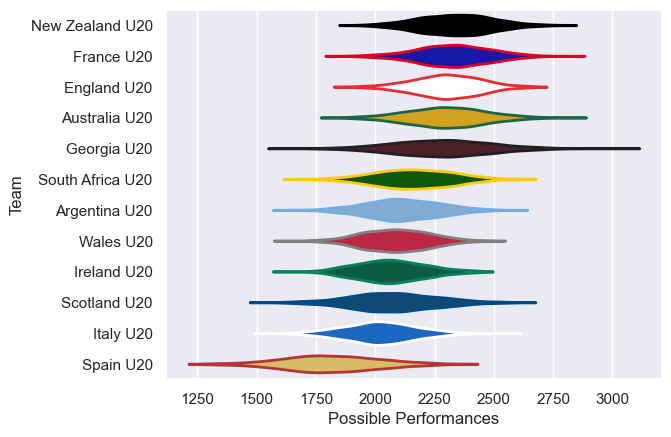

---  
title: "U20 Championship 2025 Status"  
date: 2025-06-17 6:00:00 -0500  
categories: model review projection  
layout: article  
aside:  
    toc: true  
---
# Current Team Rankings

# Standings

## Projected Remaining Table

| Club             |   To Play |   Projected Wins |   Projected Differential |   Projected Losing Bonus Points | Projected Try Bonus Points   |   Projected Competition Points |
|:-----------------|----------:|-----------------:|-------------------------:|--------------------------------:|:-----------------------------|-------------------------------:|
| France U20       |         3 |            2.105 |                   32.36  |                           0.423 |                              |                          9.015 |
| New Zealand U20  |         3 |            1.979 |                   23.627 |                           0.429 |                              |                          8.569 |
| England U20      |         3 |            1.928 |                   19.256 |                           0.458 |                              |                          8.366 |
| Australia U20    |         3 |            1.613 |                    8.677 |                           0.576 |                              |                          7.244 |
| Argentina U20    |         3 |            1.523 |                    3.801 |                           0.525 |                              |                          6.807 |
| Georgia U20      |         3 |            1.467 |                    0.192 |                           0.535 |                              |                          6.643 |
| Wales U20        |         3 |            1.319 |                   -4.169 |                           0.522 |                              |                          6.018 |
| South Africa U20 |         3 |            1.258 |                   -6.978 |                           0.598 |                              |                          5.842 |
| Italy U20        |         3 |            1.177 |                  -10.115 |                           0.591 |                              |                          5.545 |
| Ireland U20      |         3 |            1.138 |                  -13.704 |                           0.553 |                              |                          5.351 |
| Scotland U20     |         3 |            0.989 |                  -20.955 |                           0.535 |                              |                          4.715 |
| Spain U20        |         3 |            0.856 |                  -31.992 |                           0.487 |                              |                          4.117 |

## Projected Total Table

| Club             |   Played |   Wins |   Point Differential |   Losing Bonus Points | Try Bonus Points   |   Competition Points |
|:-----------------|---------:|-------:|---------------------:|----------------------:|:-------------------|---------------------:|
| France U20       |        3 |  2.105 |               32.36  |                 0.423 |                    |                9.015 |
| New Zealand U20  |        3 |  1.979 |               23.627 |                 0.429 |                    |                8.569 |
| England U20      |        3 |  1.928 |               19.256 |                 0.458 |                    |                8.366 |
| Australia U20    |        3 |  1.613 |                8.677 |                 0.576 |                    |                7.244 |
| Argentina U20    |        3 |  1.523 |                3.801 |                 0.525 |                    |                6.807 |
| Georgia U20      |        3 |  1.467 |                0.192 |                 0.535 |                    |                6.643 |
| Wales U20        |        3 |  1.319 |               -4.169 |                 0.522 |                    |                6.018 |
| South Africa U20 |        3 |  1.258 |               -6.978 |                 0.598 |                    |                5.842 |
| Italy U20        |        3 |  1.177 |              -10.115 |                 0.591 |                    |                5.545 |
| Ireland U20      |        3 |  1.138 |              -13.704 |                 0.553 |                    |                5.351 |
| Scotland U20     |        3 |  0.989 |              -20.955 |                 0.535 |                    |                4.715 |
| Spain U20        |        3 |  0.856 |              -31.992 |                 0.487 |                    |                4.117 |

# Future Predictions

## Week 1

### France U20 V Spain U20 on 2025/06/29

Average Margin: France U20 by 16.1

### Argentina U20 V Wales U20 on 2025/06/29

Average Margin: Argentina U20 by 4.3

### Australia U20 V South Africa U20 on 2025/06/29

Average Margin: Australia U20 by 6.3

### England U20 V Scotland U20 on 2025/06/29

Average Margin: England U20 by 9.6

### Ireland U20 V Georgia U20 on 2025/06/29

Average Margin: Georgia U20 by 3.2

## Week 2

### Australia U20 V Scotland U20 on 2025/07/04

Average Margin: Australia U20 by 6.0

### England U20 V South Africa U20 on 2025/07/04

Average Margin: England U20 by 6.1

### Argentina U20 V Spain U20 on 2025/07/04

Average Margin: Argentina U20 by 7.5

### France U20 V Wales U20 on 2025/07/04

Average Margin: France U20 by 8.2

### Italy U20 V Ireland U20 on 2025/07/04

Average Margin: Italy U20 by 0.4

### Italy U20 V New Zealand U20 on 2025/07/04

Average Margin: New Zealand U20 by 6.8

### New Zealand U20 V Georgia U20 on 2025/07/04

Average Margin: New Zealand U20 by 6.7

## Week 3

### France U20 V Argentina U20 on 2025/07/09

Average Margin: France U20 by 8.1

### Italy U20 V Georgia U20 on 2025/07/09

Average Margin: Georgia U20 by 3.7

### England U20 V Australia U20 on 2025/07/09

Average Margin: England U20 by 3.6

### New Zealand U20 V Ireland U20 on 2025/07/09

Average Margin: New Zealand U20 by 10.2

### South Africa U20 V Scotland U20 on 2025/07/09

Average Margin: South Africa U20 by 5.3

### Wales U20 V Spain U20 on 2025/07/09

Average Margin: Wales U20 by 8.4

