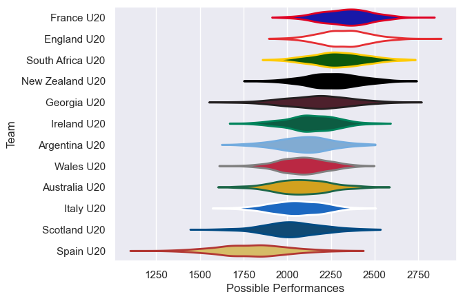

---  
title: "U20 Championship 2025 Status"  
date: 2025-07-07 6:00:00 -0500  
categories: model review projection  
layout: article  
aside:  
    toc: true  
---
# Current Team Rankings

# Standings

## Current Standings

| Club             |   Played |   Wins |   Point Differential |   Losing Bonus Points | Try Bonus Points   |   Competition Points |
|:-----------------|---------:|-------:|---------------------:|----------------------:|:-------------------|---------------------:|
| South Africa U20 |        2 |      2 |                   66 |                     0 |                    |                    8 |
| France U20       |        2 |      2 |                   52 |                     0 |                    |                    8 |
| New Zealand U20  |        2 |      2 |                   28 |                     0 |                    |                    8 |
| Argentina U20    |        2 |      2 |                   10 |                     0 |                    |                    8 |
| Ireland U20      |        2 |      1 |                    5 |                     1 |                    |                    5 |
| England U20      |        2 |      1 |                   27 |                     0 |                    |                    4 |
| Italy U20        |        2 |      1 |                   -7 |                     0 |                    |                    4 |
| Australia U20    |        2 |      1 |                  -46 |                     0 |                    |                    4 |
| Wales U20        |        2 |      0 |                  -21 |                     1 |                    |                    1 |
| Georgia U20      |        2 |      0 |                  -26 |                     1 |                    |                    1 |
| Spain U20        |        2 |      0 |                  -41 |                     1 |                    |                    1 |
| Scotland U20     |        2 |      0 |                  -47 |                     0 |                    |                    0 |

## Projected Remaining Table

| Club             |   To Play |   Projected Wins |   Projected Differential |   Projected Losing Bonus Points | Projected Try Bonus Points   |   Projected Competition Points |
|:-----------------|----------:|-----------------:|-------------------------:|--------------------------------:|:-----------------------------|-------------------------------:|
| South Africa U20 |         1 |            0.748 |                   12.95  |                           0.116 |                              |                          3.158 |
| France U20       |         1 |            0.732 |                   10.88  |                           0.122 |                              |                          3.106 |
| New Zealand U20  |         1 |            0.694 |                    9.564 |                           0.151 |                              |                          2.977 |
| Wales U20        |         1 |            0.682 |                    8.258 |                           0.146 |                              |                          2.946 |
| England U20      |         1 |            0.673 |                    7.398 |                           0.157 |                              |                          2.911 |
| Australia U20    |         1 |            0.296 |                   -7.398 |                           0.205 |                              |                          1.451 |
| Spain U20        |         1 |            0.282 |                   -8.258 |                           0.199 |                              |                          1.399 |
| Ireland U20      |         1 |            0.281 |                   -9.564 |                           0.167 |                              |                          1.341 |
| Argentina U20    |         1 |            0.24  |                  -10.88  |                           0.175 |                              |                          1.191 |
| Scotland U20     |         1 |            0.227 |                  -12.95  |                           0.165 |                              |                          1.123 |

## Projected Total Table

| Club             |   Played |   Wins |   Point Differential |   Losing Bonus Points | Try Bonus Points   |   Competition Points |
|:-----------------|---------:|-------:|---------------------:|----------------------:|:-------------------|---------------------:|
| South Africa U20 |        3 |  2.748 |               78.95  |                 0.116 |                    |               11.158 |
| France U20       |        3 |  2.732 |               62.88  |                 0.122 |                    |               11.106 |
| New Zealand U20  |        3 |  2.694 |               37.564 |                 0.151 |                    |               10.977 |
| Argentina U20    |        3 |  2.24  |               -0.88  |                 0.175 |                    |                9.191 |
| England U20      |        3 |  1.673 |               34.398 |                 0.157 |                    |                6.911 |
| Ireland U20      |        3 |  1.281 |               -4.564 |                 1.167 |                    |                6.341 |
| Australia U20    |        3 |  1.296 |              -53.398 |                 0.205 |                    |                5.451 |
| Italy U20        |        2 |  1     |               -7     |                 0     |                    |                4     |
| Wales U20        |        3 |  0.682 |              -12.742 |                 1.146 |                    |                3.946 |
| Spain U20        |        3 |  0.282 |              -49.258 |                 1.199 |                    |                2.399 |
| Scotland U20     |        3 |  0.227 |              -59.95  |                 0.165 |                    |                1.123 |
| Georgia U20      |        2 |  0     |              -26     |                 1     |                    |                1     |

# Completed Match Review

| Model | Percent Correct Predictions | Spread Error |
| ------ | ------ | ------ |
| Club Level | 58.8% | 15.8 |
| Player Level: Lineup | nan% | nan |
| Player Level: Minutes | nan% | nan |

# Future Predictions

## Week 3

### France U20 V Argentina U20 on 2025/07/09

Average Margin: France U20 by 10.9

### England U20 V Australia U20 on 2025/07/09

Average Margin: England U20 by 7.4

### Wales U20 V Spain U20 on 2025/07/09

Average Margin: Wales U20 by 8.3

### South Africa U20 V Scotland U20 on 2025/07/09

Average Margin: South Africa U20 by 13.0

### New Zealand U20 V Ireland U20 on 2025/07/09

Average Margin: New Zealand U20 by 9.6

