# Team Rankings

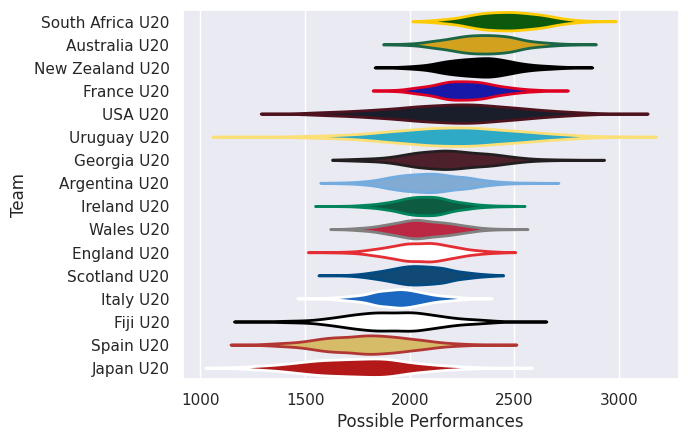
# Standings

## Projected Remaining Table

| Club             |   To Play |   Projected Wins |   Projected Differential |   Projected Losing Bonus Points | Projected Try Bonus Points   |   Projected Competition Points |
|:-----------------|----------:|-----------------:|-------------------------:|--------------------------------:|:-----------------------------|-------------------------------:|
| South Africa U20 |         1 |            0.971 |                   33.453 |                           0.016 |                              |                          3.908 |
| France U20       |         1 |            0.929 |                   24.713 |                           0.046 |                              |                          3.772 |
| Australia U20    |         1 |            0.909 |                   21.358 |                           0.05  |                              |                          3.706 |
| England U20      |         1 |            0.65  |                    5.502 |                           0.164 |                              |                          2.822 |
| Argentina U20    |         1 |            0.622 |                    7.211 |                           0.113 |                              |                          2.633 |
| Italy U20        |         1 |            0.58  |                    3.474 |                           0.176 |                              |                          2.566 |
| Georgia U20      |         1 |            0.544 |                    2.076 |                           0.163 |                              |                          2.389 |
| Japan U20        |         1 |            0.513 |                    1.312 |                           0.168 |                              |                          2.268 |
| New Zealand U20  |         1 |            0.463 |                   -1.312 |                           0.149 |                              |                          2.049 |
| Wales U20        |         1 |            0.431 |                   -2.076 |                           0.185 |                              |                          1.959 |
| Scotland U20     |         1 |            0.385 |                   -3.474 |                           0.194 |                              |                          1.804 |
| USA U20          |         1 |            0.362 |                   -7.211 |                           0.144 |                              |                          1.624 |
| Ireland U20      |         1 |            0.321 |                   -5.502 |                           0.201 |                              |                          1.543 |
| Spain U20        |         1 |            0.081 |                  -21.358 |                           0.1   |                              |                          0.444 |
| Fiji U20         |         1 |            0.066 |                  -24.713 |                           0.082 |                              |                          0.356 |
| Uruguay U20      |         1 |            0.025 |                  -33.453 |                           0.048 |                              |                          0.156 |

## Projected Total Table

| Club             |   Played |   Wins |   Point Differential |   Losing Bonus Points | Try Bonus Points   |   Competition Points |
|:-----------------|---------:|-------:|---------------------:|----------------------:|:-------------------|---------------------:|
| South Africa U20 |        1 |  0.971 |               33.453 |                 0.016 |                    |                3.908 |
| France U20       |        1 |  0.929 |               24.713 |                 0.046 |                    |                3.772 |
| Australia U20    |        1 |  0.909 |               21.358 |                 0.05  |                    |                3.706 |
| England U20      |        1 |  0.65  |                5.502 |                 0.164 |                    |                2.822 |
| Argentina U20    |        1 |  0.622 |                7.211 |                 0.113 |                    |                2.633 |
| Italy U20        |        1 |  0.58  |                3.474 |                 0.176 |                    |                2.566 |
| Georgia U20      |        1 |  0.544 |                2.076 |                 0.163 |                    |                2.389 |
| Japan U20        |        1 |  0.513 |                1.312 |                 0.168 |                    |                2.268 |
| New Zealand U20  |        1 |  0.463 |               -1.312 |                 0.149 |                    |                2.049 |
| Wales U20        |        1 |  0.431 |               -2.076 |                 0.185 |                    |                1.959 |
| Scotland U20     |        1 |  0.385 |               -3.474 |                 0.194 |                    |                1.804 |
| USA U20          |        1 |  0.362 |               -7.211 |                 0.144 |                    |                1.624 |
| Ireland U20      |        1 |  0.321 |               -5.502 |                 0.201 |                    |                1.543 |
| Spain U20        |        1 |  0.081 |              -21.358 |                 0.1   |                    |                0.444 |
| Fiji U20         |        1 |  0.066 |              -24.713 |                 0.082 |                    |                0.356 |
| Uruguay U20      |        1 |  0.025 |              -33.453 |                 0.048 |                    |                0.156 |

# Future Predictions

## Week 1

### England U20 V Ireland U20 on 2026/06/27

Average Margin: England U20 by 5.5

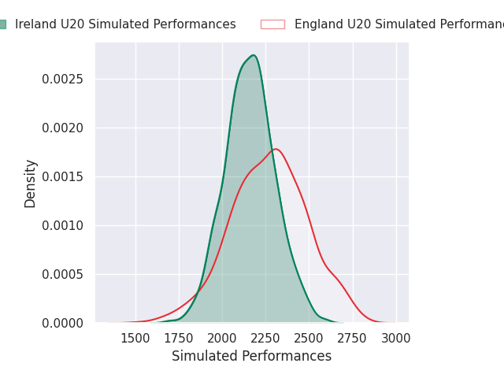
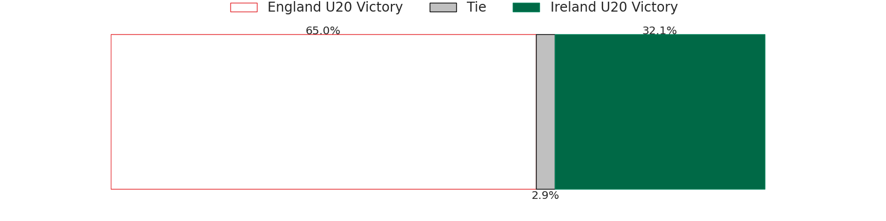
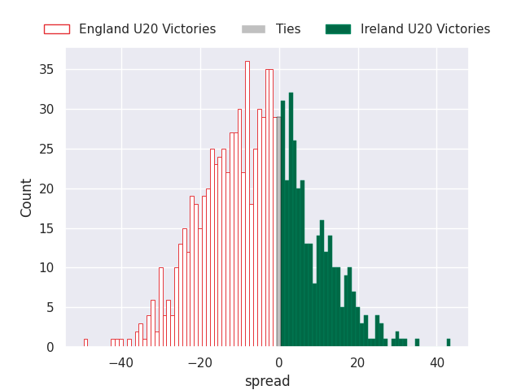

### Australia U20 V Spain U20 on 2026/06/27

Average Margin: Australia U20 by 21.4

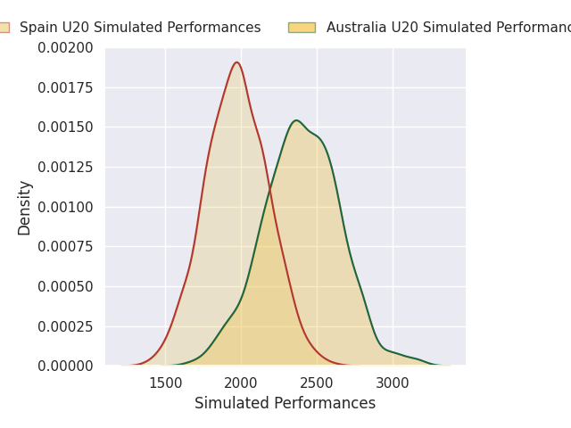
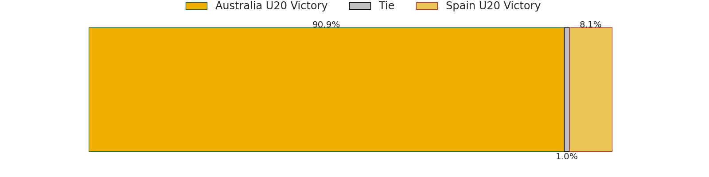
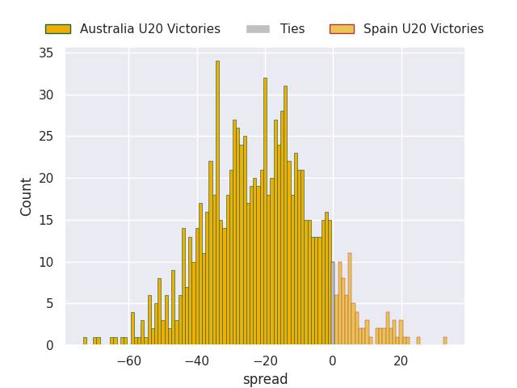

### South Africa U20 V Uruguay U20 on 2026/06/27

Average Margin: South Africa U20 by 33.5

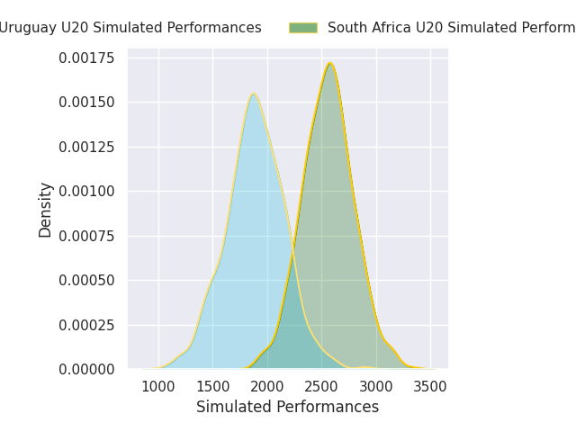
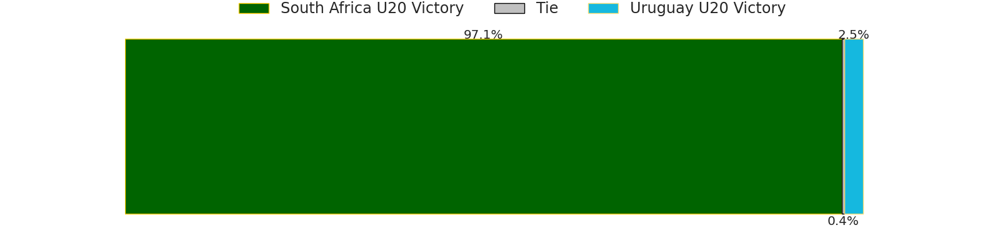
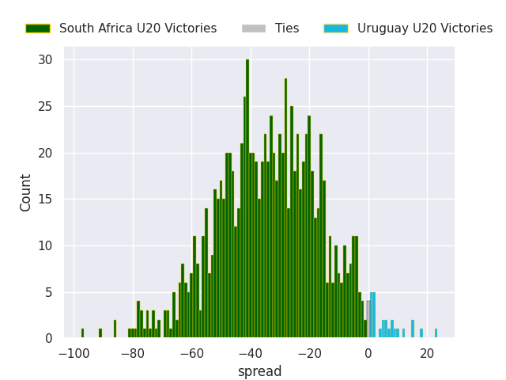

### Italy U20 V Scotland U20 on 2026/06/27

Average Margin: Italy U20 by 3.5

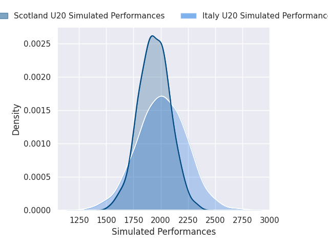

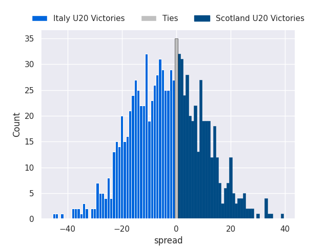

### New Zealand U20 V Japan U20 on 2026/06/27

Average Margin: Japan U20 by 1.3

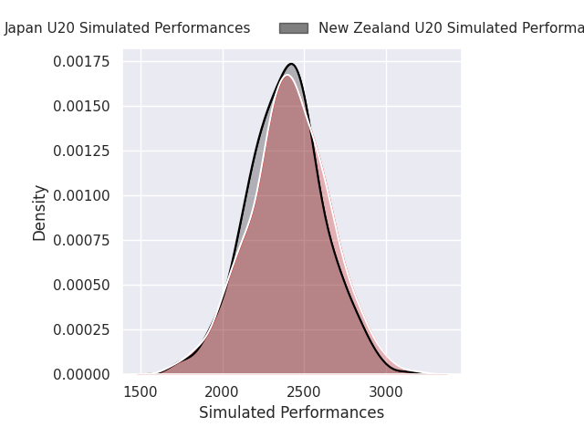
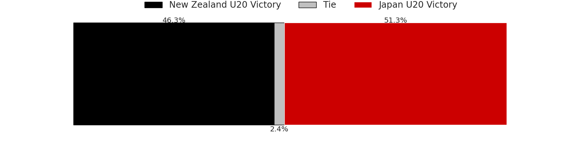
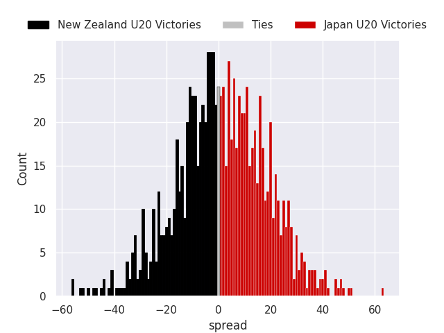

### Wales U20 V Georgia U20 on 2026/06/27

Average Margin: Georgia U20 by 2.1

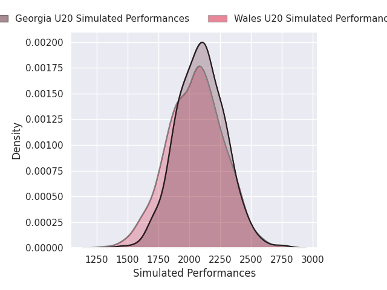

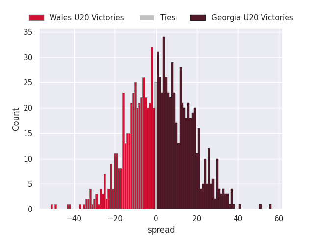

### France U20 V Fiji U20 on 2026/06/27

Average Margin: France U20 by 24.7

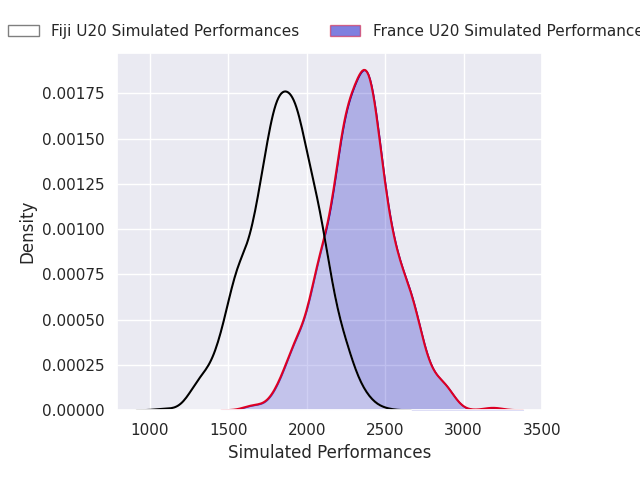
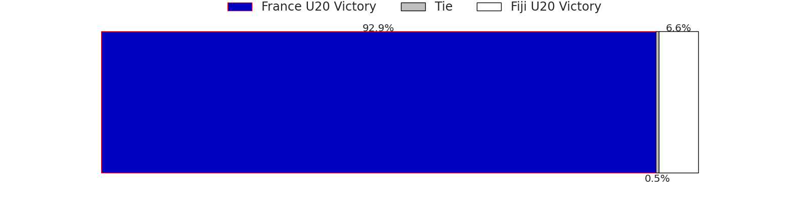
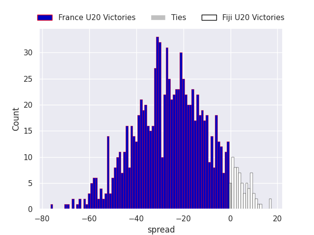

### Argentina U20 V USA U20 on 2026/06/27

Average Margin: Argentina U20 by 7.2

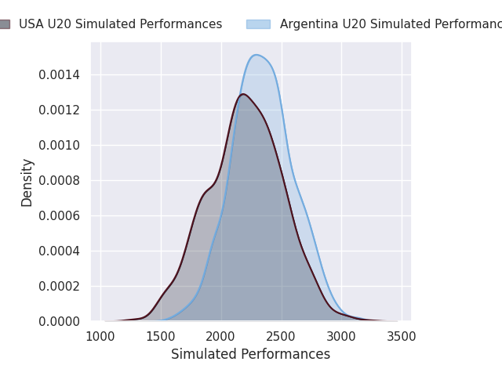
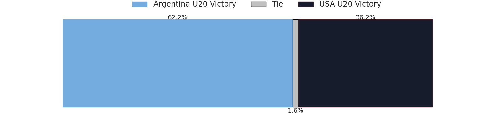
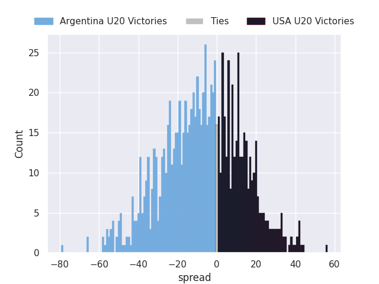

