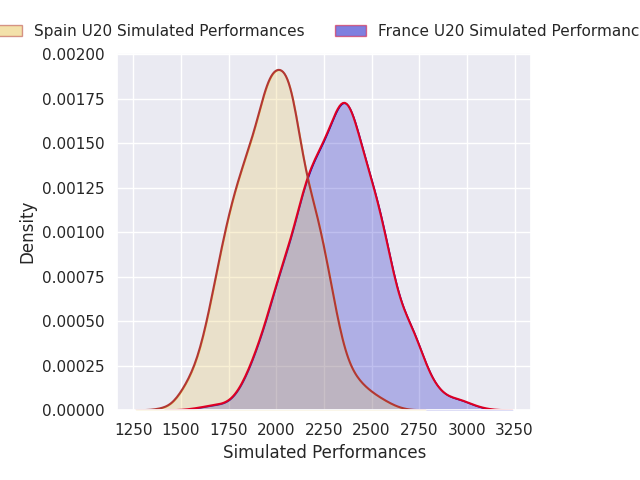
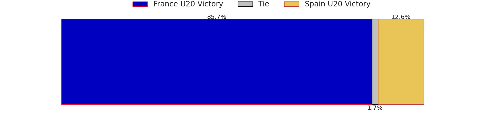
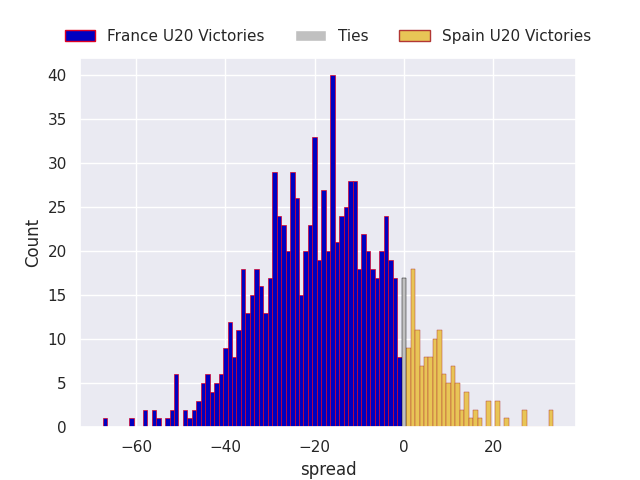
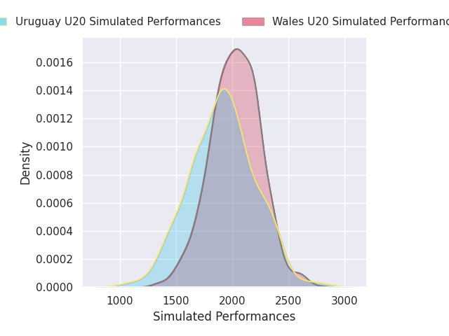
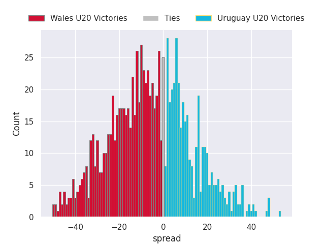

# Team Rankings

# Standings

## Projected Remaining Table

| Club             |   To Play |   Projected Wins |   Projected Differential |   Projected Losing Bonus Points | Projected Try Bonus Points   |   Projected Competition Points |
|:-----------------|----------:|-----------------:|-------------------------:|--------------------------------:|:-----------------------------|-------------------------------:|
| South Africa U20 |         2 |            1.908 |                   56.935 |                           0.049 |                              |                          7.701 |
| Australia U20    |         2 |            1.827 |                   45.968 |                           0.092 |                              |                          7.436 |
| France U20       |         2 |            1.798 |                   41.97  |                           0.103 |                              |                          7.341 |
| New Zealand U20  |         2 |            1.4   |                   19.764 |                           0.203 |                              |                          5.865 |
| Japan U20        |         2 |            1.374 |                   19.188 |                           0.208 |                              |                          5.806 |
| Argentina U20    |         2 |            1.341 |                   15.927 |                           0.262 |                              |                          5.708 |
| England U20      |         2 |            1.2   |                    8.068 |                           0.302 |                              |                          5.202 |
| Wales U20        |         2 |            0.984 |                    2.244 |                           0.338 |                              |                          4.378 |
| USA U20          |         2 |            0.779 |                   -9.9   |                           0.285 |                              |                          3.471 |
| Italy U20        |         2 |            0.707 |                  -14.682 |                           0.3   |                              |                          3.244 |
| Georgia U20      |         2 |            0.657 |                  -18.837 |                           0.225 |                              |                          2.925 |
| Ireland U20      |         2 |            0.589 |                  -14.095 |                           0.403 |                              |                          2.871 |
| Scotland U20     |         2 |            0.43  |                  -24.27  |                           0.33  |                              |                          2.126 |
| Uruguay U20      |         2 |            0.389 |                  -40.342 |                           0.182 |                              |                          1.79  |
| Spain U20        |         2 |            0.215 |                  -37.578 |                           0.232 |                              |                          1.142 |
| Fiji U20         |         2 |            0.119 |                  -50.36  |                           0.139 |                              |                          0.647 |

## Projected Total Table

| Club             |   Played |   Wins |   Point Differential |   Losing Bonus Points | Try Bonus Points   |   Competition Points |
|:-----------------|---------:|-------:|---------------------:|----------------------:|:-------------------|---------------------:|
| South Africa U20 |        2 |  1.908 |               56.935 |                 0.049 |                    |                7.701 |
| Australia U20    |        2 |  1.827 |               45.968 |                 0.092 |                    |                7.436 |
| France U20       |        2 |  1.798 |               41.97  |                 0.103 |                    |                7.341 |
| New Zealand U20  |        2 |  1.4   |               19.764 |                 0.203 |                    |                5.865 |
| Japan U20        |        2 |  1.374 |               19.188 |                 0.208 |                    |                5.806 |
| Argentina U20    |        2 |  1.341 |               15.927 |                 0.262 |                    |                5.708 |
| England U20      |        2 |  1.2   |                8.068 |                 0.302 |                    |                5.202 |
| Wales U20        |        2 |  0.984 |                2.244 |                 0.338 |                    |                4.378 |
| USA U20          |        2 |  0.779 |               -9.9   |                 0.285 |                    |                3.471 |
| Italy U20        |        2 |  0.707 |              -14.682 |                 0.3   |                    |                3.244 |
| Georgia U20      |        2 |  0.657 |              -18.837 |                 0.225 |                    |                2.925 |
| Ireland U20      |        2 |  0.589 |              -14.095 |                 0.403 |                    |                2.871 |
| Scotland U20     |        2 |  0.43  |              -24.27  |                 0.33  |                    |                2.126 |
| Uruguay U20      |        2 |  0.389 |              -40.342 |                 0.182 |                    |                1.79  |
| Spain U20        |        2 |  0.215 |              -37.578 |                 0.232 |                    |                1.142 |
| Fiji U20         |        2 |  0.119 |              -50.36  |                 0.139 |                    |                0.647 |

# Future Predictions

## Week 1

### Argentina U20 V USA U20 on 2026/06/27

Average Margin: Argentina U20 by 7.3

### Italy U20 V Scotland U20 on 2026/06/27

Average Margin: Italy U20 by 3.5

### Australia U20 V Spain U20 on 2026/06/27

Average Margin: Australia U20 by 20.6

### France U20 V Fiji U20 on 2026/06/27

Average Margin: France U20 by 25.0

### England U20 V Ireland U20 on 2026/06/27

Average Margin: England U20 by 5.5

### New Zealand U20 V Japan U20 on 2026/06/27

Average Margin: Japan U20 by 1.0

### South Africa U20 V Uruguay U20 on 2026/06/27

Average Margin: South Africa U20 by 34.7

### Wales U20 V Georgia U20 on 2026/06/27

Average Margin: Georgia U20 by 3.4

## Week 2

### France U20 V Spain U20 on 2026/07/02

Average Margin: France U20 by 17.0

### Wales U20 V Uruguay U20 on 2026/07/02

Average Margin: Wales U20 by 5.7

### Argentina U20 V Ireland U20 on 2026/07/02

Average Margin: Argentina U20 by 8.6

### Australia U20 V Fiji U20 on 2026/07/02

Average Margin: Australia U20 by 25.4

### England U20 V USA U20 on 2026/07/02

Average Margin: England U20 by 2.6

### New Zealand U20 V Scotland U20 on 2026/07/02

Average Margin: New Zealand U20 by 20.8

### Italy U20 V Japan U20 on 2026/07/02

Average Margin: Japan U20 by 18.2

### South Africa U20 V Georgia U20 on 2026/07/02

Average Margin: South Africa U20 by 22.3

