# Team Rankings

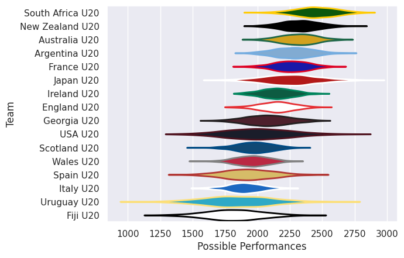
# Standings

## Current Standings

| Club             |   Played |   Wins |   Point Differential |   Losing Bonus Points | Try Bonus Points   |   Competition Points |
|:-----------------|---------:|-------:|---------------------:|----------------------:|:-------------------|---------------------:|
| South Africa U20 |        3 |      3 |                  144 |                     0 |                    |                   12 |
| France U20       |        3 |      3 |                   60 |                     0 |                    |                   12 |
| New Zealand U20  |        3 |      3 |                   57 |                     0 |                    |                   12 |
| England U20      |        3 |      3 |                   37 |                     0 |                    |                   12 |
| Australia U20    |        3 |      2 |                   99 |                     1 |                    |                    9 |
| Argentina U20    |        3 |      2 |                   84 |                     1 |                    |                    9 |
| Wales U20        |        3 |      2 |                   29 |                     0 |                    |                    8 |
| Scotland U20     |        3 |      2 |                    7 |                     0 |                    |                    8 |
| Georgia U20      |        3 |      1 |                   24 |                     1 |                    |                    5 |
| Ireland U20      |        3 |      1 |                   22 |                     1 |                    |                    5 |
| Italy U20        |        3 |      1 |                  -20 |                     1 |                    |                    5 |
| Fiji U20         |        3 |      1 |                  -63 |                     0 |                    |                    4 |
| Spain U20        |        3 |      0 |                  -96 |                     1 |                    |                    1 |
| Japan U20        |        3 |      0 |                  -44 |                     0 |                    |                    0 |
| USA U20          |        3 |      0 |                 -143 |                     0 |                    |                    0 |
| Uruguay U20      |        3 |      0 |                 -197 |                     0 |                    |                    0 |

## Projected Remaining Table

| Club             |   To Play |   Projected Wins |   Projected Differential |   Projected Losing Bonus Points | Projected Try Bonus Points   |   Projected Competition Points |
|:-----------------|----------:|-----------------:|-------------------------:|--------------------------------:|:-----------------------------|-------------------------------:|
| Australia U20    |         1 |            0.954 |                   22.801 |                           0.03  |                              |                          3.862 |
| Argentina U20    |         1 |            0.934 |                   21.361 |                           0.042 |                              |                          3.794 |
| Ireland U20      |         1 |            0.909 |                   18.125 |                           0.057 |                              |                          3.703 |
| South Africa U20 |         1 |            0.893 |                   17.351 |                           0.055 |                              |                          3.661 |
| Japan U20        |         1 |            0.875 |                   27.03  |                           0.049 |                              |                          3.571 |
| Georgia U20      |         1 |            0.771 |                   11.691 |                           0.107 |                              |                          3.225 |
| Spain U20        |         1 |            0.69  |                   11.417 |                           0.094 |                              |                          2.878 |
| France U20       |         1 |            0.586 |                    3.443 |                           0.192 |                              |                          2.588 |
| New Zealand U20  |         1 |            0.388 |                   -3.443 |                           0.212 |                              |                          1.816 |
| Uruguay U20      |         1 |            0.298 |                  -11.417 |                           0.123 |                              |                          1.339 |
| Italy U20        |         1 |            0.212 |                  -11.691 |                           0.156 |                              |                          1.038 |
| USA U20          |         1 |            0.114 |                  -27.03  |                           0.072 |                              |                          0.55  |
| England U20      |         1 |            0.09  |                  -17.351 |                           0.133 |                              |                          0.527 |
| Fiji U20         |         1 |            0.086 |                  -18.125 |                           0.122 |                              |                          0.476 |
| Scotland U20     |         1 |            0.058 |                  -21.361 |                           0.095 |                              |                          0.343 |
| Wales U20        |         1 |            0.038 |                  -22.801 |                           0.078 |                              |                          0.246 |

## Projected Total Table

| Club             |   Played |   Wins |   Point Differential |   Losing Bonus Points | Try Bonus Points   |   Competition Points |
|:-----------------|---------:|-------:|---------------------:|----------------------:|:-------------------|---------------------:|
| South Africa U20 |        4 |  3.893 |              161.351 |                 0.055 |                    |               15.661 |
| France U20       |        4 |  3.586 |               63.443 |                 0.192 |                    |               14.588 |
| New Zealand U20  |        4 |  3.388 |               53.557 |                 0.212 |                    |               13.816 |
| Australia U20    |        4 |  2.954 |              121.801 |                 1.03  |                    |               12.862 |
| Argentina U20    |        4 |  2.934 |              105.361 |                 1.042 |                    |               12.794 |
| England U20      |        4 |  3.09  |               19.649 |                 0.133 |                    |               12.527 |
| Ireland U20      |        4 |  1.909 |               40.125 |                 1.057 |                    |                8.703 |
| Scotland U20     |        4 |  2.058 |              -14.361 |                 0.095 |                    |                8.343 |
| Wales U20        |        4 |  2.038 |                6.199 |                 0.078 |                    |                8.246 |
| Georgia U20      |        4 |  1.771 |               35.691 |                 1.107 |                    |                8.225 |
| Italy U20        |        4 |  1.212 |              -31.691 |                 1.156 |                    |                6.038 |
| Fiji U20         |        4 |  1.086 |              -81.125 |                 0.122 |                    |                4.476 |
| Spain U20        |        4 |  0.69  |              -84.583 |                 1.094 |                    |                3.878 |
| Japan U20        |        4 |  0.875 |              -16.97  |                 0.049 |                    |                3.571 |
| Uruguay U20      |        4 |  0.298 |             -208.417 |                 0.123 |                    |                1.339 |
| USA U20          |        4 |  0.114 |             -170.03  |                 0.072 |                    |                0.55  |

# Completed Match Review

| Model | Percent Correct Predictions | Spread Error |
| ------ | ------ | ------ |
| Club Level | 71.9% | 15.9 |
| Player Level: Lineup | nan% | nan |
| Player Level: Minutes | nan% | nan |

# Future Predictions

## Week 4

### Japan U20 V USA U20 on 2026/07/12

Average Margin: Japan U20 by 27.0

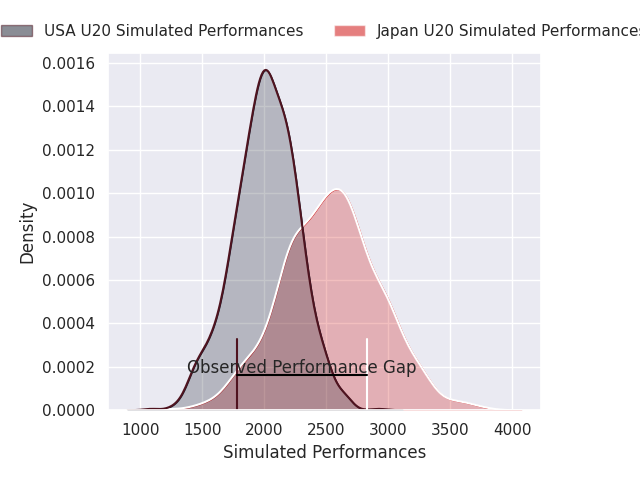
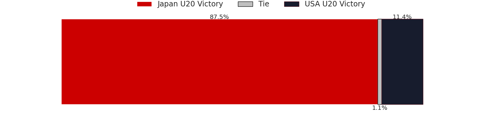
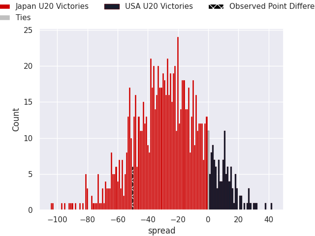

### Spain U20 V Uruguay U20 on 2026/07/12

Average Margin: Spain U20 by 11.4

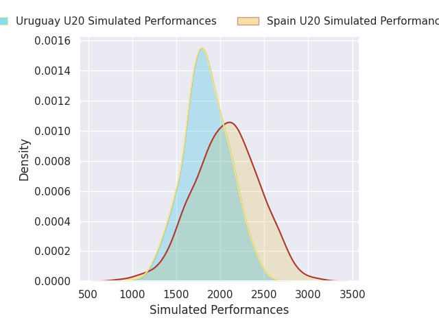
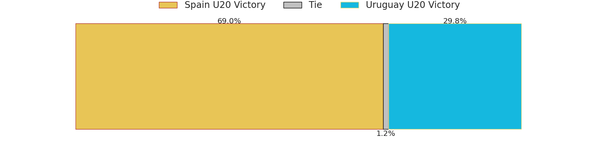
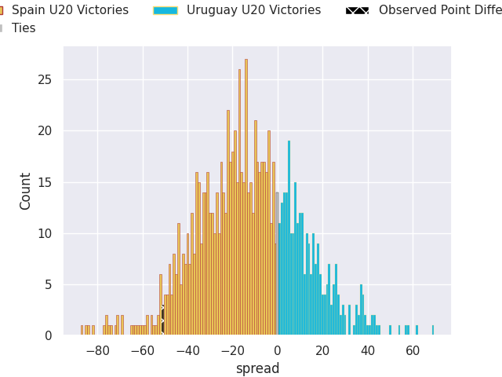

### Argentina U20 V Scotland U20 on 2026/07/12

Average Margin: Argentina U20 by 21.4

### Australia U20 V Wales U20 on 2026/07/12

Average Margin: Australia U20 by 22.8

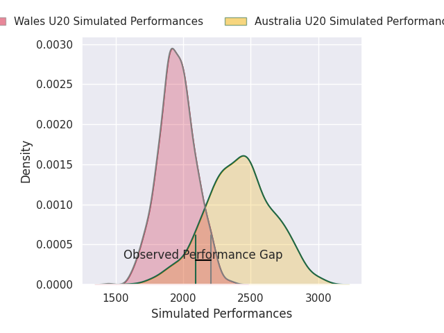
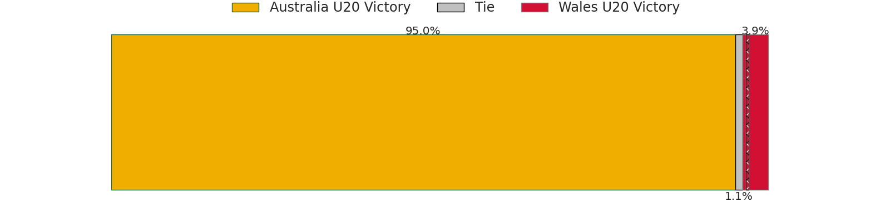
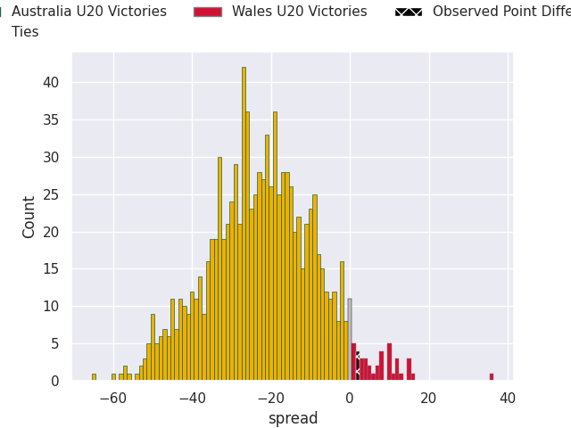

## Week 5

### South Africa U20 V England U20 on 2026/07/13

Average Margin: South Africa U20 by 17.4

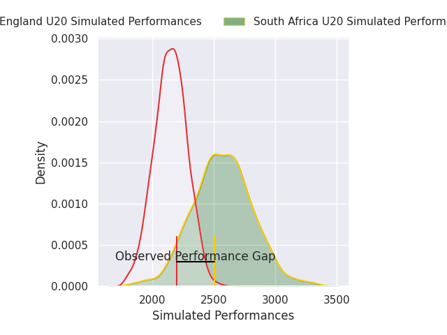
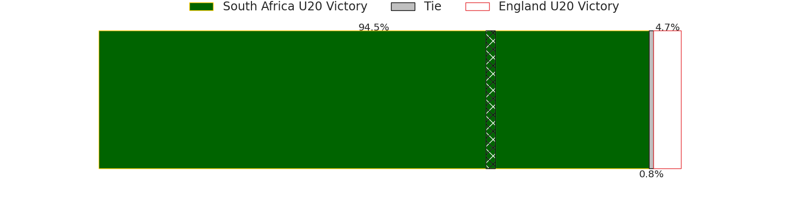
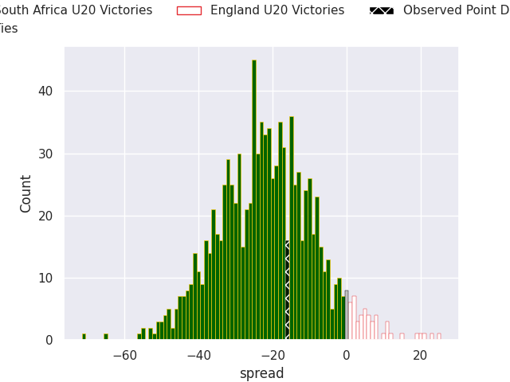

### Ireland U20 V Fiji U20 on 2026/07/13

Average Margin: Ireland U20 by 18.1

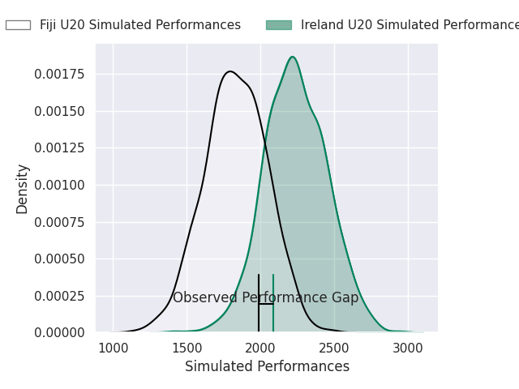
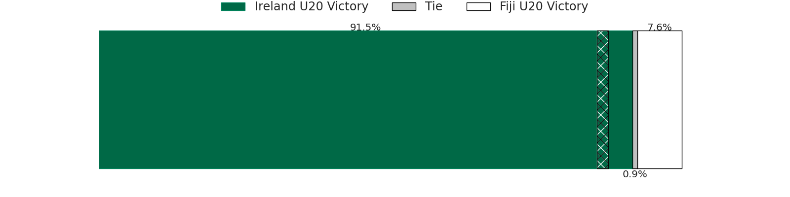
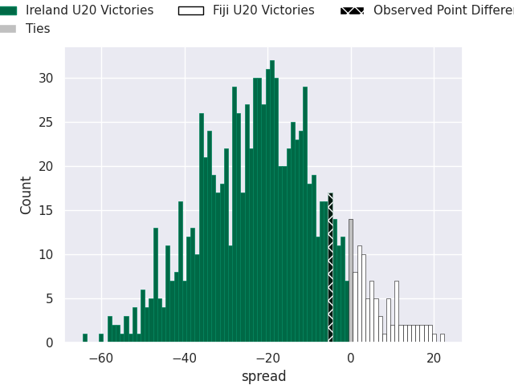

### Georgia U20 V Italy U20 on 2026/07/13

Average Margin: Georgia U20 by 11.7

### France U20 V New Zealand U20 on 2026/07/13

Average Margin: France U20 by 3.4

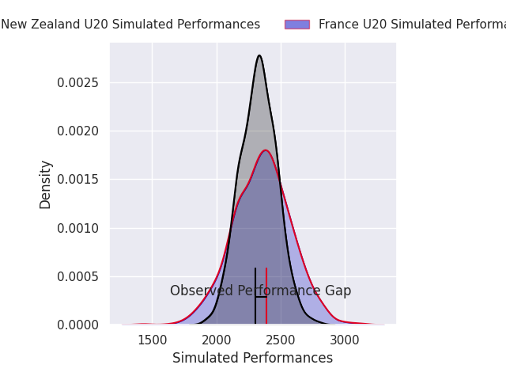
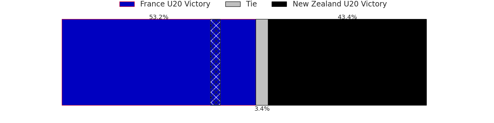
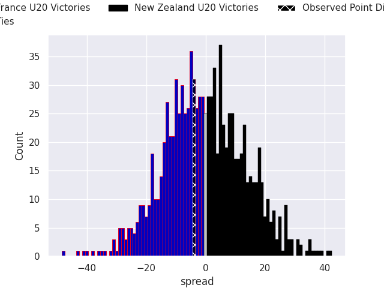

