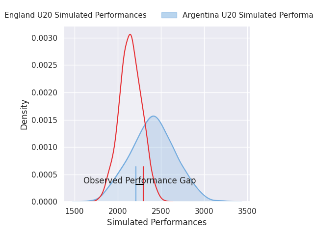
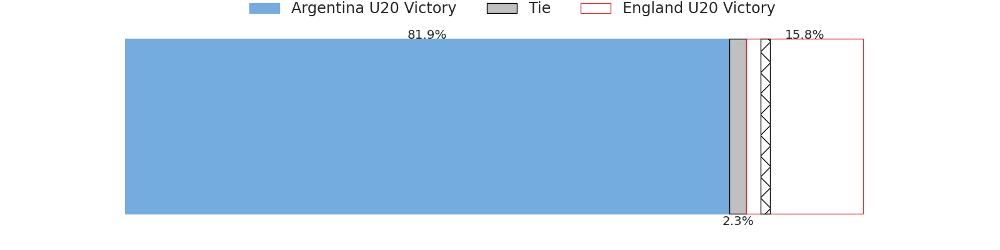
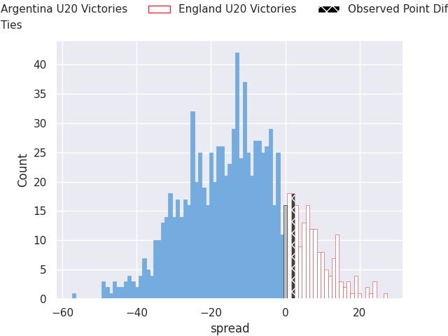

# Team Rankings

# Standings

## Current Standings

| Club             |   Played |   Wins |   Point Differential |   Losing Bonus Points | Try Bonus Points   |   Competition Points |
|:-----------------|---------:|-------:|---------------------:|----------------------:|:-------------------|---------------------:|
| South Africa U20 |        2 |      2 |                  125 |                     0 |                    |                    8 |
| Australia U20    |        2 |      2 |                  104 |                     0 |                    |                    8 |
| Argentina U20    |        2 |      2 |                   86 |                     0 |                    |                    8 |
| France U20       |        2 |      2 |                   55 |                     0 |                    |                    8 |
| Wales U20        |        2 |      2 |                   48 |                     0 |                    |                    8 |
| England U20      |        2 |      2 |                   35 |                     0 |                    |                    8 |
| New Zealand U20  |        2 |      2 |                   27 |                     0 |                    |                    8 |
| Italy U20        |        2 |      1 |                   10 |                     1 |                    |                    5 |
| Scotland U20     |        2 |      1 |                   -4 |                     0 |                    |                    4 |
| Georgia U20      |        2 |      0 |                  -29 |                     1 |                    |                    1 |
| Ireland U20      |        2 |      0 |                  -29 |                     1 |                    |                    1 |
| Japan U20        |        2 |      0 |                  -33 |                     0 |                    |                    0 |
| Fiji U20         |        2 |      0 |                  -66 |                     0 |                    |                    0 |
| USA U20          |        2 |      0 |                  -92 |                     0 |                    |                    0 |
| Spain U20        |        2 |      0 |                  -93 |                     0 |                    |                    0 |
| Uruguay U20      |        2 |      0 |                 -144 |                     0 |                    |                    0 |

## Projected Remaining Table

| Club             |   To Play |   Projected Wins |   Projected Differential |   Projected Losing Bonus Points | Projected Try Bonus Points   |   Projected Competition Points |
|:-----------------|----------:|-----------------:|-------------------------:|--------------------------------:|:-----------------------------|-------------------------------:|
| South Africa U20 |         1 |            0.989 |                   28.606 |                           0.006 |                              |                          3.968 |
| New Zealand U20  |         1 |            0.946 |                   20.493 |                           0.038 |                              |                          3.836 |
| Georgia U20      |         1 |            0.883 |                   22.412 |                           0.055 |                              |                          3.605 |
| Ireland U20      |         1 |            0.843 |                   14.924 |                           0.071 |                              |                          3.469 |
| Argentina U20    |         1 |            0.828 |                   13.818 |                           0.089 |                              |                          3.435 |
| Spain U20        |         1 |            0.721 |                   12.456 |                           0.103 |                              |                          3.023 |
| Scotland U20     |         1 |            0.627 |                    5.284 |                           0.147 |                              |                          2.713 |
| France U20       |         1 |            0.556 |                    2.396 |                           0.18  |                              |                          2.488 |
| Australia U20    |         1 |            0.402 |                   -2.396 |                           0.213 |                              |                          1.905 |
| Japan U20        |         1 |            0.344 |                   -5.284 |                           0.187 |                              |                          1.621 |
| Fiji U20         |         1 |            0.261 |                  -12.456 |                           0.124 |                              |                          1.204 |
| England U20      |         1 |            0.155 |                  -13.818 |                           0.156 |                              |                          0.81  |
| USA U20          |         1 |            0.144 |                  -14.924 |                           0.148 |                              |                          0.75  |
| Uruguay U20      |         1 |            0.108 |                  -22.412 |                           0.093 |                              |                          0.543 |
| Italy U20        |         1 |            0.047 |                  -20.493 |                           0.107 |                              |                          0.309 |
| Wales U20        |         1 |            0.008 |                  -28.606 |                           0.044 |                              |                          0.082 |

## Projected Total Table

| Club             |   Played |   Wins |   Point Differential |   Losing Bonus Points | Try Bonus Points   |   Competition Points |
|:-----------------|---------:|-------:|---------------------:|----------------------:|:-------------------|---------------------:|
| South Africa U20 |        3 |  2.989 |              153.606 |                 0.006 |                    |               11.968 |
| New Zealand U20  |        3 |  2.946 |               47.493 |                 0.038 |                    |               11.836 |
| Argentina U20    |        3 |  2.828 |               99.818 |                 0.089 |                    |               11.435 |
| France U20       |        3 |  2.556 |               57.396 |                 0.18  |                    |               10.488 |
| Australia U20    |        3 |  2.402 |              101.604 |                 0.213 |                    |                9.905 |
| England U20      |        3 |  2.155 |               21.182 |                 0.156 |                    |                8.81  |
| Wales U20        |        3 |  2.008 |               19.394 |                 0.044 |                    |                8.082 |
| Scotland U20     |        3 |  1.627 |                1.284 |                 0.147 |                    |                6.713 |
| Italy U20        |        3 |  1.047 |              -10.493 |                 1.107 |                    |                5.309 |
| Georgia U20      |        3 |  0.883 |               -6.588 |                 1.055 |                    |                4.605 |
| Ireland U20      |        3 |  0.843 |              -14.076 |                 1.071 |                    |                4.469 |
| Spain U20        |        3 |  0.721 |              -80.544 |                 0.103 |                    |                3.023 |
| Japan U20        |        3 |  0.344 |              -38.284 |                 0.187 |                    |                1.621 |
| Fiji U20         |        3 |  0.261 |              -78.456 |                 0.124 |                    |                1.204 |
| USA U20          |        3 |  0.144 |             -106.924 |                 0.148 |                    |                0.75  |
| Uruguay U20      |        3 |  0.108 |             -166.412 |                 0.093 |                    |                0.543 |

# Completed Match Review

| Model | Percent Correct Predictions | Spread Error |
| ------ | ------ | ------ |
| Club Level | 75.0% | 16.9 |
| Player Level: Lineup | nan% | nan |
| Player Level: Minutes | nan% | nan |

# Future Predictions

## Week 3

### Ireland U20 V USA U20 on 2026/07/07

Average Margin: Ireland U20 by 14.9

### New Zealand U20 V Italy U20 on 2026/07/07

Average Margin: New Zealand U20 by 20.5

### Argentina U20 V England U20 on 2026/07/07

Average Margin: Argentina U20 by 13.8

### Scotland U20 V Japan U20 on 2026/07/07

Average Margin: Scotland U20 by 5.3

### France U20 V Australia U20 on 2026/07/07

Average Margin: France U20 by 2.4

### South Africa U20 V Wales U20 on 2026/07/07

Average Margin: South Africa U20 by 28.6

### Georgia U20 V Uruguay U20 on 2026/07/07

Average Margin: Georgia U20 by 22.4

### Spain U20 V Fiji U20 on 2026/07/07

Average Margin: Spain U20 by 12.5

