# Team Rankings

# Standings

## Current Standings

| Club             |   Played |   Wins |   Point Differential |   Losing Bonus Points |   Try Bonus Points |   Competition Points |
|:-----------------|---------:|-------:|---------------------:|----------------------:|-------------------:|---------------------:|
| South Africa U20 |        4 |      4 |                  160 |                     0 |                  2 |                   18 |
| France U20       |        4 |      4 |                   64 |                     0 |                  2 |                   18 |
| New Zealand U20  |        4 |      3 |                   53 |                     1 |                  1 |                   14 |
| Wales U20        |        4 |      3 |                   31 |                     0 |                  2 |                   14 |
| Scotland U20     |        4 |      3 |                   25 |                     0 |                  2 |                   14 |
| England U20      |        4 |      3 |                   21 |                     0 |                  2 |                   14 |
| Australia U20    |        4 |      2 |                   97 |                     2 |                  2 |                   12 |
| Argentina U20    |        4 |      2 |                   66 |                     1 |                  2 |                   11 |
| Ireland U20      |        4 |      2 |                   27 |                     1 |                  1 |                   10 |
| Italy U20        |        4 |      2 |                    4 |                     1 |                  1 |                   10 |
| Japan U20        |        4 |      1 |                    6 |                     0 |                  2 |                    6 |
| Georgia U20      |        4 |      1 |                    0 |                     1 |                  1 |                    6 |
| Spain U20        |        4 |      1 |                  -45 |                     1 |                  1 |                    6 |
| Fiji U20         |        4 |      1 |                  -68 |                     1 |                  1 |                    6 |
| USA U20          |        4 |      0 |                 -193 |                     0 |                    |                    0 |
| Uruguay U20      |        4 |      0 |                 -248 |                     0 |                    |                    0 |

## Projected Remaining Table

| Club             |   To Play |   Projected Wins |   Projected Differential |   Projected Losing Bonus Points | Projected Try Bonus Points   |   Projected Competition Points |
|:-----------------|----------:|-----------------:|-------------------------:|--------------------------------:|:-----------------------------|-------------------------------:|
| Scotland U20     |         1 |            0.801 |                   10.932 |                           0.114 |                              |                          3.344 |
| Japan U20        |         1 |            0.803 |                   16.809 |                           0.083 |                              |                          3.329 |
| New Zealand U20  |         1 |            0.748 |                    8.36  |                           0.125 |                              |                          3.159 |
| USA U20          |         1 |            0.76  |                   18.526 |                           0.067 |                              |                          3.121 |
| South Africa U20 |         1 |            0.532 |                    1.308 |                           0.192 |                              |                          2.384 |
| Australia U20    |         1 |            0.522 |                    0.958 |                           0.184 |                              |                          2.36  |
| Italy U20        |         1 |            0.491 |                    0.399 |                           0.236 |                              |                          2.26  |
| Fiji U20         |         1 |            0.497 |                    0.278 |                           0.168 |                              |                          2.198 |
| Ireland U20      |         1 |            0.479 |                   -0.399 |                           0.209 |                              |                          2.185 |
| Georgia U20      |         1 |            0.482 |                   -0.278 |                           0.163 |                              |                          2.133 |
| France U20       |         1 |            0.436 |                   -1.308 |                           0.228 |                              |                          2.036 |
| Argentina U20    |         1 |            0.434 |                   -0.958 |                           0.205 |                              |                          2.029 |
| England U20      |         1 |            0.231 |                   -8.36  |                           0.211 |                              |                          1.177 |
| Uruguay U20      |         1 |            0.233 |                  -18.526 |                           0.089 |                              |                          1.035 |
| Wales U20        |         1 |            0.186 |                  -10.932 |                           0.184 |                              |                          0.954 |
| Spain U20        |         1 |            0.18  |                  -16.809 |                           0.12  |                              |                          0.874 |

## Projected Total Table

| Club             |   Played |   Wins |   Point Differential |   Losing Bonus Points |   Try Bonus Points |   Competition Points |
|:-----------------|---------:|-------:|---------------------:|----------------------:|-------------------:|---------------------:|
| South Africa U20 |        5 |  4.532 |              161.308 |                 0.192 |                  2 |               20.384 |
| France U20       |        5 |  4.436 |               62.692 |                 0.228 |                  2 |               20.036 |
| Scotland U20     |        5 |  3.801 |               35.932 |                 0.114 |                  2 |               17.344 |
| New Zealand U20  |        5 |  3.748 |               61.36  |                 1.125 |                  1 |               17.159 |
| England U20      |        5 |  3.231 |               12.64  |                 0.211 |                  2 |               15.177 |
| Wales U20        |        5 |  3.186 |               20.068 |                 0.184 |                  2 |               14.954 |
| Australia U20    |        5 |  2.522 |               97.958 |                 2.184 |                  2 |               14.36  |
| Argentina U20    |        5 |  2.434 |               65.042 |                 1.205 |                  2 |               13.029 |
| Italy U20        |        5 |  2.491 |                4.399 |                 1.236 |                  1 |               12.26  |
| Ireland U20      |        5 |  2.479 |               26.601 |                 1.209 |                  1 |               12.185 |
| Japan U20        |        5 |  1.803 |               22.809 |                 0.083 |                  2 |                9.329 |
| Fiji U20         |        5 |  1.497 |              -67.722 |                 1.168 |                  1 |                8.198 |
| Georgia U20      |        5 |  1.482 |               -0.278 |                 1.163 |                  1 |                8.133 |
| Spain U20        |        5 |  1.18  |              -61.809 |                 1.12  |                  1 |                6.874 |
| USA U20          |        5 |  0.76  |             -174.474 |                 0.067 |                    |                3.121 |
| Uruguay U20      |        5 |  0.233 |             -266.526 |                 0.089 |                    |                1.035 |

# Completed Match Review

| Model | Percent Correct Predictions | Spread Error |
| ------ | ------ | ------ |
| Club Level | 65.0% | 19.0 |
| Player Level: Lineup | nan% | nan |
| Player Level: Minutes | nan% | nan |

# Future Predictions

## Week 5

### USA U20 V Uruguay U20 on 2026/07/17

Average Margin: USA U20 by 18.5

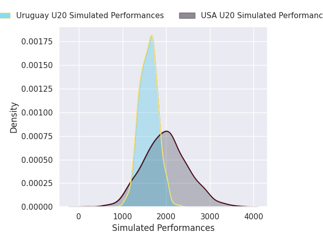
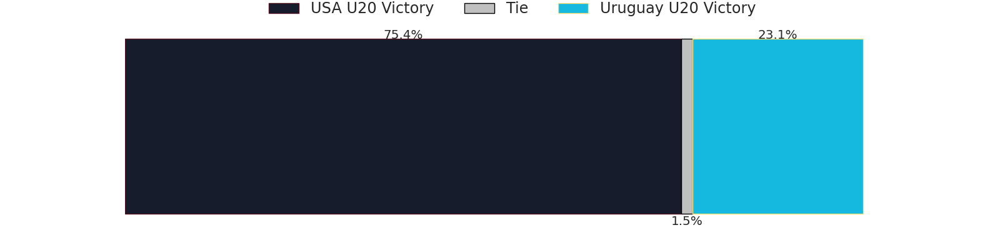
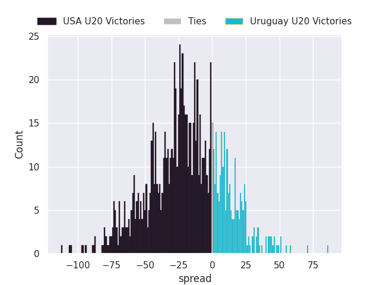

### Argentina U20 V Australia U20 on 2026/07/17

Average Margin: Australia U20 by 1.0

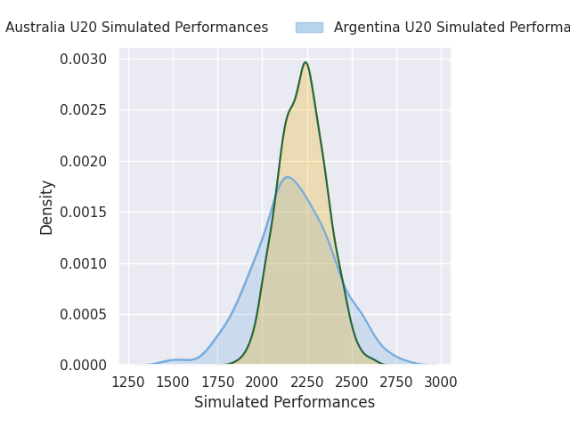
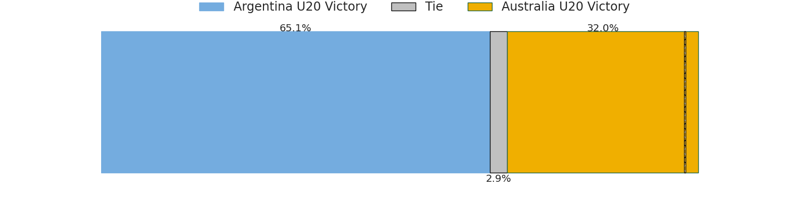
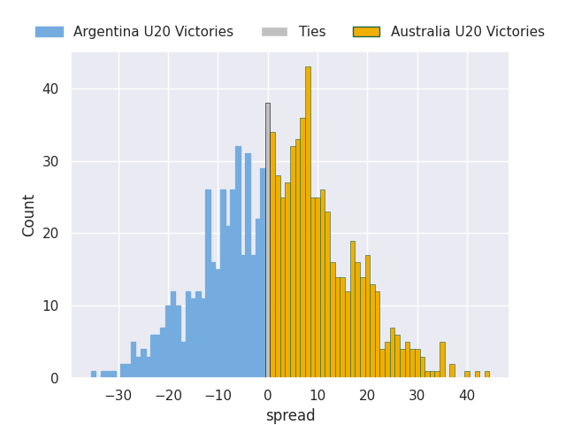

### Scotland U20 V Wales U20 on 2026/07/17

Average Margin: Scotland U20 by 10.9

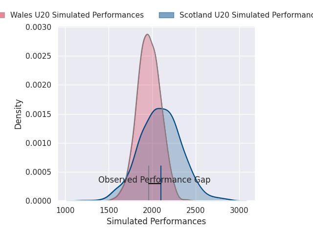
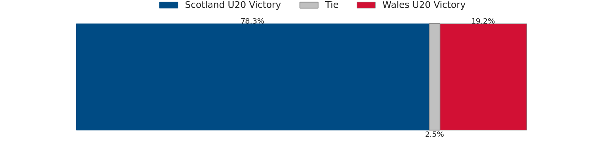
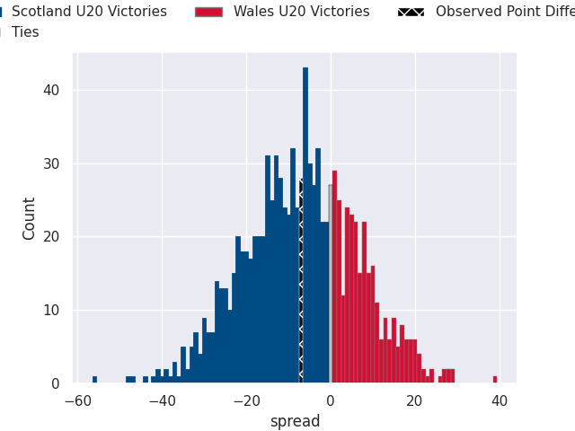

### Japan U20 V Spain U20 on 2026/07/17

Average Margin: Japan U20 by 16.8

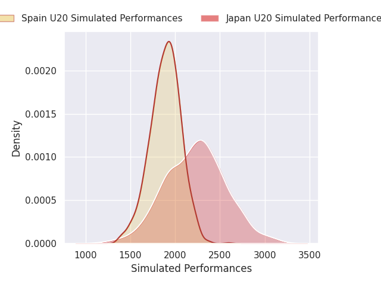
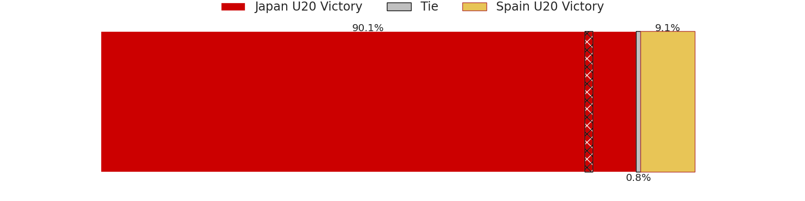
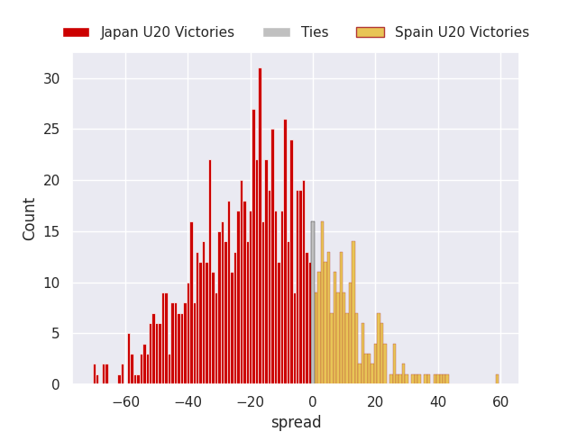

### Georgia U20 V Fiji U20 on 2026/07/18

Average Margin: Fiji U20 by 0.3

### France U20 V South Africa U20 on 2026/07/18

Average Margin: South Africa U20 by 1.3

### New Zealand U20 V England U20 on 2026/07/18

Average Margin: New Zealand U20 by 8.4

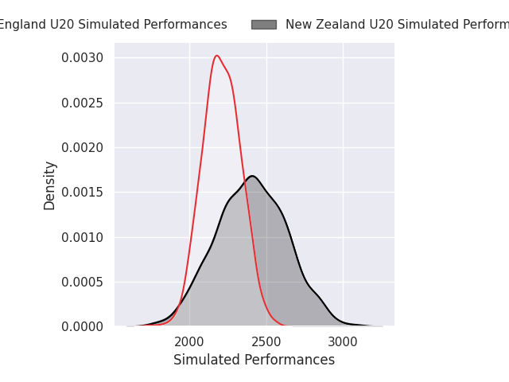
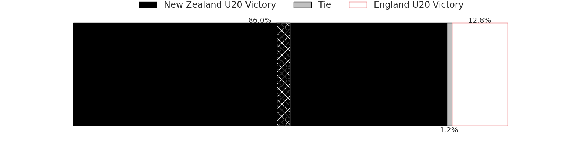
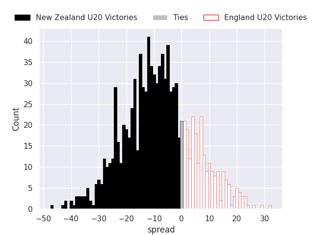

### Italy U20 V Ireland U20 on 2026/07/18

Average Margin: Italy U20 by 0.4

