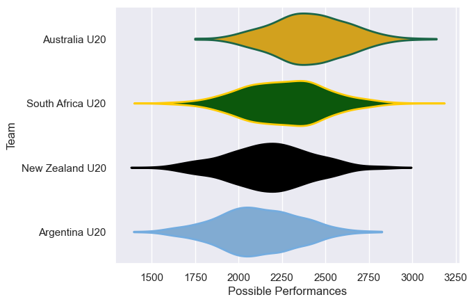

---  
title: "U20 Rugby Championship 2024 Status"  
date: 2025-07-28 6:00:00 -0500  
categories: model review projection  
layout: article  
aside:  
    toc: true  
---
# Current Team Rankings

# Standings

## Current Standings

| Club             |   Played |   Wins |   Point Differential |   Losing Bonus Points |   Try Bonus Points |   Competition Points |
|:-----------------|---------:|-------:|---------------------:|----------------------:|-------------------:|---------------------:|
| New Zealand U20  |        3 |      2 |                   34 |                     0 |                  2 |                   12 |
| South Africa U20 |        3 |      1 |                   -3 |                     1 |                  1 |                    8 |
| Argentina U20    |        3 |      1 |                   -6 |                     1 |                  1 |                    6 |
| Australia U20    |        3 |      1 |                  -25 |                     0 |                    |                    4 |

# Completed Match Review

| Model | Percent Correct Predictions | Spread Error |
| ------ | ------ | ------ |
| Club Level | 50.0% | 17.8 |
| Player Level: Lineup | nan% | nan |
| Player Level: Minutes | nan% | nan |

