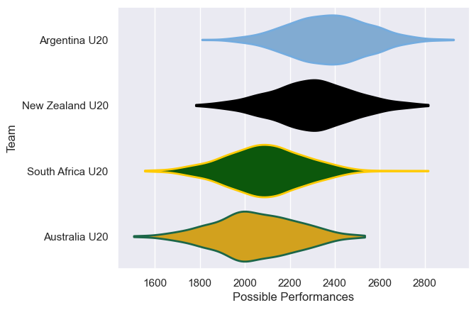

---  
title: "U20 Rugby Championship 2025 Status"  
date: 2025-07-28 6:00:00 -0500  
categories: model review projection  
layout: article  
aside:  
    toc: true  
---
# Current Team Rankings

# Standings

## Current Standings

| Club             |   Played |   Wins |   Point Differential |   Losing Bonus Points |   Try Bonus Points |   Competition Points |
|:-----------------|---------:|-------:|---------------------:|----------------------:|-------------------:|---------------------:|
| New Zealand U20  |        3 |      2 |                   57 |                     0 |                  2 |                   12 |
| Australia U20    |        3 |      2 |                    9 |                     0 |                  2 |                   12 |
| South Africa U20 |        3 |      1 |                    3 |                     2 |                  1 |                    7 |
| Argentina U20    |        3 |      0 |                  -69 |                     1 |                    |                    1 |

# Completed Match Review

| Model | Percent Correct Predictions | Spread Error |
| ------ | ------ | ------ |
| Club Level | 33.3% | 22.0 |
| Player Level: Lineup | nan% | nan |
| Player Level: Minutes | nan% | nan |

