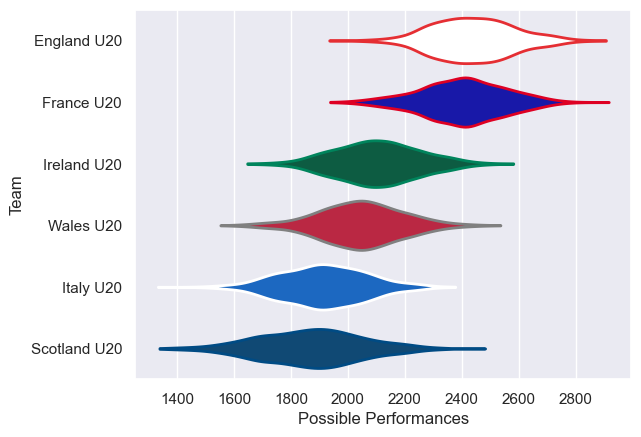

---  
title: "U20 Six Nations 2025 Status"  
date: 2025-07-28 6:00:00 -0500  
categories: model review projection  
layout: article  
aside:  
    toc: true  
---
# Current Team Rankings

# Standings

## Current Standings

| Club         |   Played |   Wins |   Point Differential |   Losing Bonus Points |   Try Bonus Points |   Competition Points |
|:-------------|---------:|-------:|---------------------:|----------------------:|-------------------:|---------------------:|
| France U20   |        5 |      4 |                   95 |                     0 |                  4 |                   20 |
| England U20  |        5 |      4 |                   76 |                     0 |                  2 |                   18 |
| Wales U20    |        5 |      3 |                  -39 |                     0 |                    |                   12 |
| Italy U20    |        5 |      2 |                  -49 |                     1 |                  1 |                   10 |
| Scotland U20 |        5 |      1 |                  -64 |                     1 |                  2 |                    7 |
| Ireland U20  |        5 |      1 |                  -19 |                     1 |                  1 |                    6 |

# Completed Match Review

| Model | Percent Correct Predictions | Spread Error |
| ------ | ------ | ------ |
| Club Level | 60.0% | 18.7 |
| Player Level: Lineup | nan% | nan |
| Player Level: Minutes | nan% | nan |

