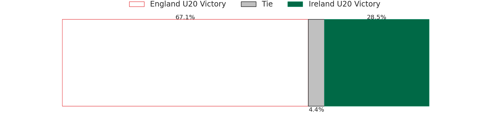
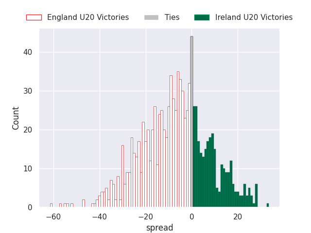
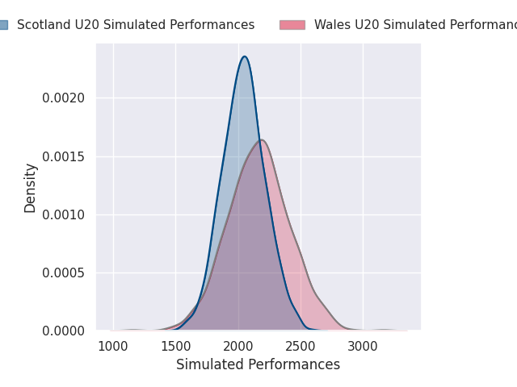
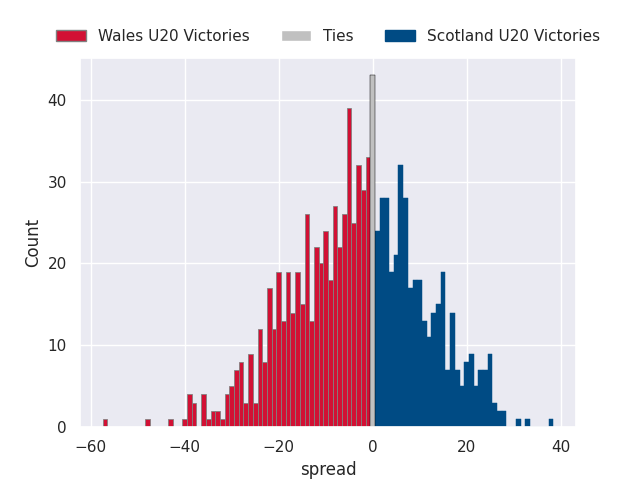
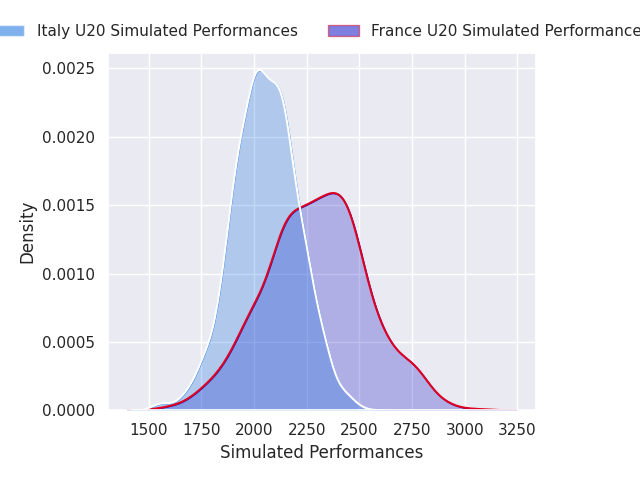
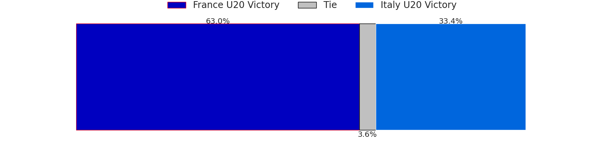
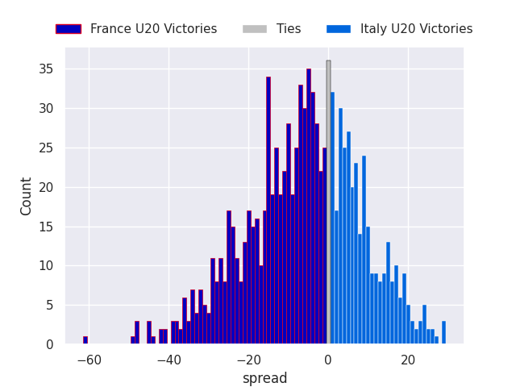

# Team Rankings

# Standings

## Projected Remaining Table

| Club         |   To Play |   Projected Wins |   Projected Differential |   Projected Losing Bonus Points | Projected Try Bonus Points   |   Projected Competition Points |
|:-------------|----------:|-----------------:|-------------------------:|--------------------------------:|:-----------------------------|-------------------------------:|
| England U20  |         3 |            1.799 |                   13.075 |                           0.522 |                              |                          7.916 |
| France U20   |         3 |            1.776 |                   14.566 |                           0.551 |                              |                          7.899 |
| Italy U20    |         3 |            1.342 |                   -5.075 |                           0.577 |                              |                          6.161 |
| Wales U20    |         3 |            1.32  |                   -4.126 |                           0.62  |                              |                          6.148 |
| Scotland U20 |         3 |            1.315 |                   -4.844 |                           0.634 |                              |                          6.092 |
| Ireland U20  |         3 |            1.113 |                  -13.596 |                           0.609 |                              |                          5.297 |

## Projected Total Table

| Club         |   Played |   Wins |   Point Differential |   Losing Bonus Points | Try Bonus Points   |   Competition Points |
|:-------------|---------:|-------:|---------------------:|----------------------:|:-------------------|---------------------:|
| England U20  |        3 |  1.799 |               13.075 |                 0.522 |                    |                7.916 |
| France U20   |        3 |  1.776 |               14.566 |                 0.551 |                    |                7.899 |
| Italy U20    |        3 |  1.342 |               -5.075 |                 0.577 |                    |                6.161 |
| Wales U20    |        3 |  1.32  |               -4.126 |                 0.62  |                    |                6.148 |
| Scotland U20 |        3 |  1.315 |               -4.844 |                 0.634 |                    |                6.092 |
| Ireland U20  |        3 |  1.113 |              -13.596 |                 0.609 |                    |                5.297 |

# Future Predictions

## Week 1

### England U20 V Wales U20 on 2026/02/06

Average Margin: England U20 by 6.4

### Italy U20 V Scotland U20 on 2026/02/06

Average Margin: Italy U20 by 3.2

### France U20 V Ireland U20 on 2026/02/07

Average Margin: France U20 by 7.1

## Week 2

### Ireland U20 V Italy U20 on 2026/02/13

Average Margin: Ireland U20 by 1.2

### Scotland U20 V England U20 on 2026/02/13

Average Margin: Scotland U20 by 1.0

### Wales U20 V France U20 on 2026/02/14

Average Margin: France U20 by 0.4

## Week 3

### England U20 V Ireland U20 on 2026/02/20

Average Margin: England U20 by 7.7

### Wales U20 V Scotland U20 on 2026/02/20

Average Margin: Wales U20 by 2.6

### France U20 V Italy U20 on 2026/02/21

Average Margin: France U20 by 7.1

