# Team Rankings

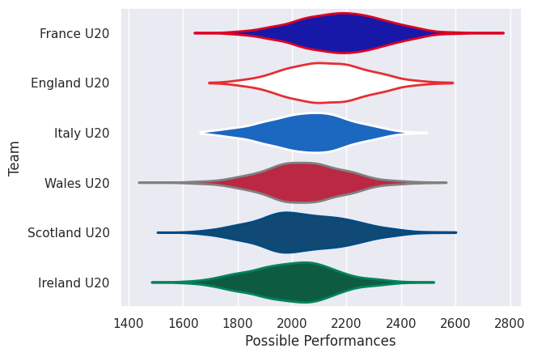
# Standings

## Projected Remaining Table

| Club         |   To Play |   Projected Wins |   Projected Differential |   Projected Losing Bonus Points | Projected Try Bonus Points   |   Projected Competition Points |
|:-------------|----------:|-----------------:|-------------------------:|--------------------------------:|:-----------------------------|-------------------------------:|
| France U20   |         2 |            1.17  |                    8.552 |                           0.361 |                              |                          5.193 |
| England U20  |         2 |            1.064 |                    4.408 |                           0.367 |                              |                          4.787 |
| Italy U20    |         2 |            0.994 |                    1.548 |                           0.43  |                              |                          4.572 |
| Scotland U20 |         2 |            0.924 |                   -0.785 |                           0.438 |                              |                          4.298 |
| Ireland U20  |         2 |            0.828 |                   -6.228 |                           0.388 |                              |                          3.84  |
| Wales U20    |         2 |            0.779 |                   -7.495 |                           0.403 |                              |                          3.697 |

## Projected Total Table

| Club         |   Played |   Wins |   Point Differential |   Losing Bonus Points | Try Bonus Points   |   Competition Points |
|:-------------|---------:|-------:|---------------------:|----------------------:|:-------------------|---------------------:|
| France U20   |        2 |  1.17  |                8.552 |                 0.361 |                    |                5.193 |
| England U20  |        2 |  1.064 |                4.408 |                 0.367 |                    |                4.787 |
| Italy U20    |        2 |  0.994 |                1.548 |                 0.43  |                    |                4.572 |
| Scotland U20 |        2 |  0.924 |               -0.785 |                 0.438 |                    |                4.298 |
| Ireland U20  |        2 |  0.828 |               -6.228 |                 0.388 |                    |                3.84  |
| Wales U20    |        2 |  0.779 |               -7.495 |                 0.403 |                    |                3.697 |

# Future Predictions

## Week 1

### England U20 V Wales U20 on 2026/02/06

Average Margin: England U20 by 6.6

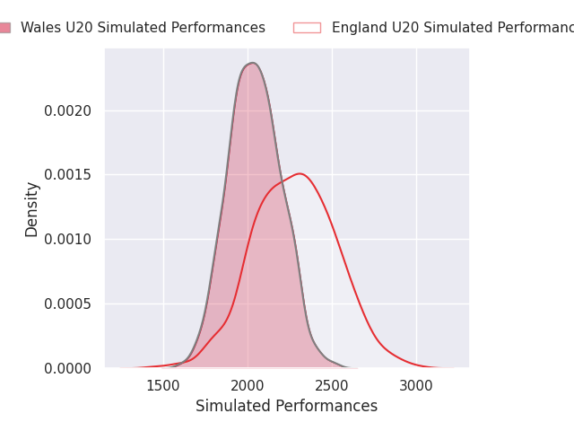
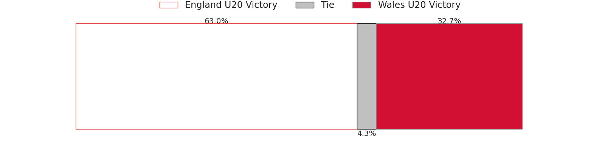
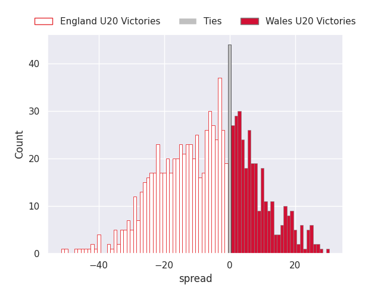

### Italy U20 V Scotland U20 on 2026/02/06

Average Margin: Italy U20 by 2.9

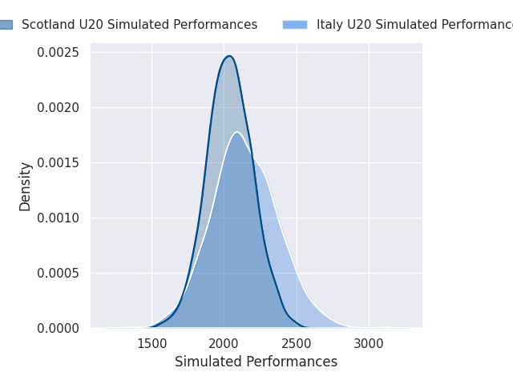

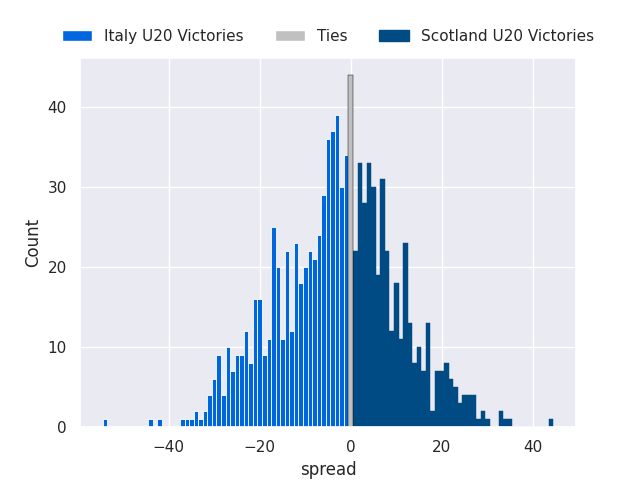

### France U20 V Ireland U20 on 2026/02/07

Average Margin: France U20 by 7.6

## Week 2

### Scotland U20 V England U20 on 2026/02/13

Average Margin: Scotland U20 by 2.2

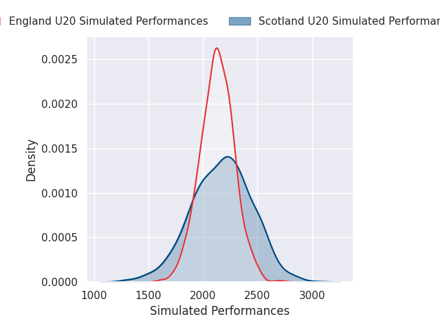

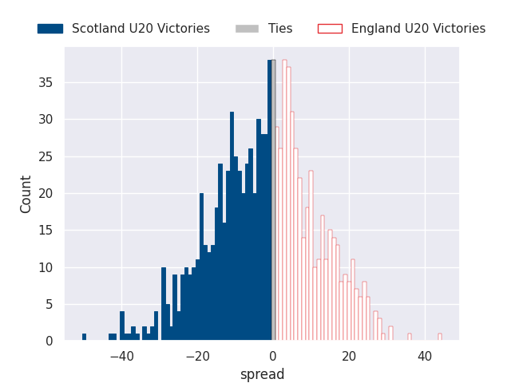

### Ireland U20 V Italy U20 on 2026/02/13

Average Margin: Ireland U20 by 1.4

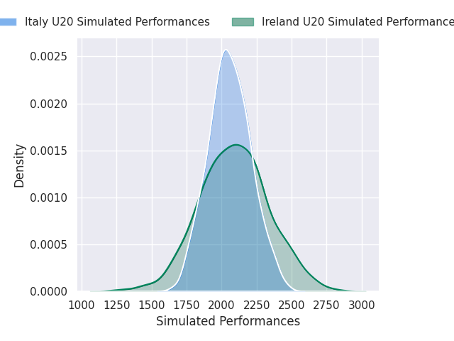

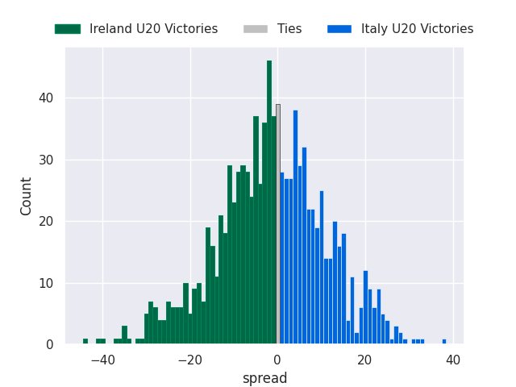

### Wales U20 V France U20 on 2026/02/14

Average Margin: France U20 by 0.9

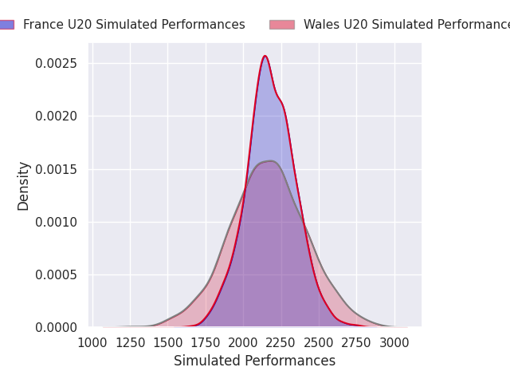

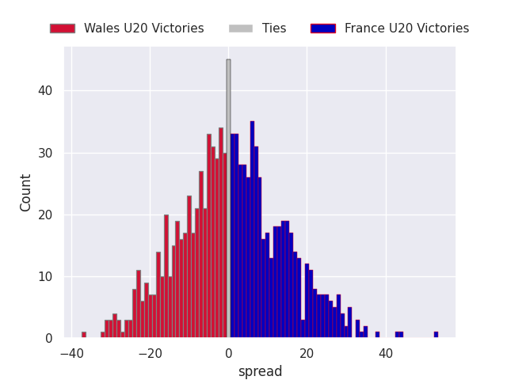

