# Team Rankings

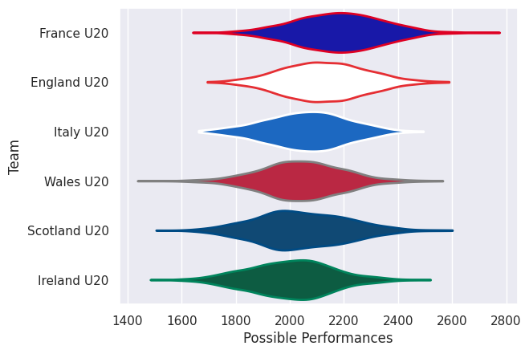
# Standings

## Current Standings

| Club         |   Played |   Wins |   Point Differential |   Losing Bonus Points | Try Bonus Points   |   Competition Points |
|:-------------|---------:|-------:|---------------------:|----------------------:|:-------------------|---------------------:|
| France U20   |        1 |      1 |                   29 |                     0 |                    |                    4 |
| Scotland U20 |        1 |      1 |                   26 |                     0 |                    |                    4 |
| England U20  |        1 |      1 |                    3 |                     0 |                    |                    4 |
| Wales U20    |        1 |      0 |                   -3 |                     1 |                    |                    1 |
| Italy U20    |        1 |      0 |                  -26 |                     0 |                    |                    0 |
| Ireland U20  |        1 |      0 |                  -29 |                     0 |                    |                    0 |

## Projected Remaining Table

| Club         |   To Play |   Projected Wins |   Projected Differential |   Projected Losing Bonus Points | Projected Try Bonus Points   |   Projected Competition Points |
|:-------------|----------:|-----------------:|-------------------------:|--------------------------------:|:-----------------------------|-------------------------------:|
| France U20   |         2 |            1.2   |                   10.506 |                           0.341 |                              |                          5.287 |
| England U20  |         2 |            1.095 |                    4.805 |                           0.322 |                              |                          4.878 |
| Scotland U20 |         2 |            0.957 |                    1.291 |                           0.419 |                              |                          4.445 |
| Wales U20    |         2 |            0.954 |                   -0.266 |                           0.419 |                              |                          4.423 |
| Ireland U20  |         2 |            0.763 |                   -6.637 |                           0.423 |                              |                          3.649 |
| Italy U20    |         2 |            0.772 |                   -9.699 |                           0.357 |                              |                          3.599 |

## Projected Total Table

| Club         |   Played |   Wins |   Point Differential |   Losing Bonus Points | Try Bonus Points   |   Competition Points |
|:-------------|---------:|-------:|---------------------:|----------------------:|:-------------------|---------------------:|
| France U20   |        3 |  2.2   |               39.506 |                 0.341 |                    |                9.287 |
| England U20  |        3 |  2.095 |                7.805 |                 0.322 |                    |                8.878 |
| Scotland U20 |        3 |  1.957 |               27.291 |                 0.419 |                    |                8.445 |
| Wales U20    |        3 |  0.954 |               -3.266 |                 1.419 |                    |                5.423 |
| Ireland U20  |        3 |  0.763 |              -35.637 |                 0.423 |                    |                3.649 |
| Italy U20    |        3 |  0.772 |              -35.699 |                 0.357 |                    |                3.599 |

# Completed Match Review

| Model | Percent Correct Predictions | Spread Error |
| ------ | ------ | ------ |
| Club Level | 55.6% | 14.0 |
| Player Level: Lineup | nan% | nan |
| Player Level: Minutes | nan% | nan |

# Future Predictions

## Week 2

### Ireland U20 V Italy U20 on 2026/02/13

Average Margin: Ireland U20 by 0.1

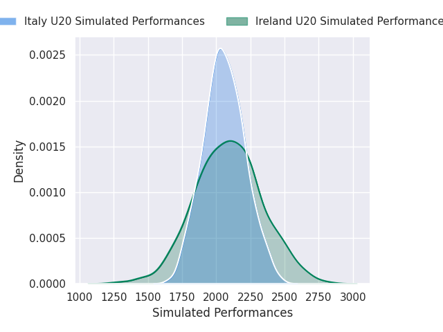

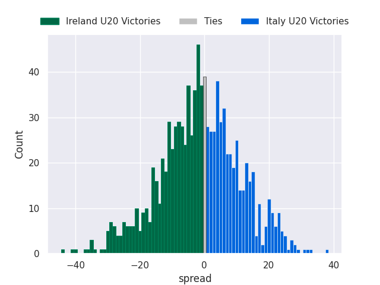

### Scotland U20 V England U20 on 2026/02/13

Average Margin: Scotland U20 by 1.9

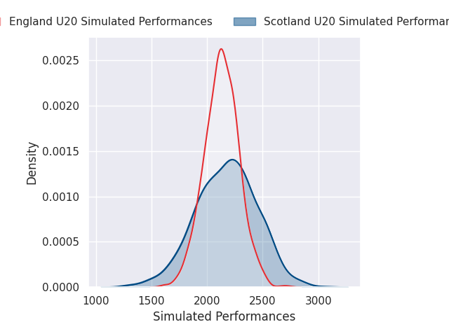

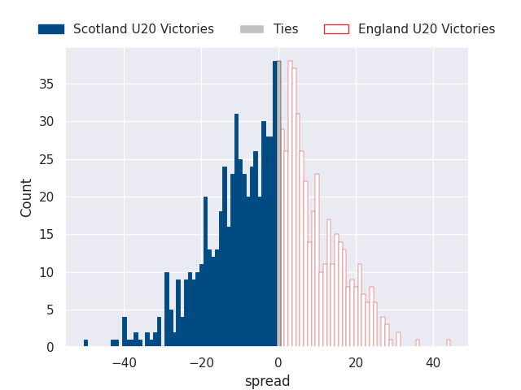

### Wales U20 V France U20 on 2026/02/14

Average Margin: France U20 by 0.9

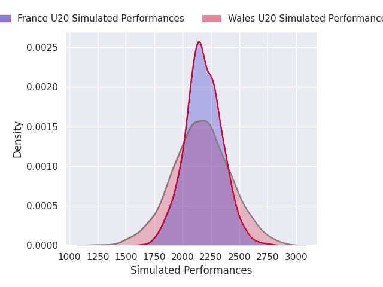

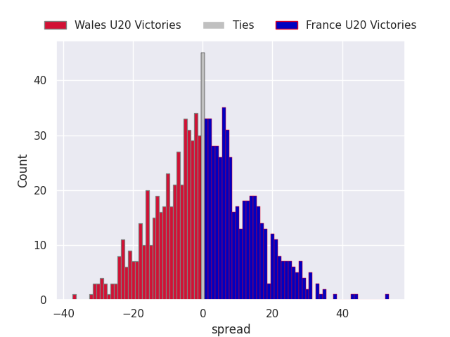

## Week 3

### England U20 V Ireland U20 on 2026/02/20

Average Margin: England U20 by 6.7

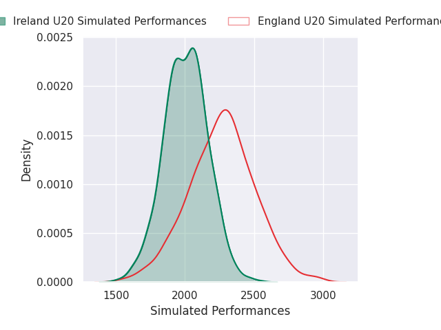
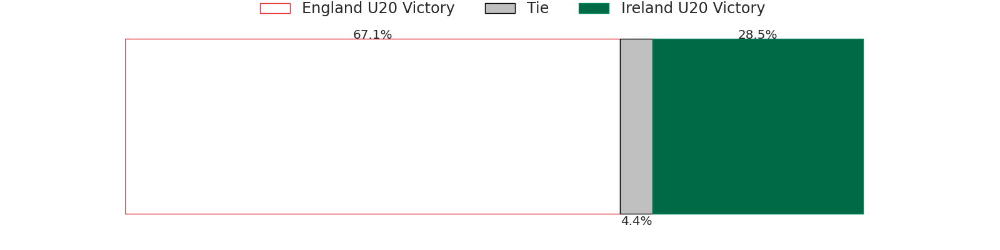
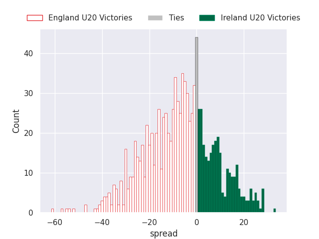

### Wales U20 V Scotland U20 on 2026/02/20

Average Margin: Wales U20 by 0.6

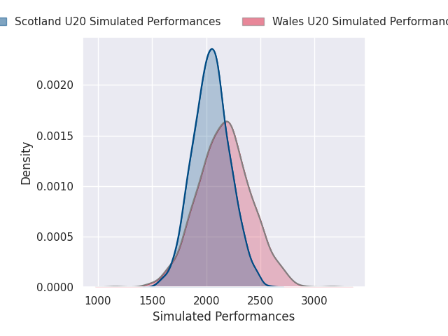

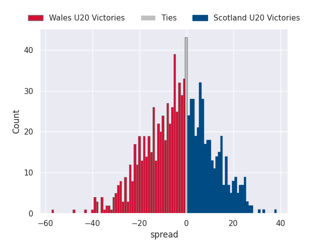

### France U20 V Italy U20 on 2026/02/21

Average Margin: France U20 by 9.6

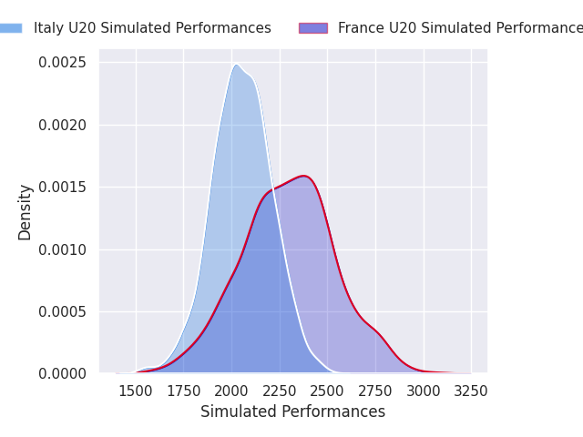
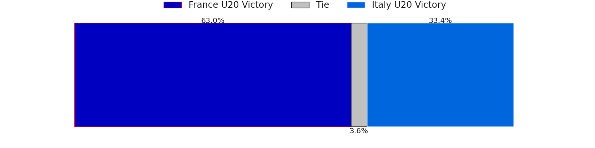
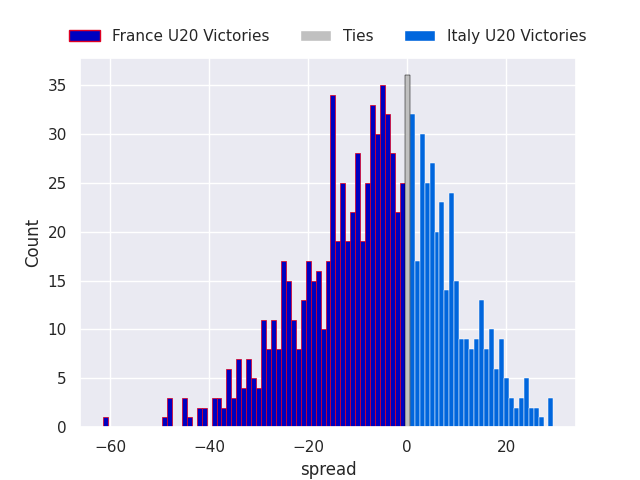

