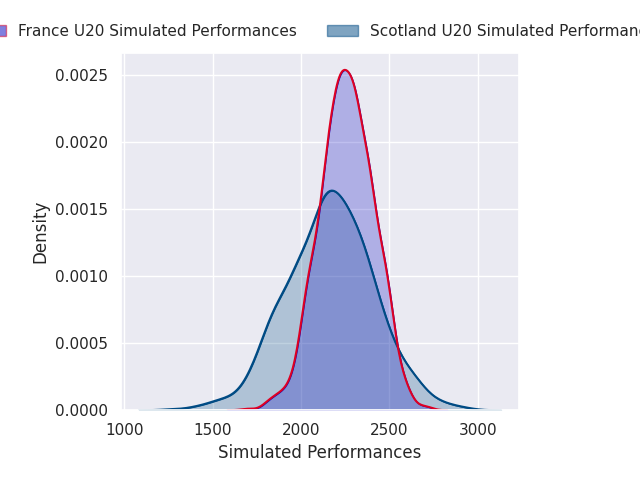
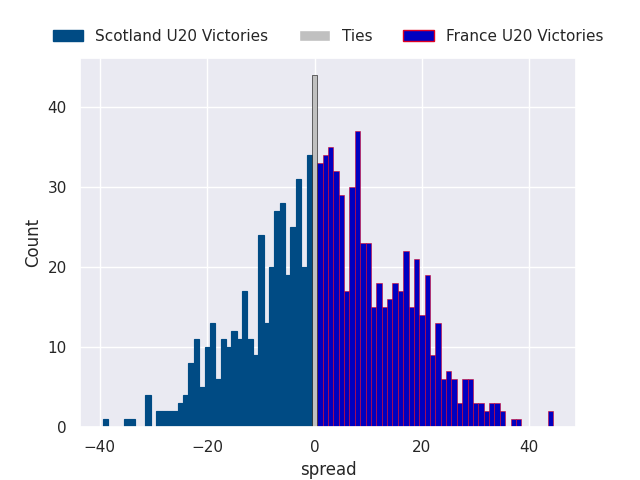
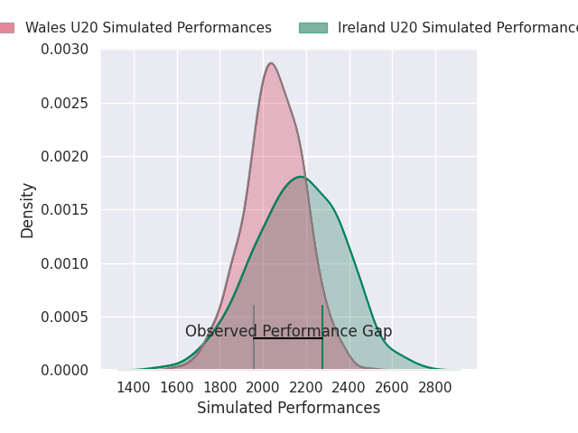
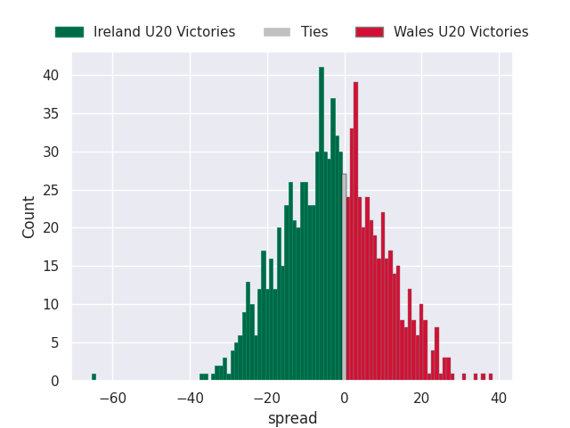

# Team Rankings

# Standings

## Current Standings

| Club         |   Played |   Wins |   Point Differential |   Losing Bonus Points | Try Bonus Points   |   Competition Points |
|:-------------|---------:|-------:|---------------------:|----------------------:|:-------------------|---------------------:|
| France U20   |        3 |      3 |                   54 |                     0 |                    |                   12 |
| England U20  |        3 |      2 |                    9 |                     0 |                    |                    8 |
| Ireland U20  |        3 |      2 |                  -16 |                     0 |                    |                    8 |
| Wales U20    |        3 |      1 |                   -3 |                     1 |                    |                    5 |
| Scotland U20 |        3 |      1 |                    0 |                     0 |                    |                    4 |
| Italy U20    |        3 |      0 |                  -44 |                     1 |                    |                    1 |

## Projected Remaining Table

| Club         |   To Play |   Projected Wins |   Projected Differential |   Projected Losing Bonus Points | Projected Try Bonus Points   |   Projected Competition Points |
|:-------------|----------:|-----------------:|-------------------------:|--------------------------------:|:-----------------------------|-------------------------------:|
| Ireland U20  |         1 |            0.586 |                    3.15  |                           0.185 |                              |                          2.583 |
| France U20   |         1 |            0.567 |                    2.987 |                           0.19  |                              |                          2.526 |
| England U20  |         1 |            0.487 |                    0.206 |                           0.224 |                              |                          2.252 |
| Italy U20    |         1 |            0.473 |                   -0.206 |                           0.23  |                              |                          2.202 |
| Scotland U20 |         1 |            0.399 |                   -2.987 |                           0.22  |                              |                          1.884 |
| Wales U20    |         1 |            0.387 |                   -3.15  |                           0.229 |                              |                          1.831 |

## Projected Total Table

| Club         |   Played |   Wins |   Point Differential |   Losing Bonus Points | Try Bonus Points   |   Competition Points |
|:-------------|---------:|-------:|---------------------:|----------------------:|:-------------------|---------------------:|
| France U20   |        4 |  3.567 |               56.987 |                 0.19  |                    |               14.526 |
| Ireland U20  |        4 |  2.586 |              -12.85  |                 0.185 |                    |               10.583 |
| England U20  |        4 |  2.487 |                9.206 |                 0.224 |                    |               10.252 |
| Wales U20    |        4 |  1.387 |               -6.15  |                 1.229 |                    |                6.831 |
| Scotland U20 |        4 |  1.399 |               -2.987 |                 0.22  |                    |                5.884 |
| Italy U20    |        4 |  0.473 |              -44.206 |                 1.23  |                    |                3.202 |

# Completed Match Review

| Model | Percent Correct Predictions | Spread Error |
| ------ | ------ | ------ |
| Club Level | 58.3% | 10.9 |
| Player Level: Lineup | nan% | nan |
| Player Level: Minutes | nan% | nan |

# Future Predictions

## Week 4

### Scotland U20 V France U20 on 2026/03/06

Average Margin: France U20 by 3.0

### Italy U20 V England U20 on 2026/03/06

Average Margin: England U20 by 0.2

### Ireland U20 V Wales U20 on 2026/03/07

Average Margin: Ireland U20 by 3.2

