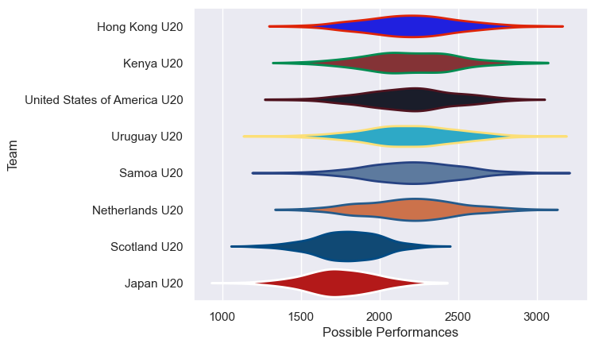

---  
title: "U20 Trophy 2024 Status"  
date: 2025-07-28 6:00:00 -0500  
categories: model review projection  
layout: article  
aside:  
    toc: true  
---
# Current Team Rankings

# Standings

## Current Standings

| Club                         |   Played |   Wins |   Point Differential |   Losing Bonus Points | Try Bonus Points   |   Competition Points |
|:-----------------------------|---------:|-------:|---------------------:|----------------------:|:-------------------|---------------------:|
| Scotland U20                 |        3 |      3 |                  245 |                     0 |                    |                   12 |
| Japan U20                    |        4 |      3 |                  176 |                     0 |                    |                   12 |
| United States of America U20 |        3 |      3 |                   41 |                     0 |                    |                   12 |
| Netherlands U20              |        4 |      2 |                   38 |                     0 |                    |                    8 |
| Uruguay U20                  |        4 |      2 |                  -36 |                     0 |                    |                    8 |
| Samoa U20                    |        4 |      1 |                 -179 |                     0 |                    |                    4 |
| Hong Kong U20                |        4 |      1 |                 -186 |                     0 |                    |                    4 |
| Kenya U20                    |        4 |      0 |                  -99 |                     0 |                    |                    0 |

## Projected Remaining Table

| Club                         |   To Play |   Projected Wins |   Projected Differential |   Projected Losing Bonus Points | Projected Try Bonus Points   |   Projected Competition Points |
|:-----------------------------|----------:|-----------------:|-------------------------:|--------------------------------:|:-----------------------------|-------------------------------:|
| United States of America U20 |         1 |             0.54 |                     5.02 |                            0.13 |                              |                           2.43 |
| Scotland U20                 |         1 |             0.39 |                    -5.02 |                            0.15 |                              |                           1.85 |

## Projected Total Table

| Club                         |   Played |   Wins |   Point Differential |   Losing Bonus Points | Try Bonus Points   |   Competition Points |
|:-----------------------------|---------:|-------:|---------------------:|----------------------:|:-------------------|---------------------:|
| United States of America U20 |        4 |   3.54 |                46.02 |                  0.13 |                    |                14.43 |
| Scotland U20                 |        4 |   3.39 |               239.98 |                  0.15 |                    |                13.85 |
| Japan U20                    |        4 |   3    |               176    |                  0    |                    |                12    |
| Netherlands U20              |        4 |   2    |                38    |                  0    |                    |                 8    |
| Uruguay U20                  |        4 |   2    |               -36    |                  0    |                    |                 8    |
| Samoa U20                    |        4 |   1    |              -179    |                  0    |                    |                 4    |
| Hong Kong U20                |        4 |   1    |              -186    |                  0    |                    |                 4    |
| Kenya U20                    |        4 |   0    |               -99    |                  0    |                    |                 0    |

# Completed Match Review

| Model | Percent Correct Predictions | Spread Error |
| ------ | ------ | ------ |
| Club Level | 37.5% | 45.1 |
| Player Level: Lineup | nan% | nan |
| Player Level: Minutes | nan% | nan |

# Future Predictions

## Week 5

### Scotland U20 V United States of America U20 on 2024/07/17

Average Margin: United States of America U20 by 7.7

