---  
title: "URBA Top 12 2024 Status"  
date: 2024-07-29 6:00:00 -0500  
categories: model review projection  
layout: article  
aside:  
    toc: true  
---
# Current Team Rankings

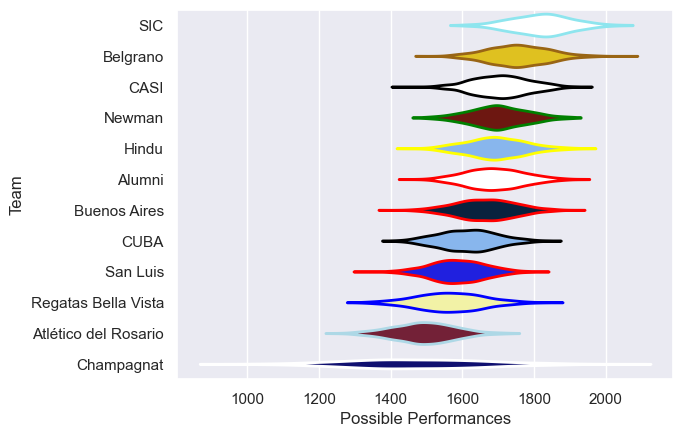
# Standings

## Current Standings

| Club                 |   Played |   Wins |   Point Differential |   Losing Bonus Points |   Try Bonus Points |   Competition Points |
|:---------------------|---------:|-------:|---------------------:|----------------------:|-------------------:|---------------------:|
| CASI                 |       13 |      9 |                  135 |                     2 |                  7 |                   47 |
| Belgrano             |       13 |     11 |                  160 |                     1 |                nan |                   45 |
| Alumni               |       13 |     10 |                   37 |                     0 |                  5 |                   45 |
| Newman               |       13 |      9 |                   99 |                     1 |                  7 |                   44 |
| SIC                  |       13 |      9 |                   96 |                     1 |                  6 |                   43 |
| CUBA                 |       13 |      5 |                   54 |                     5 |                  5 |                   32 |
| San Luis             |       13 |      6 |                  -42 |                     4 |                  3 |                   31 |
| Hindu                |       13 |      5 |                  -54 |                     4 |                nan |                   26 |
| Buenos Aires         |       13 |      5 |                  -45 |                     5 |                nan |                   25 |
| Regatas Bella Vista  |       13 |      3 |                  -66 |                     3 |                  2 |                   19 |
| Champagnat           |       13 |      3 |                 -122 |                     4 |                  2 |                   18 |
| Atlético del Rosario |       13 |      1 |                 -252 |                     1 |                nan |                    5 |

## Projected Remaining Table

| Club                 |   Matches Remaining |   Wins |   Point Differential |   Losing Bonus Points |   Try Bonus Points |   Competition Points |
|:---------------------|--------------------:|-------:|---------------------:|----------------------:|-------------------:|---------------------:|
| Alumni               |                   1 |    1   |             9.6212   |                   0   |                0.9 |                  4.8 |
| Newman               |                   1 |    1   |            19.3377   |                   0   |                0.7 |                  4.6 |
| Belgrano             |                   1 |    1   |             8.43602  |                   0   |                0.3 |                  4.2 |
| San Luis             |                   1 |    0.9 |             8.41536  |                   0.1 |                0.2 |                  4   |
| SIC                  |                   1 |    0.7 |             1.88595  |                   0.3 |                0.5 |                  3.5 |
| Hindu                |                   1 |    0.5 |             0.016685 |                   0.4 |                0.6 |                  3   |
| CASI                 |                   1 |    0.5 |            -0.016685 |                   0.4 |                0.3 |                  2.7 |
| Buenos Aires         |                   1 |    0.3 |            -1.88595  |                   0.5 |                0.1 |                  2   |
| Regatas Bella Vista  |                   1 |    0.1 |            -8.41536  |                   0.3 |                0.1 |                  0.7 |
| CUBA                 |                   1 |    0   |            -8.43602  |                   0.3 |                0.2 |                  0.7 |
| Atlético del Rosario |                   1 |    0   |            -9.6212   |                   0.3 |                0.3 |                  0.7 |
| Champagnat           |                   1 |    0   |           -19.3377   |                   0   |                0   |                  0.1 |

## Projected Total Table

| Club                 |   Total Matches |   Wins |   Point Differential |   Losing Bonus Points |   Try Bonus Points |   Competition Points |
|:---------------------|----------------:|-------:|---------------------:|----------------------:|-------------------:|---------------------:|
| Alumni               |              14 |   11   |              46.6212 |                   0   |                5.9 |                 49.8 |
| CASI                 |              14 |    9.5 |             134.983  |                   2.4 |                7.3 |                 49.7 |
| Belgrano             |              14 |   12   |             168.436  |                   1   |                0.3 |                 49.2 |
| Newman               |              14 |   10   |             118.338  |                   1   |                7.7 |                 48.6 |
| SIC                  |              14 |    9.7 |              97.886  |                   1.3 |                6.5 |                 46.5 |
| San Luis             |              14 |    6.9 |             -33.5846 |                   4.1 |                3.2 |                 35   |
| CUBA                 |              14 |    5   |              45.564  |                   5.3 |                5.2 |                 32.7 |
| Hindu                |              14 |    5.5 |             -53.9833 |                   4.4 |                0.6 |                 29   |
| Buenos Aires         |              14 |    5.3 |             -46.886  |                   5.5 |                0.1 |                 27   |
| Regatas Bella Vista  |              14 |    3.1 |             -74.4154 |                   3.3 |                2.1 |                 19.7 |
| Champagnat           |              14 |    3   |            -141.338  |                   4   |                2   |                 18.1 |
| Atlético del Rosario |              14 |    1   |            -261.621  |                   1.3 |                0.3 |                  5.7 |

# Completed Match Review

| Model | Percent Correct Predictions | Spread Error |
| ------ | ------ | ------ |
| Club Level | 62.8% | 13.7 |
| Player Level: Lineup | 64.1% | 12.2 |
| Player Level: Minutes | 64.1% | 12.2 |

# Future Predictions

## Week 14

### Hindu V CASI on 2024/08/03

Average Margin: CASI by 0.0

Average Scoreline: 28-28

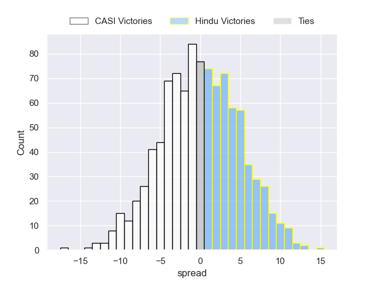

### San Luis V Regatas Bella Vista on 2024/08/03

Average Margin: San Luis by 8.4

Average Scoreline: 28-20

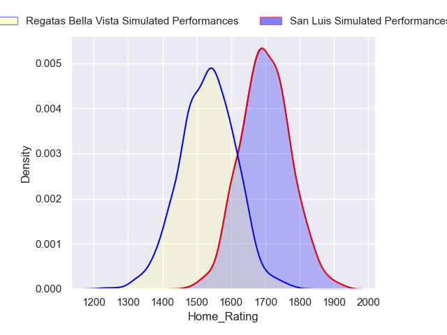
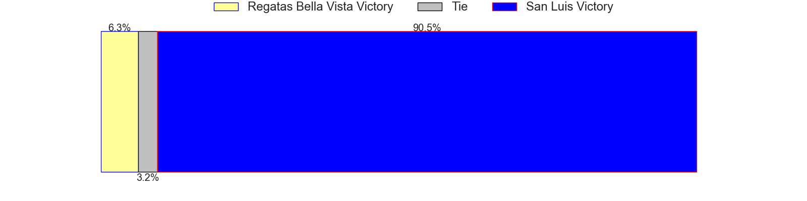
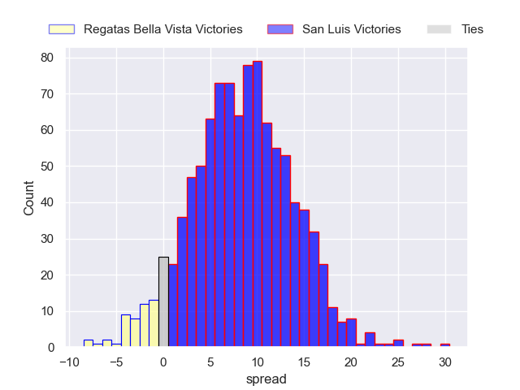

### Atlético del Rosario V Alumni on 2024/08/03

Average Margin: Alumni by 9.6

Average Scoreline: 45-35

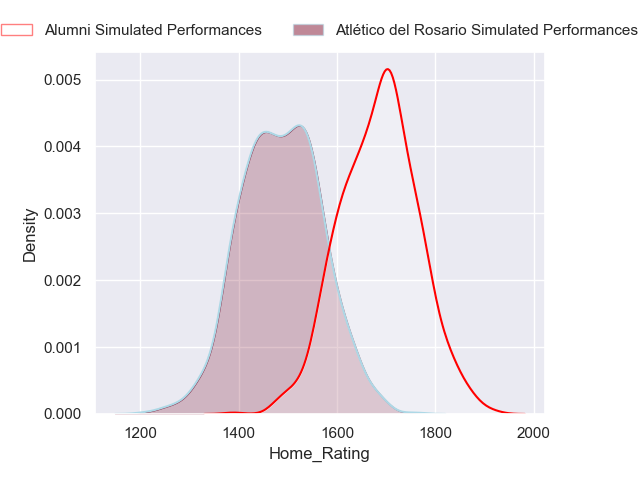
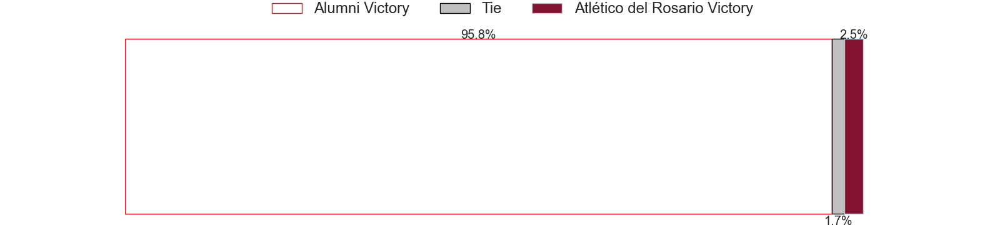
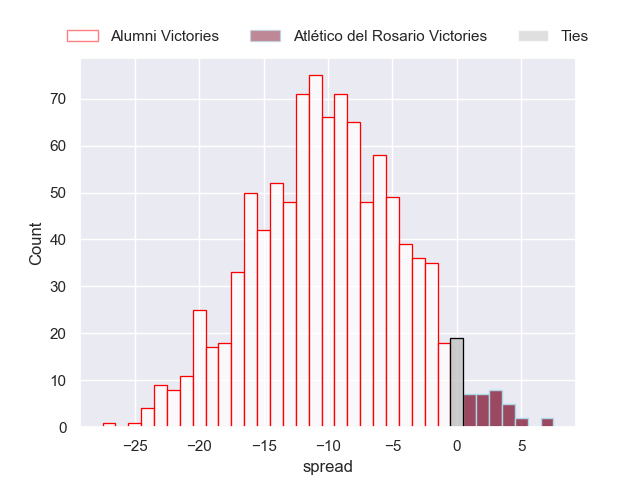

### Newman V Champagnat on 2024/08/03

Average Margin: Newman by 19.3

Average Scoreline: 38-18

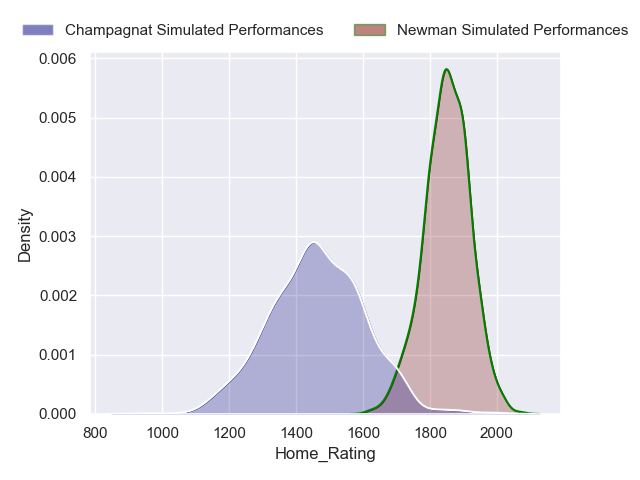

### Buenos Aires V SIC on 2024/08/03

Average Margin: SIC by 1.9

Average Scoreline: 24-22

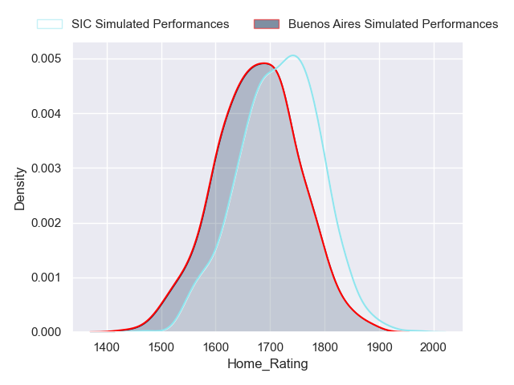

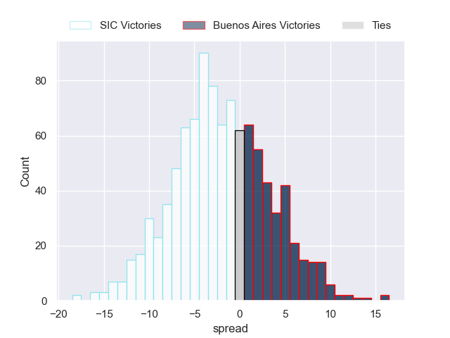

### Belgrano V CUBA on 2024/08/03

Average Margin: Belgrano by 8.4

Average Scoreline: 32-24

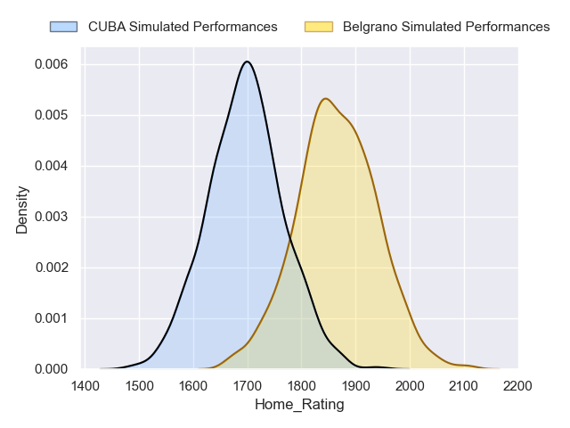

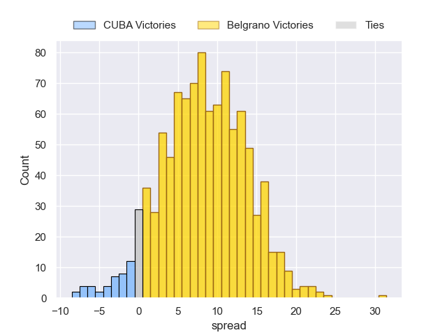

