---  
title: "URBA Top 12 2024 Status"  
date: 2024-04-22 6:00:00 -0500  
categories: model review projection  
layout: article  
aside:  
    toc: true  
---
# Current Team Rankings

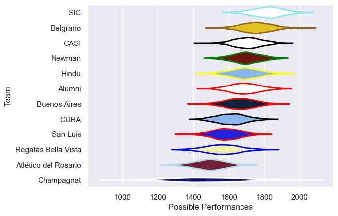
# Standings

## Current Standings

| Club                 |   Played |   Wins |   Point Differential |   Losing Bonus Points |   Try Bonus Points |   Competition Points |
|:---------------------|---------:|-------:|---------------------:|----------------------:|-------------------:|---------------------:|
| SIC                  |        3 |      3 |                   68 |                     0 |                  3 |                   15 |
| Alumni               |        3 |      3 |                   37 |                     0 |                  2 |                   14 |
| Belgrano             |        3 |      3 |                   14 |                     0 |                nan |                   12 |
| CASI                 |        3 |      2 |                   37 |                     1 |                  0 |                    9 |
| Champagnat           |        3 |      1 |                   -2 |                     1 |                  1 |                    8 |
| Buenos Aires         |        3 |      1 |                   10 |                     2 |                nan |                    6 |
| San Luis             |        3 |      1 |                   -7 |                     1 |                  1 |                    6 |
| Regatas Bella Vista  |        3 |      1 |                   -2 |                     1 |                  0 |                    5 |
| Newman               |        3 |      1 |                  -26 |                     1 |                  0 |                    5 |
| Hindu                |        3 |      1 |                  -39 |                     1 |                nan |                    5 |
| CUBA                 |        3 |      0 |                  -22 |                     2 |                  1 |                    3 |
| Atlético del Rosario |        3 |      0 |                  -68 |                     0 |                nan |                    2 |

## Projected Remaining Table

| Club                 |   Matches Remaining |   Wins |   Point Differential |   Losing Bonus Points |   Try Bonus Points |   Competition Points |
|:---------------------|--------------------:|-------:|---------------------:|----------------------:|-------------------:|---------------------:|
| Newman               |                   1 |    1   |            11.1787   |                   0   |                0.3 |                  4.2 |
| Champagnat           |                   1 |    0.9 |            15.3597   |                   0.1 |                0.2 |                  3.8 |
| Hindu                |                   1 |    0.7 |             3.65542  |                   0.2 |                0.3 |                  3.4 |
| SIC                  |                   1 |    0.7 |             3.13715  |                   0.3 |                0.3 |                  3.3 |
| Alumni               |                   1 |    0.7 |             3.29195  |                   0.3 |                0.2 |                  3.1 |
| CASI                 |                   1 |    0.6 |             0.705324 |                   0.3 |                0.2 |                  2.8 |
| San Luis             |                   1 |    0.4 |            -0.705324 |                   0.4 |                0.6 |                  2.8 |
| Regatas Bella Vista  |                   1 |    0.3 |            -3.29195  |                   0.4 |                0.1 |                  1.8 |
| CUBA                 |                   1 |    0.3 |            -3.65542  |                   0.4 |                0.2 |                  1.8 |
| Belgrano             |                   1 |    0.3 |            -3.13715  |                   0.4 |                0.1 |                  1.7 |
| Buenos Aires         |                   1 |    0.1 |           -15.3597   |                   0.2 |                0.1 |                  0.8 |
| Atlético del Rosario |                   1 |    0   |           -11.1787   |                   0.2 |                0.4 |                  0.7 |

## Projected Total Table

| Club                 |   Total Matches |   Wins |   Point Differential |   Losing Bonus Points |   Try Bonus Points |   Competition Points |
|:---------------------|----------------:|-------:|---------------------:|----------------------:|-------------------:|---------------------:|
| SIC                  |               4 |    3.7 |             71.1371  |                   0.3 |                3.3 |                 18.3 |
| Alumni               |               4 |    3.7 |             40.292   |                   0.3 |                2.2 |                 17.1 |
| Belgrano             |               4 |    3.3 |             10.8629  |                   0.4 |                0.1 |                 13.7 |
| CASI                 |               4 |    2.6 |             37.7053  |                   1.3 |                0.2 |                 11.8 |
| Champagnat           |               4 |    1.9 |             13.3597  |                   1.1 |                1.2 |                 11.8 |
| Newman               |               4 |    2   |            -14.8213  |                   1   |                0.3 |                  9.2 |
| San Luis             |               4 |    1.4 |             -7.70532 |                   1.4 |                1.6 |                  8.8 |
| Hindu                |               4 |    1.7 |            -35.3446  |                   1.2 |                0.3 |                  8.4 |
| Regatas Bella Vista  |               4 |    1.3 |             -5.29195 |                   1.4 |                0.1 |                  6.8 |
| Buenos Aires         |               4 |    1.1 |             -5.35972 |                   2.2 |                0.1 |                  6.8 |
| CUBA                 |               4 |    0.3 |            -25.6554  |                   2.4 |                1.2 |                  4.8 |
| Atlético del Rosario |               4 |    0   |            -79.1787  |                   0.2 |                0.4 |                  2.7 |

# Completed Match Review

| Model | Percent Correct Predictions | Spread Error |
| ------ | ------ | ------ |
| Club Level | 61.1% | 14.9 |
| Player Level: Lineup | 61.1% | 11.2 |
| Player Level: Minutes | 61.1% | 11.2 |

# Future Predictions

## Week 4

### Buenos Aires V Champagnat on 2024/04/27

Average Margin: Champagnat by 15.4

Average Scoreline: 29-14

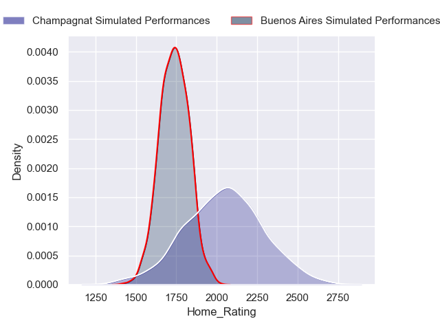

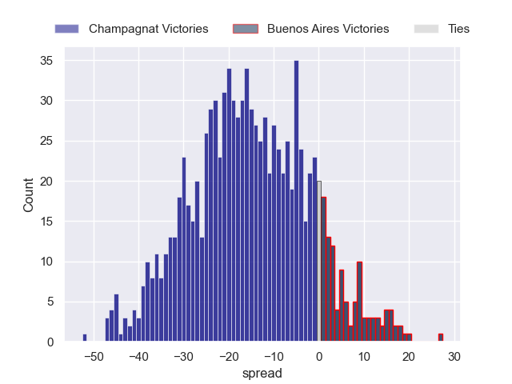

### Newman V Atlético del Rosario on 2024/04/27

Average Margin: Newman by 11.2

Average Scoreline: 33-22

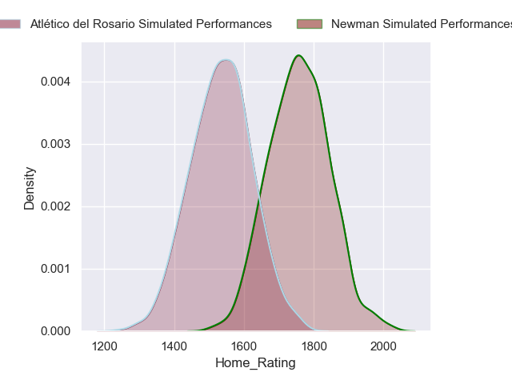
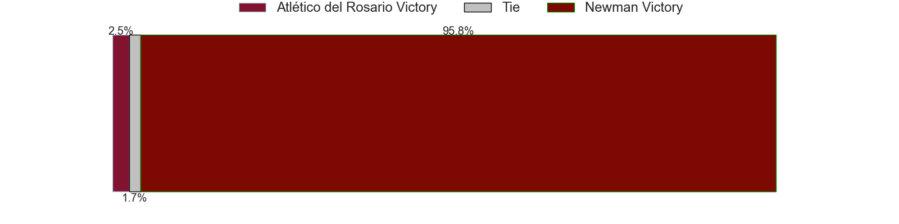
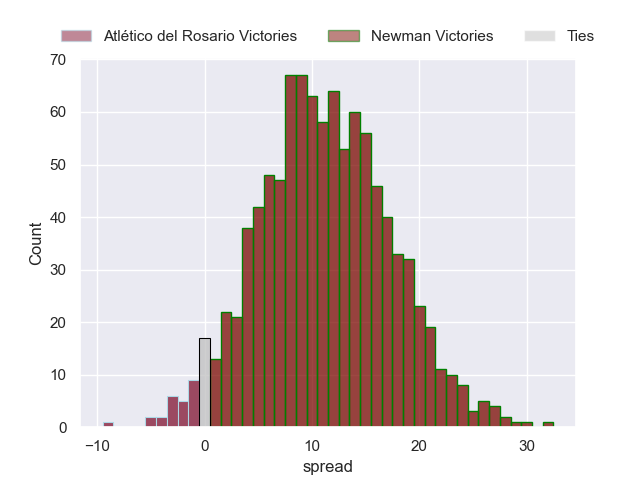

### Belgrano V SIC on 2024/04/27

Average Margin: SIC by 3.1

Average Scoreline: 26-23

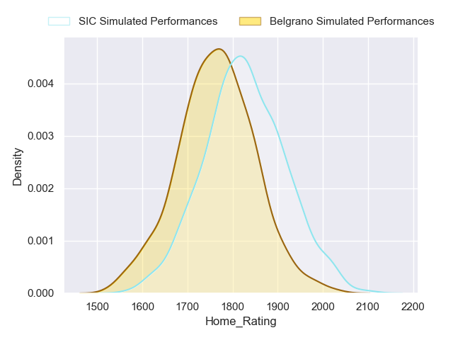

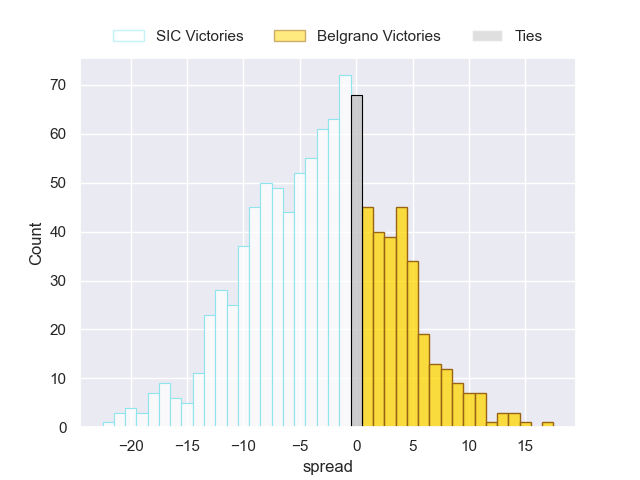

### Hindu V CUBA on 2024/04/27

Average Margin: Hindu by 3.7

Average Scoreline: 31-28

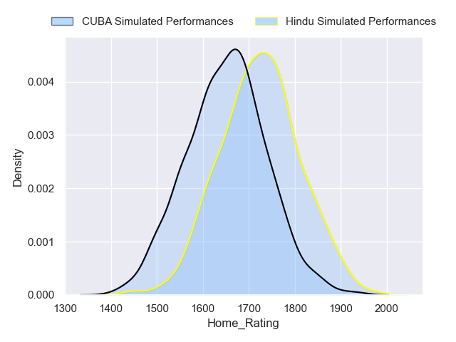

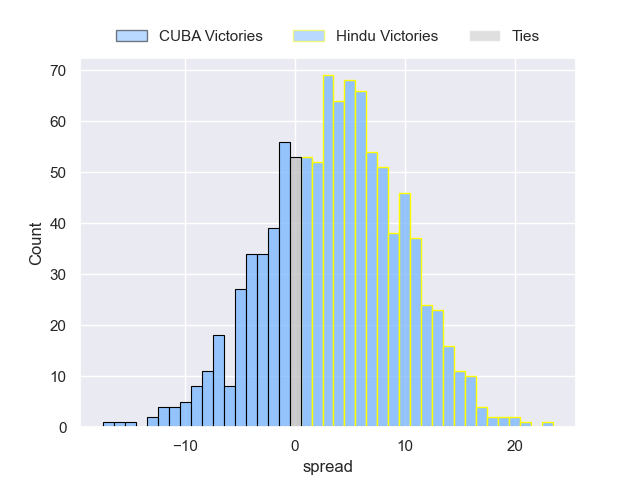

### Regatas Bella Vista V Alumni on 2024/04/27

Average Margin: Alumni by 3.3

Average Scoreline: 25-22

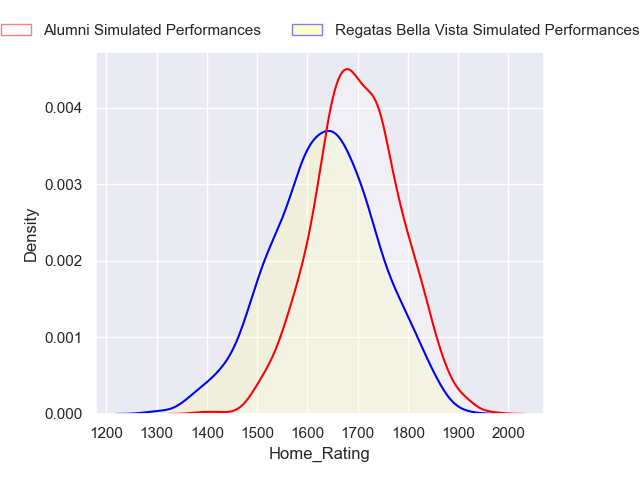

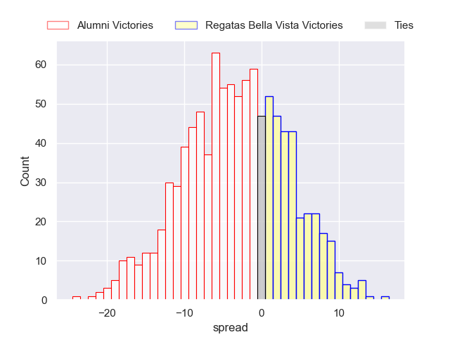

### San Luis V CASI on 2024/04/27

Average Margin: CASI by 0.7

Average Scoreline: 24-24

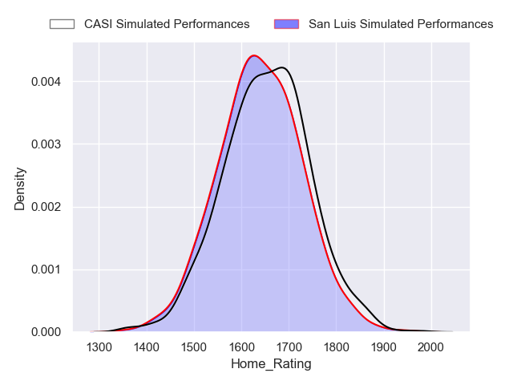

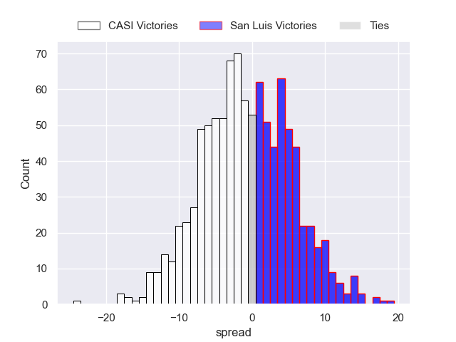

