---  
title: "URBA Top 12 2024 Status"  
date: 2024-06-17 6:00:00 -0500  
categories: model review projection  
layout: article  
aside:  
    toc: true  
---
# Current Team Rankings

# Standings

## Current Standings

| Club                 |   Played |   Wins |   Point Differential |   Losing Bonus Points |   Try Bonus Points |   Competition Points |
|:---------------------|---------:|-------:|---------------------:|----------------------:|-------------------:|---------------------:|
| CASI                 |        9 |      7 |                  113 |                     1 |                  4 |                   35 |
| SIC                  |        9 |      7 |                   83 |                     1 |                  4 |                   33 |
| Belgrano             |        9 |      8 |                  131 |                     0 |                nan |                   32 |
| Alumni               |        9 |      6 |                   13 |                     0 |                  4 |                   28 |
| Newman               |        9 |      5 |                   24 |                     1 |                  5 |                   26 |
| San Luis             |        9 |      4 |                  -33 |                     3 |                  2 |                   21 |
| Buenos Aires         |        9 |      4 |                    7 |                     4 |                nan |                   20 |
| Regatas Bella Vista  |        9 |      3 |                  -21 |                     2 |                  2 |                   18 |
| CUBA                 |        9 |      2 |                  -19 |                     4 |                  2 |                   16 |
| Hindu                |        9 |      3 |                  -61 |                     2 |                nan |                   16 |
| Champagnat           |        9 |      2 |                  -59 |                     3 |                  1 |                   12 |
| Atlético del Rosario |        9 |      1 |                 -178 |                     1 |                nan |                    5 |

## Projected Remaining Table

| Club                 |   Matches Remaining |   Wins |   Point Differential |   Losing Bonus Points |   Try Bonus Points |   Competition Points |
|:---------------------|--------------------:|-------:|---------------------:|----------------------:|-------------------:|---------------------:|
| CASI                 |                   1 |    1   |           15.1425    |                   0   |                0.7 |                  4.7 |
| CUBA                 |                   1 |    0.9 |           15.2302    |                   0.1 |                0.7 |                  4.5 |
| SIC                  |                   1 |    1   |            8.92036   |                   0   |                0.3 |                  4.2 |
| Belgrano             |                   1 |    0.8 |            4.73932   |                   0.2 |                0.4 |                  3.9 |
| Newman               |                   1 |    0.7 |            3.69877   |                   0.2 |                0.3 |                  3.4 |
| Buenos Aires         |                   1 |    0.5 |            0.0737886 |                   0.4 |                0.2 |                  2.6 |
| San Luis             |                   1 |    0.5 |           -0.0737886 |                   0.4 |                0.1 |                  2.5 |
| Regatas Bella Vista  |                   1 |    0.3 |           -3.69877   |                   0.4 |                0.2 |                  1.6 |
| Hindu                |                   1 |    0.2 |           -4.73932   |                   0.5 |                0.3 |                  1.5 |
| Atlético del Rosario |                   1 |    0   |          -15.1425    |                   0.1 |                0.7 |                  0.7 |
| Alumni               |                   1 |    0   |           -8.92036   |                   0.3 |                0.1 |                  0.6 |
| Champagnat           |                   1 |    0.1 |          -15.2302    |                   0.1 |                0.1 |                  0.4 |

## Projected Total Table

| Club                 |   Total Matches |   Wins |   Point Differential |   Losing Bonus Points |   Try Bonus Points |   Competition Points |
|:---------------------|----------------:|-------:|---------------------:|----------------------:|-------------------:|---------------------:|
| CASI                 |              10 |    8   |            128.143   |                   1   |                4.7 |                 39.7 |
| SIC                  |              10 |    8   |             91.9204  |                   1   |                4.3 |                 37.2 |
| Belgrano             |              10 |    8.8 |            135.739   |                   0.2 |                0.4 |                 35.9 |
| Newman               |              10 |    5.7 |             27.6988  |                   1.2 |                5.3 |                 29.4 |
| Alumni               |              10 |    6   |              4.07964 |                   0.3 |                4.1 |                 28.6 |
| San Luis             |              10 |    4.5 |            -33.0738  |                   3.4 |                2.1 |                 23.5 |
| Buenos Aires         |              10 |    4.5 |              7.07379 |                   4.4 |                0.2 |                 22.6 |
| CUBA                 |              10 |    2.9 |             -3.76983 |                   4.1 |                2.7 |                 20.5 |
| Regatas Bella Vista  |              10 |    3.3 |            -24.6988  |                   2.4 |                2.2 |                 19.6 |
| Hindu                |              10 |    3.2 |            -65.7393  |                   2.5 |                0.3 |                 17.5 |
| Champagnat           |              10 |    2.1 |            -74.2302  |                   3.1 |                1.1 |                 12.4 |
| Atlético del Rosario |              10 |    1   |           -193.143   |                   1.1 |                0.7 |                  5.7 |

# Completed Match Review

| Model | Percent Correct Predictions | Spread Error |
| ------ | ------ | ------ |
| Club Level | 59.3% | 14.6 |
| Player Level: Lineup | 61.1% | 12.1 |
| Player Level: Minutes | 61.1% | 12.1 |

# Future Predictions

## Week 10

### CUBA V Champagnat on 2024/06/22

Average Margin: CUBA by 15.2

Average Scoreline: 36-21

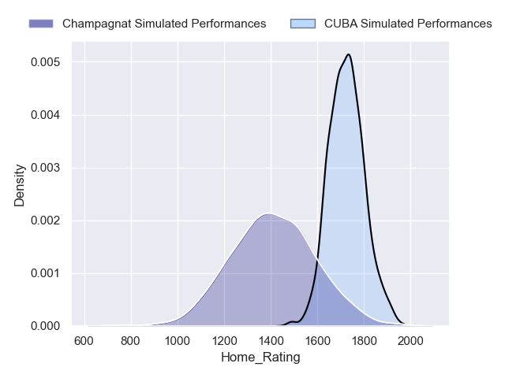

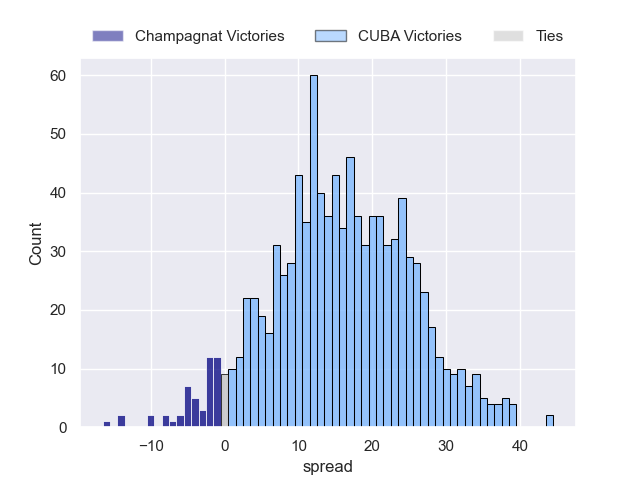

### CASI V Atlético del Rosario on 2024/06/22

Average Margin: CASI by 15.1

Average Scoreline: 41-26

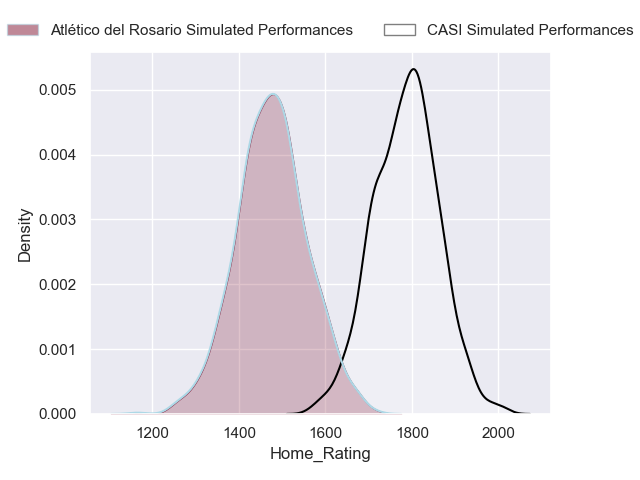
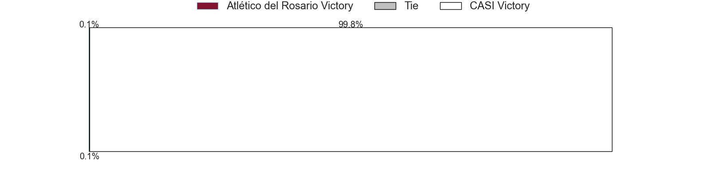
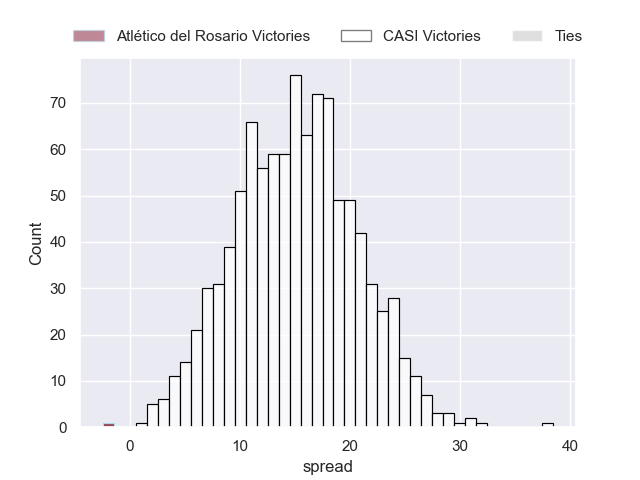

### SIC V Alumni on 2024/06/22

Average Margin: SIC by 8.9

Average Scoreline: 34-25

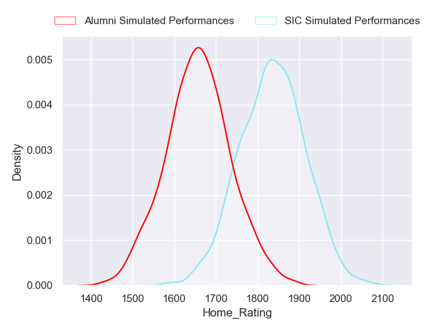
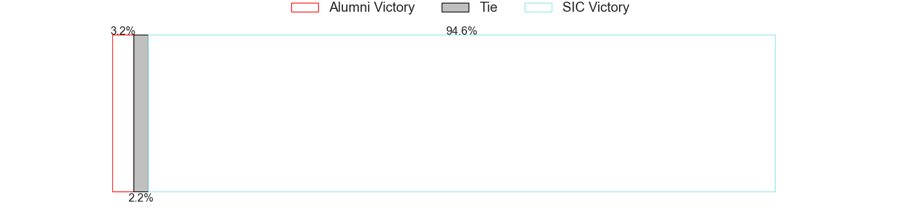
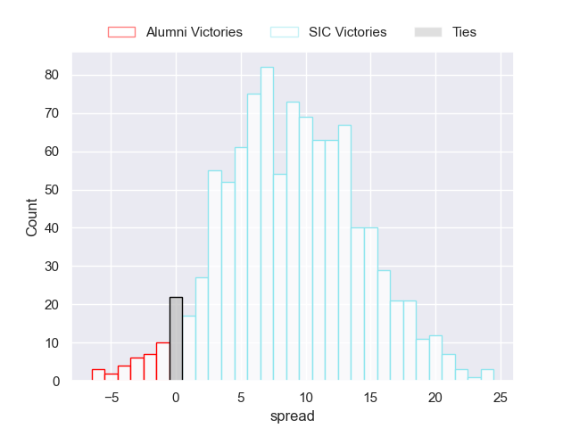

### Hindu V Belgrano on 2024/06/22

Average Margin: Belgrano by 4.7

Average Scoreline: 26-22

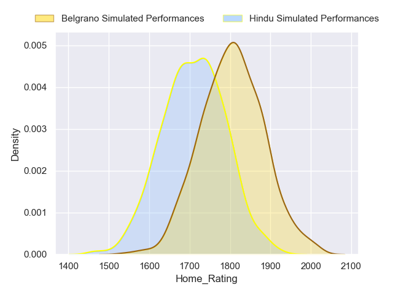

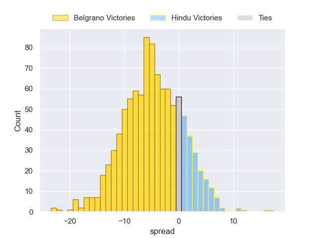

### San Luis V Buenos Aires on 2024/06/22

Average Margin: Buenos Aires by 0.1

Average Scoreline: 32-32

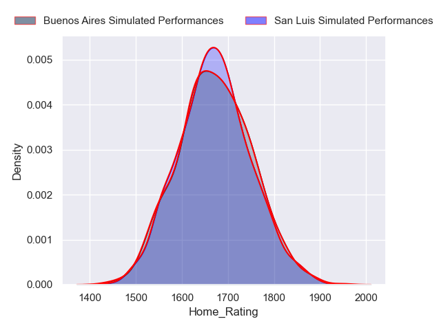

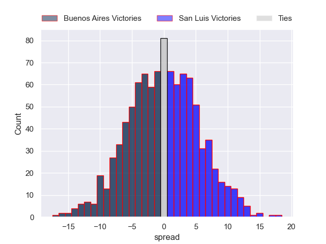

### Regatas Bella Vista V Newman on 2024/06/22

Average Margin: Newman by 3.7

Average Scoreline: 32-28

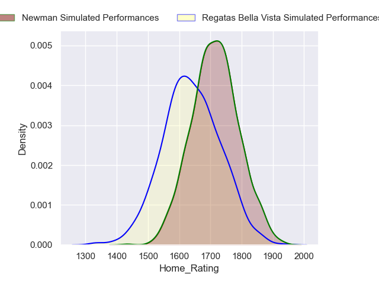

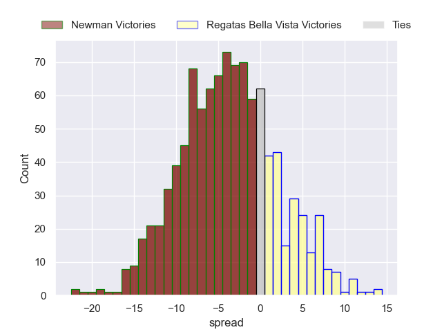

