---  
title: "URBA Top 12 2024 Status"  
date: 2024-04-15 6:00:00 -0500  
categories: model review projection  
layout: article  
aside:  
    toc: true  
---
# Current Team Rankings

# Standings

## Current Standings

| Club                 |   Played |   Wins |   Point Differential |   Losing Bonus Points |   Try Bonus Points |   Competition Points |
|:---------------------|---------:|-------:|---------------------:|----------------------:|-------------------:|---------------------:|
| SIC                  |        2 |      2 |                   62 |                     0 |                  2 |                   10 |
| Alumni               |        2 |      2 |                    8 |                     0 |                  1 |                    9 |
| Belgrano             |        2 |      2 |                   13 |                     0 |                nan |                    8 |
| San Luis             |        2 |      1 |                    4 |                     1 |                  1 |                    6 |
| Buenos Aires         |        2 |      1 |                   16 |                     1 |                nan |                    5 |
| CASI                 |        2 |      1 |                    1 |                     1 |                  0 |                    5 |
| Hindu                |        2 |      1 |                   -3 |                     1 |                nan |                    5 |
| Champagnat           |        2 |      0 |                   -7 |                     1 |                  1 |                    4 |
| Newman               |        2 |      1 |                  -21 |                     0 |                  0 |                    4 |
| Atlético del Rosario |        2 |      0 |                  -39 |                     0 |                nan |                    2 |
| Regatas Bella Vista  |        2 |      0 |                  -13 |                     1 |                  0 |                    1 |
| CUBA                 |        2 |      0 |                  -21 |                     1 |                  0 |                    1 |

## Projected Remaining Table

| Club                 |   Matches Remaining |   Wins |   Point Differential |   Losing Bonus Points |   Try Bonus Points |   Competition Points |
|:---------------------|--------------------:|-------:|---------------------:|----------------------:|-------------------:|---------------------:|
| SIC                  |                   1 |    1   |             12.3923  |                   0   |                0.4 |                  4.4 |
| Alumni               |                   1 |    0.9 |              9.49039 |                   0.1 |                0.3 |                  4   |
| Hindu                |                   1 |    0.6 |              1.61493 |                   0.3 |                0.8 |                  3.5 |
| CUBA                 |                   1 |    0.6 |              2.27713 |                   0.3 |                0.2 |                  3.1 |
| Regatas Bella Vista  |                   1 |    0.6 |              1.28365 |                   0.3 |                0.1 |                  2.7 |
| Champagnat           |                   1 |    0.6 |              2.77677 |                   0.2 |                0.1 |                  2.6 |
| San Luis             |                   1 |    0.4 |             -1.28365 |                   0.3 |                0.2 |                  2.3 |
| CASI                 |                   1 |    0.4 |             -1.61493 |                   0.4 |                0.2 |                  2.2 |
| Belgrano             |                   1 |    0.4 |             -2.27713 |                   0.4 |                0.2 |                  2.1 |
| Newman               |                   1 |    0.4 |             -2.77677 |                   0.2 |                0.2 |                  2.1 |
| Atlético del Rosario |                   1 |    0.1 |             -9.49039 |                   0.3 |                0.4 |                  1   |
| Buenos Aires         |                   1 |    0   |            -12.3923  |                   0.2 |                0   |                  0.3 |

## Projected Total Table

| Club                 |   Total Matches |   Wins |   Point Differential |   Losing Bonus Points |   Try Bonus Points |   Competition Points |
|:---------------------|----------------:|-------:|---------------------:|----------------------:|-------------------:|---------------------:|
| SIC                  |               3 |    3   |            74.3923   |                   0   |                2.4 |                 14.4 |
| Alumni               |               3 |    2.9 |            17.4904   |                   0.1 |                1.3 |                 13   |
| Belgrano             |               3 |    2.4 |            10.7229   |                   0.4 |                0.2 |                 10.1 |
| Hindu                |               3 |    1.6 |            -1.38507  |                   1.3 |                0.8 |                  8.5 |
| San Luis             |               3 |    1.4 |             2.71635  |                   1.3 |                1.2 |                  8.3 |
| CASI                 |               3 |    1.4 |            -0.614931 |                   1.4 |                0.2 |                  7.2 |
| Champagnat           |               3 |    0.6 |            -4.22323  |                   1.2 |                1.1 |                  6.6 |
| Newman               |               3 |    1.4 |           -23.7768   |                   0.2 |                0.2 |                  6.1 |
| Buenos Aires         |               3 |    1   |             3.60767  |                   1.2 |                0   |                  5.3 |
| CUBA                 |               3 |    0.6 |           -18.7229   |                   1.3 |                0.2 |                  4.1 |
| Regatas Bella Vista  |               3 |    0.6 |           -11.7163   |                   1.3 |                0.1 |                  3.7 |
| Atlético del Rosario |               3 |    0.1 |           -48.4904   |                   0.3 |                0.4 |                  3   |

# Completed Match Review

| Model | Percent Correct Predictions | Spread Error |
| ------ | ------ | ------ |
| Club Level | 66.7% | 13.3 |
| Player Level: Lineup | 58.3% | 9.9 |
| Player Level: Minutes | 58.3% | 10.0 |

# Future Predictions

## Week 3

### Champagnat V Newman on 2024/04/20

Average Margin: Champagnat by 2.8

Average Scoreline: 21-19

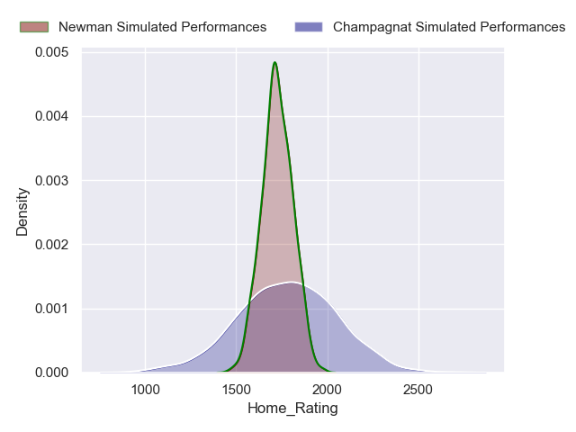

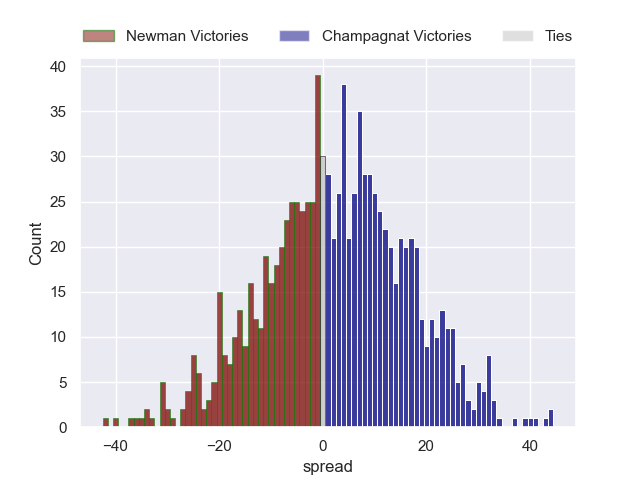

### Regatas Bella Vista V San Luis on 2024/04/20

Average Margin: Regatas Bella Vista by 1.3

Average Scoreline: 23-22

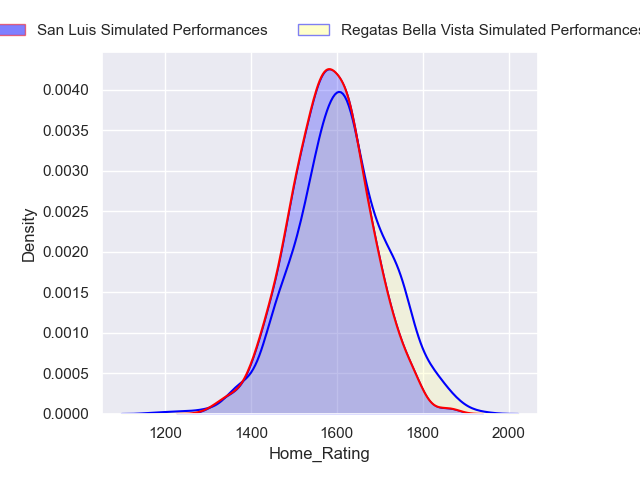

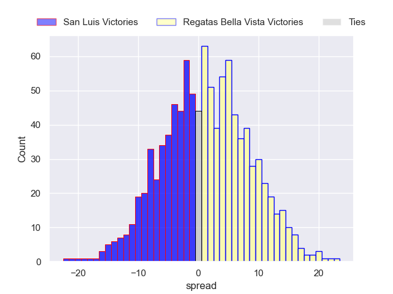

### CUBA V Belgrano on 2024/04/20

Average Margin: CUBA by 2.3

Average Scoreline: 29-27

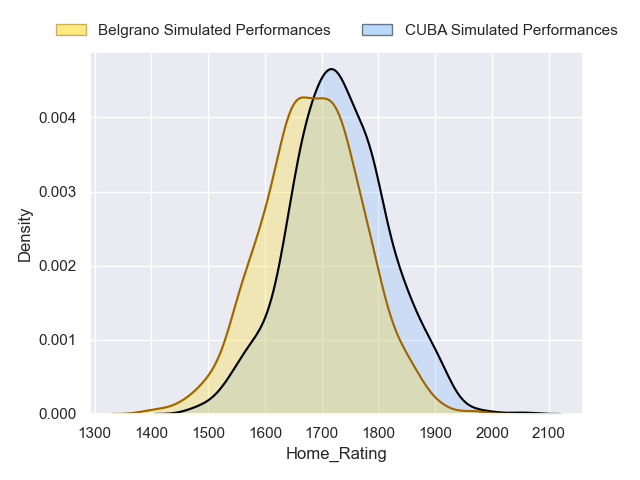

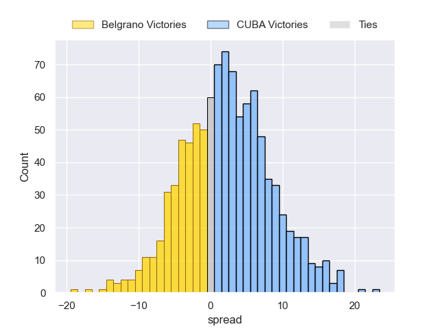

### SIC V Buenos Aires on 2024/04/20

Average Margin: SIC by 12.4

Average Scoreline: 31-18

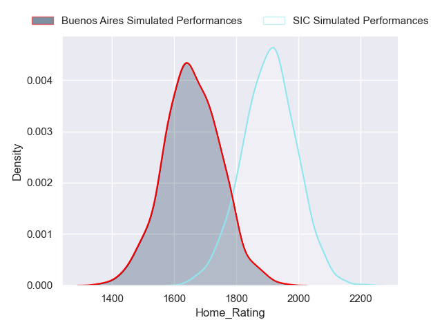

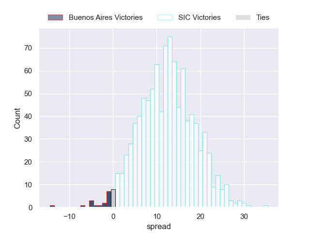

### CASI V Hindu on 2024/04/20

Average Margin: Hindu by 1.6

Average Scoreline: 26-24

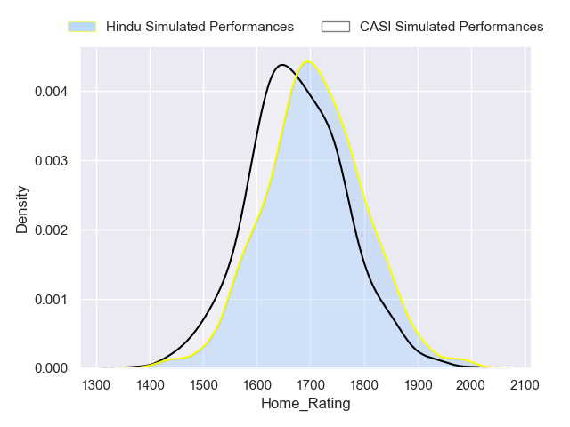

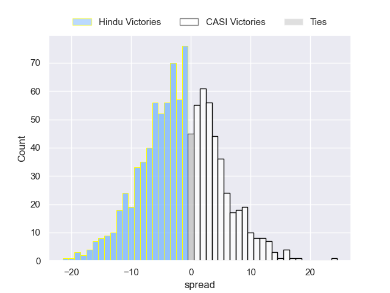

### Alumni V Atlético del Rosario on 2024/04/20

Average Margin: Alumni by 9.5

Average Scoreline: 30-20

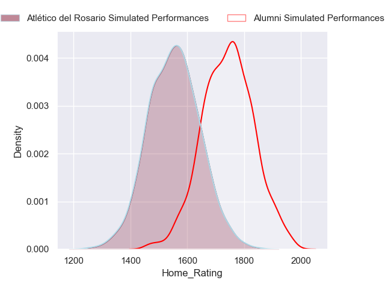
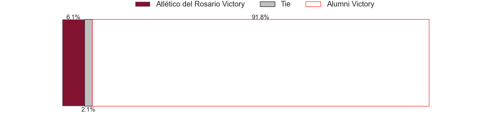
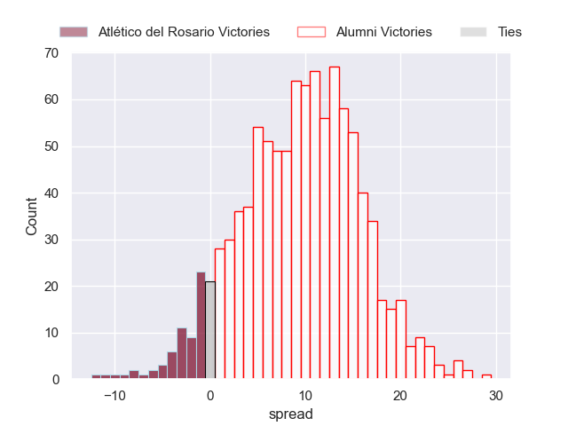

