---  
title: "URBA Top 12 2024 Status"  
date: 2024-05-09 6:00:00 -0500  
categories: model review projection  
layout: article  
aside:  
    toc: true  
---
# Current Team Rankings

# Standings

## Current Standings

| Club                 |   Played |   Wins |   Point Differential |   Losing Bonus Points |   Try Bonus Points |   Competition Points |
|:---------------------|---------:|-------:|---------------------:|----------------------:|-------------------:|---------------------:|
| SIC                  |        4 |      4 |                   76 |                     0 |                  3 |                   19 |
| Alumni               |        4 |      4 |                   42 |                     0 |                  2 |                   18 |
| CASI                 |        4 |      3 |                   40 |                     1 |                  0 |                   13 |
| Belgrano             |        4 |      3 |                    6 |                     0 |                nan |                   12 |
| Buenos Aires         |        4 |      2 |                   20 |                     2 |                nan |                   10 |
| Newman               |        4 |      2 |                    2 |                     1 |                  1 |                   10 |
| Hindu                |        4 |      2 |                  -36 |                     1 |                nan |                    9 |
| Champagnat           |        4 |      1 |                  -12 |                     1 |                  1 |                    8 |
| San Luis             |        4 |      1 |                  -10 |                     2 |                  1 |                    7 |
| Regatas Bella Vista  |        4 |      1 |                   -7 |                     2 |                  0 |                    6 |
| CUBA                 |        4 |      0 |                  -25 |                     3 |                  1 |                    4 |
| Atlético del Rosario |        4 |      0 |                  -96 |                     0 |                nan |                    2 |

## Projected Remaining Table

| Club                 |   Matches Remaining |   Wins |   Point Differential |   Losing Bonus Points |   Try Bonus Points |   Competition Points |
|:---------------------|--------------------:|-------:|---------------------:|----------------------:|-------------------:|---------------------:|
| SIC                  |                   1 |    1   |             12.9845  |                   0   |                0.5 |                  4.5 |
| Champagnat           |                   1 |    1   |             22.9962  |                   0   |                0.1 |                  4   |
| CUBA                 |                   1 |    0.9 |              8.48692 |                   0.1 |                0.3 |                  4   |
| CASI                 |                   1 |    0.9 |              8.53362 |                   0.1 |                0.2 |                  3.9 |
| Alumni               |                   1 |    0.7 |              3.42242 |                   0.2 |                0.3 |                  3.4 |
| Buenos Aires         |                   1 |    0.7 |              3.47957 |                   0.3 |                0.3 |                  3.3 |
| Atlético del Rosario |                   1 |    0.3 |             -3.47957 |                   0.4 |                0.5 |                  2.1 |
| Newman               |                   1 |    0.3 |             -3.42242 |                   0.4 |                0.1 |                  1.7 |
| Regatas Bella Vista  |                   1 |    0.1 |             -8.53362 |                   0.3 |                0.2 |                  1   |
| San Luis             |                   1 |    0.1 |             -8.48692 |                   0.3 |                0.2 |                  0.8 |
| Belgrano             |                   1 |    0   |            -22.9962  |                   0.1 |                0.2 |                  0.4 |
| Hindu                |                   1 |    0   |            -12.9845  |                   0.1 |                0.1 |                  0.3 |

## Projected Total Table

| Club                 |   Total Matches |   Wins |   Point Differential |   Losing Bonus Points |   Try Bonus Points |   Competition Points |
|:---------------------|----------------:|-------:|---------------------:|----------------------:|-------------------:|---------------------:|
| SIC                  |               5 |    5   |             88.9845  |                   0   |                3.5 |                 23.5 |
| Alumni               |               5 |    4.7 |             45.4224  |                   0.2 |                2.3 |                 21.4 |
| CASI                 |               5 |    3.9 |             48.5336  |                   1.1 |                0.2 |                 16.9 |
| Buenos Aires         |               5 |    2.7 |             23.4796  |                   2.3 |                0.3 |                 13.3 |
| Belgrano             |               5 |    3   |            -16.9962  |                   0.1 |                0.2 |                 12.4 |
| Champagnat           |               5 |    2   |             10.9962  |                   1   |                1.1 |                 12   |
| Newman               |               5 |    2.3 |             -1.42242 |                   1.4 |                1.1 |                 11.7 |
| Hindu                |               5 |    2   |            -48.9845  |                   1.1 |                0.1 |                  9.3 |
| CUBA                 |               5 |    0.9 |            -16.5131  |                   3.1 |                1.3 |                  8   |
| San Luis             |               5 |    1.1 |            -18.4869  |                   2.3 |                1.2 |                  7.8 |
| Regatas Bella Vista  |               5 |    1.1 |            -15.5336  |                   2.3 |                0.2 |                  7   |
| Atlético del Rosario |               5 |    0.3 |            -99.4796  |                   0.4 |                0.5 |                  4.1 |

# Completed Match Review

| Model | Percent Correct Predictions | Spread Error |
| ------ | ------ | ------ |
| Club Level | 66.7% | 13.2 |
| Player Level: Lineup | 58.3% | 11.0 |
| Player Level: Minutes | 58.3% | 11.0 |

# Future Predictions

## Week 5

### Alumni V Newman on 2024/05/11

Average Margin: Alumni by 3.4

Average Scoreline: 27-24

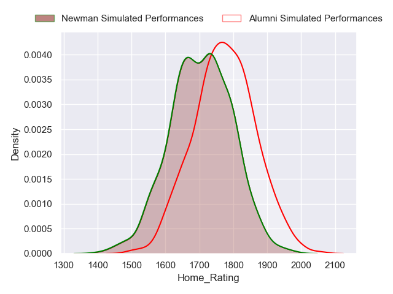
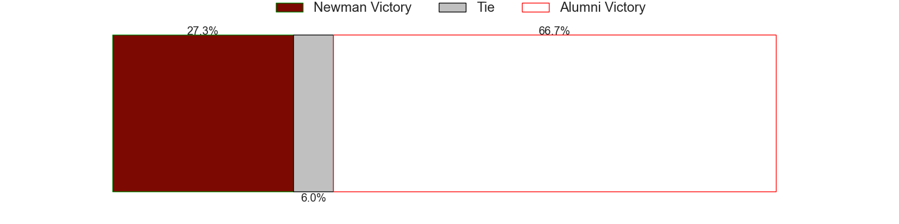
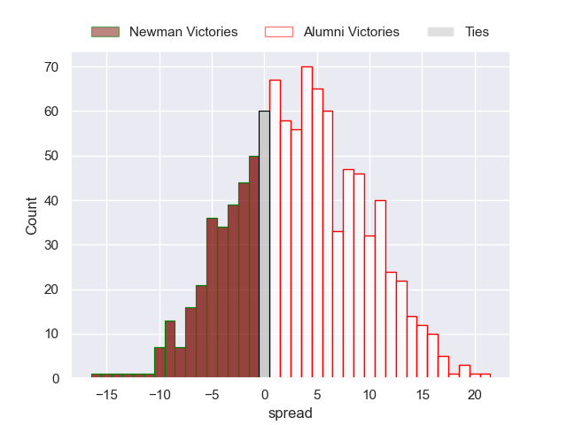

### CASI V Regatas Bella Vista on 2024/05/11

Average Margin: CASI by 8.5

Average Scoreline: 28-20

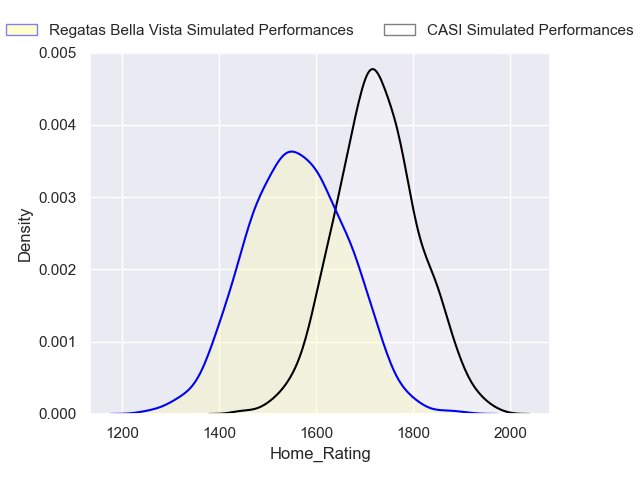
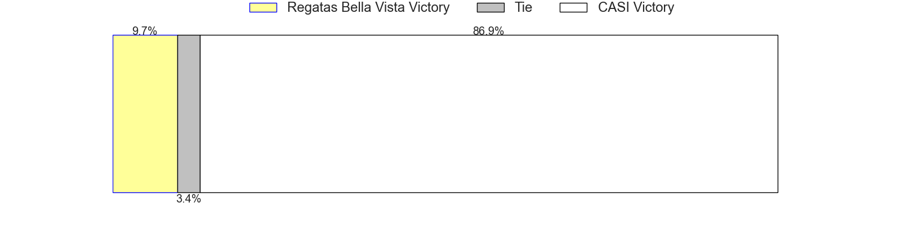
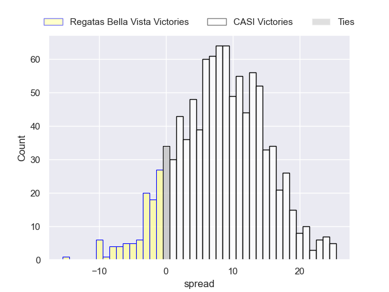

### CUBA V San Luis on 2024/05/11

Average Margin: CUBA by 8.5

Average Scoreline: 30-21

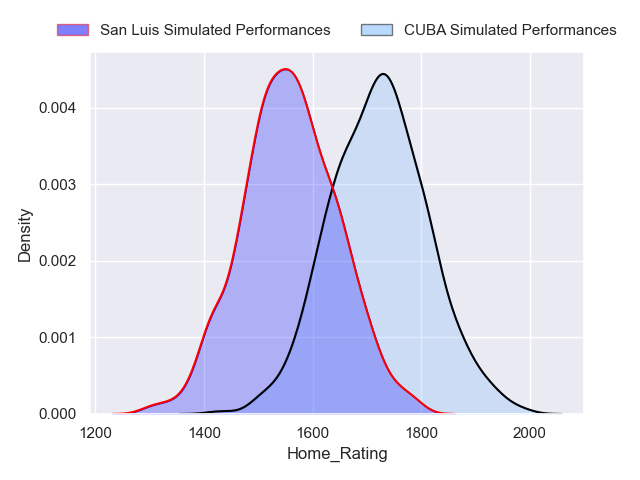
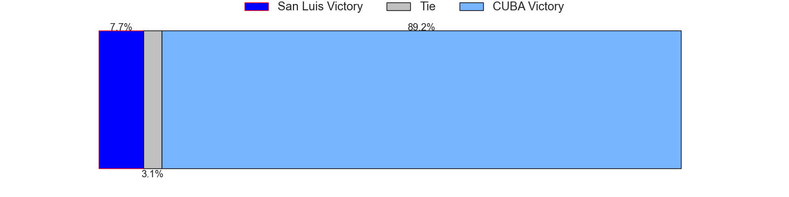
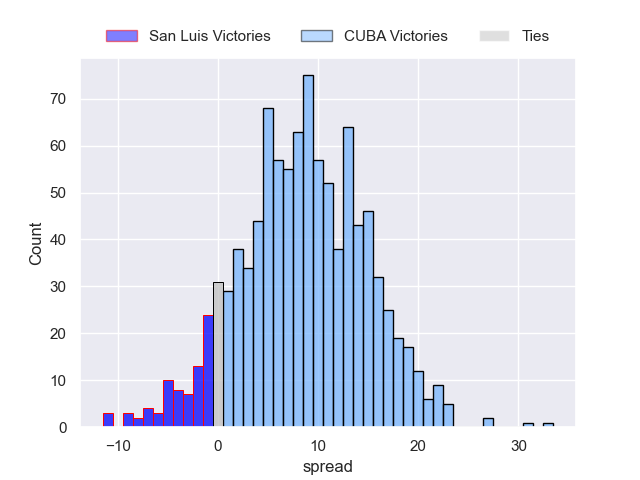

### Atlético del Rosario V Buenos Aires on 2024/05/11

Average Margin: Buenos Aires by 3.5

Average Scoreline: 27-24

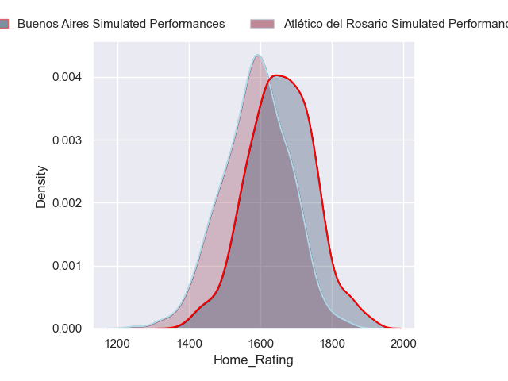

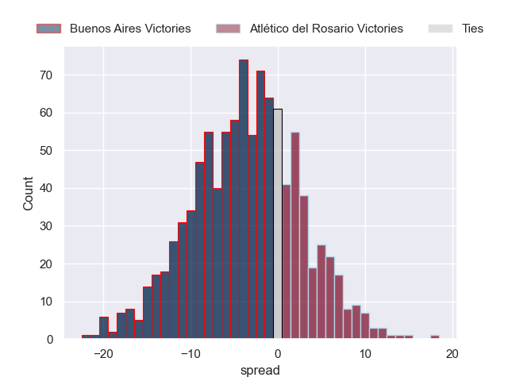

### Champagnat V Belgrano on 2024/05/11

Average Margin: Champagnat by 23.0

Average Scoreline: 33-10

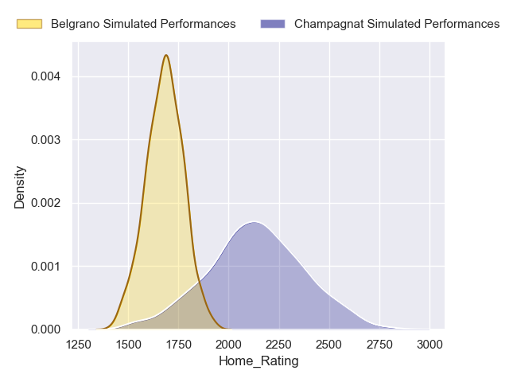

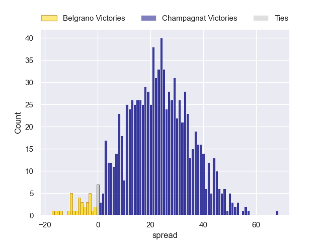

### SIC V Hindu on 2024/05/11

Average Margin: SIC by 13.0

Average Scoreline: 32-19

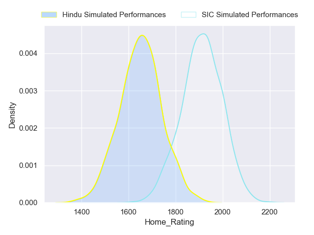

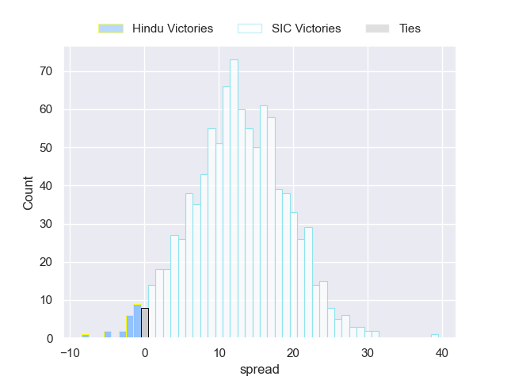

