---  
title: "URBA Top 12 2024 Status"  
date: 2024-05-13 6:00:00 -0500  
categories: model review projection  
layout: article  
aside:  
    toc: true  
---
# Current Team Rankings

# Standings

## Current Standings

| Club                 |   Played |   Wins |   Point Differential |   Losing Bonus Points |   Try Bonus Points |   Competition Points |
|:---------------------|---------:|-------:|---------------------:|----------------------:|-------------------:|---------------------:|
| SIC                  |        5 |      5 |                   78 |                     0 |                  3 |                   23 |
| Alumni               |        5 |      5 |                   53 |                     0 |                  3 |                   23 |
| CASI                 |        5 |      4 |                   63 |                     1 |                  1 |                   18 |
| Belgrano             |        5 |      4 |                   37 |                     0 |                nan |                   16 |
| Buenos Aires         |        5 |      3 |                   29 |                     2 |                nan |                   14 |
| San Luis             |        5 |      2 |                   -5 |                     2 |                  1 |                   11 |
| Newman               |        5 |      2 |                   -9 |                     1 |                  1 |                   10 |
| Hindu                |        5 |      2 |                  -38 |                     2 |                nan |                   10 |
| Champagnat           |        5 |      1 |                  -43 |                     1 |                  1 |                    8 |
| Regatas Bella Vista  |        5 |      1 |                  -30 |                     2 |                  0 |                    6 |
| CUBA                 |        5 |      0 |                  -30 |                     4 |                  1 |                    5 |
| Atlético del Rosario |        5 |      0 |                 -105 |                     0 |                nan |                    2 |

## Projected Remaining Table

| Club                 |   Matches Remaining |   Wins |   Point Differential |   Losing Bonus Points |   Try Bonus Points |   Competition Points |
|:---------------------|--------------------:|-------:|---------------------:|----------------------:|-------------------:|---------------------:|
| Belgrano             |                   1 |    1   |            15.2298   |                   0   |                0.7 |                  4.7 |
| SIC                  |                   1 |    0.9 |             8.4986   |                   0.1 |                0.5 |                  4.3 |
| Hindu                |                   1 |    0.8 |             8.82866  |                   0.1 |                0.7 |                  3.9 |
| Buenos Aires         |                   1 |    0.6 |             1.97867  |                   0.3 |                0.3 |                  3.1 |
| CUBA                 |                   1 |    0.6 |             0.989973 |                   0.3 |                0.3 |                  2.9 |
| CASI                 |                   1 |    0.6 |             1.3081   |                   0.3 |                0.1 |                  2.8 |
| Alumni               |                   1 |    0.4 |            -1.3081   |                   0.4 |                0.7 |                  2.8 |
| Regatas Bella Vista  |                   1 |    0.4 |            -0.989973 |                   0.4 |                0.1 |                  2.2 |
| Newman               |                   1 |    0.4 |            -1.97867  |                   0.4 |                0.2 |                  2.1 |
| Champagnat           |                   1 |    0.2 |            -8.82866  |                   0.2 |                0.1 |                  1.2 |
| San Luis             |                   1 |    0.1 |            -8.4986   |                   0.3 |                0.1 |                  0.7 |
| Atlético del Rosario |                   1 |    0   |           -15.2298   |                   0.1 |                0.3 |                  0.4 |

## Projected Total Table

| Club                 |   Total Matches |   Wins |   Point Differential |   Losing Bonus Points |   Try Bonus Points |   Competition Points |
|:---------------------|----------------:|-------:|---------------------:|----------------------:|-------------------:|---------------------:|
| SIC                  |               6 |    5.9 |              86.4986 |                   0.1 |                3.5 |                 27.3 |
| Alumni               |               6 |    5.4 |              51.6919 |                   0.4 |                3.7 |                 25.8 |
| CASI                 |               6 |    4.6 |              64.3081 |                   1.3 |                1.1 |                 20.8 |
| Belgrano             |               6 |    5   |              52.2298 |                   0   |                0.7 |                 20.7 |
| Buenos Aires         |               6 |    3.6 |              30.9787 |                   2.3 |                0.3 |                 17.1 |
| Hindu                |               6 |    2.8 |             -29.1713 |                   2.1 |                0.7 |                 13.9 |
| Newman               |               6 |    2.4 |             -10.9787 |                   1.4 |                1.2 |                 12.1 |
| San Luis             |               6 |    2.1 |             -13.4986 |                   2.3 |                1.1 |                 11.7 |
| Champagnat           |               6 |    1.2 |             -51.8287 |                   1.2 |                1.1 |                  9.2 |
| Regatas Bella Vista  |               6 |    1.4 |             -30.99   |                   2.4 |                0.1 |                  8.2 |
| CUBA                 |               6 |    0.6 |             -29.01   |                   4.3 |                1.3 |                  7.9 |
| Atlético del Rosario |               6 |    0   |            -120.23   |                   0.1 |                0.3 |                  2.4 |

# Completed Match Review

| Model | Percent Correct Predictions | Spread Error |
| ------ | ------ | ------ |
| Club Level | 66.7% | 14.1 |
| Player Level: Lineup | 60.0% | 11.2 |
| Player Level: Minutes | 60.0% | 11.2 |

# Future Predictions

## Week 6

### Buenos Aires V Newman on 2024/05/18

Average Margin: Buenos Aires by 2.0

Average Scoreline: 30-28

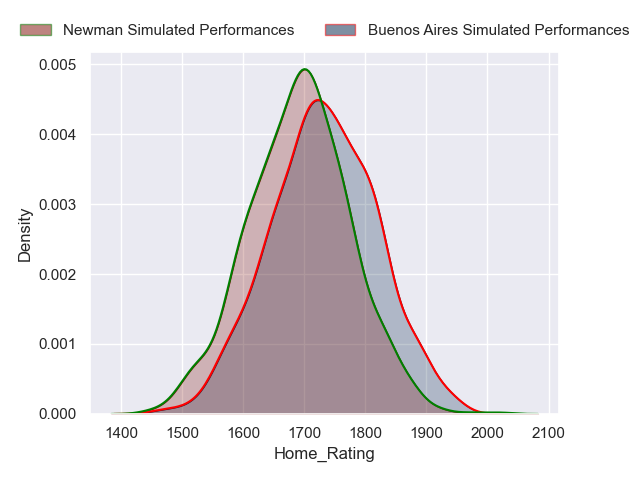

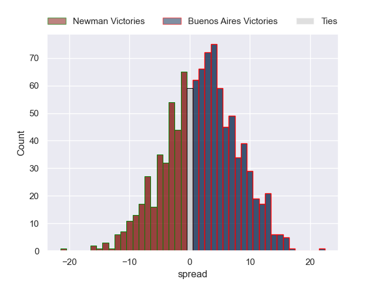

### Regatas Bella Vista V CUBA on 2024/05/18

Average Margin: CUBA by 1.0

Average Scoreline: 20-19

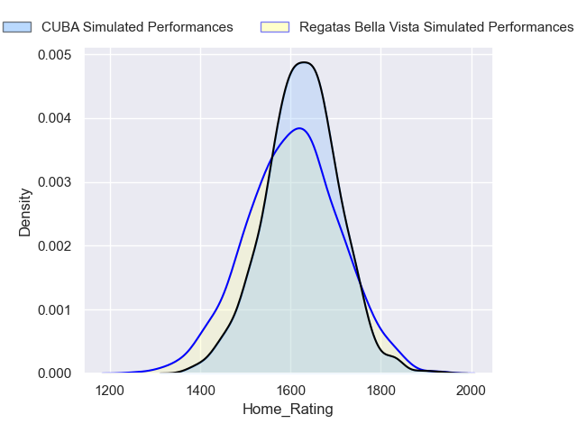

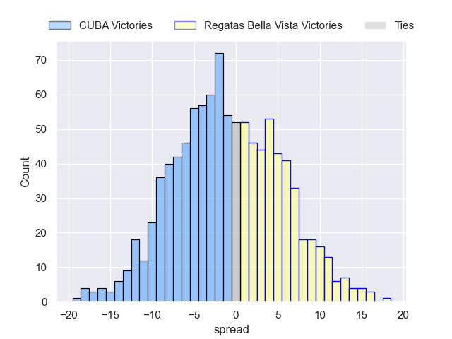

### CASI V Alumni on 2024/05/18

Average Margin: CASI by 1.3

Average Scoreline: 33-32

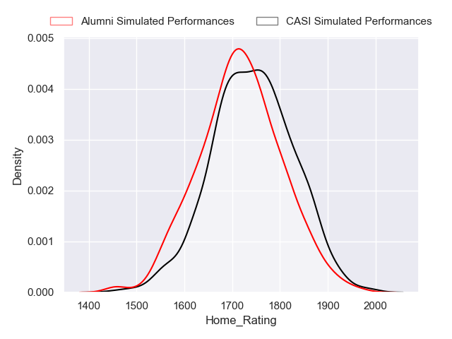

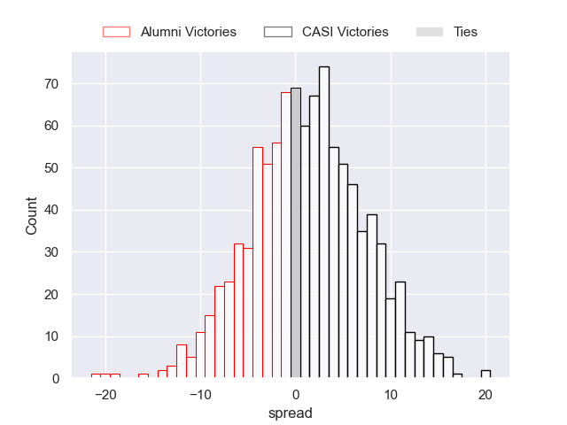

### Belgrano V Atlético del Rosario on 2024/05/18

Average Margin: Belgrano by 15.2

Average Scoreline: 37-22

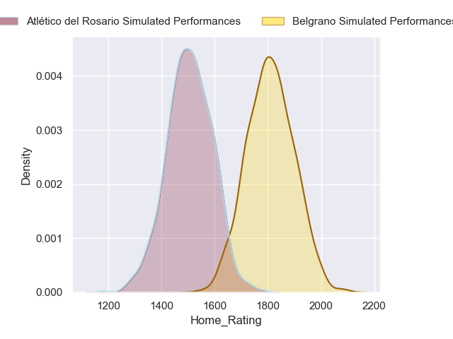
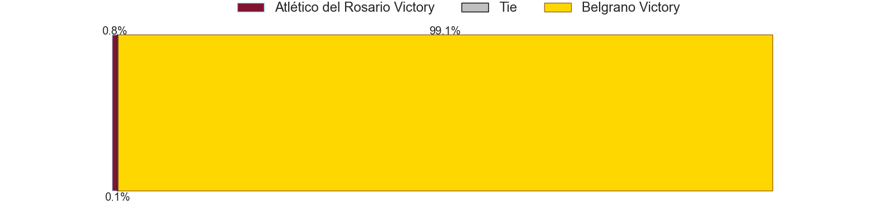
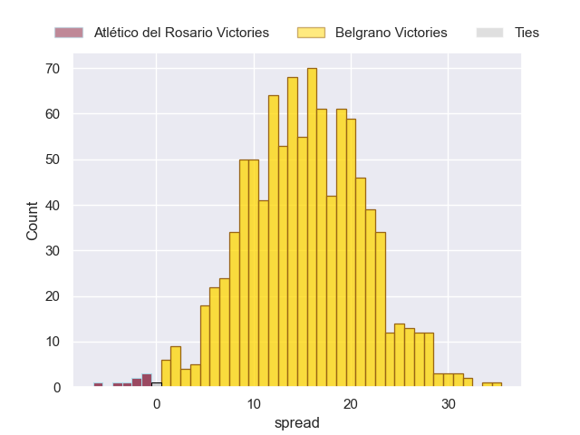

### Hindu V Champagnat on 2024/05/18

Average Margin: Hindu by 8.8

Average Scoreline: 38-29

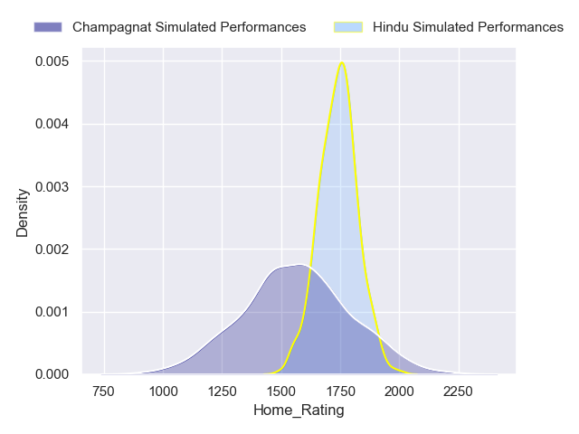

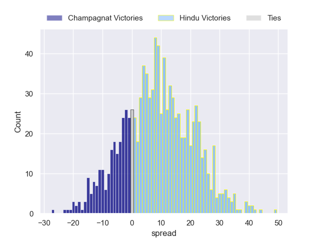

### San Luis V SIC on 2024/05/18

Average Margin: SIC by 8.5

Average Scoreline: 27-19

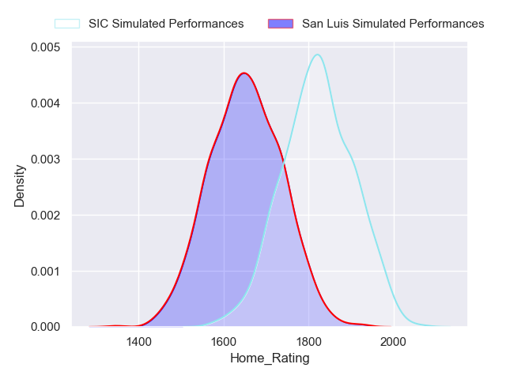
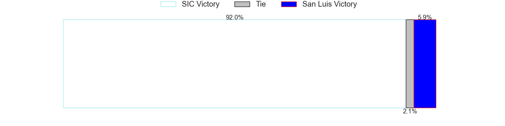
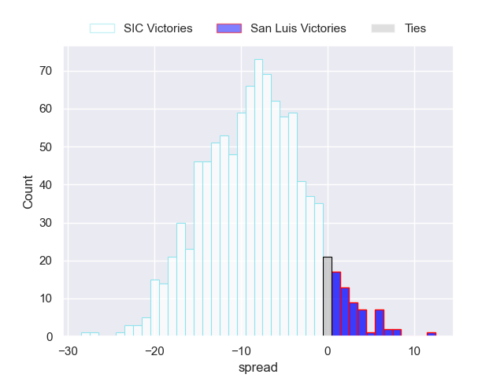

