---  
title: "URBA Top 12 2024 Status"  
date: 2024-05-20 6:00:00 -0500  
categories: model review projection  
layout: article  
aside:  
    toc: true  
---
# Current Team Rankings

# Standings

## Current Standings

| Club                 |   Played |   Wins |   Point Differential |   Losing Bonus Points |   Try Bonus Points |   Competition Points |
|:---------------------|---------:|-------:|---------------------:|----------------------:|-------------------:|---------------------:|
| SIC                  |        6 |      6 |                   85 |                     0 |                  3 |                   27 |
| CASI                 |        6 |      5 |                   98 |                     1 |                  2 |                   23 |
| Alumni               |        6 |      5 |                   18 |                     0 |                  3 |                   23 |
| Belgrano             |        6 |      5 |                   84 |                     0 |                nan |                   20 |
| Buenos Aires         |        6 |      3 |                   28 |                     3 |                nan |                   15 |
| Newman               |        6 |      3 |                   -8 |                     1 |                  2 |                   15 |
| San Luis             |        6 |      2 |                  -12 |                     3 |                  1 |                   12 |
| Hindu                |        6 |      2 |                  -38 |                     2 |                nan |                   12 |
| Regatas Bella Vista  |        6 |      2 |                  -22 |                     2 |                  1 |                   11 |
| Champagnat           |        6 |      2 |                  -43 |                     1 |                  1 |                   10 |
| CUBA                 |        6 |      0 |                  -38 |                     4 |                  1 |                    5 |
| Atlético del Rosario |        6 |      0 |                 -152 |                     0 |                nan |                    2 |

## Projected Remaining Table

| Club                 |   Matches Remaining |   Wins |   Point Differential |   Losing Bonus Points |   Try Bonus Points |   Competition Points |
|:---------------------|--------------------:|-------:|---------------------:|----------------------:|-------------------:|---------------------:|
| SIC                  |                   1 |    1   |            15.5243   |                   0   |                0.3 |                  4.3 |
| Hindu                |                   1 |    0.9 |             6.96608  |                   0.1 |                0.6 |                  4.2 |
| Alumni               |                   1 |    0.8 |             4.47374  |                   0.2 |                0.2 |                  3.6 |
| CASI                 |                   1 |    0.6 |             0.994325 |                   0.3 |                0.3 |                  2.9 |
| San Luis             |                   1 |    0.5 |             1.8689   |                   0.3 |                0.4 |                  2.8 |
| Newman               |                   1 |    0.5 |             0.580957 |                   0.4 |                0.2 |                  2.7 |
| Belgrano             |                   1 |    0.5 |            -0.580957 |                   0.4 |                0.4 |                  2.6 |
| CUBA                 |                   1 |    0.4 |            -0.994325 |                   0.4 |                0.5 |                  2.6 |
| Champagnat           |                   1 |    0.5 |            -1.8689   |                   0.2 |                0.1 |                  2.1 |
| Buenos Aires         |                   1 |    0.2 |            -4.47374  |                   0.5 |                0.2 |                  1.5 |
| Atlético del Rosario |                   1 |    0.1 |            -6.96608  |                   0.4 |                0.4 |                  1.2 |
| Regatas Bella Vista  |                   1 |    0   |           -15.5243   |                   0.1 |                0   |                  0.1 |

## Projected Total Table

| Club                 |   Total Matches |   Wins |   Point Differential |   Losing Bonus Points |   Try Bonus Points |   Competition Points |
|:---------------------|----------------:|-------:|---------------------:|----------------------:|-------------------:|---------------------:|
| SIC                  |               7 |    7   |            100.524   |                   0   |                3.3 |                 31.3 |
| Alumni               |               7 |    5.8 |             22.4737  |                   0.2 |                3.2 |                 26.6 |
| CASI                 |               7 |    5.6 |             98.9943  |                   1.3 |                2.3 |                 25.9 |
| Belgrano             |               7 |    5.5 |             83.419   |                   0.4 |                0.4 |                 22.6 |
| Newman               |               7 |    3.5 |             -7.41904 |                   1.4 |                2.2 |                 17.7 |
| Buenos Aires         |               7 |    3.2 |             23.5263  |                   3.5 |                0.2 |                 16.5 |
| Hindu                |               7 |    2.9 |            -31.0339  |                   2.1 |                0.6 |                 16.2 |
| San Luis             |               7 |    2.5 |            -10.1311  |                   3.3 |                1.4 |                 14.8 |
| Champagnat           |               7 |    2.5 |            -44.8689  |                   1.2 |                1.1 |                 12.1 |
| Regatas Bella Vista  |               7 |    2   |            -37.5243  |                   2.1 |                1   |                 11.1 |
| CUBA                 |               7 |    0.4 |            -38.9943  |                   4.4 |                1.5 |                  7.6 |
| Atlético del Rosario |               7 |    0.1 |           -158.966   |                   0.4 |                0.4 |                  3.2 |

# Completed Match Review

| Model | Percent Correct Predictions | Spread Error |
| ------ | ------ | ------ |
| Club Level | 63.9% | 14.5 |
| Player Level: Lineup | 61.1% | 11.6 |
| Player Level: Minutes | 61.1% | 11.6 |

# Future Predictions

## Week 7

### Alumni V Buenos Aires on 2024/05/25

Average Margin: Alumni by 4.5

Average Scoreline: 30-26

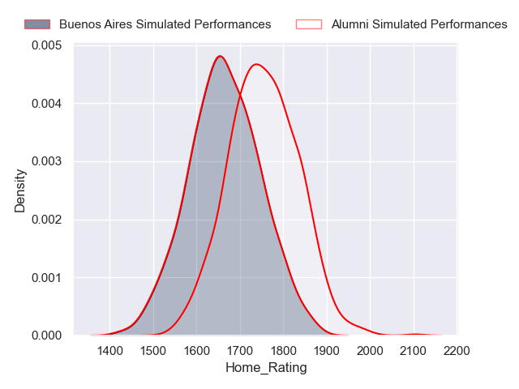
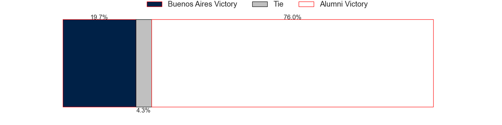
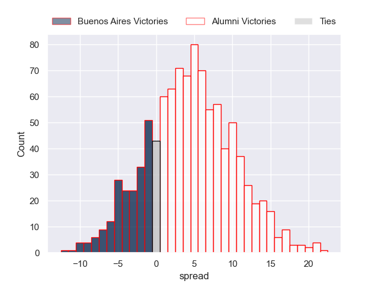

### CUBA V CASI on 2024/05/25

Average Margin: CASI by 1.0

Average Scoreline: 25-24

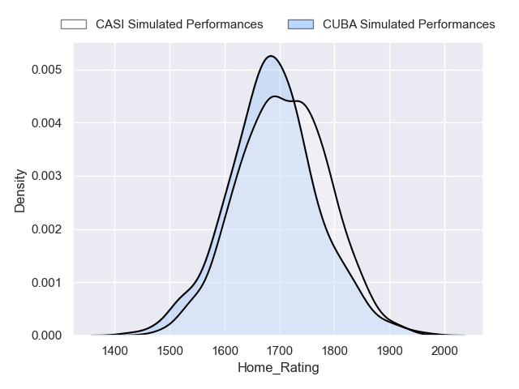

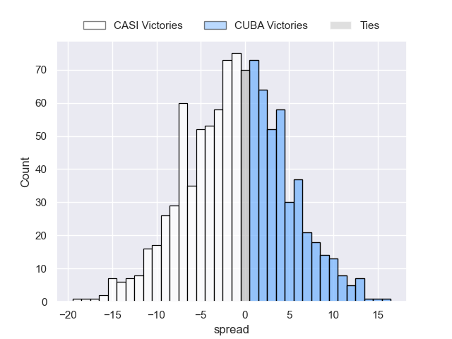

### SIC V Regatas Bella Vista on 2024/05/25

Average Margin: SIC by 15.5

Average Scoreline: 29-13

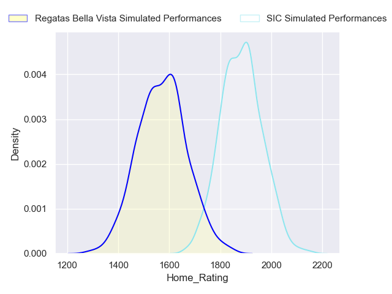

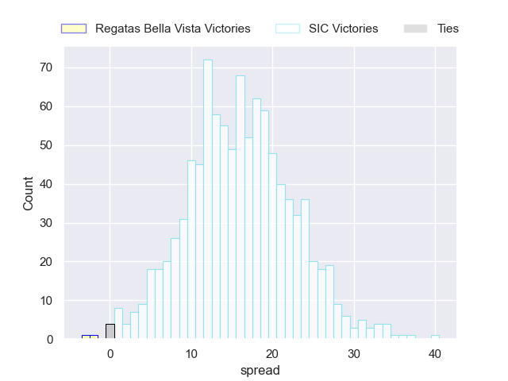

### Newman V Belgrano on 2024/05/25

Average Margin: Newman by 0.6

Average Scoreline: 31-30

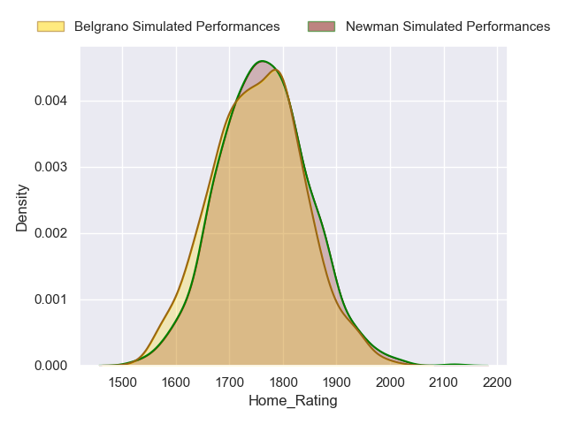

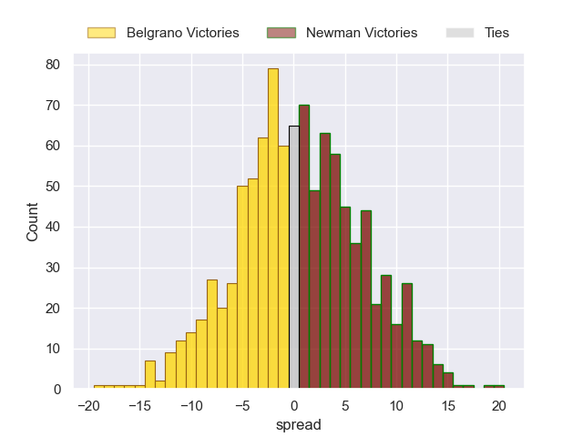

### Atlético del Rosario V Hindu on 2024/05/25

Average Margin: Hindu by 7.0

Average Scoreline: 39-32

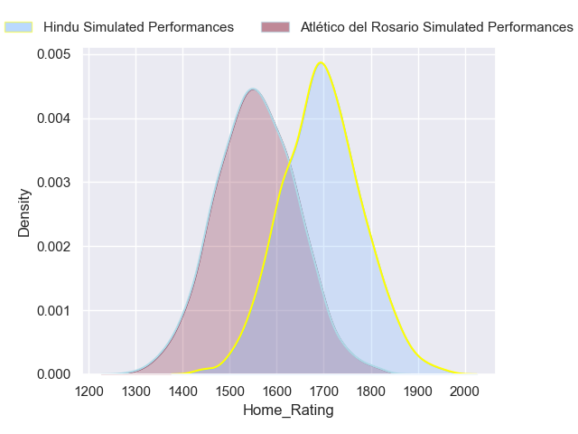

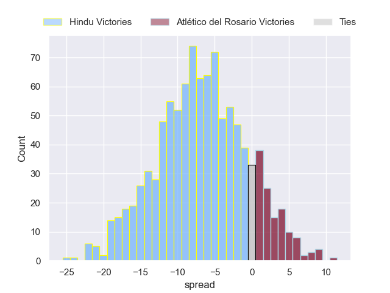

### Champagnat V San Luis on 2024/05/25

Average Margin: San Luis by 1.9

Average Scoreline: 29-27

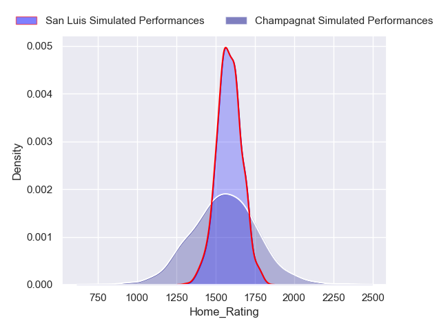

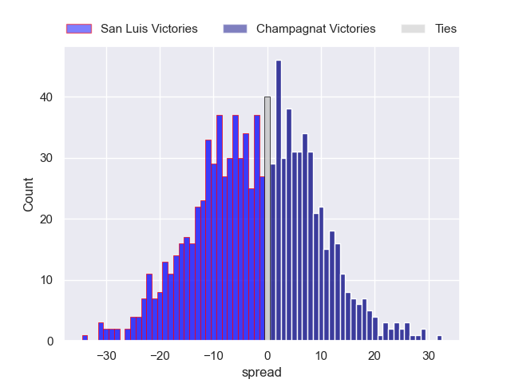

