---  
title: "URBA Top 12 2024 Status"  
date: 2024-06-03 6:00:00 -0500  
categories: model review projection  
layout: article  
aside:  
    toc: true  
---
# Current Team Rankings

# Standings

## Current Standings

| Club                 |   Played |   Wins |   Point Differential |   Losing Bonus Points |   Try Bonus Points |   Competition Points |
|:---------------------|---------:|-------:|---------------------:|----------------------:|-------------------:|---------------------:|
| SIC                  |        8 |      7 |                   84 |                     0 |                  4 |                   32 |
| CASI                 |        8 |      6 |                  108 |                     1 |                  3 |                   30 |
| Belgrano             |        8 |      7 |                  118 |                     0 |                nan |                   28 |
| Alumni               |        8 |      6 |                   26 |                     0 |                  4 |                   28 |
| San Luis             |        8 |      4 |                   11 |                     3 |                  2 |                   21 |
| Newman               |        8 |      4 |                  -20 |                     1 |                  4 |                   21 |
| Buenos Aires         |        8 |      3 |                   -2 |                     4 |                nan |                   16 |
| Hindu                |        8 |      3 |                  -52 |                     2 |                nan |                   16 |
| Regatas Bella Vista  |        8 |      3 |                  -21 |                     2 |                  1 |                   15 |
| CUBA                 |        8 |      1 |                  -20 |                     4 |                  2 |                   12 |
| Champagnat           |        8 |      2 |                  -54 |                     2 |                  1 |                   11 |
| Atlético del Rosario |        8 |      0 |                 -178 |                     1 |                nan |                    3 |

## Projected Remaining Table

| Club                 |   Matches Remaining |   Wins |   Point Differential |   Losing Bonus Points |   Try Bonus Points |   Competition Points |
|:---------------------|--------------------:|-------:|---------------------:|----------------------:|-------------------:|---------------------:|
| CASI                 |                   1 |    0.9 |             15.9133  |                   0   |                0.8 |                  4.6 |
| SIC                  |                   1 |    1   |             11.3276  |                   0   |                0.4 |                  4.3 |
| Newman               |                   1 |    0.9 |              6.85841 |                   0.1 |                0.2 |                  3.9 |
| Buenos Aires         |                   1 |    0.7 |              3.19113 |                   0.2 |                0.2 |                  3.3 |
| Belgrano             |                   1 |    0.6 |              1.73525 |                   0.3 |                0.3 |                  3.2 |
| Regatas Bella Vista  |                   1 |    0.6 |              1.17219 |                   0.3 |                0.2 |                  2.8 |
| Atlético del Rosario |                   1 |    0.4 |             -1.17219 |                   0.4 |                0.2 |                  2.3 |
| Alumni               |                   1 |    0.4 |             -1.73525 |                   0.5 |                0.1 |                  2.1 |
| Hindu                |                   1 |    0.3 |             -3.19113 |                   0.5 |                0.4 |                  2   |
| San Luis             |                   1 |    0.1 |             -6.85841 |                   0.4 |                0.2 |                  1   |
| Champagnat           |                   1 |    0.1 |            -15.9133  |                   0.1 |                0.1 |                  0.5 |
| CUBA                 |                   1 |    0   |            -11.3276  |                   0.2 |                0.1 |                  0.3 |

## Projected Total Table

| Club                 |   Total Matches |   Wins |   Point Differential |   Losing Bonus Points |   Try Bonus Points |   Competition Points |
|:---------------------|----------------:|-------:|---------------------:|----------------------:|-------------------:|---------------------:|
| SIC                  |               9 |    8   |             95.3276  |                   0   |                4.4 |                 36.3 |
| CASI                 |               9 |    6.9 |            123.913   |                   1   |                3.8 |                 34.6 |
| Belgrano             |               9 |    7.6 |            119.735   |                   0.3 |                0.3 |                 31.2 |
| Alumni               |               9 |    6.4 |             24.2647  |                   0.5 |                4.1 |                 30.1 |
| Newman               |               9 |    4.9 |            -13.1416  |                   1.1 |                4.2 |                 24.9 |
| San Luis             |               9 |    4.1 |              4.14159 |                   3.4 |                2.2 |                 22   |
| Buenos Aires         |               9 |    3.7 |              1.19113 |                   4.2 |                0.2 |                 19.3 |
| Hindu                |               9 |    3.3 |            -55.1911  |                   2.5 |                0.4 |                 18   |
| Regatas Bella Vista  |               9 |    3.6 |            -19.8278  |                   2.3 |                1.2 |                 17.8 |
| CUBA                 |               9 |    1   |            -31.3276  |                   4.2 |                2.1 |                 12.3 |
| Champagnat           |               9 |    2.1 |            -69.9133  |                   2.1 |                1.1 |                 11.5 |
| Atlético del Rosario |               9 |    0.4 |           -179.172   |                   1.4 |                0.2 |                  5.3 |

# Completed Match Review

| Model | Percent Correct Predictions | Spread Error |
| ------ | ------ | ------ |
| Club Level | 60.4% | 14.7 |
| Player Level: Lineup | 60.4% | 11.8 |
| Player Level: Minutes | 60.4% | 11.8 |

# Future Predictions

## Week 9

### Atlético del Rosario V Regatas Bella Vista on 2024/06/08

Average Margin: Regatas Bella Vista by 1.2

Average Scoreline: 25-24

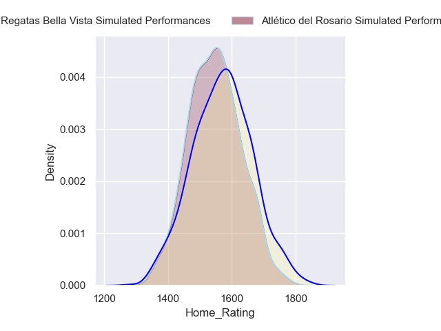
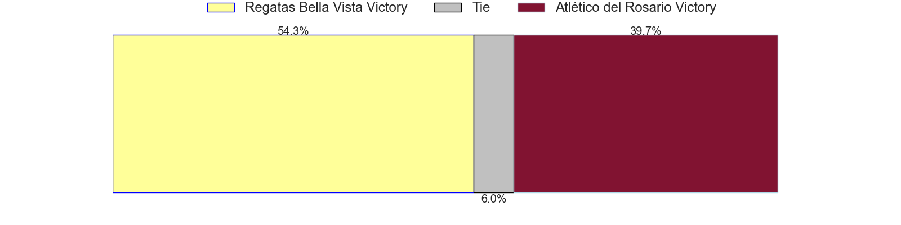
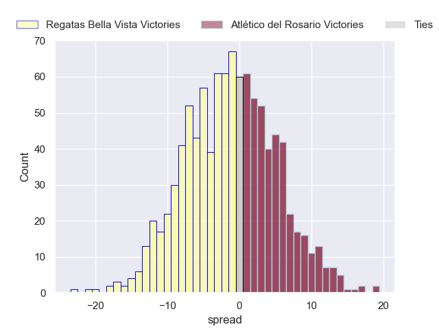

### Buenos Aires V Hindu on 2024/06/08

Average Margin: Buenos Aires by 3.2

Average Scoreline: 22-19

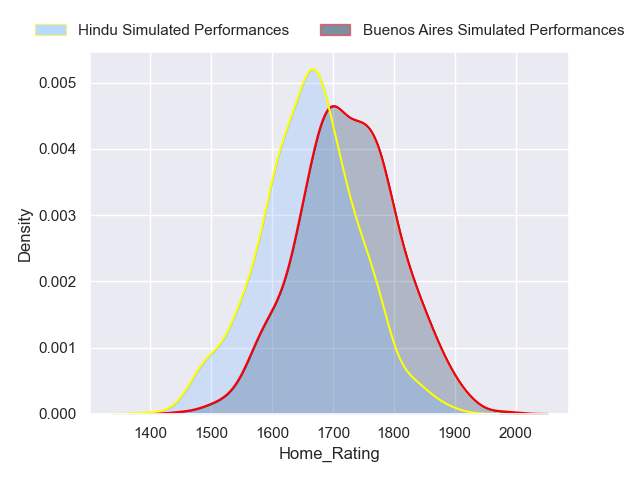

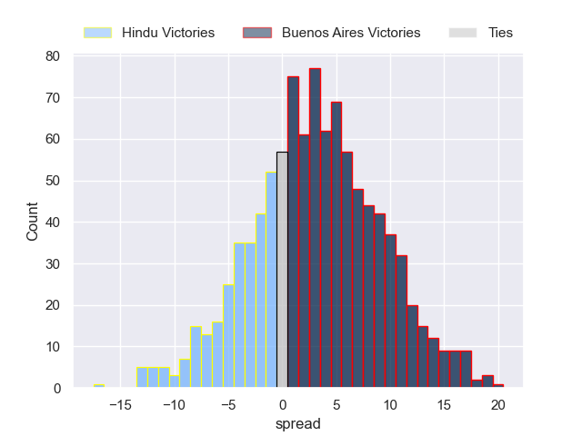

### Newman V San Luis on 2024/06/08

Average Margin: Newman by 6.9

Average Scoreline: 27-20

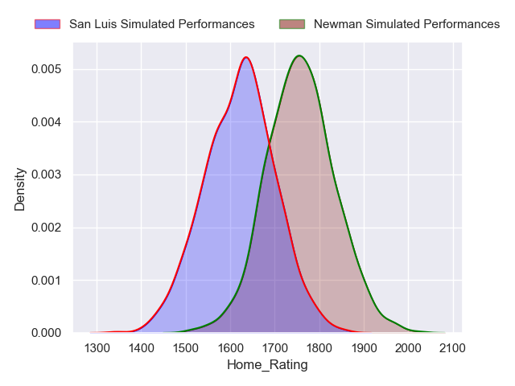

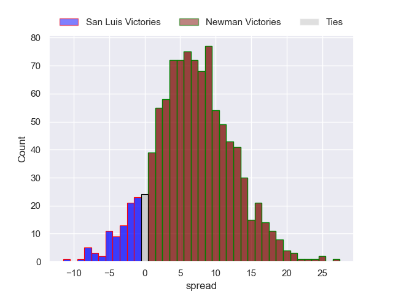

### Alumni V Belgrano on 2024/06/08

Average Margin: Belgrano by 1.7

Average Scoreline: 27-25

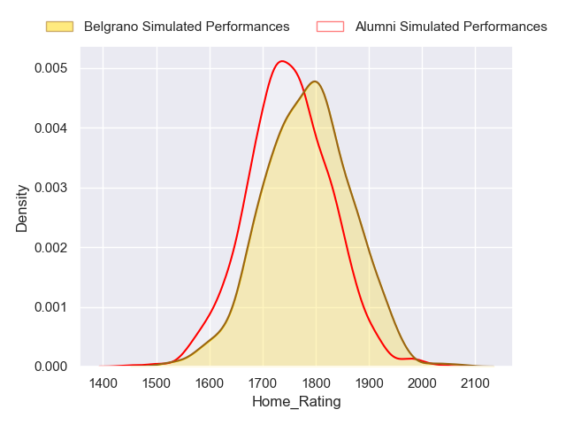
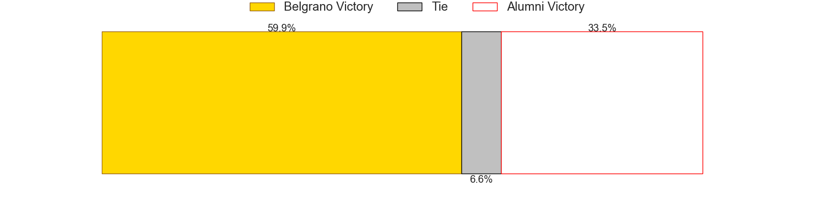
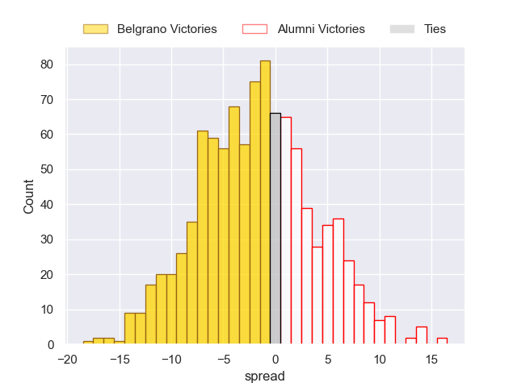

### SIC V CUBA on 2024/06/08

Average Margin: SIC by 11.3

Average Scoreline: 29-18

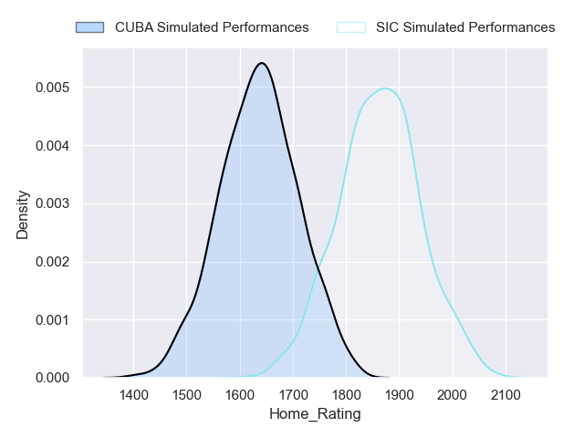
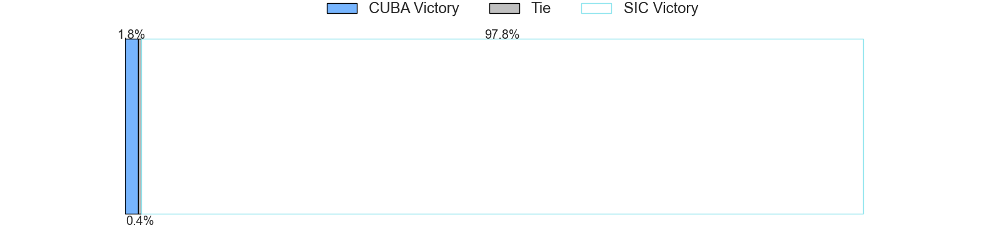
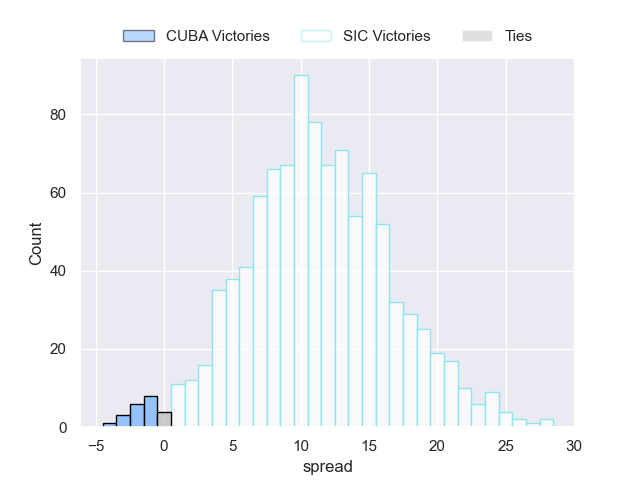

### Champagnat V CASI on 2024/06/08

Average Margin: CASI by 15.9

Average Scoreline: 39-23

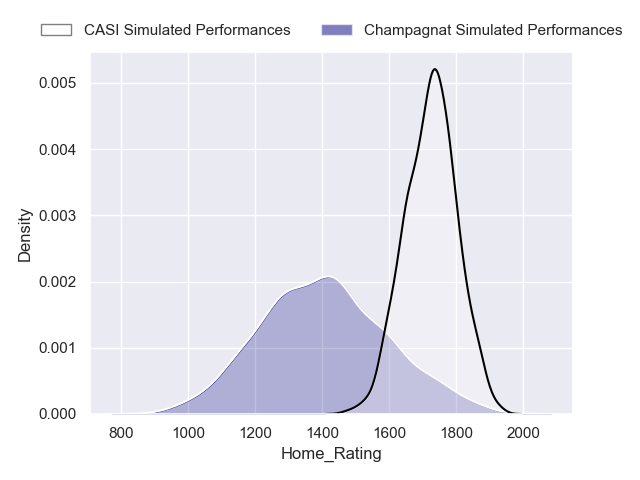
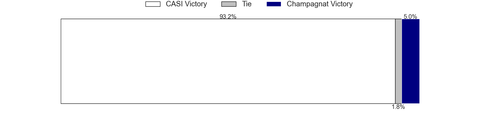
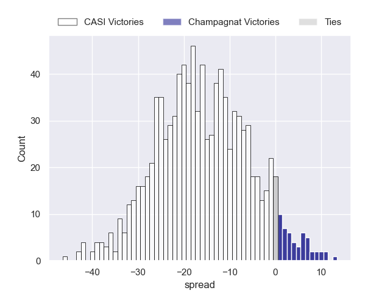

