---  
title: "URBA Top 12 2024 Status"  
date: 2024-07-10 6:00:00 -0500  
categories: model review projection  
layout: article  
aside:  
    toc: true  
---
# Current Team Rankings

# Standings

## Current Standings

| Club                 |   Played |   Wins |   Point Differential |   Losing Bonus Points |   Try Bonus Points |   Competition Points |
|:---------------------|---------:|-------:|---------------------:|----------------------:|-------------------:|---------------------:|
| CASI                 |       12 |      9 |                  139 |                     1 |                  6 |                   45 |
| SIC                  |       12 |      9 |                  124 |                     1 |                  6 |                   43 |
| Belgrano             |       12 |     10 |                  156 |                     1 |                nan |                   41 |
| Alumni               |       12 |      9 |                   34 |                     0 |                  5 |                   41 |
| Newman               |       12 |      8 |                   71 |                     1 |                  6 |                   39 |
| San Luis             |       12 |      6 |                  -39 |                     3 |                  3 |                   30 |
| CUBA                 |       12 |      4 |                   34 |                     5 |                  4 |                   27 |
| Buenos Aires         |       12 |      5 |                  -25 |                     5 |                nan |                   25 |
| Hindu                |       12 |      4 |                  -69 |                     4 |                nan |                   22 |
| Regatas Bella Vista  |       12 |      3 |                  -51 |                     3 |                  2 |                   19 |
| Champagnat           |       12 |      2 |                 -138 |                     4 |                  1 |                   13 |
| Atlético del Rosario |       12 |      1 |                 -236 |                     1 |                nan |                    5 |

## Projected Remaining Table

| Club                 |   Matches Remaining |   Wins |   Point Differential |   Losing Bonus Points |   Try Bonus Points |   Competition Points |
|:---------------------|--------------------:|-------:|---------------------:|----------------------:|-------------------:|---------------------:|
| Alumni               |                   1 |    0.9 |             6.70135  |                   0.1 |                0.3 |                  4   |
| CUBA                 |                   1 |    0.9 |             6.43872  |                   0.1 |                0.3 |                  4   |
| SIC                  |                   1 |    0.8 |             3.36147  |                   0.2 |                0.3 |                  3.5 |
| Belgrano             |                   1 |    0.5 |             0.256074 |                   0.4 |                0.7 |                  3.2 |
| Hindu                |                   1 |    0.5 |             0.697037 |                   0.4 |                0.3 |                  2.8 |
| Champagnat           |                   1 |    0.5 |             0.635163 |                   0.3 |                0.2 |                  2.6 |
| Atlético del Rosario |                   1 |    0.5 |            -0.635163 |                   0.3 |                0.4 |                  2.6 |
| CASI                 |                   1 |    0.5 |            -0.256074 |                   0.4 |                0.2 |                  2.5 |
| Regatas Bella Vista  |                   1 |    0.5 |            -0.697037 |                   0.4 |                0.1 |                  2.4 |
| Newman               |                   1 |    0.2 |            -3.36147  |                   0.5 |                0.1 |                  1.6 |
| Buenos Aires         |                   1 |    0.1 |            -6.43872  |                   0.4 |                0.2 |                  1   |
| San Luis             |                   1 |    0.1 |            -6.70135  |                   0.4 |                0.2 |                  1   |

## Projected Total Table

| Club                 |   Total Matches |   Wins |   Point Differential |   Losing Bonus Points |   Try Bonus Points |   Competition Points |
|:---------------------|----------------:|-------:|---------------------:|----------------------:|-------------------:|---------------------:|
| CASI                 |              13 |    9.5 |             138.744  |                   1.4 |                6.2 |                 47.5 |
| SIC                  |              13 |    9.8 |             127.361  |                   1.2 |                6.3 |                 46.5 |
| Alumni               |              13 |    9.9 |              40.7013 |                   0.1 |                5.3 |                 45   |
| Belgrano             |              13 |   10.5 |             156.256  |                   1.4 |                0.7 |                 44.2 |
| Newman               |              13 |    8.2 |              67.6385 |                   1.5 |                6.1 |                 40.6 |
| CUBA                 |              13 |    4.9 |              40.4387 |                   5.1 |                4.3 |                 31   |
| San Luis             |              13 |    6.1 |             -45.7013 |                   3.4 |                3.2 |                 31   |
| Buenos Aires         |              13 |    5.1 |             -31.4387 |                   5.4 |                0.2 |                 26   |
| Hindu                |              13 |    4.5 |             -68.303  |                   4.4 |                0.3 |                 24.8 |
| Regatas Bella Vista  |              13 |    3.5 |             -51.697  |                   3.4 |                2.1 |                 21.4 |
| Champagnat           |              13 |    2.5 |            -137.365  |                   4.3 |                1.2 |                 15.6 |
| Atlético del Rosario |              13 |    1.5 |            -236.635  |                   1.3 |                0.4 |                  7.6 |

# Completed Match Review

| Model | Percent Correct Predictions | Spread Error |
| ------ | ------ | ------ |
| Club Level | 62.5% | 13.6 |
| Player Level: Lineup | 61.1% | 12.3 |
| Player Level: Minutes | 61.1% | 12.3 |

# Future Predictions

## Week 13

### CASI V Belgrano on 2024/07/14

Average Margin: Belgrano by 0.3

Average Scoreline: 28-28

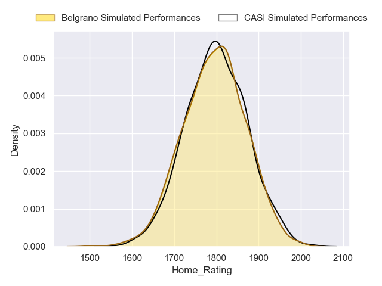

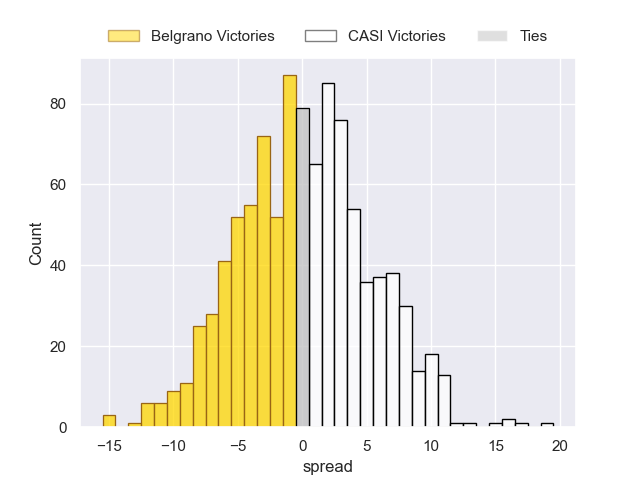

### SIC V Newman on 2024/07/14

Average Margin: SIC by 3.4

Average Scoreline: 27-23

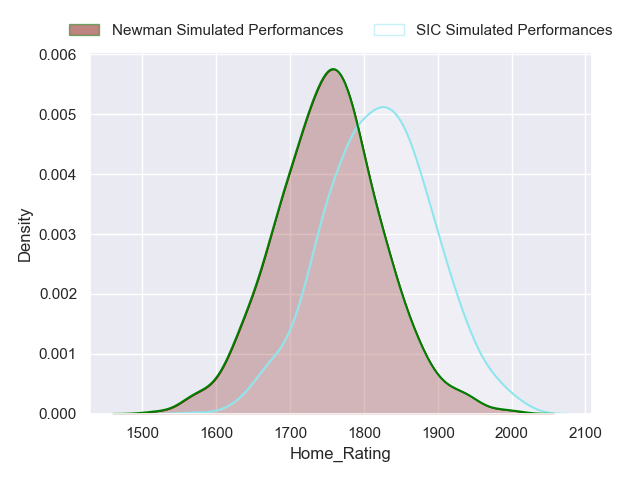

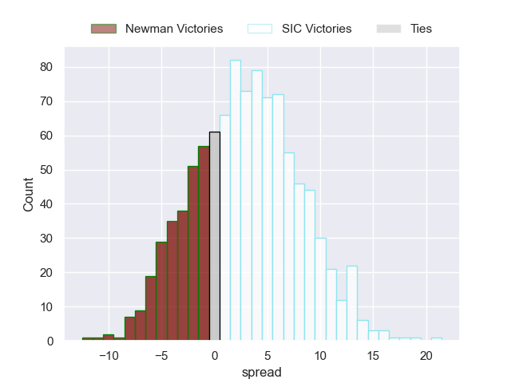

### Champagnat V Atlético del Rosario on 2024/07/14

Average Margin: Champagnat by 0.6

Average Scoreline: 22-21

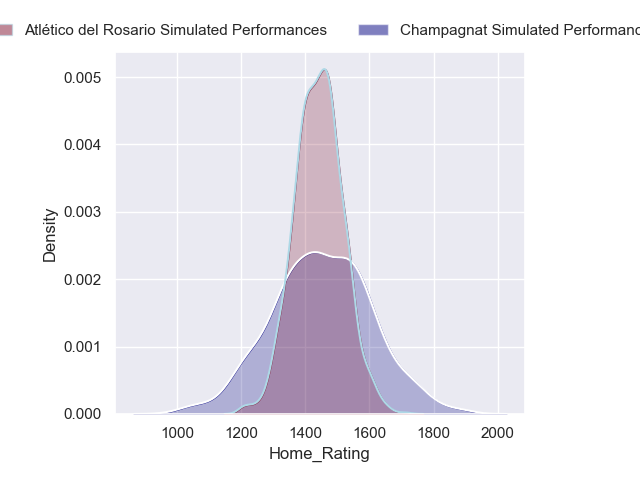

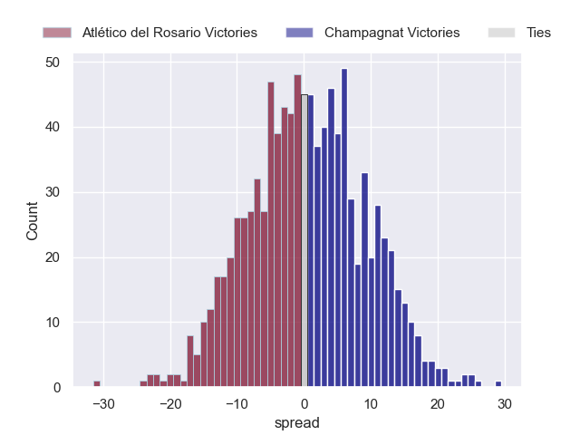

### Alumni V San Luis on 2024/07/14

Average Margin: Alumni by 6.7

Average Scoreline: 29-22

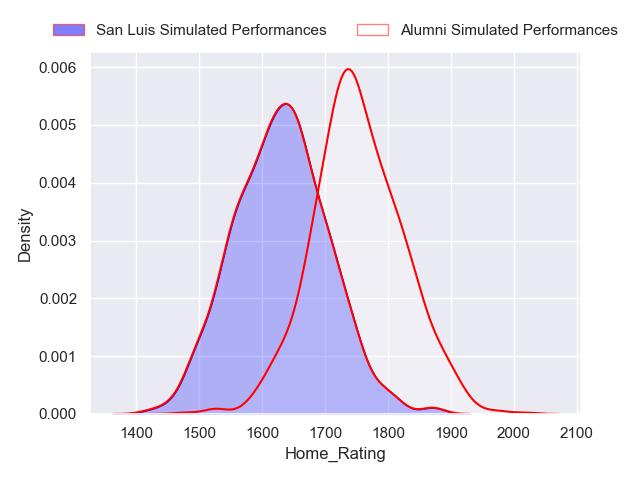
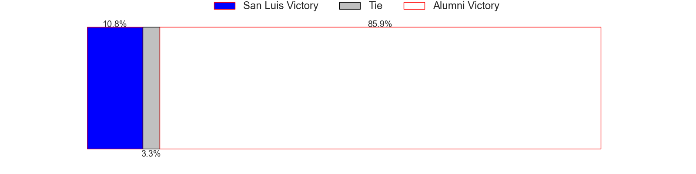
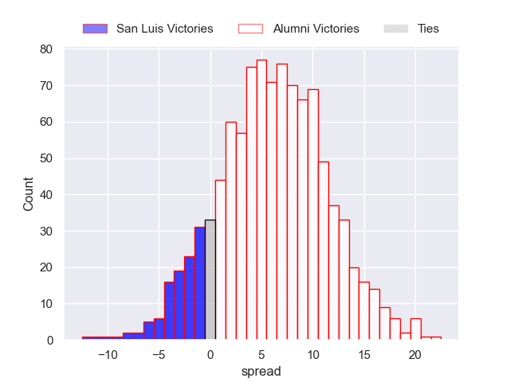

### CUBA V Buenos Aires on 2024/07/14

Average Margin: CUBA by 6.4

Average Scoreline: 31-24

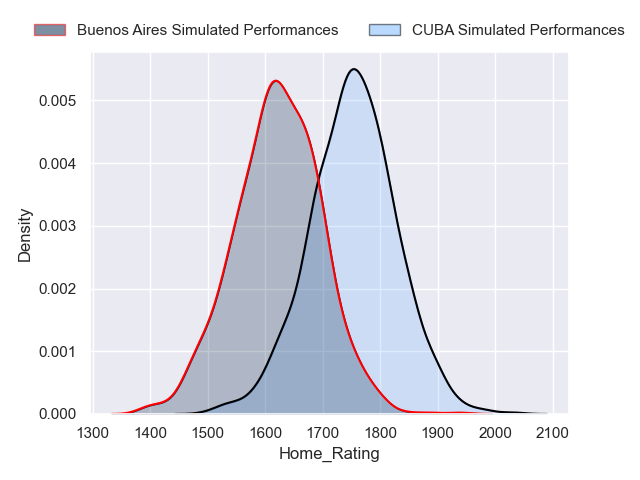
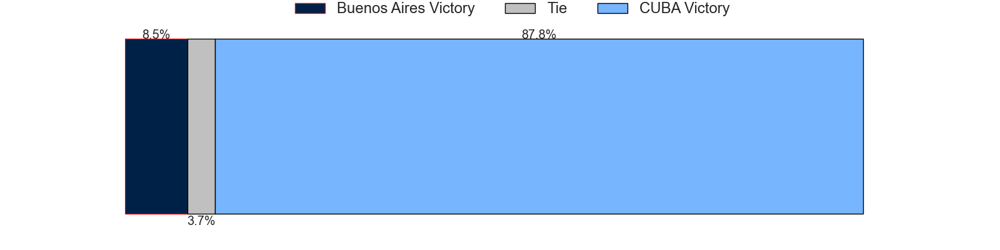
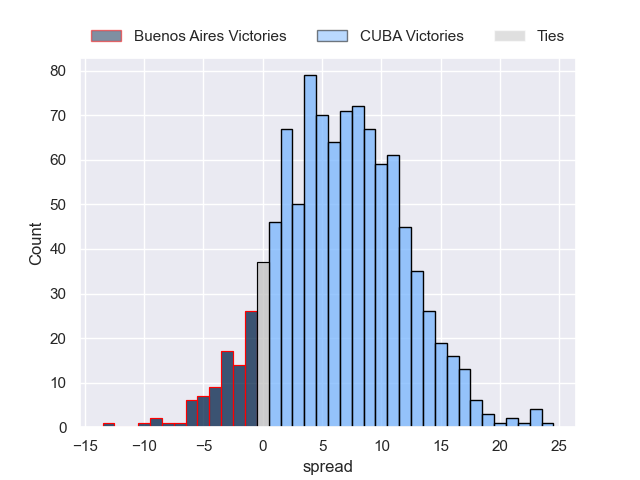

### Regatas Bella Vista V Hindu on 2024/07/14

Average Margin: Hindu by 0.7

Average Scoreline: 20-20

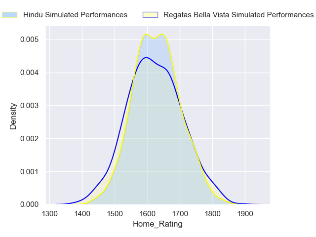

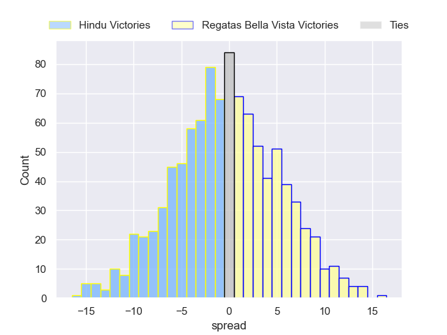

