---  
title: "URBA Top 12 2024 Status"  
date: 2024-07-01 6:00:00 -0500  
categories: model review projection  
layout: article  
aside:  
    toc: true  
---
# Current Team Rankings

# Standings

## Current Standings

| Club                 |   Played |   Wins |   Point Differential |   Losing Bonus Points |   Try Bonus Points |   Competition Points |
|:---------------------|---------:|-------:|---------------------:|----------------------:|-------------------:|---------------------:|
| CASI                 |       11 |      8 |                  110 |                     1 |                  5 |                   40 |
| SIC                  |       11 |      8 |                  107 |                     1 |                  5 |                   38 |
| Belgrano             |       11 |      9 |                  146 |                     1 |                nan |                   37 |
| Alumni               |       11 |      8 |                   27 |                     0 |                  5 |                   37 |
| Newman               |       11 |      7 |                   64 |                     1 |                  6 |                   35 |
| CUBA                 |       11 |      4 |                   41 |                     4 |                  4 |                   26 |
| San Luis             |       11 |      5 |                  -45 |                     3 |                  3 |                   26 |
| Buenos Aires         |       11 |      5 |                    4 |                     5 |                nan |                   25 |
| Hindu                |       11 |      4 |                  -63 |                     3 |                nan |                   21 |
| Regatas Bella Vista  |       11 |      3 |                  -41 |                     3 |                  2 |                   19 |
| Champagnat           |       11 |      2 |                 -131 |                     3 |                  1 |                   12 |
| Atlético del Rosario |       11 |      1 |                 -219 |                     1 |                nan |                    5 |

## Projected Remaining Table

| Club                 |   Matches Remaining |   Wins |   Point Differential |   Losing Bonus Points |   Try Bonus Points |   Competition Points |
|:---------------------|--------------------:|-------:|---------------------:|----------------------:|-------------------:|---------------------:|
| SIC                  |                   1 |    1   |             11.2578  |                   0   |                0.7 |                  4.6 |
| Alumni               |                   1 |    0.9 |             14.3211  |                   0.1 |                0.8 |                  4.5 |
| Belgrano             |                   1 |    1   |             16.0297  |                   0   |                0.2 |                  4.2 |
| Newman               |                   1 |    0.9 |              7.12731 |                   0.1 |                0.2 |                  4   |
| Hindu                |                   1 |    0.8 |              5.99664 |                   0.1 |                0.4 |                  4   |
| Buenos Aires         |                   1 |    0.6 |              1.10688 |                   0.3 |                0.5 |                  3.2 |
| CASI                 |                   1 |    0.4 |             -1.10688 |                   0.4 |                0.2 |                  2.3 |
| San Luis             |                   1 |    0.2 |             -5.99664 |                   0.4 |                0.2 |                  1.2 |
| CUBA                 |                   1 |    0.1 |             -7.12731 |                   0.4 |                0.2 |                  1   |
| Atlético del Rosario |                   1 |    0   |            -11.2578  |                   0.2 |                0.2 |                  0.5 |
| Champagnat           |                   1 |    0.1 |            -14.3211  |                   0.2 |                0.1 |                  0.5 |
| Regatas Bella Vista  |                   1 |    0   |            -16.0297  |                   0.1 |                0.1 |                  0.1 |

## Projected Total Table

| Club                 |   Total Matches |   Wins |   Point Differential |   Losing Bonus Points |   Try Bonus Points |   Competition Points |
|:---------------------|----------------:|-------:|---------------------:|----------------------:|-------------------:|---------------------:|
| SIC                  |              12 |    9   |            118.258   |                   1   |                5.7 |                 42.6 |
| CASI                 |              12 |    8.4 |            108.893   |                   1.4 |                5.2 |                 42.3 |
| Alumni               |              12 |    8.9 |             41.3211  |                   0.1 |                5.8 |                 41.5 |
| Belgrano             |              12 |   10   |            162.03    |                   1   |                0.2 |                 41.2 |
| Newman               |              12 |    7.9 |             71.1273  |                   1.1 |                6.2 |                 39   |
| Buenos Aires         |              12 |    5.6 |              5.10688 |                   5.3 |                0.5 |                 28.2 |
| San Luis             |              12 |    5.2 |            -50.9966  |                   3.4 |                3.2 |                 27.2 |
| CUBA                 |              12 |    4.1 |             33.8727  |                   4.4 |                4.2 |                 27   |
| Hindu                |              12 |    4.8 |            -57.0034  |                   3.1 |                0.4 |                 25   |
| Regatas Bella Vista  |              12 |    3   |            -57.0297  |                   3.1 |                2.1 |                 19.1 |
| Champagnat           |              12 |    2.1 |           -145.321   |                   3.2 |                1.1 |                 12.5 |
| Atlético del Rosario |              12 |    1   |           -230.258   |                   1.2 |                0.2 |                  5.5 |

# Completed Match Review

| Model | Percent Correct Predictions | Spread Error |
| ------ | ------ | ------ |
| Club Level | 62.1% | 13.9 |
| Player Level: Lineup | 60.6% | 12.5 |
| Player Level: Minutes | 60.6% | 12.5 |

# Future Predictions

## Week 12

### Atlético del Rosario V SIC on 2024/07/06

Average Margin: SIC by 11.3

Average Scoreline: 39-28

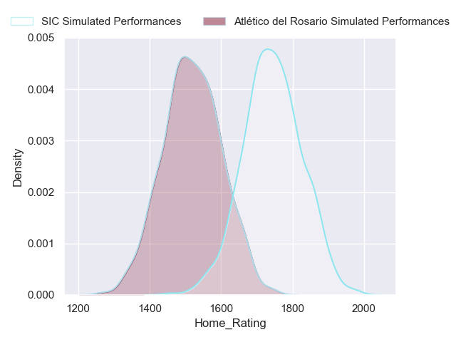
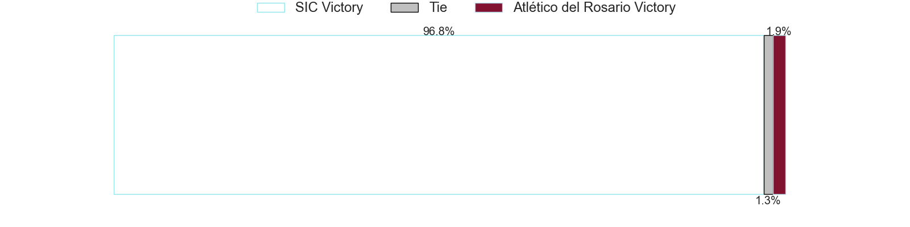
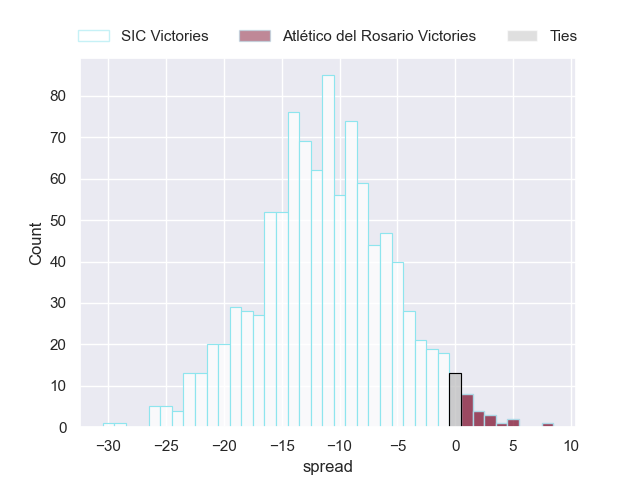

### Belgrano V Regatas Bella Vista on 2024/07/06

Average Margin: Belgrano by 16.0

Average Scoreline: 34-18

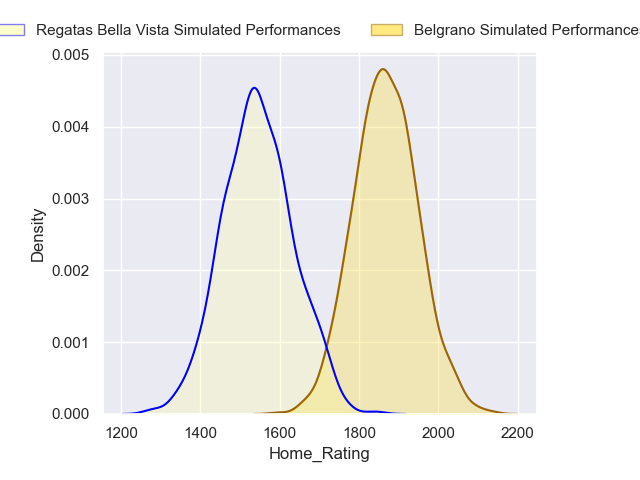
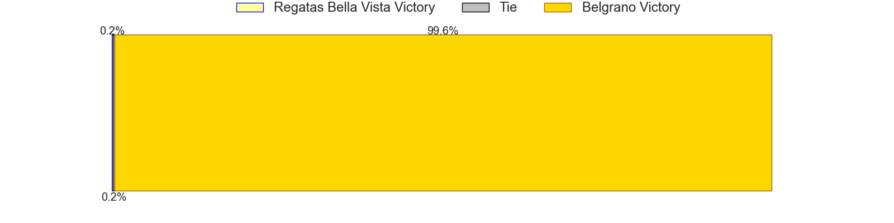
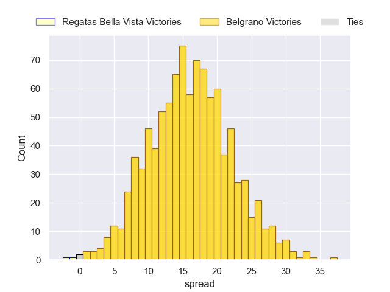

### Hindu V San Luis on 2024/07/06

Average Margin: Hindu by 6.0

Average Scoreline: 31-25

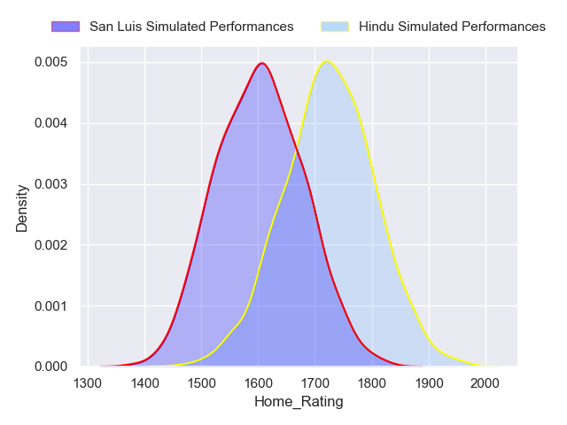

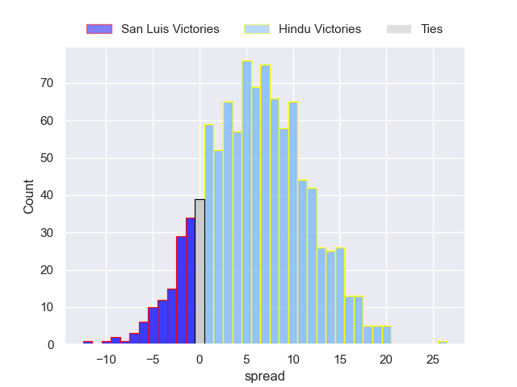

### Champagnat V Alumni on 2024/07/06

Average Margin: Alumni by 14.3

Average Scoreline: 34-19

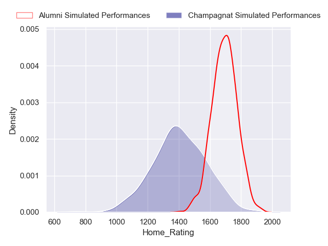
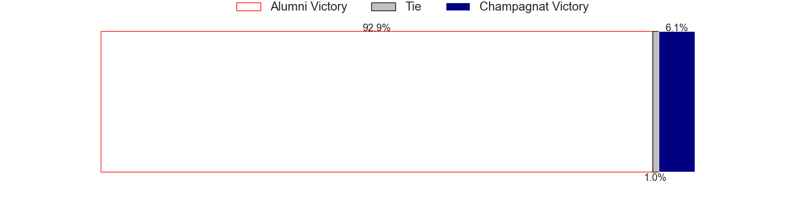
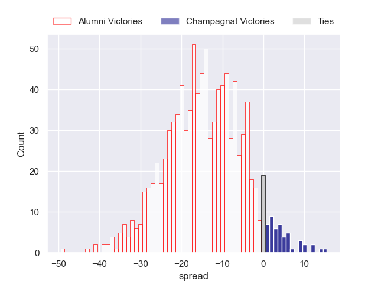

### Newman V CUBA on 2024/07/06

Average Margin: Newman by 7.1

Average Scoreline: 31-24

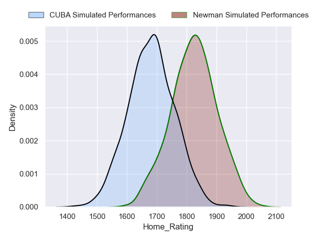

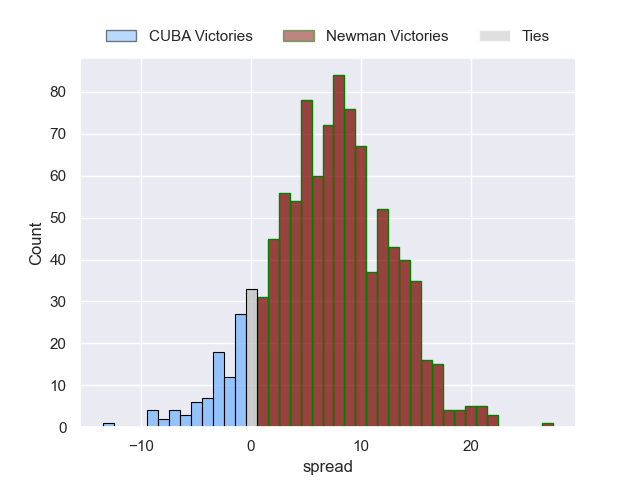

### Buenos Aires V CASI on 2024/07/06

Average Margin: Buenos Aires by 1.1

Average Scoreline: 31-30

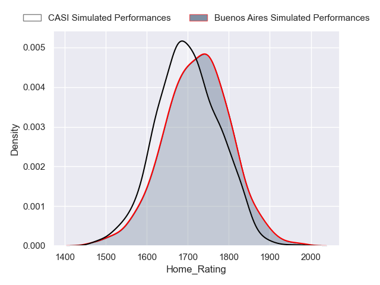

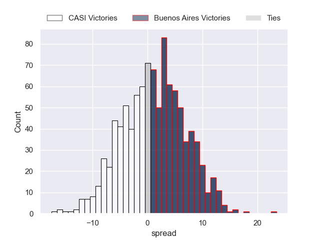

