---  
title: "URBA Top 12 2024 Status"  
date: 2024-06-24 6:00:00 -0500  
categories: model review projection  
layout: article  
aside:  
    toc: true  
---
# Current Team Rankings

# Standings

## Current Standings

| Club                 |   Played |   Wins |   Point Differential |   Losing Bonus Points |   Try Bonus Points |   Competition Points |
|:---------------------|---------:|-------:|---------------------:|----------------------:|-------------------:|---------------------:|
| CASI                 |       10 |      8 |                  133 |                     1 |                  5 |                   40 |
| Belgrano             |       10 |      8 |                  128 |                     1 |                nan |                   33 |
| SIC                  |       10 |      7 |                   74 |                     1 |                  4 |                   33 |
| Alumni               |       10 |      7 |                   22 |                     0 |                  4 |                   32 |
| Newman               |       10 |      6 |                   41 |                     1 |                  5 |                   30 |
| San Luis             |       10 |      5 |                  -27 |                     3 |                  3 |                   26 |
| CUBA                 |       10 |      3 |                   20 |                     4 |                  3 |                   21 |
| Buenos Aires         |       10 |      4 |                    1 |                     5 |                nan |                   21 |
| Hindu                |       10 |      4 |                  -58 |                     2 |                nan |                   20 |
| Regatas Bella Vista  |       10 |      3 |                  -38 |                     2 |                  2 |                   18 |
| Champagnat           |       10 |      2 |                  -98 |                     3 |                  1 |                   12 |
| Atlético del Rosario |       10 |      1 |                 -198 |                     1 |                nan |                    5 |

## Projected Remaining Table

| Club                 |   Matches Remaining |   Wins |   Point Differential |   Losing Bonus Points |   Try Bonus Points |   Competition Points |
|:---------------------|--------------------:|-------:|---------------------:|----------------------:|-------------------:|---------------------:|
| SIC                  |                   1 |    0.9 |             14.9976  |                   0.1 |                0.8 |                  4.6 |
| Belgrano             |                   1 |    1   |             12.604   |                   0   |                0.5 |                  4.5 |
| CUBA                 |                   1 |    0.9 |              6.2369  |                   0.1 |                0.5 |                  4.2 |
| Buenos Aires         |                   1 |    0.9 |              9.59398 |                   0   |                0.2 |                  4   |
| Newman               |                   1 |    0.8 |              4.05536 |                   0.2 |                0.6 |                  4   |
| Alumni               |                   1 |    0.8 |              4.77737 |                   0.2 |                0.3 |                  3.7 |
| CASI                 |                   1 |    0.2 |             -4.05536 |                   0.5 |                0.3 |                  1.7 |
| Hindu                |                   1 |    0.2 |             -4.77737 |                   0.5 |                0.3 |                  1.5 |
| Atlético del Rosario |                   1 |    0.1 |             -6.2369  |                   0.4 |                0.3 |                  1.2 |
| Regatas Bella Vista  |                   1 |    0.1 |             -9.59398 |                   0.3 |                0.2 |                  0.7 |
| Champagnat           |                   1 |    0.1 |            -14.9976  |                   0.1 |                0   |                  0.4 |
| San Luis             |                   1 |    0   |            -12.604   |                   0.1 |                0.1 |                  0.3 |

## Projected Total Table

| Club                 |   Total Matches |   Wins |   Point Differential |   Losing Bonus Points |   Try Bonus Points |   Competition Points |
|:---------------------|----------------:|-------:|---------------------:|----------------------:|-------------------:|---------------------:|
| CASI                 |              11 |    8.2 |             128.945  |                   1.5 |                5.3 |                 41.7 |
| SIC                  |              11 |    7.9 |              88.9976 |                   1.1 |                4.8 |                 37.6 |
| Belgrano             |              11 |    9   |             140.604  |                   1   |                0.5 |                 37.5 |
| Alumni               |              11 |    7.8 |              26.7774 |                   0.2 |                4.3 |                 35.7 |
| Newman               |              11 |    6.8 |              45.0554 |                   1.2 |                5.6 |                 34   |
| San Luis             |              11 |    5   |             -39.604  |                   3.1 |                3.1 |                 26.3 |
| CUBA                 |              11 |    3.9 |              26.2369 |                   4.1 |                3.5 |                 25.2 |
| Buenos Aires         |              11 |    4.9 |              10.594  |                   5   |                0.2 |                 25   |
| Hindu                |              11 |    4.2 |             -62.7774 |                   2.5 |                0.3 |                 21.5 |
| Regatas Bella Vista  |              11 |    3.1 |             -47.594  |                   2.3 |                2.2 |                 18.7 |
| Champagnat           |              11 |    2.1 |            -112.998  |                   3.1 |                1   |                 12.4 |
| Atlético del Rosario |              11 |    1.1 |            -204.237  |                   1.4 |                0.3 |                  6.2 |

# Completed Match Review

| Model | Percent Correct Predictions | Spread Error |
| ------ | ------ | ------ |
| Club Level | 58.3% | 14.3 |
| Player Level: Lineup | 60.0% | 12.3 |
| Player Level: Minutes | 60.0% | 12.3 |

# Future Predictions

## Week 11

### Belgrano V San Luis on 2024/06/29

Average Margin: Belgrano by 12.6

Average Scoreline: 30-17

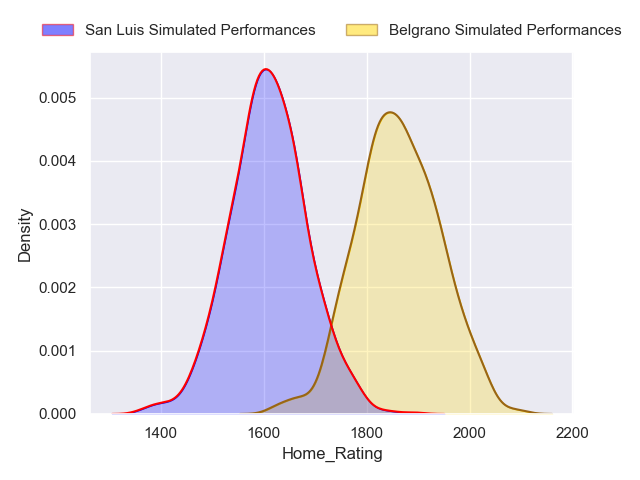

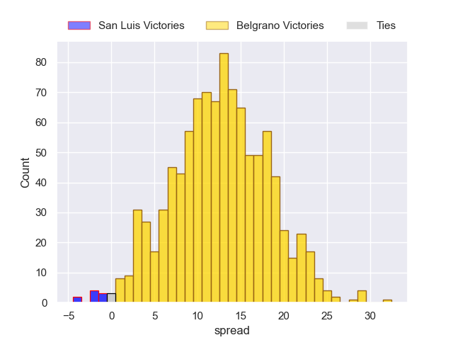

### Alumni V Hindu on 2024/06/29

Average Margin: Alumni by 4.8

Average Scoreline: 27-23

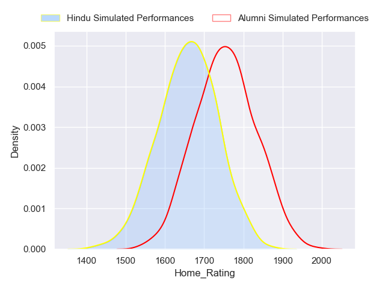
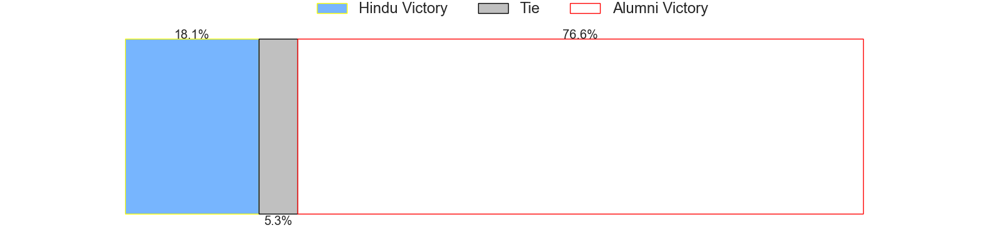
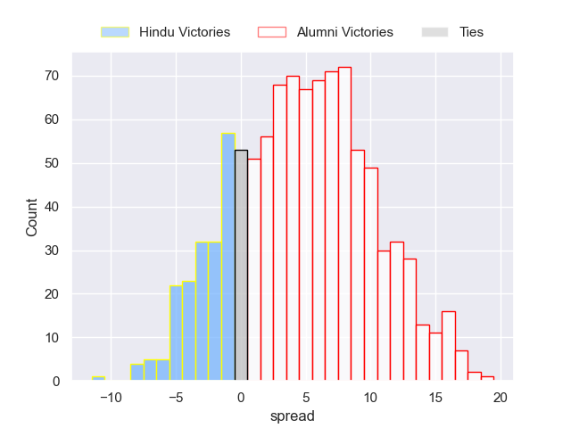

### Buenos Aires V Regatas Bella Vista on 2024/06/29

Average Margin: Buenos Aires by 9.6

Average Scoreline: 29-19

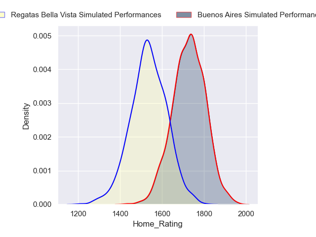
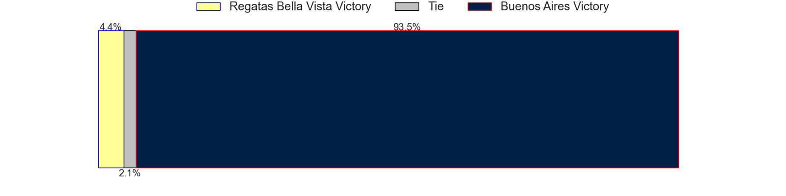
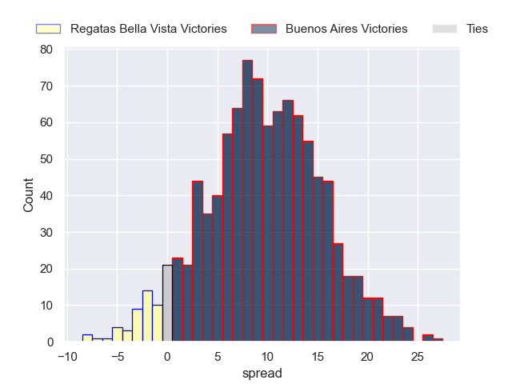

### Newman V CASI on 2024/06/29

Average Margin: Newman by 4.1

Average Scoreline: 28-24

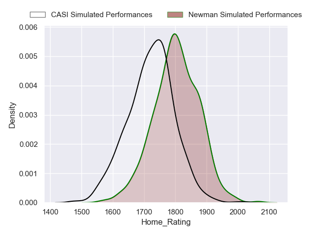

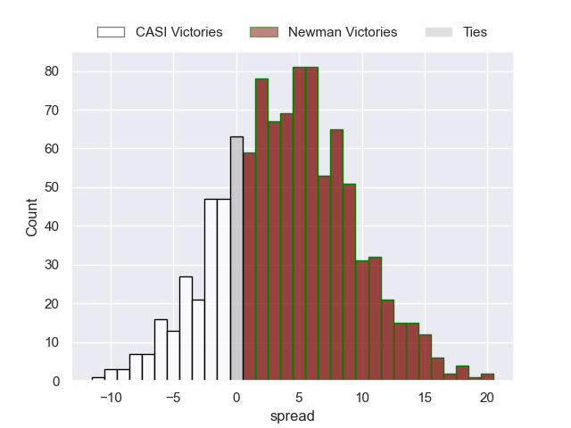

### Atlético del Rosario V CUBA on 2024/06/29

Average Margin: CUBA by 6.2

Average Scoreline: 28-22

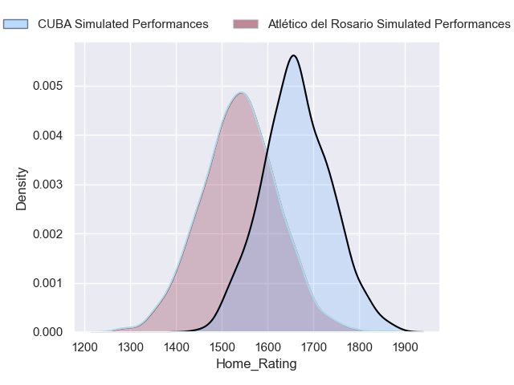
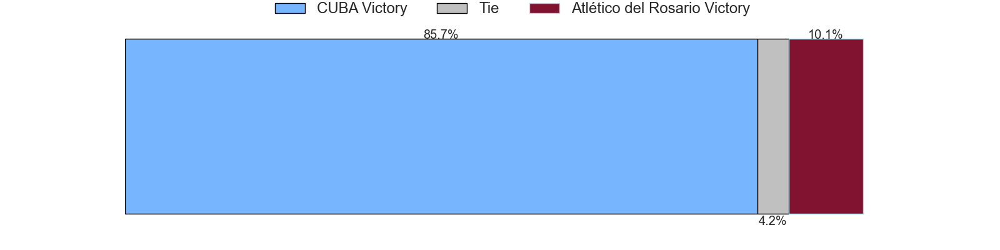
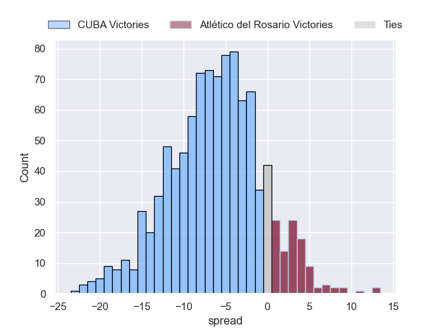

### Champagnat V SIC on 2024/06/29

Average Margin: SIC by 15.0

Average Scoreline: 43-28

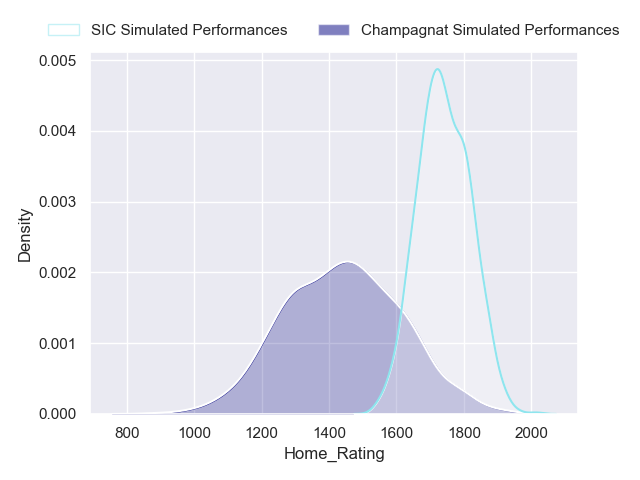
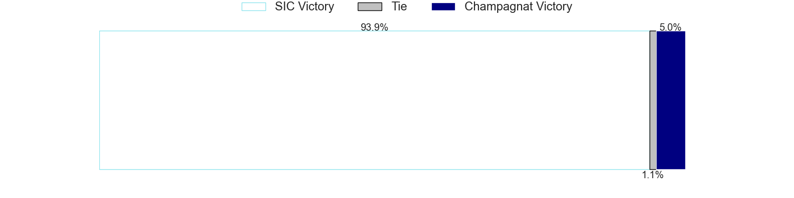
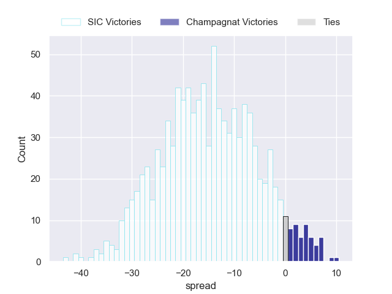

