---  
title: "URBA Top 12 2024 Status"  
date: 2024-05-30 6:00:00 -0500  
categories: model review projection  
layout: article  
aside:  
    toc: true  
---
# Current Team Rankings

# Standings

## Current Standings

| Club                 |   Played |   Wins |   Point Differential |   Losing Bonus Points |   Try Bonus Points |   Competition Points |
|:---------------------|---------:|-------:|---------------------:|----------------------:|-------------------:|---------------------:|
| SIC                  |        6 |      6 |                   85 |                     0 |                  3 |                   27 |
| CASI                 |        6 |      5 |                   98 |                     1 |                  2 |                   23 |
| Alumni               |        6 |      5 |                   18 |                     0 |                  3 |                   23 |
| Belgrano             |        6 |      5 |                   84 |                     0 |                nan |                   20 |
| Buenos Aires         |        6 |      3 |                   28 |                     3 |                nan |                   15 |
| Newman               |        6 |      3 |                   -8 |                     1 |                  2 |                   15 |
| San Luis             |        6 |      2 |                  -12 |                     3 |                  1 |                   12 |
| Hindu                |        6 |      2 |                  -38 |                     2 |                nan |                   12 |
| Regatas Bella Vista  |        6 |      2 |                  -22 |                     2 |                  1 |                   11 |
| Champagnat           |        6 |      2 |                  -43 |                     1 |                  1 |                   10 |
| CUBA                 |        6 |      0 |                  -38 |                     4 |                  1 |                    5 |
| Atlético del Rosario |        6 |      0 |                 -152 |                     0 |                nan |                    2 |

## Projected Remaining Table

| Club                 |   Matches Remaining |   Wins |   Point Differential |   Losing Bonus Points |   Try Bonus Points |   Competition Points |
|:---------------------|--------------------:|-------:|---------------------:|----------------------:|-------------------:|---------------------:|
| Belgrano             |                   1 |    0.9 |            7.94483   |                   0.1 |                0.3 |                  4   |
| San Luis             |                   1 |    0.9 |            8.33883   |                   0.1 |                0.2 |                  3.9 |
| Regatas Bella Vista  |                   1 |    0.8 |            7.39604   |                   0.1 |                0.4 |                  3.6 |
| Hindu                |                   1 |    0.7 |            3.22904   |                   0.3 |                0.6 |                  3.6 |
| SIC                  |                   1 |    0.6 |            1.86532   |                   0.3 |                0.7 |                  3.5 |
| Alumni               |                   1 |    0.5 |            0.0897353 |                   0.4 |                0.2 |                  2.6 |
| CUBA                 |                   1 |    0.5 |           -0.0897353 |                   0.4 |                0.2 |                  2.5 |
| CASI                 |                   1 |    0.4 |           -1.86532   |                   0.4 |                0   |                  2   |
| Newman               |                   1 |    0.3 |           -3.22904   |                   0.4 |                0.2 |                  1.9 |
| Champagnat           |                   1 |    0.2 |           -7.39604   |                   0.2 |                0.1 |                  1.3 |
| Buenos Aires         |                   1 |    0.1 |           -7.94483   |                   0.3 |                0.2 |                  0.9 |
| Atlético del Rosario |                   1 |    0.1 |           -8.33883   |                   0.4 |                0.2 |                  0.8 |

## Projected Total Table

| Club                 |   Total Matches |   Wins |   Point Differential |   Losing Bonus Points |   Try Bonus Points |   Competition Points |
|:---------------------|----------------:|-------:|---------------------:|----------------------:|-------------------:|---------------------:|
| SIC                  |               7 |    6.6 |             86.8653  |                   0.3 |                3.7 |                 30.5 |
| Alumni               |               7 |    5.5 |             18.0897  |                   0.4 |                3.2 |                 25.6 |
| CASI                 |               7 |    5.4 |             96.1347  |                   1.4 |                2   |                 25   |
| Belgrano             |               7 |    5.9 |             91.9448  |                   0.1 |                0.3 |                 24   |
| Newman               |               7 |    3.3 |            -11.229   |                   1.4 |                2.2 |                 16.9 |
| Buenos Aires         |               7 |    3.1 |             20.0552  |                   3.3 |                0.2 |                 15.9 |
| San Luis             |               7 |    2.9 |             -3.66117 |                   3.1 |                1.2 |                 15.9 |
| Hindu                |               7 |    2.7 |            -34.771   |                   2.3 |                0.6 |                 15.6 |
| Regatas Bella Vista  |               7 |    2.8 |            -14.604   |                   2.1 |                1.4 |                 14.6 |
| Champagnat           |               7 |    2.2 |            -50.396   |                   1.2 |                1.1 |                 11.3 |
| CUBA                 |               7 |    0.5 |            -38.0897  |                   4.4 |                1.2 |                  7.5 |
| Atlético del Rosario |               7 |    0.1 |           -160.339   |                   0.4 |                0.2 |                  2.8 |

# Completed Match Review

| Model | Percent Correct Predictions | Spread Error |
| ------ | ------ | ------ |
| Club Level | 63.9% | 14.5 |
| Player Level: Lineup | 52.4% | 11.6 |
| Player Level: Minutes | 61.1% | 11.6 |

# Future Predictions

## Week 7

### San Luis V Atlético del Rosario on 2024/06/01

Average Margin: San Luis by 8.3

Average Scoreline: 26-18

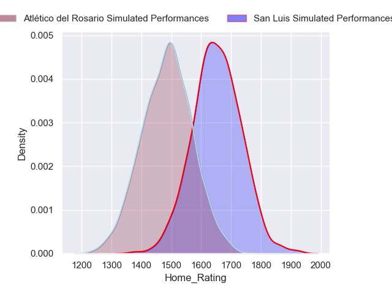
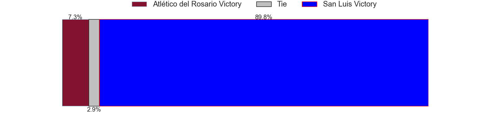
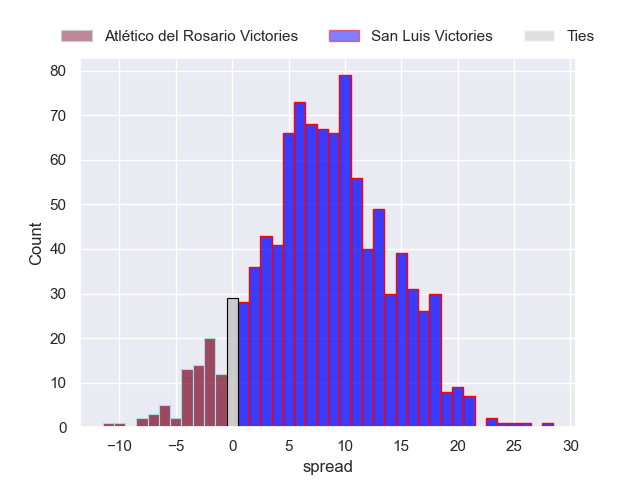

### Belgrano V Buenos Aires on 2024/06/01

Average Margin: Belgrano by 7.9

Average Scoreline: 25-17

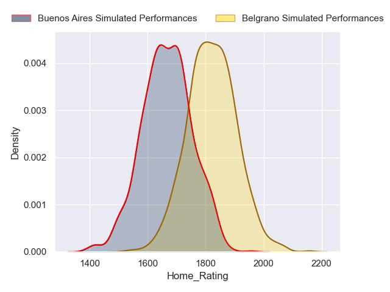
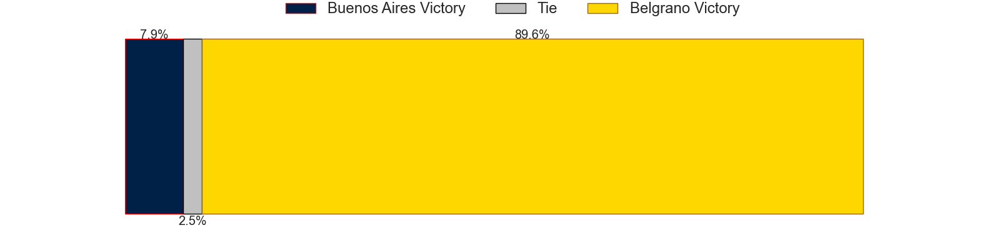
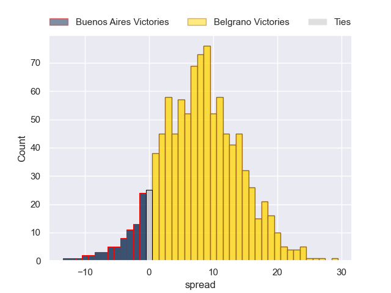

### Hindu V Newman on 2024/06/01

Average Margin: Hindu by 3.2

Average Scoreline: 21-18

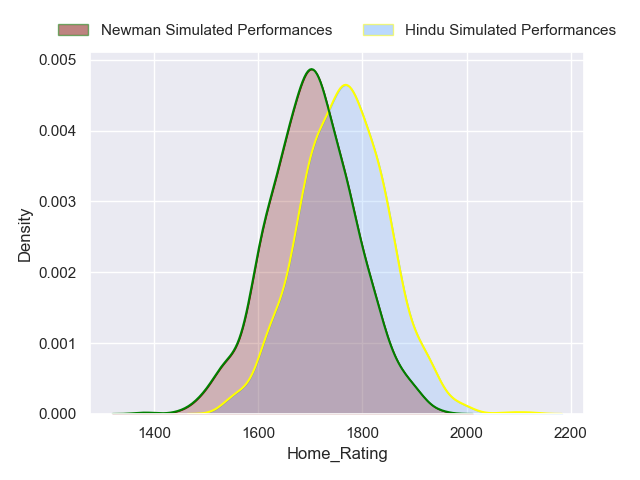

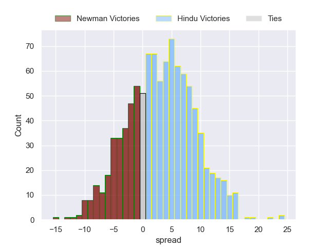

### CUBA V Alumni on 2024/06/01

Average Margin: Alumni by 0.1

Average Scoreline: 24-24

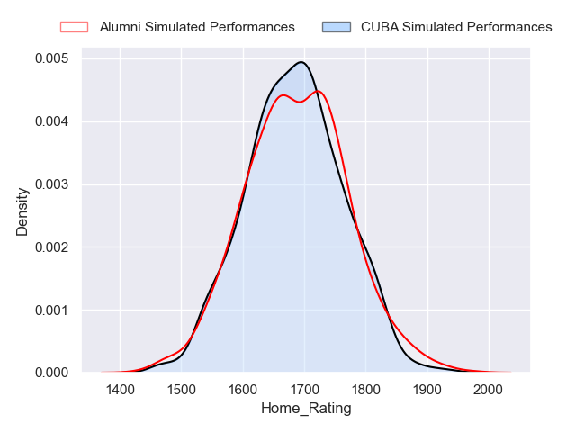

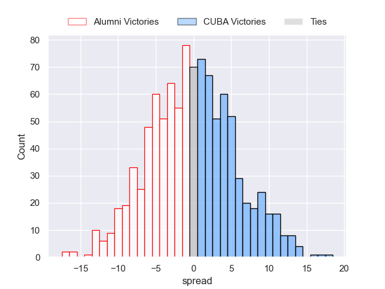

### CASI V SIC on 2024/06/01

Average Margin: SIC by 1.9

Average Scoreline: 26-24

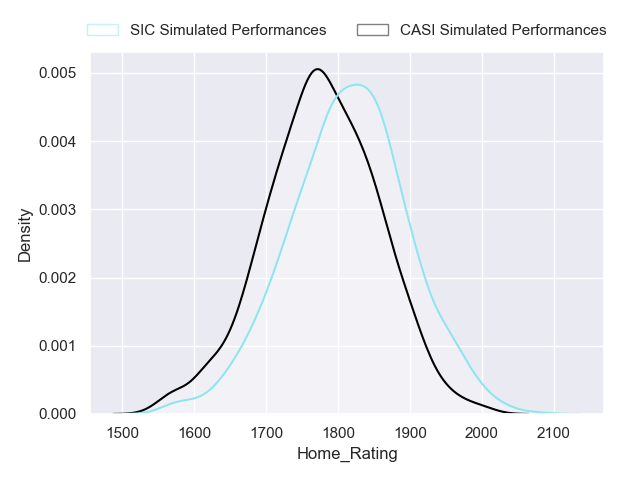

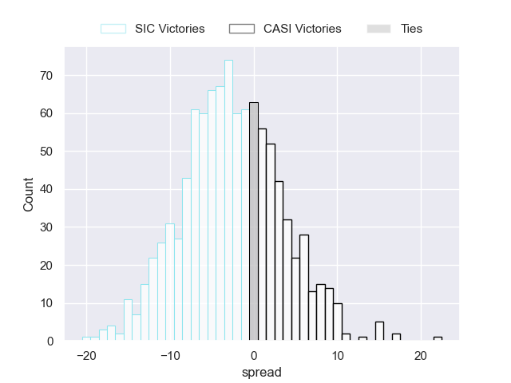

### Regatas Bella Vista V Champagnat on 2024/06/01

Average Margin: Regatas Bella Vista by 7.4

Average Scoreline: 27-19

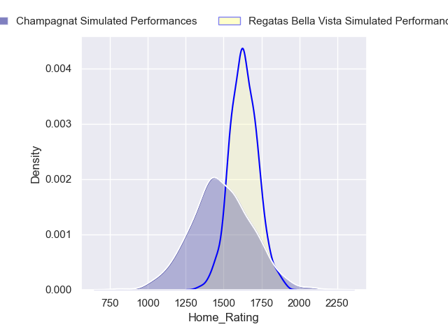

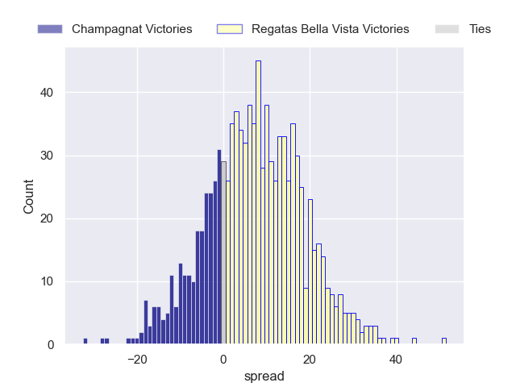

