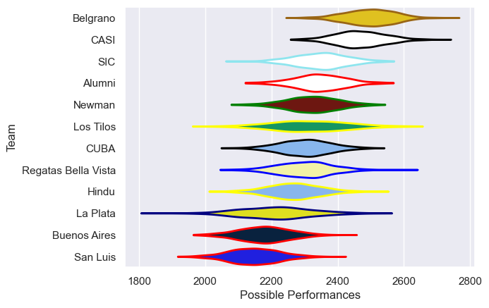

---  
title: "URBA Top 12 2025 Status"  
date: 2025-07-07 6:00:00 -0500  
categories: model review projection  
layout: article  
aside:  
    toc: true  
---
# Current Team Rankings

# Standings

## Current Standings

| Club                |   Played |   Wins |   Point Differential |   Losing Bonus Points |   Try Bonus Points |   Competition Points |
|:--------------------|---------:|-------:|---------------------:|----------------------:|-------------------:|---------------------:|
| Belgrano            |       12 |     11 |                  162 |                     1 |                  1 |                   46 |
| CASI                |       12 |     10 |                  142 |                     1 |                  4 |                   45 |
| SIC                 |       12 |      8 |                   61 |                     3 |                  5 |                   40 |
| Los Tilos           |       12 |      7 |                   25 |                     3 |                  4 |                   37 |
| Alumni              |       12 |      7 |                   -4 |                     2 |                  4 |                   34 |
| Newman              |       12 |      7 |                    4 |                     3 |                  1 |                   32 |
| Regatas Bella Vista |       12 |      6 |                  -13 |                     1 |                  1 |                   26 |
| CUBA                |       12 |      5 |                  -16 |                     5 |                  1 |                   26 |
| Hindu               |       12 |      4 |                  -16 |                     5 |                  1 |                   22 |
| La Plata            |       12 |      3 |                 -102 |                     6 |                    |                   18 |
| Buenos Aires        |       12 |      2 |                  -88 |                     4 |                    |                   12 |
| San Luis            |       12 |      1 |                 -155 |                     3 |                  1 |                   10 |

## Projected Remaining Table

| Club                |   To Play |   Projected Wins |   Projected Differential |   Projected Losing Bonus Points | Projected Try Bonus Points   |   Projected Competition Points |
|:--------------------|----------:|-----------------:|-------------------------:|--------------------------------:|:-----------------------------|-------------------------------:|
| Belgrano            |        11 |            7.235 |                   51.726 |                           1.874 |                              |                         31.688 |
| CASI                |        11 |            6.412 |                   30.208 |                           2.218 |                              |                         28.814 |
| SIC                 |        11 |            6.274 |                   24.351 |                           2.36  |                              |                         28.416 |
| Newman              |        11 |            5.56  |                    9.172 |                           2.701 |                              |                         25.945 |
| Alumni              |        11 |            5.24  |                   -1.427 |                           2.638 |                              |                         24.62  |
| CUBA                |        11 |            5.175 |                   -0.174 |                           2.767 |                              |                         24.437 |
| Regatas Bella Vista |        11 |            5.092 |                   -4.176 |                           2.804 |                              |                         24.268 |
| Los Tilos           |        11 |            4.928 |                   -8.495 |                           2.585 |                              |                         23.297 |
| Hindu               |        11 |            4.833 |                  -10.283 |                           2.808 |                              |                         23.09  |
| La Plata            |        11 |            4.557 |                  -20.118 |                           2.646 |                              |                         21.84  |
| San Luis            |        11 |            3.899 |                  -36.03  |                           2.805 |                              |                         19.345 |
| Buenos Aires        |        11 |            3.888 |                  -34.754 |                           2.851 |                              |                         19.297 |

## Projected Total Table

| Club                |   Played |   Wins |   Point Differential |   Losing Bonus Points |   Try Bonus Points |   Competition Points |
|:--------------------|---------:|-------:|---------------------:|----------------------:|-------------------:|---------------------:|
| Belgrano            |       23 | 18.235 |              213.726 |                 2.874 |                  1 |               77.688 |
| CASI                |       23 | 16.412 |              172.208 |                 3.218 |                  4 |               73.814 |
| SIC                 |       23 | 14.274 |               85.351 |                 5.36  |                  5 |               68.416 |
| Los Tilos           |       23 | 11.928 |               16.505 |                 5.585 |                  4 |               60.297 |
| Alumni              |       23 | 12.24  |               -5.427 |                 4.638 |                  4 |               58.62  |
| Newman              |       23 | 12.56  |               13.172 |                 5.701 |                  1 |               57.945 |
| CUBA                |       23 | 10.175 |              -16.174 |                 7.767 |                  1 |               50.437 |
| Regatas Bella Vista |       23 | 11.092 |              -17.176 |                 3.804 |                  1 |               50.268 |
| Hindu               |       23 |  8.833 |              -26.283 |                 7.808 |                  1 |               45.09  |
| La Plata            |       23 |  7.557 |             -122.118 |                 8.646 |                    |               39.84  |
| Buenos Aires        |       23 |  5.888 |             -122.754 |                 6.851 |                    |               31.297 |
| San Luis            |       23 |  4.899 |             -191.03  |                 5.805 |                  1 |               29.345 |

# Completed Match Review

| Model | Percent Correct Predictions | Spread Error |
| ------ | ------ | ------ |
| Club Level | 72.5% | 9.8 |
| Player Level: Lineup | nan% | nan |
| Player Level: Minutes | nan% | nan |

# Future Predictions

## Week 13

### San Luis V Hindu on 2025/07/12

Average Margin: Hindu by 1.0

### CASI V Buenos Aires on 2025/07/12

Average Margin: CASI by 8.2

### CUBA V Alumni on 2025/07/12

Average Margin: CUBA by 2.5

### SIC V Los Tilos on 2025/07/12

Average Margin: SIC by 5.6

### Belgrano V La Plata on 2025/07/12

Average Margin: Belgrano by 9.1

### Regatas Bella Vista V Newman on 2025/07/12

Average Margin: Regatas Bella Vista by 0.5

## Week 14

### CUBA V Belgrano on 2025/07/19

Average Margin: Belgrano by 3.1

### Buenos Aires V San Luis on 2025/07/19

Average Margin: Buenos Aires by 2.9

### Hindu V Regatas Bella Vista on 2025/07/19

Average Margin: Hindu by 1.5

### La Plata V CASI on 2025/07/19

Average Margin: CASI by 3.2

### Alumni V Los Tilos on 2025/07/19

Average Margin: Alumni by 3.3

### Newman V SIC on 2025/07/19

Average Margin: Newman by 0.4

## Week 15

### Los Tilos V Newman on 2025/08/02

Average Margin: Los Tilos by 1.0

### SIC V Hindu on 2025/08/02

Average Margin: SIC by 4.7

### San Luis V La Plata on 2025/08/02

Average Margin: San Luis by 0.2

### Regatas Bella Vista V Buenos Aires on 2025/08/02

Average Margin: Regatas Bella Vista by 3.8

### Belgrano V Alumni on 2025/08/02

Average Margin: Belgrano by 6.6

### CASI V CUBA on 2025/08/02

Average Margin: CASI by 4.8

## Week 16

### Belgrano V CASI on 2025/08/09

Average Margin: Belgrano by 3.7

### Buenos Aires V SIC on 2025/08/09

Average Margin: SIC by 2.8

### Alumni V Newman on 2025/08/09

Average Margin: Alumni by 0.9

### La Plata V Regatas Bella Vista on 2025/08/09

Average Margin: La Plata by 0.9

### CUBA V San Luis on 2025/08/09

Average Margin: CUBA by 5.9

### Hindu V Los Tilos on 2025/08/09

Average Margin: Hindu by 2.0

## Week 17

### SIC V La Plata on 2025/08/16

Average Margin: SIC by 4.7

### Regatas Bella Vista V CUBA on 2025/08/16

Average Margin: Regatas Bella Vista by 1.8

### Newman V Hindu on 2025/08/16

Average Margin: Newman by 4.0

### San Luis V Belgrano on 2025/08/16

Average Margin: Belgrano by 6.1

### Los Tilos V Buenos Aires on 2025/08/16

Average Margin: Los Tilos by 5.2

### CASI V Alumni on 2025/08/16

Average Margin: CASI by 4.2

## Week 18

### Alumni V Hindu on 2025/08/30

Average Margin: Alumni by 3.3

### Buenos Aires V Newman on 2025/08/30

Average Margin: Newman by 2.4

### CUBA V SIC on 2025/08/30

Average Margin: SIC by 0.1

### CASI V San Luis on 2025/08/30

Average Margin: CASI by 8.0

### La Plata V Los Tilos on 2025/08/30

Average Margin: La Plata by 1.8

### Belgrano V Regatas Bella Vista on 2025/08/30

Average Margin: Belgrano by 6.7

## Week 19

### Los Tilos V CUBA on 2025/09/06

Average Margin: Los Tilos by 1.9

### SIC V Belgrano on 2025/09/06

Average Margin: Belgrano by 0.6

### Newman V La Plata on 2025/09/06

Average Margin: Newman by 4.6

### Regatas Bella Vista V CASI on 2025/09/06

Average Margin: CASI by 0.1

### Hindu V Buenos Aires on 2025/09/06

Average Margin: Hindu by 3.7

### San Luis V Alumni on 2025/09/06

Average Margin: Alumni by 1.0

## Week 20

### Alumni V Buenos Aires on 2025/09/13

Average Margin: Alumni by 4.8

### San Luis V Regatas Bella Vista on 2025/09/13

Average Margin: Regatas Bella Vista by 0.2

### La Plata V Hindu on 2025/09/13

Average Margin: La Plata by 1.8

### CASI V SIC on 2025/09/13

Average Margin: CASI by 2.3

### Belgrano V Los Tilos on 2025/09/13

Average Margin: Belgrano by 5.9

### CUBA V Newman on 2025/09/13

Average Margin: CUBA by 1.2

## Week 21

### Buenos Aires V La Plata on 2025/09/27

Average Margin: Buenos Aires by 0.6

### Newman V Belgrano on 2025/09/27

Average Margin: Belgrano by 0.8

### Regatas Bella Vista V Alumni on 2025/09/27

Average Margin: Regatas Bella Vista by 1.6

### SIC V San Luis on 2025/09/27

Average Margin: SIC by 6.6

### Hindu V CUBA on 2025/09/27

Average Margin: Hindu by 1.4

### Los Tilos V CASI on 2025/09/27

Average Margin: CASI by 0.3

## Week 22

### CUBA V Buenos Aires on 2025/10/04

Average Margin: CUBA by 4.2

### Regatas Bella Vista V SIC on 2025/10/04

Average Margin: SIC by 0.1

### Alumni V La Plata on 2025/10/04

Average Margin: Alumni by 3.1

### San Luis V Los Tilos on 2025/10/04

Average Margin: San Luis by 0.4

### CASI V Newman on 2025/10/04

Average Margin: CASI by 2.7

### Belgrano V Hindu on 2025/10/04

Average Margin: Belgrano by 5.9

## Week 23

### Buenos Aires V Belgrano on 2025/10/11

Average Margin: Belgrano by 3.1

### La Plata V CUBA on 2025/10/11

Average Margin: La Plata by 0.9

### SIC V Alumni on 2025/10/11

Average Margin: SIC by 3.1

### Newman V San Luis on 2025/10/11

Average Margin: Newman by 4.8

### Hindu V CASI on 2025/10/11

Average Margin: CASI by 0.2

### Los Tilos V Regatas Bella Vista on 2025/10/11

Average Margin: Los Tilos by 2.7

