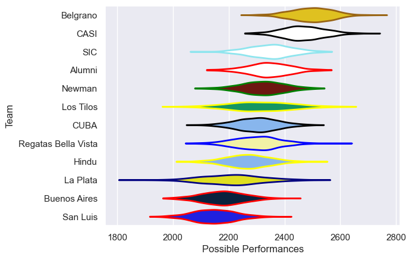

---  
title: "URBA Top 12 2025 Status"  
date: 2025-06-17 6:00:00 -0500  
categories: model review projection  
layout: article  
aside:  
    toc: true  
---
# Current Team Rankings

# Standings

## Current Standings

| Club                |   Played |   Wins |   Point Differential |   Losing Bonus Points |   Try Bonus Points |   Competition Points |
|:--------------------|---------:|-------:|---------------------:|----------------------:|-------------------:|---------------------:|
| CASI                |       10 |      9 |                  155 |                     1 |                  4 |                   41 |
| Belgrano            |       10 |      9 |                  144 |                     1 |                  1 |                   38 |
| Los Tilos           |       10 |      7 |                   32 |                     2 |                  4 |                   34 |
| SIC                 |       10 |      6 |                   16 |                     3 |                  4 |                   31 |
| Alumni              |       10 |      6 |                   14 |                     2 |                  3 |                   29 |
| Newman              |       10 |      5 |                  -14 |                     3 |                  1 |                   24 |
| Regatas Bella Vista |       10 |      5 |                    1 |                     1 |                  1 |                   22 |
| Hindu               |       10 |      4 |                   -6 |                     4 |                  1 |                   21 |
| CUBA                |       10 |      3 |                  -23 |                     5 |                  1 |                   18 |
| La Plata            |       10 |      3 |                  -92 |                     4 |                    |                   16 |
| Buenos Aires        |       10 |      2 |                  -76 |                     3 |                    |                   11 |
| San Luis            |       10 |      1 |                 -151 |                     2 |                  1 |                    7 |

## Projected Remaining Table

| Club                |   To Play |   Projected Wins |   Projected Differential |   Projected Losing Bonus Points | Projected Try Bonus Points   |   Projected Competition Points |
|:--------------------|----------:|-----------------:|-------------------------:|--------------------------------:|:-----------------------------|-------------------------------:|
| Belgrano            |        13 |            8.678 |                   65.095 |                           2.119 |                              |                         37.831 |
| CASI                |        13 |            8.188 |                   51.583 |                           2.303 |                              |                         36.085 |
| SIC                 |        13 |            6.645 |                   11.605 |                           3.167 |                              |                         30.921 |
| Alumni              |        13 |            6.631 |                    9.331 |                           2.942 |                              |                         30.642 |
| CUBA                |        13 |            6.388 |                    3.399 |                           3.04  |                              |                         29.832 |
| Regatas Bella Vista |        13 |            6.163 |                   -2.469 |                           3.268 |                              |                         29.116 |
| Los Tilos           |        13 |            6.227 |                    2.178 |                           3.002 |                              |                         28.996 |
| Newman              |        13 |            6.033 |                   -4.377 |                           3.237 |                              |                         28.525 |
| Hindu               |        13 |            5.406 |                  -19.878 |                           3.325 |                              |                         26.053 |
| La Plata            |        13 |            5.356 |                  -23.748 |                           3.15  |                              |                         25.682 |
| Buenos Aires        |        13 |            4.586 |                  -43.96  |                           3.251 |                              |                         22.669 |
| San Luis            |        13 |            4.354 |                  -48.759 |                           3.327 |                              |                         21.779 |

## Projected Total Table

| Club                |   Played |   Wins |   Point Differential |   Losing Bonus Points |   Try Bonus Points |   Competition Points |
|:--------------------|---------:|-------:|---------------------:|----------------------:|-------------------:|---------------------:|
| CASI                |       23 | 17.188 |              206.583 |                 3.303 |                  4 |               77.085 |
| Belgrano            |       23 | 17.678 |              209.095 |                 3.119 |                  1 |               75.831 |
| Los Tilos           |       23 | 13.227 |               34.178 |                 5.002 |                  4 |               62.996 |
| SIC                 |       23 | 12.645 |               27.605 |                 6.167 |                  4 |               61.921 |
| Alumni              |       23 | 12.631 |               23.331 |                 4.942 |                  3 |               59.642 |
| Newman              |       23 | 11.033 |              -18.377 |                 6.237 |                  1 |               52.525 |
| Regatas Bella Vista |       23 | 11.163 |               -1.469 |                 4.268 |                  1 |               51.116 |
| CUBA                |       23 |  9.388 |              -19.601 |                 8.04  |                  1 |               47.832 |
| Hindu               |       23 |  9.406 |              -25.878 |                 7.325 |                  1 |               47.053 |
| La Plata            |       23 |  8.356 |             -115.748 |                 7.15  |                    |               41.682 |
| Buenos Aires        |       23 |  6.586 |             -119.96  |                 6.251 |                    |               33.669 |
| San Luis            |       23 |  5.354 |             -199.759 |                 5.327 |                  1 |               28.779 |

# Completed Match Review

| Model | Percent Correct Predictions | Spread Error |
| ------ | ------ | ------ |
| Club Level | 71.0% | 9.7 |
| Player Level: Lineup | nan% | nan |
| Player Level: Minutes | nan% | nan |

# Future Predictions

## Week 11

### SIC V Regatas Bella Vista on 2025/06/21

Average Margin: SIC by 2.9

### Hindu V Belgrano on 2025/06/21

Average Margin: Belgrano by 4.6

### La Plata V Alumni on 2025/06/21

Average Margin: Alumni by 0.6

### Buenos Aires V CUBA on 2025/06/21

Average Margin: CUBA by 0.8

### Newman V CASI on 2025/06/21

Average Margin: CASI by 1.9

### Los Tilos V San Luis on 2025/06/21

Average Margin: Los Tilos by 7.1

## Week 12

### Alumni V SIC on 2025/06/28

Average Margin: Alumni by 2.6

### San Luis V Newman on 2025/06/28

Average Margin: Newman by 1.7

### Belgrano V Buenos Aires on 2025/06/28

Average Margin: Belgrano by 10.9

### CASI V Hindu on 2025/06/28

Average Margin: CASI by 7.1

### CUBA V La Plata on 2025/06/28

Average Margin: CUBA by 4.8

### Regatas Bella Vista V Los Tilos on 2025/06/28

Average Margin: Regatas Bella Vista by 1.5

## Week 13

### Belgrano V La Plata on 2025/07/12

Average Margin: Belgrano by 8.5

### CUBA V Alumni on 2025/07/12

Average Margin: CUBA by 1.0

### San Luis V Hindu on 2025/07/12

Average Margin: Hindu by 1.4

### SIC V Los Tilos on 2025/07/12

Average Margin: SIC by 3.4

### CASI V Buenos Aires on 2025/07/12

Average Margin: CASI by 8.2

### Regatas Bella Vista V Newman on 2025/07/12

Average Margin: Regatas Bella Vista by 1.3

## Week 14

### Hindu V Regatas Bella Vista on 2025/07/19

Average Margin: Hindu by 0.8

### Newman V SIC on 2025/07/19

Average Margin: Newman by 1.0

### CUBA V Belgrano on 2025/07/19

Average Margin: Belgrano by 2.7

### Alumni V Los Tilos on 2025/07/19

Average Margin: Alumni by 3.6

### Buenos Aires V San Luis on 2025/07/19

Average Margin: Buenos Aires by 3.8

### La Plata V CASI on 2025/07/19

Average Margin: CASI by 3.9

## Week 15

### Belgrano V Alumni on 2025/08/02

Average Margin: Belgrano by 6.0

### Los Tilos V Newman on 2025/08/02

Average Margin: Los Tilos by 3.1

### SIC V Hindu on 2025/08/02

Average Margin: SIC by 3.3

### CASI V CUBA on 2025/08/02

Average Margin: CASI by 6.2

### Regatas Bella Vista V Buenos Aires on 2025/08/02

Average Margin: Regatas Bella Vista by 4.6

### San Luis V La Plata on 2025/08/02

Average Margin: La Plata by 0.7

## Week 16

### La Plata V Regatas Bella Vista on 2025/08/09

Average Margin: La Plata by 0.9

### Hindu V Los Tilos on 2025/08/09

Average Margin: Hindu by 1.9

### Belgrano V CASI on 2025/08/09

Average Margin: Belgrano by 2.7

### CUBA V San Luis on 2025/08/09

Average Margin: CUBA by 5.8

### Buenos Aires V SIC on 2025/08/09

Average Margin: SIC by 1.8

### Alumni V Newman on 2025/08/09

Average Margin: Alumni by 3.6

## Week 17

### Los Tilos V Buenos Aires on 2025/08/16

Average Margin: Los Tilos by 5.6

### SIC V La Plata on 2025/08/16

Average Margin: SIC by 3.7

### San Luis V Belgrano on 2025/08/16

Average Margin: Belgrano by 6.2

### Newman V Hindu on 2025/08/16

Average Margin: Newman by 3.1

### Regatas Bella Vista V CUBA on 2025/08/16

Average Margin: Regatas Bella Vista by 1.7

### CASI V Alumni on 2025/08/16

Average Margin: CASI by 4.4

## Week 18

### Buenos Aires V Newman on 2025/08/30

Average Margin: Newman by 1.2

### Belgrano V Regatas Bella Vista on 2025/08/30

Average Margin: Belgrano by 5.4

### CUBA V SIC on 2025/08/30

Average Margin: CUBA by 0.7

### La Plata V Los Tilos on 2025/08/30

Average Margin: La Plata by 1.0

### CASI V San Luis on 2025/08/30

Average Margin: CASI by 9.5

### Alumni V Hindu on 2025/08/30

Average Margin: Alumni by 3.5

## Week 19

### Regatas Bella Vista V CASI on 2025/09/06

Average Margin: CASI by 1.0

### Hindu V Buenos Aires on 2025/09/06

Average Margin: Hindu by 3.8

### San Luis V Alumni on 2025/09/06

Average Margin: Alumni by 1.9

### Los Tilos V CUBA on 2025/09/06

Average Margin: Los Tilos by 2.2

### Newman V La Plata on 2025/09/06

Average Margin: Newman by 2.9

### SIC V Belgrano on 2025/09/06

Average Margin: Belgrano by 1.6

## Week 20

### CASI V SIC on 2025/09/13

Average Margin: CASI by 4.2

### Alumni V Buenos Aires on 2025/09/13

Average Margin: Alumni by 4.9

### La Plata V Hindu on 2025/09/13

Average Margin: La Plata by 1.6

### CUBA V Newman on 2025/09/13

Average Margin: CUBA by 2.0

### Belgrano V Los Tilos on 2025/09/13

Average Margin: Belgrano by 6.5

### San Luis V Regatas Bella Vista on 2025/09/13

Average Margin: Regatas Bella Vista by 0.5

## Week 21

### Hindu V CUBA on 2025/09/27

Average Margin: Hindu by 2.0

### Newman V Belgrano on 2025/09/27

Average Margin: Belgrano by 1.5

### Los Tilos V CASI on 2025/09/27

Average Margin: CASI by 0.9

### Regatas Bella Vista V Alumni on 2025/09/27

Average Margin: Regatas Bella Vista by 0.8

### Buenos Aires V La Plata on 2025/09/27

Average Margin: Buenos Aires by 1.2

### SIC V San Luis on 2025/09/27

Average Margin: SIC by 5.1

## Week 22

### San Luis V Los Tilos on 2025/10/04

Average Margin: Los Tilos by 0.3

### Regatas Bella Vista V SIC on 2025/10/04

Average Margin: Regatas Bella Vista by 0.7

### Belgrano V Hindu on 2025/10/04

Average Margin: Belgrano by 5.1

### Alumni V La Plata on 2025/10/04

Average Margin: Alumni by 3.2

### CUBA V Buenos Aires on 2025/10/04

Average Margin: CUBA by 4.0

### CASI V Newman on 2025/10/04

Average Margin: CASI by 5.7

## Week 23

### Hindu V CASI on 2025/10/11

Average Margin: CASI by 1.4

### SIC V Alumni on 2025/10/11

Average Margin: SIC by 2.2

### Newman V San Luis on 2025/10/11

Average Margin: Newman by 4.8

### Los Tilos V Regatas Bella Vista on 2025/10/11

Average Margin: Los Tilos by 2.6

### Buenos Aires V Belgrano on 2025/10/11

Average Margin: Belgrano by 3.2

### La Plata V CUBA on 2025/10/11

Average Margin: La Plata by 1.0

