---  
title: "URBA Top 12 2025 Status"  
date: 2025-05-22 6:00:00 -0500  
categories: model review projection  
layout: article  
aside:  
    toc: true  
---
# Current Team Rankings

# Standings

## Current Standings

| Club                |   Played |   Wins |   Point Differential |   Losing Bonus Points |   Try Bonus Points |   Competition Points |
|:--------------------|---------:|-------:|---------------------:|----------------------:|-------------------:|---------------------:|
| CASI                |        1 |      1 |                   40 |                     0 |                nan |                    4 |
| La Plata Rugby Club |        1 |      0 |                  -40 |                     0 |                nan |                    0 |

## Projected Remaining Table

| Club                |   Matches Remaining |   Wins |   Point Differential |   Losing Bonus Points |   Try Bonus Points |   Competition Points |
|:--------------------|--------------------:|-------:|---------------------:|----------------------:|-------------------:|---------------------:|
| CASI                |                   1 |    0.9 |            11.1813   |                   0.1 |                0.7 |                  4.3 |
| Newman              |                   1 |    0.9 |            11.8315   |                   0.1 |                0.5 |                  4.1 |
| Belgrano            |                   1 |    0.7 |             4.97983  |                   0.2 |                0.2 |                  3.3 |
| La Plata Rugby Club |                   1 |    0.6 |             4.22072  |                   0.2 |                0.4 |                  3.1 |
| Hindu               |                   1 |    0.6 |             2.3481   |                   0.3 |                0.4 |                  3   |
| CUBA                |                   1 |    0.5 |             0.633268 |                   0.3 |                0.1 |                  2.5 |
| SIC                 |                   1 |    0.5 |            -0.633268 |                   0.3 |                0.2 |                  2.4 |
| Alumni              |                   1 |    0.4 |            -2.3481   |                   0.3 |                0.4 |                  2.3 |
| Los Tilos           |                   1 |    0.4 |            -4.22072  |                   0.3 |                0.2 |                  1.9 |
| Regatas Bella Vista |                   1 |    0.3 |            -4.97983  |                   0.4 |                0.1 |                  1.6 |
| San Luis            |                   1 |    0.1 |           -11.1813   |                   0.2 |                0.2 |                  0.9 |
| Buenos Aires        |                   1 |    0.1 |           -11.8315   |                   0.2 |                0.2 |                  0.8 |

## Projected Total Table

| Club                |   Total Matches |   Wins |   Point Differential |   Losing Bonus Points |   Try Bonus Points |   Competition Points |
|:--------------------|----------------:|-------:|---------------------:|----------------------:|-------------------:|---------------------:|
| CASI                |               2 |    1.9 |            51.1813   |                   0.1 |                0.7 |                  8.3 |
| Newman              |               1 |    0.9 |            11.8315   |                   0.1 |                0.5 |                  4.1 |
| Belgrano            |               1 |    0.7 |             4.97983  |                   0.2 |                0.2 |                  3.3 |
| La Plata Rugby Club |               2 |    0.6 |           -35.7793   |                   0.2 |                0.4 |                  3.1 |
| Hindu               |               1 |    0.6 |             2.3481   |                   0.3 |                0.4 |                  3   |
| CUBA                |               1 |    0.5 |             0.633268 |                   0.3 |                0.1 |                  2.5 |
| SIC                 |               1 |    0.5 |            -0.633268 |                   0.3 |                0.2 |                  2.4 |
| Alumni              |               1 |    0.4 |            -2.3481   |                   0.3 |                0.4 |                  2.3 |
| Los Tilos           |               1 |    0.4 |            -4.22072  |                   0.3 |                0.2 |                  1.9 |
| Regatas Bella Vista |               1 |    0.3 |            -4.97983  |                   0.4 |                0.1 |                  1.6 |
| San Luis            |               1 |    0.1 |           -11.1813   |                   0.2 |                0.2 |                  0.9 |
| Buenos Aires        |               1 |    0.1 |           -11.8315   |                   0.2 |                0.2 |                  0.8 |

# Completed Match Review

| Model | Percent Correct Predictions | Spread Error |
| ------ | ------ | ------ |
| Club Level | 100.0% | 24.0 |
| Player Level: Lineup | nan% | nan |
| Player Level: Minutes | nan% | nan |

# Future Predictions

## Week 2

### Newman V Buenos Aires on 2025/05/24

Average Margin: Newman by 11.8

Average Scoreline: 34-22

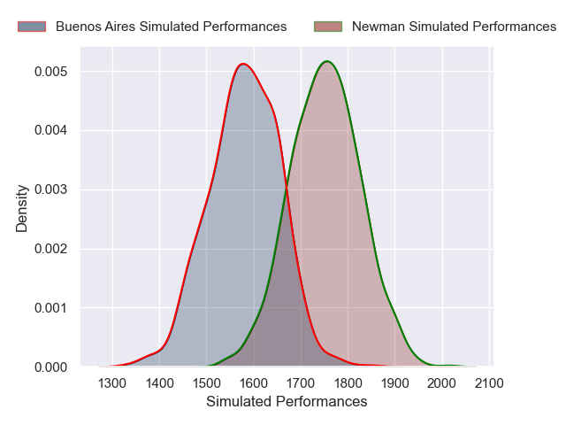

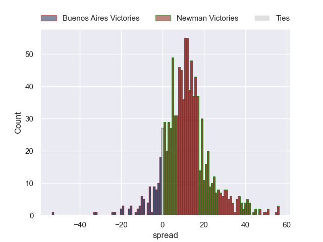

### Los Tilos V La Plata Rugby Club on 2025/05/24

Average Margin: La Plata Rugby Club by 4.2

Average Scoreline: 29-25

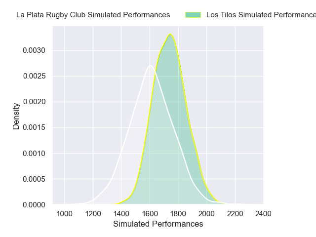

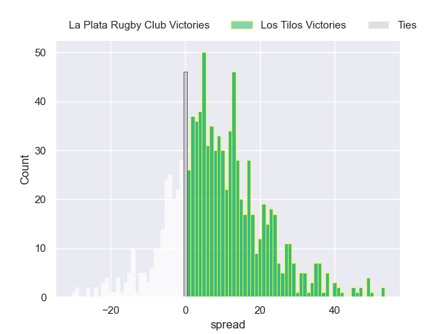

### Hindu V Alumni on 2025/05/24

Average Margin: Hindu by 2.3

Average Scoreline: 32-30

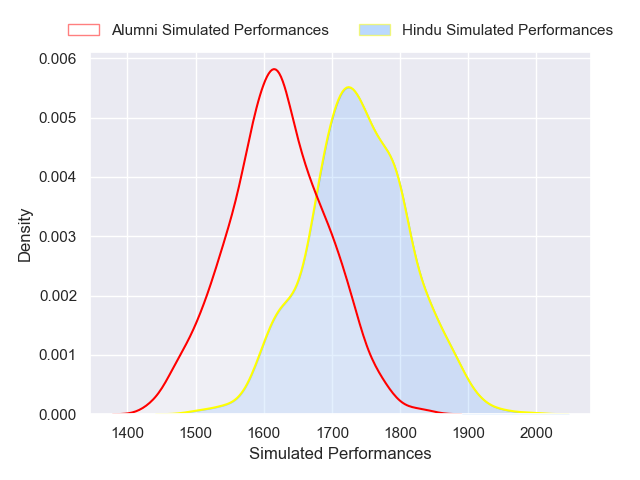

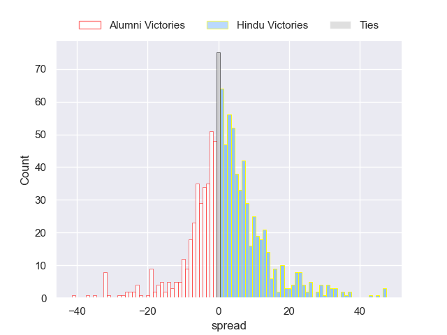

### San Luis V CASI on 2025/05/24

Average Margin: CASI by 11.2

Average Scoreline: 40-28

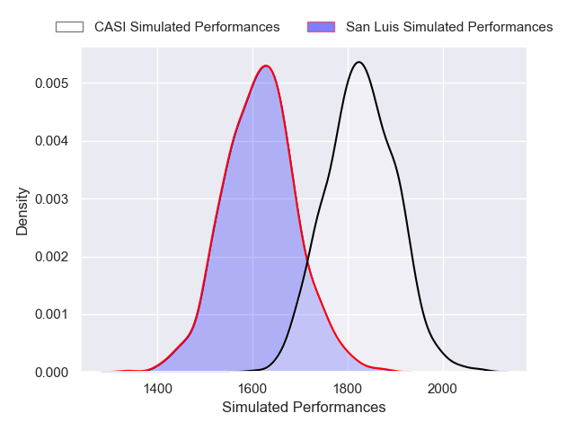
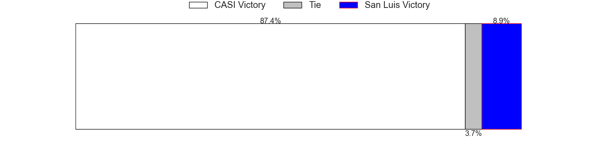
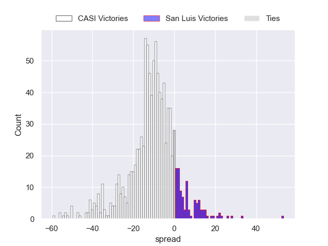

### Regatas Bella Vista V Belgrano on 2025/05/24

Average Margin: Belgrano by 5.0

Average Scoreline: 32-27

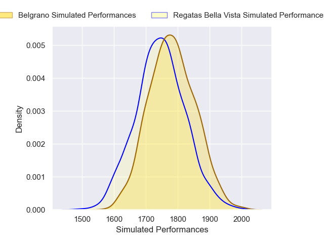

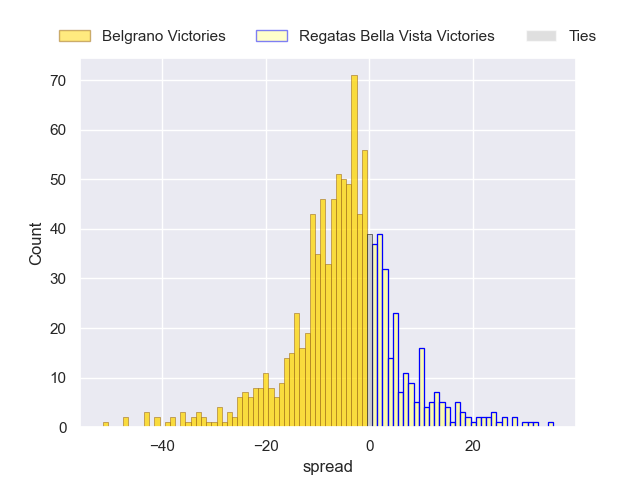

### SIC V CUBA on 2025/05/24

Average Margin: CUBA by 0.6

Average Scoreline: 29-28

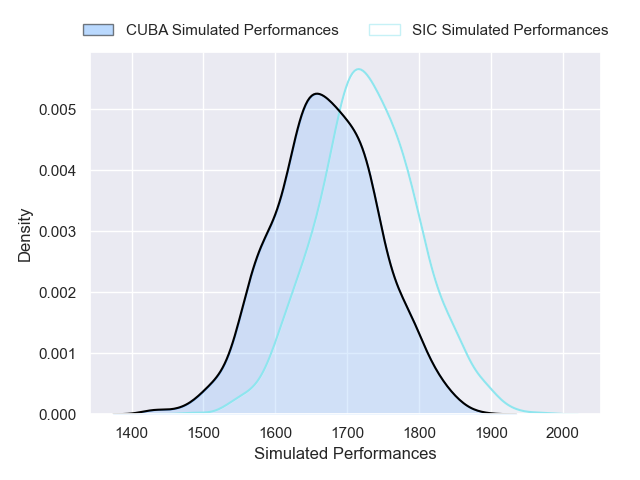

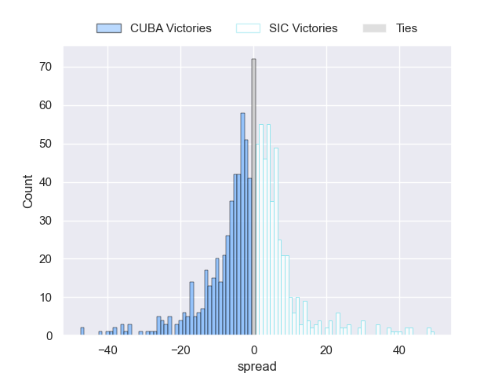

