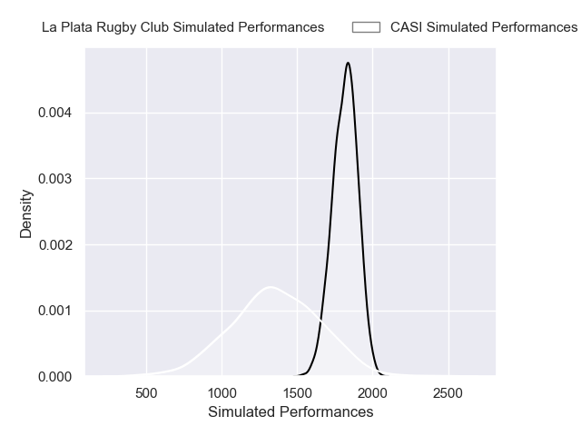
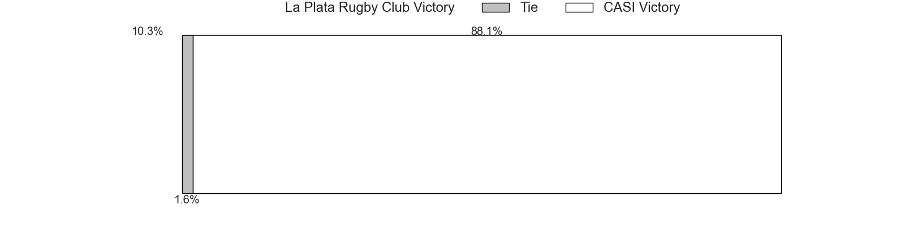
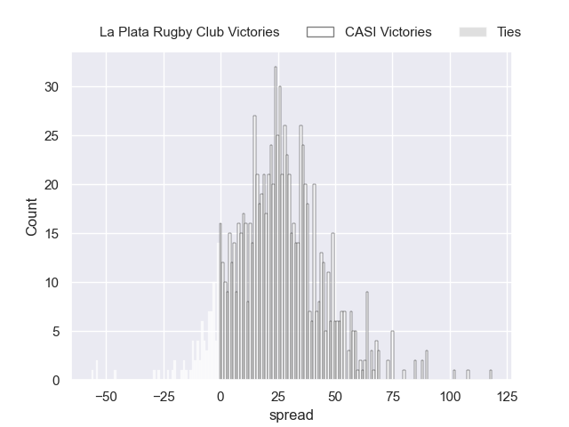

---  
title: "URBA Top 12 2025 Status"  
date: 2025-04-11 6:00:00 -0500  
categories: model review projection  
layout: article  
aside:  
    toc: true  
---
# Current Team Rankings

# Standings

## Projected Total Table

| Club                |   Total Matches |   Wins |   Point Differential |   Losing Bonus Points |   Try Bonus Points |   Competition Points |
|:--------------------|----------------:|-------:|---------------------:|----------------------:|-------------------:|---------------------:|
| CASI                |               1 |    0.9 |              23.7232 |                   0.1 |                0.7 |                  4.3 |
| La Plata Rugby Club |               1 |    0.1 |             -23.7232 |                   0.1 |                0.1 |                  0.6 |

# Future Predictions

## Week 1

### CASI V La Plata Rugby Club on 2025/04/12

Average Margin: CASI by 23.7

Average Scoreline: 39-15

