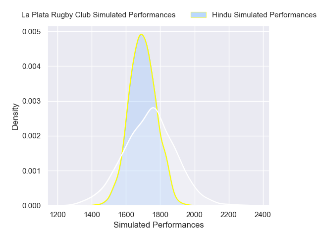
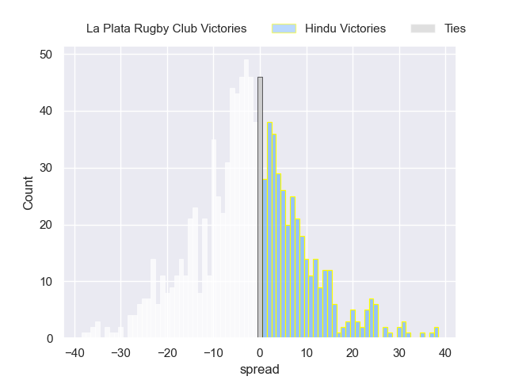

---  
title: "URBA Top 12 2025 Status"  
date: 2025-06-02 6:00:00 -0500  
categories: model review projection  
layout: article  
aside:  
    toc: true  
---
# Current Team Rankings

# Standings

## Current Standings

| Club                |   Played |   Wins |   Point Differential |   Losing Bonus Points |   Try Bonus Points |   Competition Points |
|:--------------------|---------:|-------:|---------------------:|----------------------:|-------------------:|---------------------:|
| CASI                |        1 |      1 |                   40 |                     0 |                nan |                    4 |
| La Plata Rugby Club |        1 |      0 |                  -40 |                     0 |                nan |                    0 |

## Projected Remaining Table

| Club                |   Matches Remaining |   Wins |   Point Differential |   Losing Bonus Points |   Try Bonus Points |   Competition Points |
|:--------------------|--------------------:|-------:|---------------------:|----------------------:|-------------------:|---------------------:|
| La Plata Rugby Club |                   1 |    0.6 |              2.56952 |                   0.2 |                0.4 |                  3   |
| Hindu               |                   1 |    0.4 |             -2.56952 |                   0.3 |                0.3 |                  2.1 |

## Projected Total Table

| Club                |   Total Matches |   Wins |   Point Differential |   Losing Bonus Points |   Try Bonus Points |   Competition Points |
|:--------------------|----------------:|-------:|---------------------:|----------------------:|-------------------:|---------------------:|
| CASI                |               1 |    1   |             40       |                   0   |                0   |                  4   |
| La Plata Rugby Club |               2 |    0.6 |            -37.4305  |                   0.2 |                0.4 |                  3   |
| Hindu               |               1 |    0.4 |             -2.56952 |                   0.3 |                0.3 |                  2.1 |

# Completed Match Review

| Model | Percent Correct Predictions | Spread Error |
| ------ | ------ | ------ |
| Club Level | 100.0% | 24.0 |
| Player Level: Lineup | nan% | nan |
| Player Level: Minutes | nan% | nan |

# Future Predictions

## Week 2

### Hindu V La Plata Rugby Club on 2025/06/07

Average Margin: La Plata Rugby Club by 2.6

Average Scoreline: 32-29

