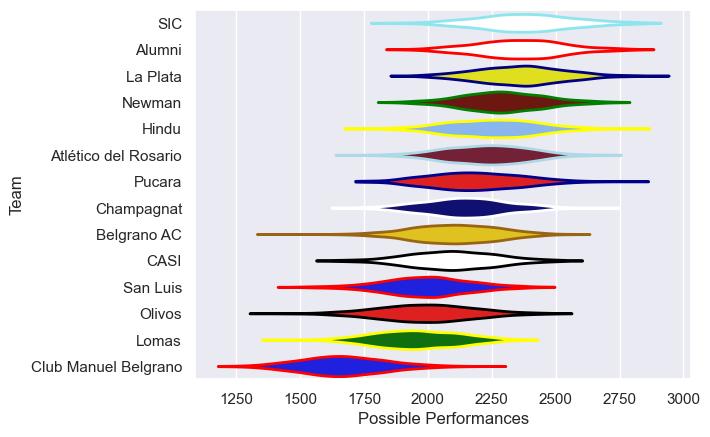

---  
title: "URBA Top 13 2010 Status"  
date: 2025-07-28 6:00:00 -0500  
categories: model review projection  
layout: article  
aside:  
    toc: true  
---
# Current Team Rankings

# Standings

## Current Standings

| Club                 |   Played |   Wins |   Point Differential |   Losing Bonus Points | Try Bonus Points   |   Competition Points |
|:---------------------|---------:|-------:|---------------------:|----------------------:|:-------------------|---------------------:|
| SIC                  |       15 |     12 |                  196 |                     1 |                    |                   49 |
| Hindu                |       14 |     11 |                  157 |                     1 |                    |                   47 |
| La Plata             |       16 |     10 |                  124 |                     2 |                    |                   46 |
| Belgrano AC          |       15 |     11 |                   77 |                     2 |                    |                   46 |
| Alumni               |       14 |      9 |                   61 |                     1 |                    |                   39 |
| Atlético del Rosario |       14 |      6 |                   -6 |                     3 |                    |                   33 |
| Newman               |       13 |      5 |                   27 |                     3 |                    |                   27 |
| Olivos               |       13 |      5 |                  -38 |                     2 |                    |                   24 |
| Pucara               |       13 |      4 |                   21 |                     3 |                    |                   23 |
| San Luis             |       13 |      4 |                  -34 |                     4 |                    |                   20 |
| CASI                 |       13 |      4 |                 -101 |                     4 |                    |                   20 |
| Lomas                |       13 |      4 |                 -120 |                     2 |                    |                   18 |
| Champagnat           |       13 |      4 |                  -88 |                     0 |                    |                   16 |
| Club Manuel Belgrano |       13 |      1 |                 -276 |                     2 |                    |                    6 |

# Completed Match Review

| Model | Percent Correct Predictions | Spread Error |
| ------ | ------ | ------ |
| Club Level | 56.2% | 14.3 |
| Player Level: Lineup | nan% | nan |
| Player Level: Minutes | nan% | nan |

