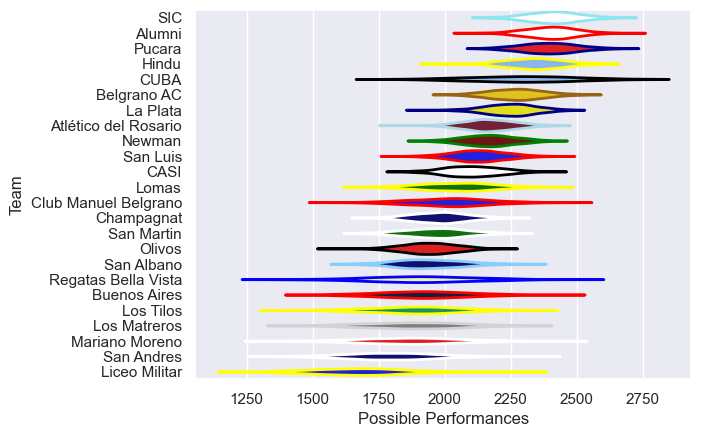

---  
title: "URBA Top 13 2011 Status"  
date: 2025-07-28 6:00:00 -0500  
categories: model review projection  
layout: article  
aside:  
    toc: true  
---
# Current Team Rankings

# Standings

## Current Standings

| Club                 |   Played |   Wins |   Point Differential |   Losing Bonus Points | Try Bonus Points   |   Competition Points |
|:---------------------|---------:|-------:|---------------------:|----------------------:|:-------------------|---------------------:|
| SIC                  |       23 |     19 |                  398 |                     4 |                    |                   80 |
| Hindu                |       25 |     19 |                  378 |                     2 |                    |                   78 |
| Alumni               |       23 |     18 |                  309 |                     4 |                    |                   78 |
| La Plata             |       24 |     16 |                  252 |                     3 |                    |                   69 |
| Pucara               |       23 |     16 |                  134 |                     2 |                    |                   66 |
| Atlético del Rosario |       24 |     15 |                   24 |                     0 |                    |                   66 |
| San Luis             |       26 |     15 |                   89 |                     4 |                    |                   64 |
| Belgrano AC          |       22 |     14 |                  130 |                     2 |                    |                   62 |
| CASI                 |       24 |     11 |                   71 |                     9 |                    |                   53 |
| Newman               |       24 |      9 |                  -25 |                     7 |                    |                   43 |
| Champagnat           |       21 |      8 |                 -139 |                     4 |                    |                   36 |
| San Martin           |       24 |      8 |                 -214 |                     4 |                    |                   36 |
| Olivos               |       21 |      6 |                 -218 |                     3 |                    |                   27 |
| San Albano           |       21 |      6 |                 -221 |                     1 |                    |                   27 |
| Los Tilos            |       11 |      4 |                  -34 |                     5 |                    |                   21 |
| Club Manuel Belgrano |       11 |      4 |                  -85 |                     3 |                    |                   19 |
| CUBA                 |        8 |      4 |                   33 |                     2 |                    |                   18 |
| Buenos Aires         |       11 |      3 |                 -111 |                     4 |                    |                   16 |
| Liceo Militar        |       11 |      3 |                 -232 |                     0 |                    |                   12 |
| San Andres           |       11 |      2 |                 -178 |                     3 |                    |                   11 |
| Lomas                |        8 |      2 |                  -84 |                     2 |                    |                   10 |
| Regatas Bella Vista  |        8 |      2 |                  -90 |                     1 |                    |                    9 |
| Los Matreros         |        8 |      1 |                  -84 |                     2 |                    |                    8 |
| Mariano Moreno       |        8 |      0 |                 -103 |                     2 |                    |                    4 |

# Completed Match Review

| Model | Percent Correct Predictions | Spread Error |
| ------ | ------ | ------ |
| Club Level | 70.0% | 13.1 |
| Player Level: Lineup | nan% | nan |
| Player Level: Minutes | nan% | nan |

