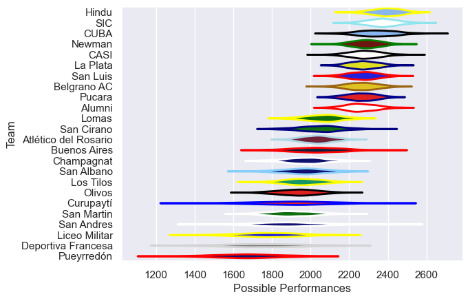

---  
title: "URBA Top 13 2012 Status"  
date: 2025-07-28 6:00:00 -0500  
categories: model review projection  
layout: article  
aside:  
    toc: true  
---
# Current Team Rankings

# Standings

## Current Standings

| Club                 |   Played |   Wins |   Point Differential |   Losing Bonus Points | Try Bonus Points   |   Competition Points |
|:---------------------|---------:|-------:|---------------------:|----------------------:|:-------------------|---------------------:|
| Hindu                |       26 |     21 |                  322 |                     3 |                    |                   89 |
| SIC                  |       25 |     19 |                  307 |                     4 |                    |                   80 |
| Pucara               |       24 |     18 |                  235 |                     2 |                    |                   76 |
| La Plata             |       27 |     16 |                  118 |                     7 |                    |                   73 |
| San Luis             |       25 |     17 |                  120 |                     4 |                    |                   72 |
| Newman               |       26 |     16 |                  175 |                     5 |                    |                   69 |
| Belgrano AC          |       24 |     16 |                  268 |                     2 |                    |                   68 |
| CUBA                 |       25 |     14 |                   63 |                     4 |                    |                   64 |
| Alumni               |       24 |     14 |                  183 |                     5 |                    |                   63 |
| CASI                 |       24 |     13 |                  169 |                     6 |                    |                   62 |
| Lomas                |       24 |     10 |                  -77 |                     5 |                    |                   45 |
| San Cirano           |       23 |      8 |                  -31 |                     4 |                    |                   42 |
| Atlético del Rosario |       24 |      9 |                 -229 |                     3 |                    |                   39 |
| Los Tilos            |       24 |      5 |                 -258 |                     4 |                    |                   24 |
| Champagnat           |       10 |      4 |                  -41 |                     2 |                    |                   18 |
| San Albano           |       11 |      4 |                  -91 |                     1 |                    |                   17 |
| Buenos Aires         |       11 |      3 |                  -54 |                     4 |                    |                   16 |
| Olivos               |       11 |      3 |                  -96 |                     3 |                    |                   15 |
| San Martin           |       11 |      3 |                 -113 |                     2 |                    |                   14 |
| Curupaytí            |       11 |      3 |                 -134 |                     1 |                    |                   13 |
| San Andres           |       11 |      2 |                 -151 |                     2 |                    |                   10 |
| Liceo Militar        |       11 |      2 |                 -272 |                     1 |                    |                    9 |
| Pueyrredón           |       11 |      1 |                 -201 |                     2 |                    |                    6 |
| Deportiva Francesa   |       11 |      0 |                 -212 |                     1 |                    |                    1 |

# Completed Match Review

| Model | Percent Correct Predictions | Spread Error |
| ------ | ------ | ------ |
| Club Level | 69.2% | 11.8 |
| Player Level: Lineup | nan% | nan |
| Player Level: Minutes | nan% | nan |

