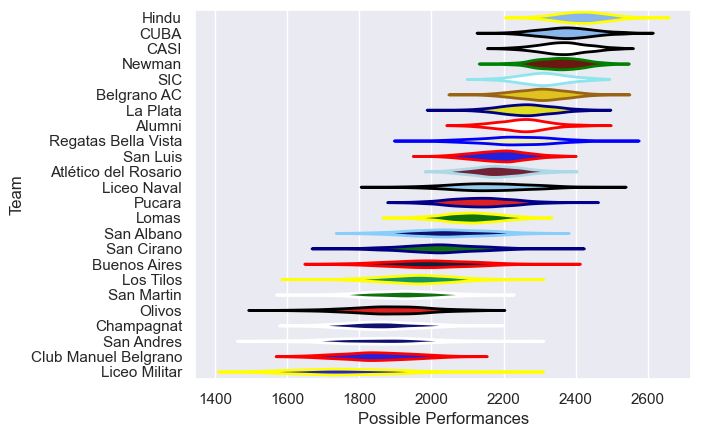

---  
title: "URBA Top 13 2013"  
date: 2025-07-29 6:00:00 -0500  
categories: model review projection  
layout: article  
aside:  
    toc: true  
---
# Current Team Rankings

# Standings

## Current Standings

| Club                 |   Played |   Wins |   Point Differential |   Losing Bonus Points | Try Bonus Points   |   Competition Points |
|:---------------------|---------:|-------:|---------------------:|----------------------:|:-------------------|---------------------:|
| Hindu                |       26 |     21 |                  346 |                     3 |                    |                   89 |
| CUBA                 |       26 |     21 |                  341 |                     5 |                    |                   89 |
| CASI                 |       25 |     20 |                  331 |                     3 |                    |                   85 |
| Newman               |       26 |     20 |                  301 |                     3 |                    |                   83 |
| SIC                  |       26 |     19 |                  242 |                     3 |                    |                   79 |
| Belgrano AC          |       25 |     15 |                  127 |                     3 |                    |                   63 |
| Alumni               |       24 |     11 |                  185 |                     7 |                    |                   53 |
| La Plata             |       24 |     11 |                   93 |                     6 |                    |                   52 |
| Regatas Bella Vista  |       24 |     11 |                   28 |                     5 |                    |                   51 |
| San Luis             |       24 |     11 |                   71 |                     5 |                    |                   49 |
| Atlético del Rosario |       24 |     11 |                  -30 |                     4 |                    |                   48 |
| Lomas                |       24 |     11 |                  -68 |                     3 |                    |                   47 |
| Liceo Naval          |       24 |     11 |                 -116 |                     2 |                    |                   46 |
| Club Manuel Belgrano |       24 |      5 |                 -489 |                     5 |                    |                   25 |
| Pucara               |       11 |      5 |                    0 |                     1 |                    |                   21 |
| San Cirano           |       11 |      5 |                   -2 |                     1 |                    |                   21 |
| San Albano           |       11 |      4 |                   25 |                     4 |                    |                   20 |
| Los Tilos            |       11 |      3 |                 -157 |                     1 |                    |                   13 |
| Olivos               |       11 |      3 |                 -167 |                     0 |                    |                   12 |
| Buenos Aires         |       11 |      2 |                 -167 |                     1 |                    |                    9 |
| Champagnat           |       11 |      1 |                 -257 |                     3 |                    |                    9 |
| San Andres           |       11 |      2 |                 -259 |                     1 |                    |                    9 |
| Liceo Militar        |       11 |      1 |                 -237 |                     2 |                    |                    6 |
| San Martin           |       11 |      1 |                 -141 |                     1 |                    |                    5 |

# Completed Match Review

| Model | Percent Correct Predictions | Spread Error |
| ------ | ------ | ------ |
| Club Level | 68.4% | 13.4 |
| Player Level: Lineup | nan% | nan |
| Player Level: Minutes | nan% | nan |

