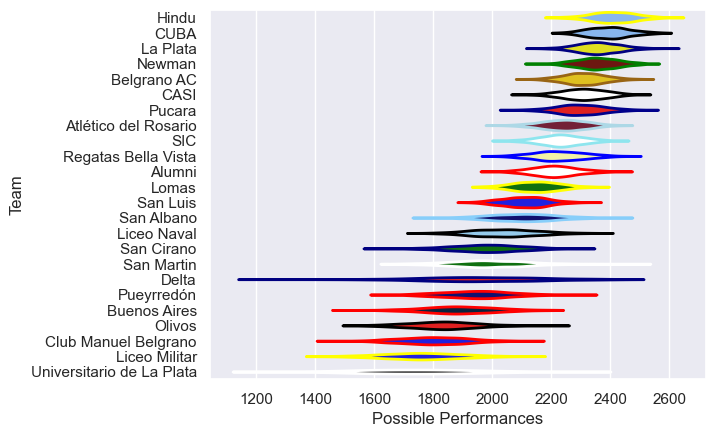

---  
title: "URBA Top 13 2014"  
date: 2025-07-29 6:00:00 -0500  
categories: model review projection  
layout: article  
aside:  
    toc: true  
---
# Current Team Rankings

# Standings

## Current Standings

| Club                      |   Played |   Wins |   Point Differential |   Losing Bonus Points | Try Bonus Points   |   Competition Points |
|:--------------------------|---------:|-------:|---------------------:|----------------------:|:-------------------|---------------------:|
| Hindu                     |       22 |     19 |                  344 |                     0 |                    |                   78 |
| CUBA                      |       23 |     18 |                  269 |                     1 |                    |                   77 |
| La Plata                  |       21 |     16 |                  146 |                     1 |                    |                   67 |
| Pucara                    |       21 |     15 |                  296 |                     4 |                    |                   64 |
| Newman                    |       21 |     14 |                  266 |                     4 |                    |                   60 |
| Belgrano AC               |       22 |     13 |                  129 |                     6 |                    |                   60 |
| CASI                      |       20 |     13 |                  195 |                     5 |                    |                   57 |
| Atlético del Rosario      |       20 |     11 |                   46 |                     7 |                    |                   51 |
| SIC                       |       20 |     10 |                   59 |                     4 |                    |                   44 |
| Alumni                    |       20 |      7 |                   10 |                     9 |                    |                   37 |
| San Luis                  |       20 |      8 |                  -76 |                     4 |                    |                   36 |
| Regatas Bella Vista       |       20 |      7 |                  -87 |                     4 |                    |                   32 |
| Lomas                     |       20 |      6 |                 -189 |                     4 |                    |                   28 |
| Pueyrredón                |       20 |      4 |                 -269 |                     3 |                    |                   21 |
| San Albano                |        7 |      3 |                  -30 |                     0 |                    |                   14 |
| Delta                     |        7 |      3 |                  -45 |                     1 |                    |                   13 |
| Liceo Naval               |        7 |      2 |                  -39 |                     1 |                    |                   11 |
| San Martin                |        7 |      2 |                  -39 |                     2 |                    |                   10 |
| Universitario de La Plata |        7 |      2 |                  -55 |                     2 |                    |                   10 |
| Buenos Aires              |        7 |      2 |                 -102 |                     0 |                    |                    8 |
| San Cirano                |        7 |      1 |                 -155 |                     1 |                    |                    5 |
| Olivos                    |        7 |      0 |                 -115 |                     3 |                    |                    3 |
| Liceo Militar             |        7 |      0 |                 -268 |                     1 |                    |                    1 |
| Club Manuel Belgrano      |        7 |      0 |                 -291 |                     1 |                    |                    1 |

# Completed Match Review

| Model | Percent Correct Predictions | Spread Error |
| ------ | ------ | ------ |
| Club Level | 71.7% | 12.6 |
| Player Level: Lineup | nan% | nan |
| Player Level: Minutes | nan% | nan |

