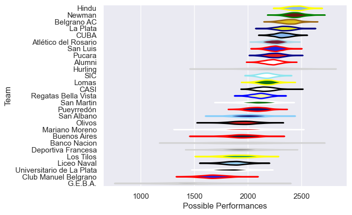

---  
title: "URBA Top 13 2015"  
date: 2025-07-29 6:00:00 -0500  
categories: model review projection  
layout: article  
aside:  
    toc: true  
---
# Current Team Rankings

# Standings

## Current Standings

| Club                      |   Played |   Wins |   Point Differential |   Losing Bonus Points | Try Bonus Points   |   Competition Points |
|:--------------------------|---------:|-------:|---------------------:|----------------------:|:-------------------|---------------------:|
| Atlético del Rosario      |       23 |     16 |                  148 |                     3 |                    |                   69 |
| San Luis                  |       22 |     14 |                  150 |                     4 |                    |                   62 |
| Alumni                    |       22 |     12 |                  119 |                     4 |                    |                   56 |
| Hindu                     |       15 |     13 |                  231 |                     1 |                    |                   53 |
| Newman                    |       14 |     11 |                  172 |                     2 |                    |                   48 |
| Lomas                     |       22 |     10 |                   85 |                     8 |                    |                   48 |
| Regatas Bella Vista       |       22 |     10 |                  -36 |                     4 |                    |                   46 |
| CUBA                      |       16 |     11 |                    4 |                     1 |                    |                   45 |
| SIC                       |       22 |     10 |                   20 |                     4 |                    |                   44 |
| Belgrano AC               |       15 |      9 |                  138 |                     2 |                    |                   42 |
| Pueyrredón                |       22 |     10 |                  -50 |                     2 |                    |                   42 |
| La Plata                  |       14 |      9 |                   59 |                     3 |                    |                   39 |
| San Martin                |        9 |      7 |                   96 |                     1 |                    |                   29 |
| Pucara                    |       13 |      4 |                  -19 |                     2 |                    |                   20 |
| Mariano Moreno            |        9 |      4 |                   13 |                     2 |                    |                   18 |
| Buenos Aires              |        9 |      4 |                  -22 |                     2 |                    |                   18 |
| CASI                      |       13 |      4 |                 -164 |                     2 |                    |                   18 |
| San Albano                |        9 |      4 |                  -32 |                     0 |                    |                   16 |
| Los Tilos                 |        9 |      3 |                    7 |                     2 |                    |                   14 |
| Olivos                    |        9 |      1 |                  -19 |                     5 |                    |                   13 |
| Liceo Naval               |        9 |      3 |                  -49 |                     1 |                    |                   13 |
| Universitario de La Plata |        9 |      3 |                 -124 |                     1 |                    |                   13 |
| Hurling                   |        7 |      1 |                 -104 |                     2 |                    |                    6 |
| Banco Nacion              |        8 |      1 |                 -137 |                     0 |                    |                    6 |
| Deportiva Francesa        |        7 |      1 |                  -96 |                     0 |                    |                    4 |
| G.E.B.A.                  |        7 |      1 |                 -198 |                     0 |                    |                    4 |
| Club Manuel Belgrano      |        8 |      0 |                 -192 |                     1 |                    |                    1 |

# Completed Match Review

| Model | Percent Correct Predictions | Spread Error |
| ------ | ------ | ------ |
| Club Level | 70.9% | 12.4 |
| Player Level: Lineup | nan% | nan |
| Player Level: Minutes | nan% | nan |

