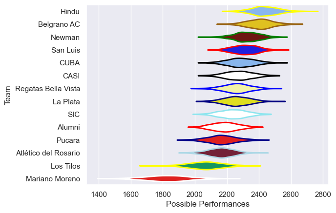

---  
title: "URBA Top 13 2016 Status"  
date: 2025-07-28 6:00:00 -0500  
categories: model review projection  
layout: article  
aside:  
    toc: true  
---
# Current Team Rankings

# Standings

## Current Standings

| Club                 |   Played |   Wins |   Point Differential |   Losing Bonus Points | Try Bonus Points   |   Competition Points |
|:---------------------|---------:|-------:|---------------------:|----------------------:|:-------------------|---------------------:|
| Hindu                |       15 |     13 |                  113 |                     0 |                    |                   54 |
| Belgrano AC          |       15 |     13 |                  220 |                     1 |                    |                   53 |
| San Luis             |       15 |     10 |                   51 |                     3 |                    |                   43 |
| Newman               |       15 |     10 |                   61 |                     2 |                    |                   42 |
| Regatas Bella Vista  |       14 |      8 |                   97 |                     4 |                    |                   36 |
| SIC                  |       14 |      8 |                   39 |                     2 |                    |                   36 |
| CASI                 |       13 |      7 |                   58 |                     4 |                    |                   32 |
| CUBA                 |       13 |      7 |                   44 |                     3 |                    |                   31 |
| Alumni               |       13 |      4 |                   -6 |                     5 |                    |                   23 |
| La Plata             |       13 |      3 |                  -42 |                     3 |                    |                   19 |
| Pucara               |       13 |      4 |                  -41 |                     2 |                    |                   18 |
| Atlético del Rosario |       13 |      4 |                 -122 |                     1 |                    |                   17 |
| Los Tilos            |       13 |      2 |                 -157 |                     3 |                    |                   13 |
| Mariano Moreno       |       13 |      0 |                 -315 |                     0 |                    |                    0 |

# Completed Match Review

| Model | Percent Correct Predictions | Spread Error |
| ------ | ------ | ------ |
| Club Level | 75.0% | 11.3 |
| Player Level: Lineup | nan% | nan |
| Player Level: Minutes | nan% | nan |

