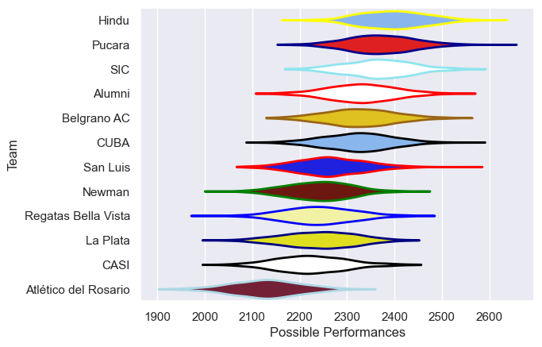

---  
title: "URBA Top 13 2017"  
date: 2025-07-29 6:00:00 -0500  
categories: model review projection  
layout: article  
aside:  
    toc: true  
---
# Current Team Rankings

# Standings

## Current Standings

| Club                 |   Played |   Wins |   Point Differential |   Losing Bonus Points | Try Bonus Points   |   Competition Points |
|:---------------------|---------:|-------:|---------------------:|----------------------:|:-------------------|---------------------:|
| Alumni               |       24 |     15 |                  108 |                     3 |                    |                   67 |
| Hindu                |       24 |     16 |                   82 |                     2 |                    |                   66 |
| SIC                  |       23 |     14 |                  177 |                     6 |                    |                   64 |
| Pucara               |       23 |     14 |                  122 |                     6 |                    |                   64 |
| CUBA                 |       22 |     13 |                  126 |                     2 |                    |                   56 |
| Belgrano AC          |       22 |     12 |                  -28 |                     2 |                    |                   52 |
| Newman               |       22 |     10 |                  -20 |                     7 |                    |                   49 |
| San Luis             |       22 |      9 |                   13 |                     4 |                    |                   44 |
| CASI                 |       21 |      8 |                  -62 |                     7 |                    |                   39 |
| Regatas Bella Vista  |       22 |      7 |                  -88 |                     6 |                    |                   38 |
| La Plata             |       22 |      7 |                 -159 |                     7 |                    |                   35 |
| Atlético del Rosario |       21 |      3 |                 -271 |                     4 |                    |                   18 |

# Completed Match Review

| Model | Percent Correct Predictions | Spread Error |
| ------ | ------ | ------ |
| Club Level | 59.0% | 12.4 |
| Player Level: Lineup | nan% | nan |
| Player Level: Minutes | nan% | nan |

