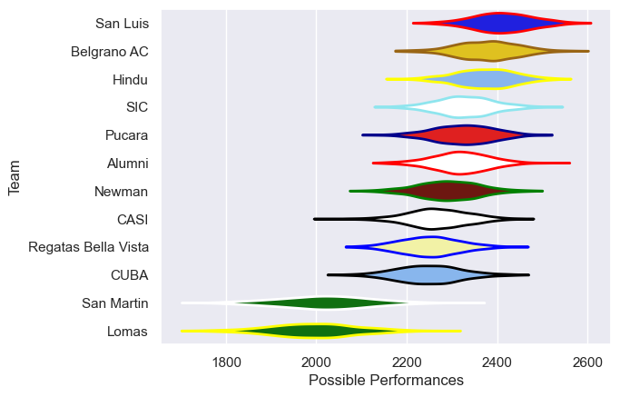

---  
title: "URBA Top 13 2018 Status"  
date: 2025-07-28 6:00:00 -0500  
categories: model review projection  
layout: article  
aside:  
    toc: true  
---
# Current Team Rankings

# Standings

## Current Standings

| Club                |   Played |   Wins |   Point Differential |   Losing Bonus Points | Try Bonus Points   |   Competition Points |
|:--------------------|---------:|-------:|---------------------:|----------------------:|:-------------------|---------------------:|
| San Luis            |       23 |     18 |                  193 |                     2 |                    |                   74 |
| Alumni              |       24 |     17 |                  146 |                     2 |                    |                   72 |
| Belgrano AC         |       23 |     15 |                  224 |                     6 |                    |                   66 |
| Hindu               |       24 |     15 |                   98 |                     3 |                    |                   65 |
| SIC                 |       22 |     13 |                  134 |                     6 |                    |                   58 |
| Pucara              |       22 |     13 |                  153 |                     3 |                    |                   57 |
| CASI                |       22 |     11 |                   59 |                     6 |                    |                   50 |
| Newman              |       22 |     10 |                   36 |                     6 |                    |                   48 |
| Regatas Bella Vista |       22 |      8 |                  -50 |                     5 |                    |                   41 |
| CUBA                |       22 |      7 |                  -18 |                     8 |                    |                   36 |
| San Martin          |       22 |      4 |                 -465 |                     4 |                    |                   20 |
| Lomas               |       22 |      1 |                 -510 |                     4 |                    |                    8 |

# Completed Match Review

| Model | Percent Correct Predictions | Spread Error |
| ------ | ------ | ------ |
| Club Level | 63.0% | 13.7 |
| Player Level: Lineup | nan% | nan |
| Player Level: Minutes | nan% | nan |

