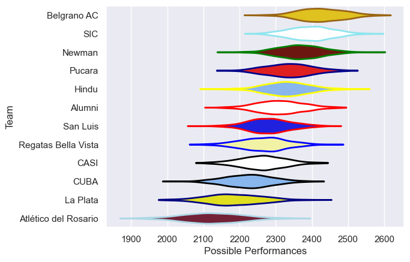

---  
title: "URBA Top 13 2019"  
date: 2025-07-29 6:00:00 -0500  
categories: model review projection  
layout: article  
aside:  
    toc: true  
---
# Current Team Rankings

# Standings

## Current Standings

| Club                 |   Played |   Wins |   Point Differential |   Losing Bonus Points | Try Bonus Points   |   Competition Points |
|:---------------------|---------:|-------:|---------------------:|----------------------:|:-------------------|---------------------:|
| SIC                  |       24 |     19 |                  222 |                     4 |                    |                   80 |
| Belgrano AC          |       24 |     15 |                  236 |                     5 |                    |                   69 |
| Hindu                |       23 |     15 |                   74 |                     3 |                    |                   65 |
| Pucara               |       23 |     13 |                  105 |                     8 |                    |                   62 |
| Newman               |       22 |     13 |                  201 |                     2 |                    |                   58 |
| Alumni               |       22 |     12 |                   44 |                     1 |                    |                   51 |
| Regatas Bella Vista  |       22 |      9 |                 -112 |                     6 |                    |                   42 |
| San Luis             |       22 |      7 |                  -60 |                    11 |                    |                   41 |
| CASI                 |       22 |      9 |                 -143 |                     3 |                    |                   39 |
| CUBA                 |       22 |      7 |                 -104 |                     5 |                    |                   35 |
| La Plata             |       22 |      7 |                 -156 |                     6 |                    |                   34 |
| Atlético del Rosario |       22 |      4 |                 -307 |                     3 |                    |                   21 |

# Completed Match Review

| Model | Percent Correct Predictions | Spread Error |
| ------ | ------ | ------ |
| Club Level | 61.5% | 12.2 |
| Player Level: Lineup | nan% | nan |
| Player Level: Minutes | nan% | nan |

