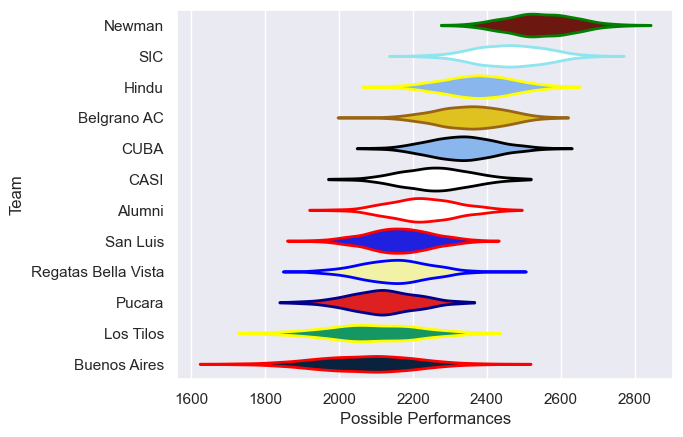

---  
title: "URBA Top 13 2021"  
date: 2025-07-29 6:00:00 -0500  
categories: model review projection  
layout: article  
aside:  
    toc: true  
---
# Current Team Rankings

# Standings

## Current Standings

| Club                |   Played |   Wins |   Point Differential |   Losing Bonus Points | Try Bonus Points   |   Competition Points |
|:--------------------|---------:|-------:|---------------------:|----------------------:|:-------------------|---------------------:|
| SIC                 |       18 |     14 |                  262 |                     3 |                    |                   61 |
| Newman              |       17 |     14 |                  329 |                     3 |                    |                   59 |
| CUBA                |       18 |     14 |                  108 |                     2 |                    |                   58 |
| Hindu               |       17 |     12 |                  183 |                     0 |                    |                   50 |
| Belgrano AC         |       16 |     11 |                  110 |                     1 |                    |                   45 |
| Alumni              |       16 |      8 |                  -59 |                     2 |                    |                   34 |
| Pucara              |       16 |      7 |                 -102 |                     1 |                    |                   31 |
| CASI                |       16 |      5 |                  -49 |                     6 |                    |                   26 |
| Regatas Bella Vista |       16 |      4 |                 -177 |                     4 |                    |                   20 |
| Los Tilos           |       16 |      4 |                 -227 |                     4 |                    |                   20 |
| San Luis            |       16 |      2 |                 -151 |                     5 |                    |                   15 |
| Buenos Aires        |       16 |      2 |                 -227 |                     2 |                    |                   10 |

# Completed Match Review

| Model | Percent Correct Predictions | Spread Error |
| ------ | ------ | ------ |
| Club Level | 79.8% | 12.0 |
| Player Level: Lineup | nan% | nan |
| Player Level: Minutes | nan% | nan |

