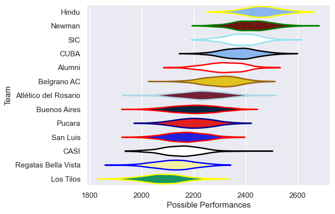

---  
title: "URBA Top 13 2022"  
date: 2025-07-29 6:00:00 -0500  
categories: model review projection  
layout: article  
aside:  
    toc: true  
---
# Current Team Rankings

# Standings

## Current Standings

| Club                 |   Played |   Wins |   Point Differential |   Losing Bonus Points |   Try Bonus Points |   Competition Points |
|:---------------------|---------:|-------:|---------------------:|----------------------:|-------------------:|---------------------:|
| Hindu                |       26 |     24 |                  293 |                     1 |                 20 |                  117 |
| Newman               |       25 |     18 |                  259 |                     3 |                 12 |                   89 |
| SIC                  |       26 |     18 |                  172 |                     6 |                 11 |                   89 |
| CUBA                 |       25 |     16 |                  122 |                     2 |                 12 |                   78 |
| Alumni               |       24 |     15 |                  125 |                     3 |                  9 |                   74 |
| Atlético del Rosario |       24 |     10 |                    7 |                     6 |                 10 |                   62 |
| Belgrano AC          |       24 |     11 |                  144 |                     5 |                 10 |                   61 |
| Buenos Aires         |       24 |      9 |                  -96 |                     6 |                  5 |                   49 |
| CASI                 |       24 |      8 |                 -170 |                     4 |                  7 |                   45 |
| Pucara               |       24 |      6 |                 -168 |                     6 |                  5 |                   39 |
| San Luis             |       24 |      8 |                 -170 |                     4 |                  3 |                   39 |
| Regatas Bella Vista  |       24 |      7 |                 -175 |                     5 |                  4 |                   37 |
| Los Tilos            |       24 |      4 |                 -343 |                     7 |                  5 |                   28 |

# Completed Match Review

| Model | Percent Correct Predictions | Spread Error |
| ------ | ------ | ------ |
| Club Level | 66.7% | 11.0 |
| Player Level: Lineup | nan% | nan |
| Player Level: Minutes | nan% | nan |

