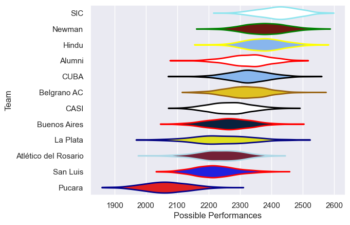

---  
title: "URBA Top 13 2023"  
date: 2025-07-29 6:00:00 -0500  
categories: model review projection  
layout: article  
aside:  
    toc: true  
---
# Current Team Rankings

# Standings

## Current Standings

| Club                 |   Played |   Wins |   Point Differential |   Losing Bonus Points |   Try Bonus Points |   Competition Points |
|:---------------------|---------:|-------:|---------------------:|----------------------:|-------------------:|---------------------:|
| Newman               |       14 |     12 |                  115 |                     1 |                  4 |                   53 |
| Alumni               |       14 |     11 |                   47 |                     2 |                    |                   46 |
| SIC                  |       14 |      9 |                  182 |                     3 |                  3 |                   44 |
| Belgrano AC          |       14 |      9 |                   56 |                     1 |                  2 |                   43 |
| Hindu                |       14 |      8 |                  108 |                     4 |                  2 |                   38 |
| CUBA                 |       14 |      7 |                  102 |                     5 |                  3 |                   38 |
| CASI                 |       14 |      7 |                  -28 |                     1 |                  1 |                   32 |
| Buenos Aires         |       14 |      6 |                   -7 |                     3 |                  1 |                   30 |
| Atlético del Rosario |       14 |      5 |                  -81 |                     2 |                  3 |                   25 |
| La Plata             |       14 |      3 |                  -76 |                     7 |                  1 |                   20 |
| San Luis             |       14 |      4 |                  -71 |                     2 |                  1 |                   19 |
| Pucara               |       14 |      0 |                 -347 |                     2 |                  1 |                    3 |

## Projected Remaining Table

| Club                 |   To Play |   Projected Wins |   Projected Differential |   Projected Losing Bonus Points | Projected Try Bonus Points   |   Projected Competition Points |
|:---------------------|----------:|-----------------:|-------------------------:|--------------------------------:|:-----------------------------|-------------------------------:|
| SIC                  |         8 |            5.043 |                   35.585 |                           1.536 |                              |                         22.396 |
| Newman               |         8 |            4.635 |                   21.42  |                           1.644 |                              |                         20.932 |
| Hindu                |         8 |            4.525 |                   17.49  |                           1.734 |                              |                         20.612 |
| Alumni               |         8 |            4.457 |                   20.117 |                           1.818 |                              |                         20.428 |
| Belgrano AC          |         8 |            4.088 |                    9.797 |                           2.059 |                              |                         19.245 |
| CUBA                 |         8 |            3.893 |                    3.026 |                           2.136 |                              |                         18.566 |
| Buenos Aires         |         8 |            3.848 |                   -1.436 |                           1.855 |                              |                         17.983 |
| Atlético del Rosario |         8 |            3.565 |                   -7.261 |                           1.732 |                              |                         16.684 |
| CASI                 |         8 |            3.223 |                  -11.857 |                           2.297 |                              |                         16.011 |
| La Plata             |         8 |            3.304 |                  -13.848 |                           2.017 |                              |                         15.973 |
| San Luis             |         8 |            3.142 |                  -15.937 |                           2.154 |                              |                         15.534 |
| Pucara               |         8 |            2.009 |                  -57.096 |                           1.777 |                              |                         10.395 |

## Projected Total Table

| Club                 |   Played |   Wins |   Point Differential |   Losing Bonus Points |   Try Bonus Points |   Competition Points |
|:---------------------|---------:|-------:|---------------------:|----------------------:|-------------------:|---------------------:|
| Newman               |       22 | 16.635 |              136.42  |                 2.644 |                  4 |               73.932 |
| Alumni               |       22 | 15.457 |               67.117 |                 3.818 |                    |               66.428 |
| SIC                  |       22 | 14.043 |              217.585 |                 4.536 |                  3 |               66.396 |
| Belgrano AC          |       22 | 13.088 |               65.797 |                 3.059 |                  2 |               62.245 |
| Hindu                |       22 | 12.525 |              125.49  |                 5.734 |                  2 |               58.612 |
| CUBA                 |       22 | 10.893 |              105.026 |                 7.136 |                  3 |               56.566 |
| CASI                 |       22 | 10.223 |              -39.857 |                 3.297 |                  1 |               48.011 |
| Buenos Aires         |       22 |  9.848 |               -8.436 |                 4.855 |                  1 |               47.983 |
| Atlético del Rosario |       22 |  8.565 |              -88.261 |                 3.732 |                  3 |               41.684 |
| La Plata             |       22 |  6.304 |              -89.848 |                 9.017 |                  1 |               35.973 |
| San Luis             |       22 |  7.142 |              -86.937 |                 4.154 |                  1 |               34.534 |
| Pucara               |       22 |  2.009 |             -404.096 |                 3.777 |                  1 |               13.395 |

# Completed Match Review

| Model | Percent Correct Predictions | Spread Error |
| ------ | ------ | ------ |
| Club Level | 69.7% | 8.0 |
| Player Level: Lineup | nan% | nan |
| Player Level: Minutes | nan% | nan |

# Future Predictions

## Week 15

### SIC V Newman on 2023/08/12

Average Margin: SIC by 3.7

### La Plata V CUBA on 2023/08/12

Average Margin: CUBA by 0.5

### Alumni V San Luis on 2023/08/12

Average Margin: Alumni by 6.1

### Atlético del Rosario V Pucara on 2023/08/12

Average Margin: Atlético del Rosario by 8.3

### Buenos Aires V Belgrano AC on 2023/08/12

Average Margin: Buenos Aires by 0.1

### Hindu V CASI on 2023/08/12

Average Margin: Hindu by 6.2

## Week 16

### San Luis V Hindu on 2023/08/19

Average Margin: Hindu by 2.6

### CASI V Atlético del Rosario on 2023/08/19

Average Margin: CASI by 2.6

### Pucara V La Plata on 2023/08/19

Average Margin: La Plata by 3.0

### CUBA V SIC on 2023/08/19

Average Margin: SIC by 0.3

### Belgrano AC V Alumni on 2023/08/19

Average Margin: Belgrano AC by 1.5

### Newman V Buenos Aires on 2023/08/19

Average Margin: Newman by 5.9

## Week 17

### SIC V Pucara on 2023/08/26

Average Margin: SIC by 11.9

### Buenos Aires V CUBA on 2023/08/26

Average Margin: CUBA by 0.0

### San Luis V Belgrano AC on 2023/08/26

Average Margin: Belgrano AC by 0.6

### Alumni V Newman on 2023/08/26

Average Margin: Alumni by 1.1

### Hindu V Atlético del Rosario on 2023/08/26

Average Margin: Hindu by 7.0

### La Plata V CASI on 2023/08/26

Average Margin: La Plata by 1.3

## Week 18

### Pucara V Buenos Aires on 2023/09/02

Average Margin: Buenos Aires by 4.6

### CASI V SIC on 2023/09/02

Average Margin: SIC by 2.5

### Atlético del Rosario V La Plata on 2023/09/02

Average Margin: Atlético del Rosario by 2.9

### Newman V San Luis on 2023/09/02

Average Margin: Newman by 7.0

### CUBA V Alumni on 2023/09/02

Average Margin: CUBA by 2.1

### Belgrano AC V Hindu on 2023/09/02

Average Margin: Belgrano AC by 0.9

## Week 19

### Alumni V Pucara on 2023/09/16

Average Margin: Alumni by 10.0

### Buenos Aires V CASI on 2023/09/16

Average Margin: Buenos Aires by 2.6

### Belgrano AC V Newman on 2023/09/16

Average Margin: Belgrano AC by 0.2

### San Luis V CUBA on 2023/09/16

Average Margin: CUBA by 1.1

### Hindu V La Plata on 2023/09/16

Average Margin: Hindu by 6.5

### SIC V Atlético del Rosario on 2023/09/16

Average Margin: SIC by 7.9

## Week 20

### La Plata V SIC on 2023/09/23

Average Margin: SIC by 4.0

### CUBA V Belgrano AC on 2023/09/23

Average Margin: CUBA by 2.6

### Newman V Hindu on 2023/09/23

Average Margin: Newman by 3.0

### Pucara V San Luis on 2023/09/23

Average Margin: San Luis by 3.2

### Atlético del Rosario V Buenos Aires on 2023/09/23

Average Margin: Atlético del Rosario by 1.3

### CASI V Alumni on 2023/09/23

Average Margin: Alumni by 0.5

## Week 21

### Newman V CUBA on 2023/09/30

Average Margin: Newman by 4.0

### Buenos Aires V La Plata on 2023/09/30

Average Margin: Buenos Aires by 3.8

### Alumni V Atlético del Rosario on 2023/09/30

Average Margin: Alumni by 5.5

### San Luis V CASI on 2023/09/30

Average Margin: San Luis by 1.6

### Belgrano AC V Pucara on 2023/09/30

Average Margin: Belgrano AC by 9.5

### Hindu V SIC on 2023/09/30

Average Margin: Hindu by 0.1

## Week 22

### CUBA V Hindu on 2023/10/21

Average Margin: CUBA by 1.0

### SIC V Buenos Aires on 2023/10/21

Average Margin: SIC by 5.4

### Atlético del Rosario V San Luis on 2023/10/21

Average Margin: Atlético del Rosario by 3.1

### CASI V Belgrano AC on 2023/10/21

Average Margin: CASI by 0.4

### La Plata V Alumni on 2023/10/21

Average Margin: Alumni by 0.4

### Pucara V Newman on 2023/10/21

Average Margin: Newman by 6.5

