---  
title: "URBA Top 13 2023 Status"  
date: 2023-10-20 6:00:00 -0500  
categories: model review projection  
layout: article  
aside:  
    toc: true  
---
# Current Team Rankings

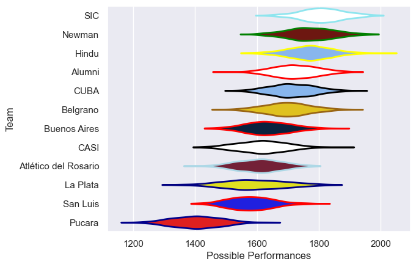
# Standings

## Current Standings

| Club                 |   Played |   Wins |   Point Differential |   Losing Bonus Points |   Try Bonus Points |   Competition Points |
|:---------------------|---------:|-------:|---------------------:|----------------------:|-------------------:|---------------------:|
| SIC                  |        5 |      5 |                  117 |                     0 |                nan |                   23 |
| Newman               |        4 |      4 |                   55 |                     0 |                  4 |                   20 |
| Alumni               |        5 |      4 |                    8 |                     0 |                  0 |                   16 |
| Hindu                |        5 |      3 |                   48 |                     1 |                nan |                   15 |
| CUBA                 |        4 |      2 |                   26 |                     1 |                  3 |                   12 |
| Belgrano             |        5 |      2 |                  -30 |                     0 |                  2 |                   12 |
| CASI                 |        4 |      2 |                   18 |                     0 |                  1 |                   11 |
| San Luis             |        4 |      2 |                  -33 |                     0 |                  1 |                    9 |
| Atlético del Rosario |        4 |      1 |                  -26 |                     1 |                  3 |                    8 |
| Buenos Aires         |        4 |      0 |                  -28 |                     2 |                  1 |                    3 |
| La Plata             |        4 |      0 |                  -40 |                     2 |                  1 |                    3 |
| Pucara               |        4 |      0 |                 -115 |                     0 |                  1 |                    1 |

## Projected Remaining Table

| Club                 |   Matches Remaining |   Wins |   Point Differential |   Losing Bonus Points |   Try Bonus Points |   Competition Points |
|:---------------------|--------------------:|-------:|---------------------:|----------------------:|-------------------:|---------------------:|
| Newman               |                   1 |    1   |                 14.5 |                   0   |                1   |                  5   |
| SIC                  |                   1 |    1   |                 11.9 |                   0   |                1   |                  4.9 |
| Atlético del Rosario |                   1 |    0.8 |                  4.4 |                   0.2 |                0.8 |                  4.2 |
| Alumni               |                   1 |    0.7 |                  2.7 |                   0.3 |                0.6 |                  3.6 |
| Belgrano             |                   1 |    0.6 |                  0.8 |                   0.4 |                0.5 |                  3.1 |
| CUBA                 |                   1 |    0.5 |                  0.3 |                   0.4 |                0.5 |                  2.9 |
| Hindu                |                   1 |    0.5 |                 -0.3 |                   0.4 |                0.4 |                  2.7 |
| CASI                 |                   1 |    0.4 |                 -0.8 |                   0.4 |                0.4 |                  2.6 |
| La Plata             |                   1 |    0.3 |                 -2.7 |                   0.4 |                0.3 |                  2   |
| San Luis             |                   1 |    0.2 |                 -4.4 |                   0.5 |                0.2 |                  1.4 |
| Buenos Aires         |                   1 |    0   |                -11.9 |                   0.2 |                0   |                  0.2 |
| Pucara               |                   1 |    0   |                -14.5 |                   0.1 |                0   |                  0.1 |

## Projected Total Table

| Club                 |   Total Matches |   Wins |   Point Differential |   Losing Bonus Points |   Try Bonus Points |   Competition Points |
|:---------------------|----------------:|-------:|---------------------:|----------------------:|-------------------:|---------------------:|
| SIC                  |               6 |    6   |                128.9 |                   0   |                1   |                 27.9 |
| Newman               |               5 |    5   |                 69.5 |                   0   |                5   |                 25   |
| Alumni               |               6 |    4.7 |                 10.7 |                   0.3 |                0.6 |                 19.6 |
| Hindu                |               6 |    3.5 |                 47.7 |                   1.4 |                0.4 |                 17.7 |
| Belgrano             |               6 |    2.6 |                -29.2 |                   0.4 |                2.5 |                 15.1 |
| CUBA                 |               5 |    2.5 |                 26.3 |                   1.4 |                3.5 |                 14.9 |
| CASI                 |               5 |    2.4 |                 17.2 |                   0.4 |                1.4 |                 13.6 |
| Atlético del Rosario |               5 |    1.8 |                -21.6 |                   1.2 |                3.8 |                 12.2 |
| San Luis             |               5 |    2.2 |                -37.4 |                   0.5 |                1.2 |                 10.4 |
| La Plata             |               5 |    0.3 |                -42.7 |                   2.4 |                1.3 |                  5   |
| Buenos Aires         |               5 |    0   |                -39.9 |                   2.2 |                1   |                  3.2 |
| Pucara               |               5 |    0   |               -129.5 |                   0.1 |                1   |                  1.1 |

# Completed Match Review

| Model | Percent Correct Predictions | Spread Error |
| ------ | ------ | ------ |
| Club Level | 61.5% | 10.8 |
| Player Level: Lineup | 60.0% | 12.9 |
| Player Level: Minutes | 64.0% | 13.1 |

# Future Predictions

## Week 6

### La Plata V Alumni on 2023/10/21

Average Margin: Alumni by 2.9

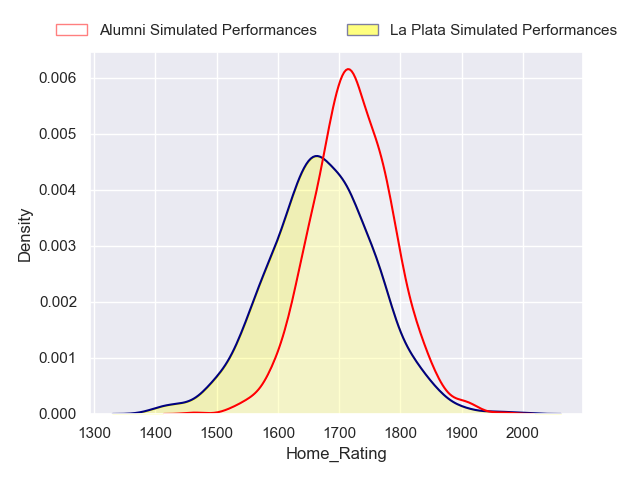
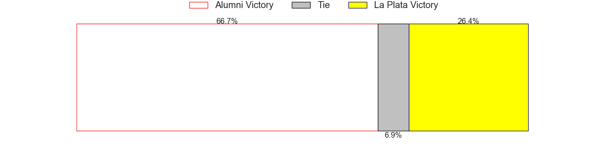
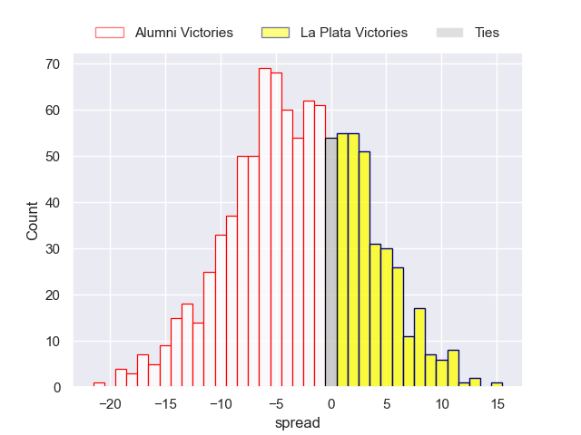

### SIC V Buenos Aires on 2023/10/21

Average Margin: SIC by 12.4

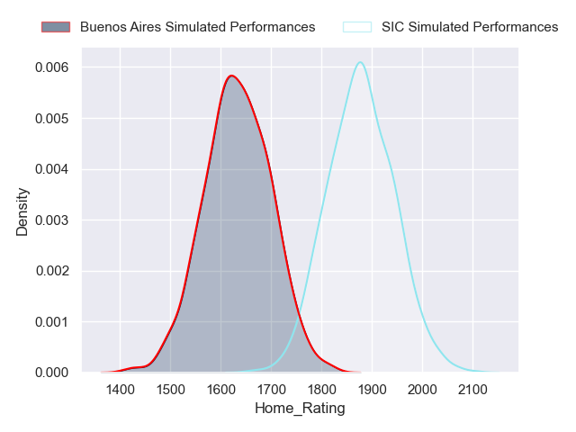
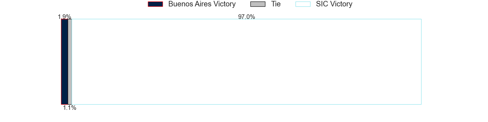
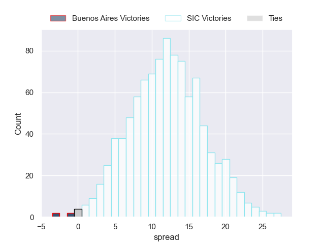

### Atlético del Rosario V San Luis on 2023/10/21

Average Margin: Atlético del Rosario by 4.7

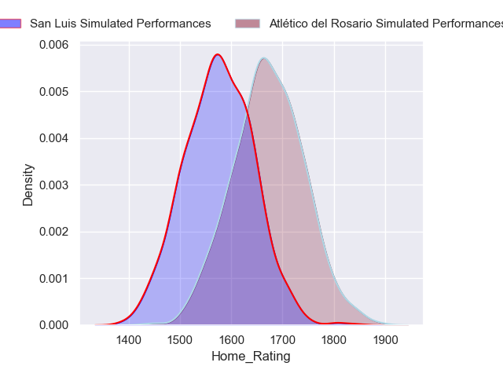
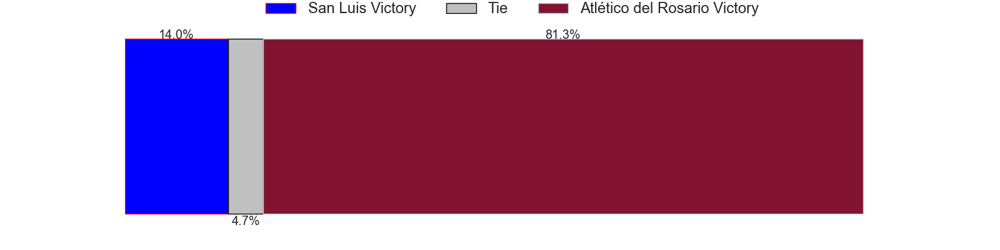
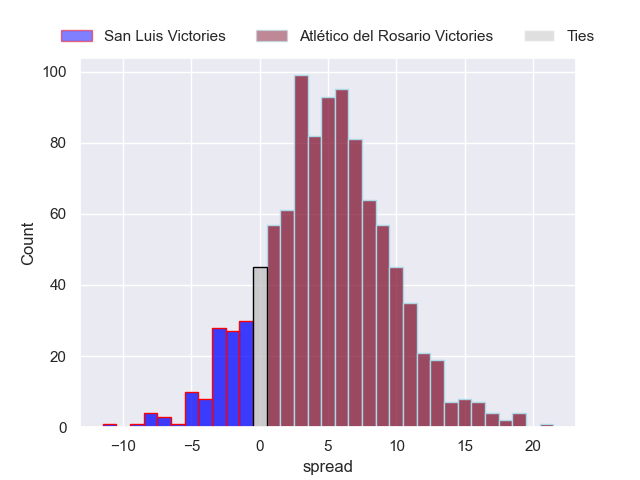

### CUBA V Hindu on 2023/10/21

Average Margin: CUBA by 0.3

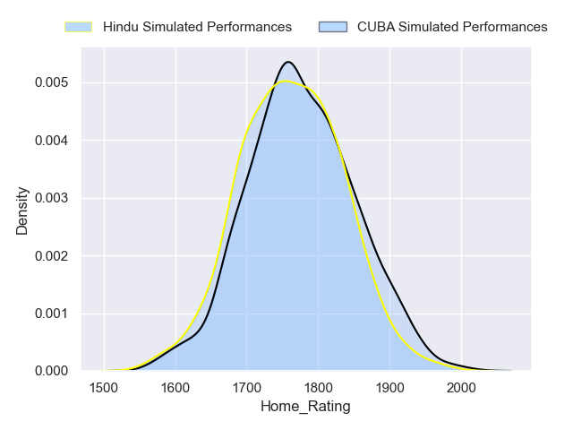

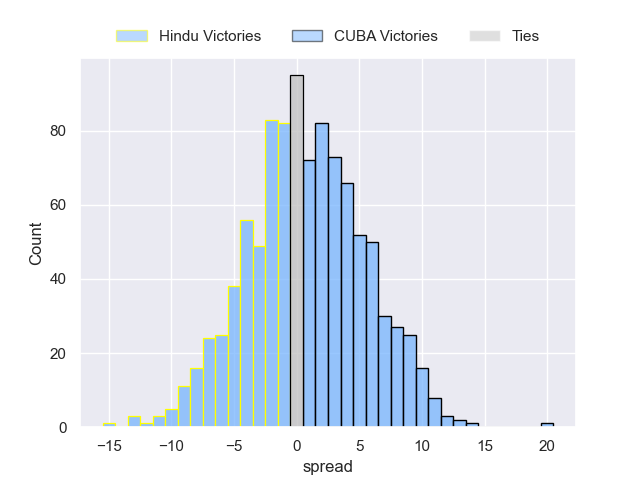

### Pucara V Newman on 2023/10/21

Average Margin: Newman by 15.0

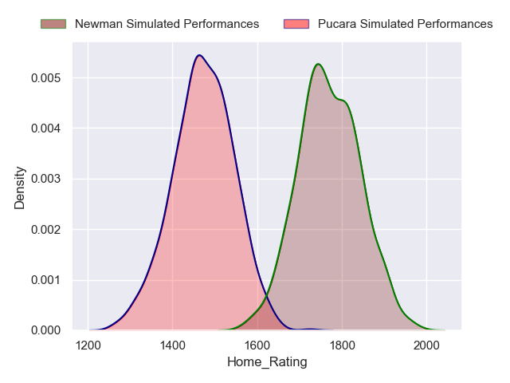
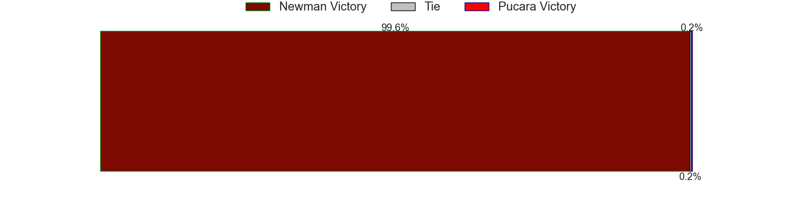
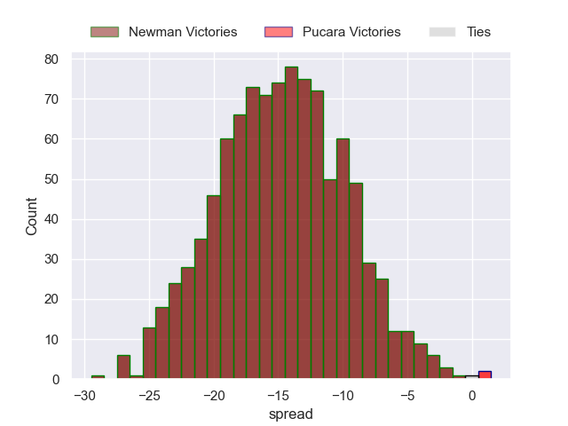

### CASI V Belgrano on 2023/10/21

Average Margin: Belgrano by 0.8

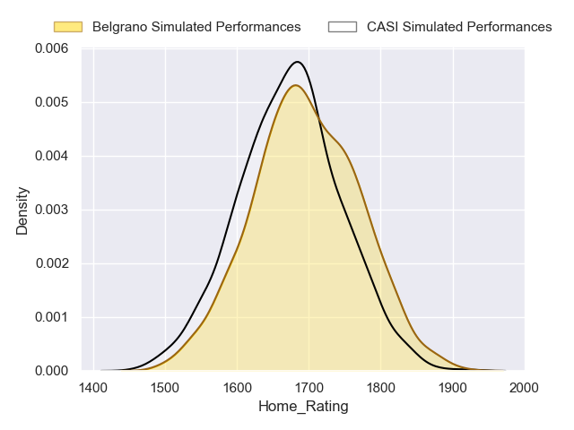

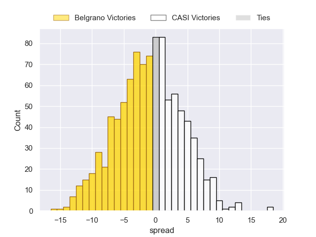

