---  
title: "URBA Top 13 2023 Status"  
date: 2023-09-30 6:00:00 -0500  
categories: model review projection  
layout: article  
aside:  
    toc: true  
---
# Current Team Rankings

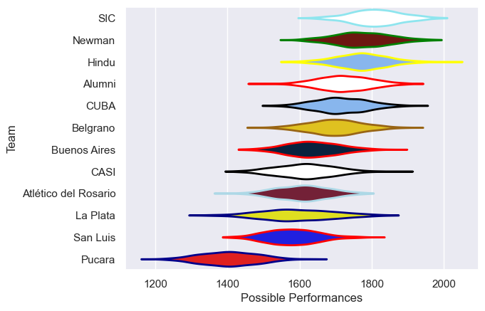
# Standings

## Current Standings

| Club                 |   Played |   Wins |   Point Differential |   Losing Bonus Points |   Try Bonus Points |   Competition Points |
|:---------------------|---------:|-------:|---------------------:|----------------------:|-------------------:|---------------------:|
| SIC                  |        5 |      5 |                  117 |                     0 |                nan |                   23 |
| Newman               |        4 |      4 |                   55 |                     0 |                  4 |                   20 |
| Alumni               |        5 |      4 |                    8 |                     0 |                  0 |                   16 |
| Hindu                |        5 |      3 |                   48 |                     1 |                nan |                   15 |
| CUBA                 |        4 |      2 |                   26 |                     1 |                  3 |                   12 |
| Belgrano             |        5 |      2 |                  -30 |                     0 |                  2 |                   12 |
| CASI                 |        4 |      2 |                   18 |                     0 |                  1 |                   11 |
| San Luis             |        4 |      2 |                  -33 |                     0 |                  1 |                    9 |
| Atlético del Rosario |        4 |      1 |                  -26 |                     1 |                  3 |                    8 |
| Buenos Aires         |        4 |      0 |                  -28 |                     2 |                  1 |                    3 |
| La Plata             |        4 |      0 |                  -40 |                     2 |                  1 |                    3 |
| Pucara               |        4 |      0 |                 -115 |                     0 |                  1 |                    1 |

## Projected Remaining Table

| Club                 |   Matches Remaining |   Wins |   Point Differential |   Losing Bonus Points |   Try Bonus Points |   Competition Points |
|:---------------------|--------------------:|-------:|---------------------:|----------------------:|-------------------:|---------------------:|
| Newman               |                   2 |    1.9 |                 20.5 |                   0.1 |                1.8 |                  9.4 |
| Alumni               |                   2 |    1.6 |                 11.6 |                   0.3 |                1.6 |                  8.4 |
| Belgrano             |                   2 |    1.6 |                 18.8 |                   0.4 |                1.6 |                  8.2 |
| SIC                  |                   2 |    1.4 |                 10.5 |                   0.5 |                1.3 |                  7.4 |
| Hindu                |                   2 |    1   |                  0.4 |                   0.8 |                0.9 |                  5.8 |
| CASI                 |                   2 |    0.8 |                 -2.7 |                   0.9 |                0.7 |                  4.8 |
| San Luis             |                   2 |    0.8 |                 -2.8 |                   0.8 |                0.7 |                  4.8 |
| Atlético del Rosario |                   2 |    0.9 |                 -4.2 |                   0.5 |                0.8 |                  4.7 |
| Buenos Aires         |                   2 |    0.8 |                 -6.5 |                   0.3 |                0.8 |                  4.4 |
| CUBA                 |                   2 |    0.7 |                 -5.2 |                   0.8 |                0.6 |                  4.1 |
| La Plata             |                   2 |    0.5 |                 -7.8 |                   0.9 |                0.5 |                  3.4 |
| Pucara               |                   2 |    0   |                -32.6 |                   0.1 |                0   |                  0.1 |

## Projected Total Table

| Club                 |   Total Matches |   Wins |   Point Differential |   Losing Bonus Points |   Try Bonus Points |   Competition Points |
|:---------------------|----------------:|-------:|---------------------:|----------------------:|-------------------:|---------------------:|
| SIC                  |               7 |    6.4 |                127.5 |                   0.5 |                1.3 |                 30.4 |
| Newman               |               6 |    5.9 |                 75.5 |                   0.1 |                5.8 |                 29.4 |
| Alumni               |               7 |    5.6 |                 19.6 |                   0.3 |                1.6 |                 24.4 |
| Hindu                |               7 |    4   |                 48.4 |                   1.8 |                0.9 |                 20.8 |
| Belgrano             |               7 |    3.6 |                -11.2 |                   0.4 |                3.6 |                 20.2 |
| CUBA                 |               6 |    2.7 |                 20.8 |                   1.8 |                3.6 |                 16.1 |
| CASI                 |               6 |    2.8 |                 15.3 |                   0.9 |                1.7 |                 15.8 |
| San Luis             |               6 |    2.8 |                -35.8 |                   0.8 |                1.7 |                 13.8 |
| Atlético del Rosario |               6 |    1.9 |                -30.2 |                   1.5 |                3.8 |                 12.7 |
| Buenos Aires         |               6 |    0.8 |                -34.5 |                   2.3 |                1.8 |                  7.4 |
| La Plata             |               6 |    0.5 |                -47.8 |                   2.9 |                1.5 |                  6.4 |
| Pucara               |               6 |    0   |               -147.6 |                   0.1 |                1   |                  1.1 |

# Completed Match Review

| Model | Percent Correct Predictions | Spread Error |
| ------ | ------ | ------ |
| Club Level | 61.5% | 10.8 |
| Player Level: Lineup | 60.0% | 12.9 |
| Player Level: Minutes | 64.0% | 13.1 |

# Future Predictions

## Week 6

### Newman V CUBA on 2023/09/30

Average Margin: Newman by 6.1

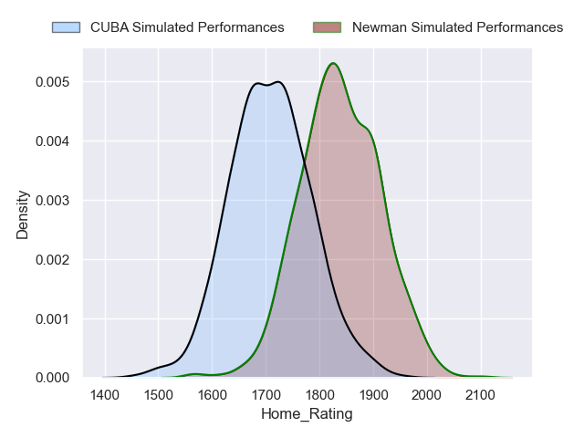

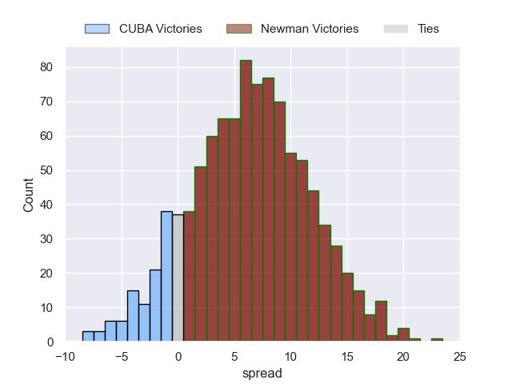

### Hindu V SIC on 2023/09/30

Average Margin: Hindu by 1.1

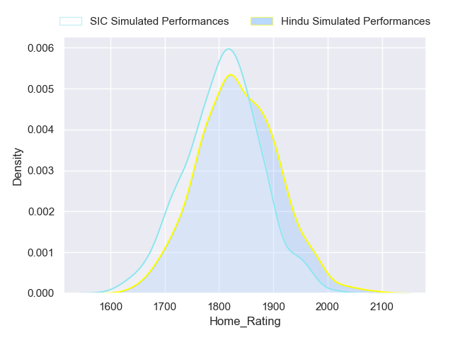

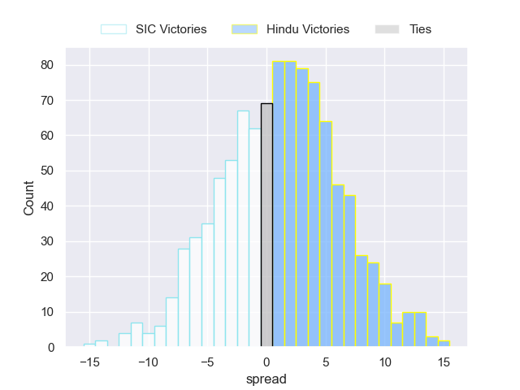

### Buenos Aires V La Plata on 2023/09/30

Average Margin: Buenos Aires by 5.2

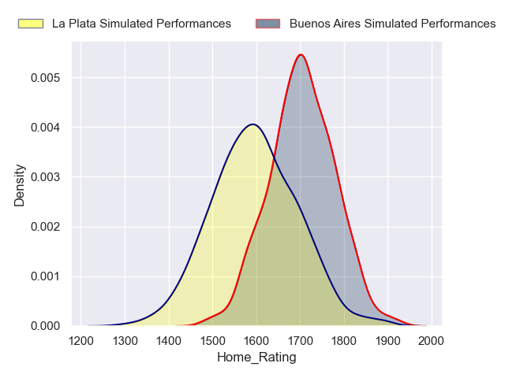

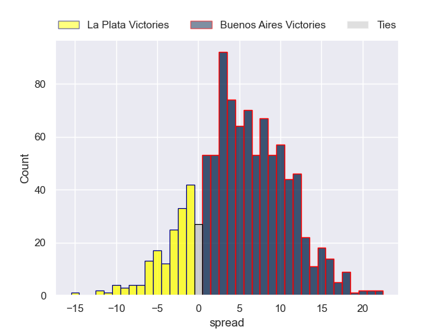

### Alumni V Atlético del Rosario on 2023/09/30

Average Margin: Alumni by 9.2

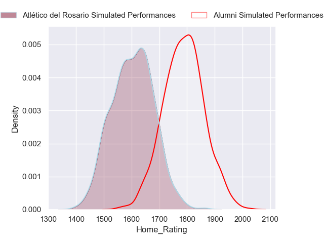
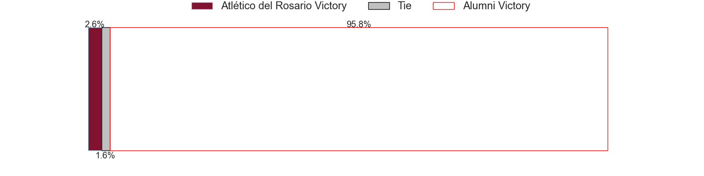
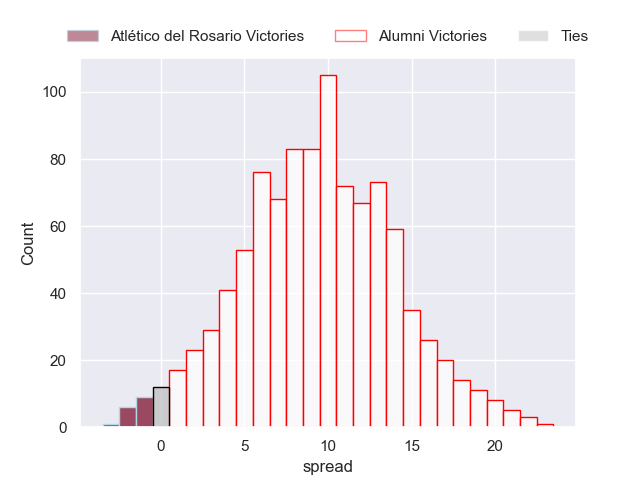

### San Luis V CASI on 2023/09/30

Average Margin: San Luis by 1.8

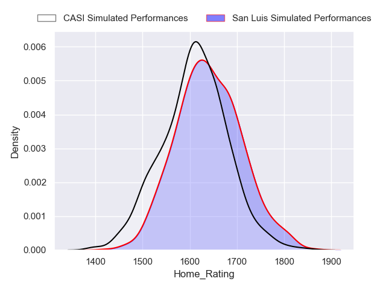
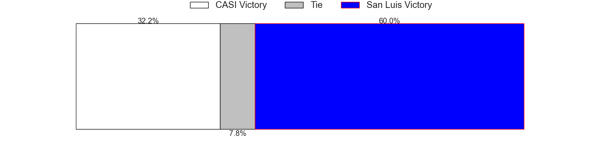
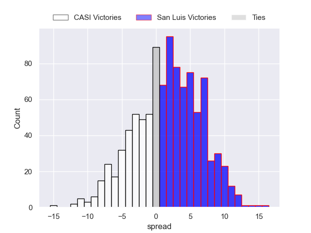

### Belgrano V Pucara on 2023/09/30

Average Margin: Belgrano by 18.3

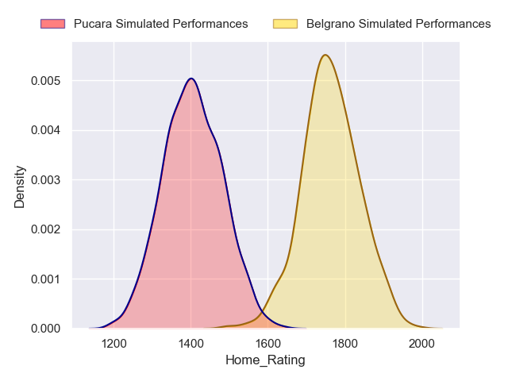
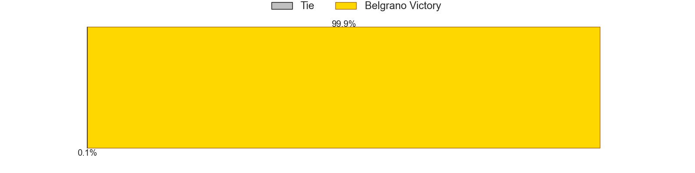
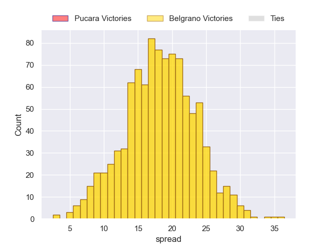

## Week 7

### Pucara V Newman on 2023/10/21

Average Margin: Newman by 14.8

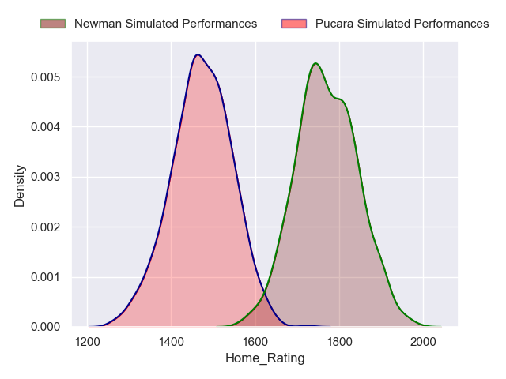

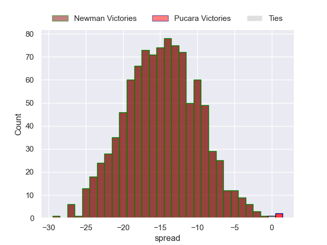

### CASI V Belgrano on 2023/10/21

Average Margin: Belgrano by 1.0

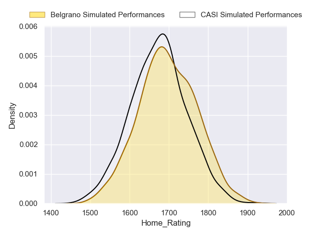

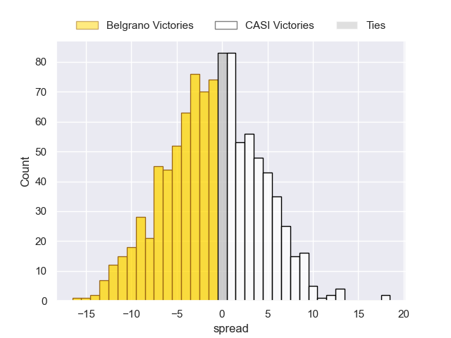

### Atlético del Rosario V San Luis on 2023/10/21

Average Margin: Atlético del Rosario by 4.8

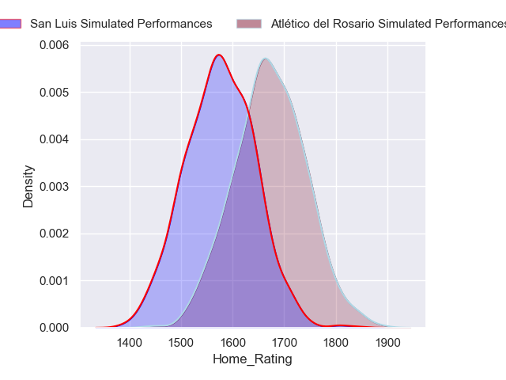
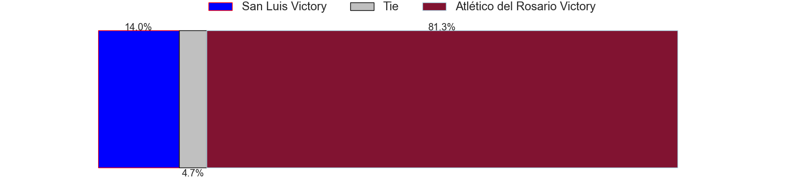
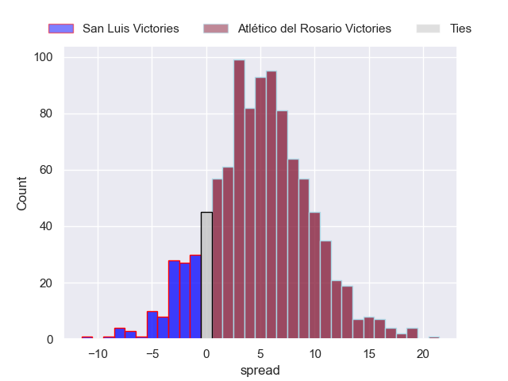

### La Plata V Alumni on 2023/10/21

Average Margin: Alumni by 2.9

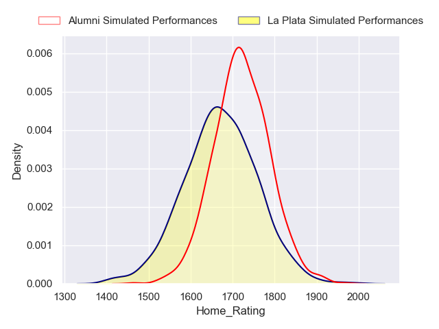
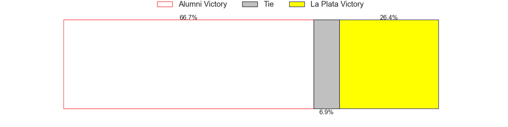
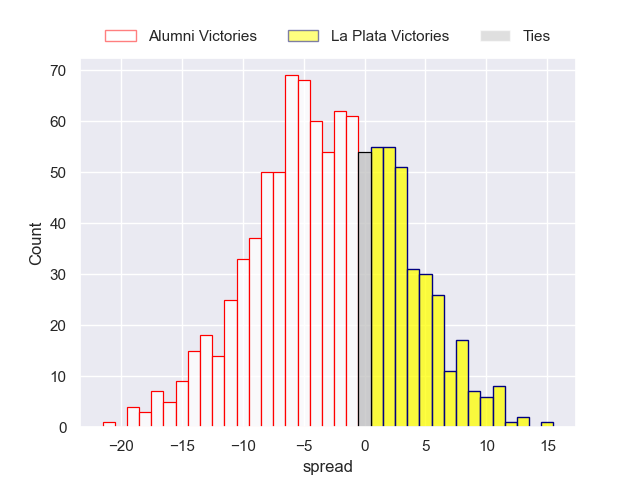

### SIC V Buenos Aires on 2023/10/21

Average Margin: SIC by 12.0

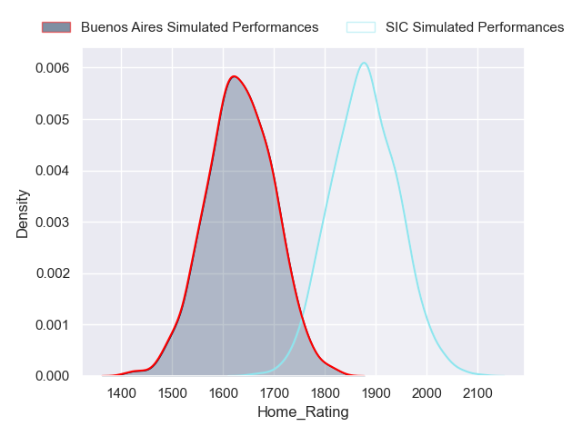
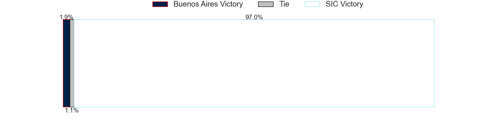
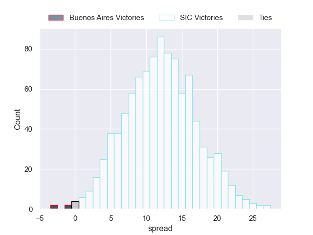

### CUBA V Hindu on 2023/10/21

Average Margin: CUBA by 0.7

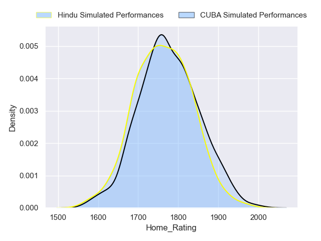

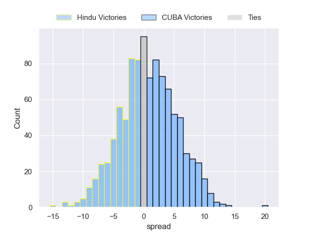

