---  
title: "URBA Top 13 2023 Status"  
date: 2023-08-09 6:00:00 -0500  
categories: model review projection  
layout: article  
aside:  
    toc: true  
---
# Current Team Rankings

# Standings

## Current Standings

| Club                 |   Played |   Wins |   Point Differential |   Losing Bonus Points |   Try Bonus Points |   Competition Points |
|:---------------------|---------:|-------:|---------------------:|----------------------:|-------------------:|---------------------:|
| SIC                  |        5 |      5 |                  117 |                     0 |                nan |                   23 |
| Newman               |        4 |      4 |                   55 |                     0 |                  4 |                   20 |
| Alumni               |        5 |      4 |                    8 |                     0 |                  0 |                   16 |
| Hindu                |        5 |      3 |                   48 |                     1 |                nan |                   15 |
| CUBA                 |        4 |      2 |                   26 |                     1 |                  3 |                   12 |
| Belgrano             |        5 |      2 |                  -30 |                     0 |                  2 |                   12 |
| CASI                 |        4 |      2 |                   18 |                     0 |                  1 |                   11 |
| San Luis             |        4 |      2 |                  -33 |                     0 |                  1 |                    9 |
| Atlético del Rosario |        4 |      1 |                  -26 |                     1 |                  3 |                    8 |
| Buenos Aires         |        4 |      0 |                  -28 |                     2 |                  1 |                    3 |
| La Plata             |        4 |      0 |                  -40 |                     2 |                  1 |                    3 |
| Pucara               |        4 |      0 |                 -115 |                     0 |                  1 |                    1 |

## Projected Remaining Table

| Club                 |   Matches Remaining |   Wins |   Point Differential |   Losing Bonus Points |   Try Bonus Points |   Competition Points |
|:---------------------|--------------------:|-------:|---------------------:|----------------------:|-------------------:|---------------------:|
| SIC                  |                   8 |    6.7 |                 68   |                   1.1 |                6.5 |                 34.4 |
| Newman               |                   8 |    5.8 |                 41.4 |                   1.7 |                5.5 |                 30.2 |
| Hindu                |                   8 |    5.6 |                 36.4 |                   1.9 |                5.3 |                 29.7 |
| Alumni               |                   8 |    5.6 |                 39.8 |                   2   |                5.3 |                 29.6 |
| Belgrano             |                   8 |    4.6 |                 18.9 |                   2.7 |                4.3 |                 25.5 |
| CUBA                 |                   8 |    4.4 |                  5.6 |                   2.8 |                4.1 |                 24.6 |
| Buenos Aires         |                   8 |    4   |                 -6   |                   2   |                3.7 |                 21.7 |
| Atlético del Rosario |                   8 |    3.6 |                -13.5 |                   1.7 |                3.5 |                 19.4 |
| La Plata             |                   8 |    2.7 |                -22.9 |                   2.9 |                2.5 |                 16.3 |
| CASI                 |                   8 |    2.3 |                -27.1 |                   3.4 |                2.1 |                 14.8 |
| San Luis             |                   8 |    2.3 |                -33.2 |                   2.8 |                2.1 |                 14.2 |
| Pucara               |                   8 |    0.3 |               -107.8 |                   1.5 |                0.3 |                  3.1 |

## Projected Total Table

| Club                 |   Total Matches |   Wins |   Point Differential |   Losing Bonus Points |   Try Bonus Points |   Competition Points |
|:---------------------|----------------:|-------:|---------------------:|----------------------:|-------------------:|---------------------:|
| SIC                  |              13 |   11.7 |                185   |                   1.1 |                6.5 |                 57.4 |
| Newman               |              12 |    9.8 |                 96.4 |                   1.7 |                9.5 |                 50.2 |
| Alumni               |              13 |    9.6 |                 47.8 |                   2   |                5.3 |                 45.6 |
| Hindu                |              13 |    8.6 |                 84.4 |                   2.9 |                5.3 |                 44.7 |
| Belgrano             |              13 |    6.6 |                -11.1 |                   2.7 |                6.3 |                 37.5 |
| CUBA                 |              12 |    6.4 |                 31.6 |                   3.8 |                7.1 |                 36.6 |
| Atlético del Rosario |              12 |    4.6 |                -39.5 |                   2.7 |                6.5 |                 27.4 |
| CASI                 |              12 |    4.3 |                 -9.1 |                   3.4 |                3.1 |                 25.8 |
| Buenos Aires         |              12 |    4   |                -34   |                   4   |                4.7 |                 24.7 |
| San Luis             |              12 |    4.3 |                -66.2 |                   2.8 |                3.1 |                 23.2 |
| La Plata             |              12 |    2.7 |                -62.9 |                   4.9 |                3.5 |                 19.3 |
| Pucara               |              12 |    0.3 |               -222.8 |                   1.5 |                1.3 |                  4.1 |

# Completed Match Review

| Model | Percent Correct Predictions | Spread Error |
| ------ | ------ | ------ |
| Club Level | 61.5% | 10.8 |
| Player Level: Lineup | 56.0% | 13.9 |
| Player Level: Minutes | 52.0% | 14.4 |

# Future Predictions

## Week 6

### La Plata V CUBA on 2023/08/12

Average Margin: CUBA by 2.2

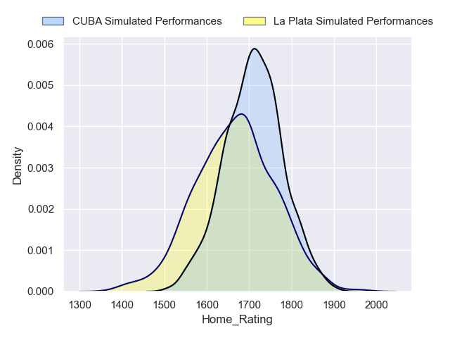

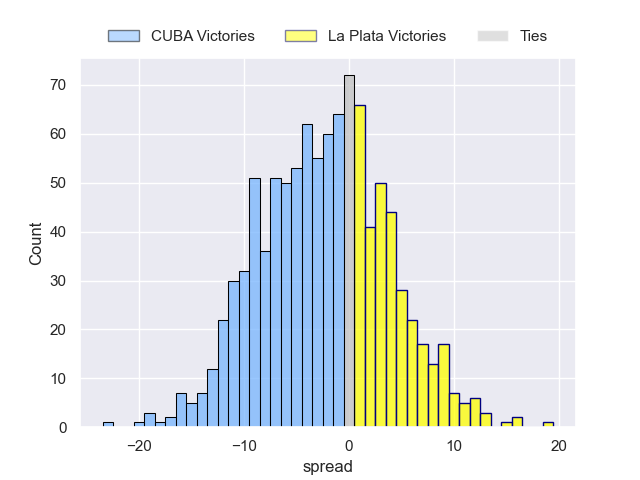

### Buenos Aires V Belgrano on 2023/08/12

Average Margin: Buenos Aires by 0.4

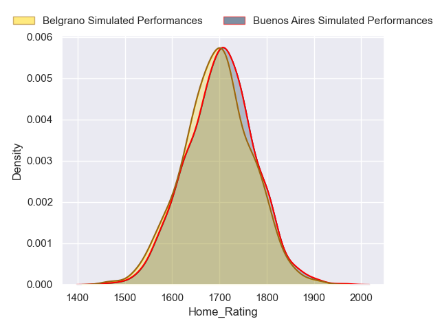

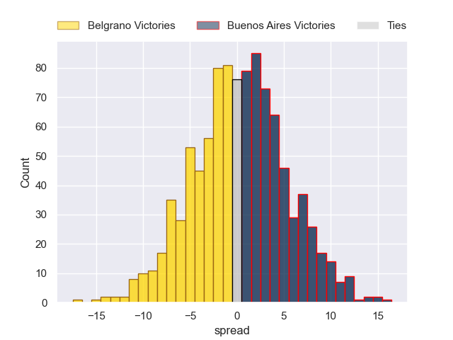

### Alumni V San Luis on 2023/08/12

Average Margin: Alumni by 10.8

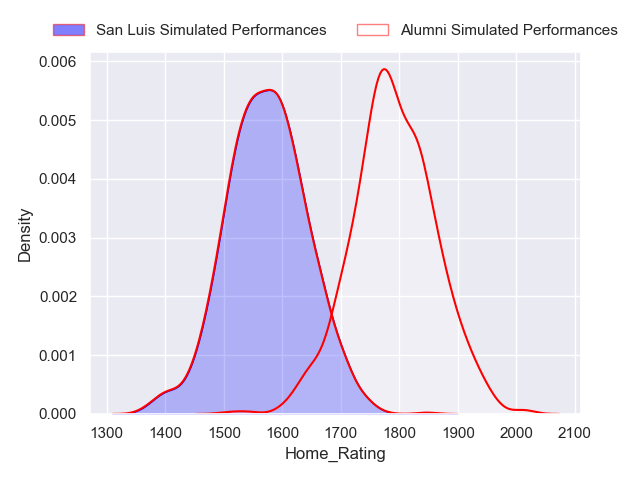
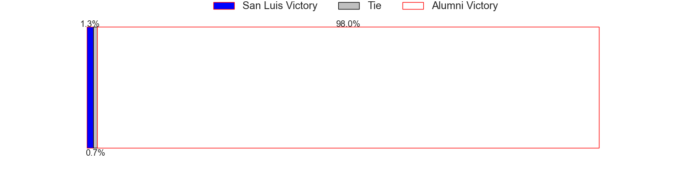
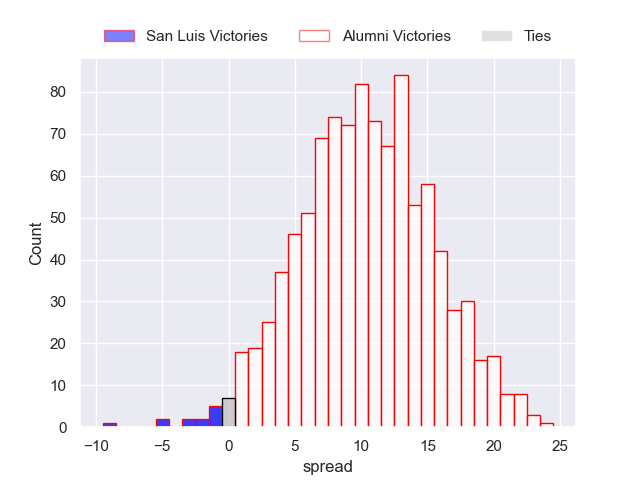

### SIC V Newman on 2023/08/12

Average Margin: SIC by 5.2

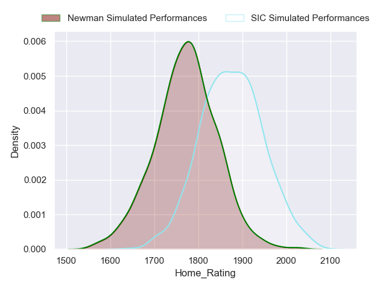
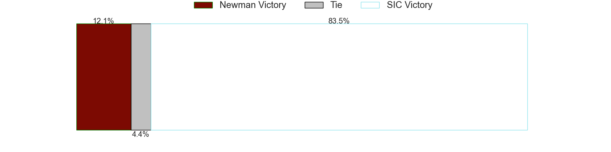
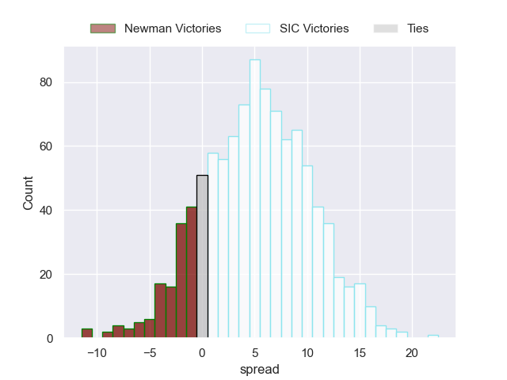

### Atlético del Rosario V Pucara on 2023/08/12

Average Margin: Atlético del Rosario by 13.5

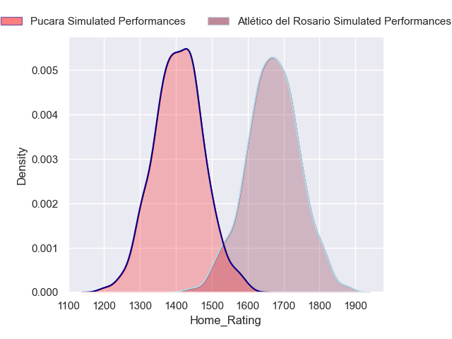
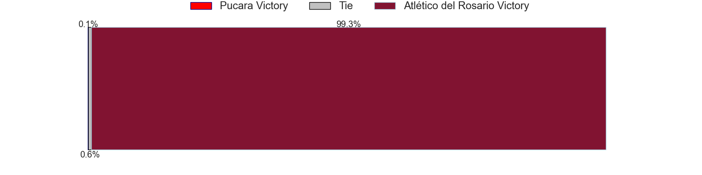
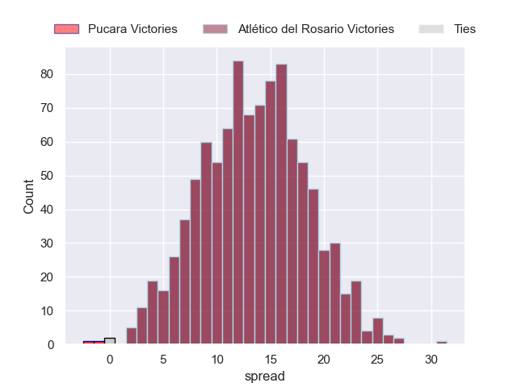

### Hindu V CASI on 2023/08/12

Average Margin: Hindu by 11.0

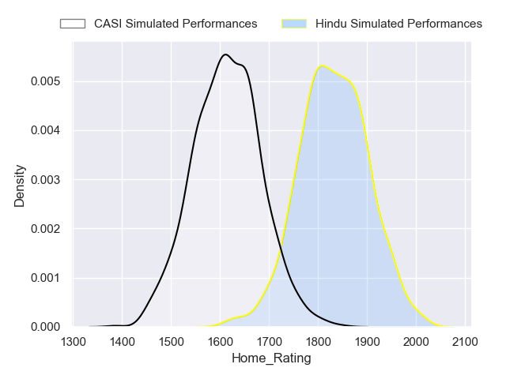

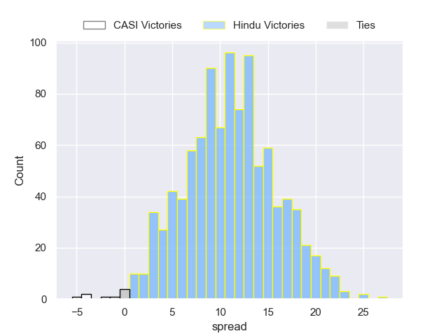

## Week 7

### Belgrano V Alumni on 2023/08/19

Average Margin: Belgrano by 2.1

### San Luis V Hindu on 2023/08/19

Average Margin: Hindu by 6.0

### Newman V Buenos Aires on 2023/08/19

Average Margin: Newman by 10.1

### Pucara V La Plata on 2023/08/19

Average Margin: La Plata by 6.1

### CASI V Atlético del Rosario on 2023/08/19

Average Margin: CASI by 3.7

### CUBA V SIC on 2023/08/19

Average Margin: SIC by 1.5

## Week 8

### La Plata V CASI on 2023/08/26

Average Margin: La Plata by 3.3

### Hindu V Atlético del Rosario on 2023/08/26

Average Margin: Hindu by 11.4

### SIC V Pucara on 2023/08/26

Average Margin: SIC by 23.5

### Buenos Aires V CUBA on 2023/08/26

Average Margin: CUBA by 0.5

### Alumni V Newman on 2023/08/26

Average Margin: Alumni by 0.8

### San Luis V Belgrano on 2023/08/26

Average Margin: Belgrano by 2.9

## Week 9

### Newman V San Luis on 2023/09/02

Average Margin: Newman by 13.0

### Belgrano V Hindu on 2023/09/02

Average Margin: Belgrano by 0.1

### CUBA V Alumni on 2023/09/02

Average Margin: CUBA by 2.8

### Pucara V Buenos Aires on 2023/09/02

Average Margin: Buenos Aires by 8.1

### CASI V SIC on 2023/09/02

Average Margin: SIC by 6.7

### Atlético del Rosario V La Plata on 2023/09/02

Average Margin: Atlético del Rosario by 3.8

## Week 10

### Hindu V La Plata on 2023/09/16

Average Margin: Hindu by 11.6

### San Luis V CUBA on 2023/09/16

Average Margin: CUBA by 3.1

### Buenos Aires V CASI on 2023/09/16

Average Margin: Buenos Aires by 4.8

### Alumni V Pucara on 2023/09/16

Average Margin: Alumni by 19.2

### SIC V Atlético del Rosario on 2023/09/16

Average Margin: SIC by 13.7

### Belgrano V Newman on 2023/09/16

Average Margin: Newman by 0.3

## Week 11

### CUBA V Belgrano on 2023/09/23

Average Margin: CUBA by 4.2

### CASI V Alumni on 2023/09/23

Average Margin: Alumni by 2.4

### Pucara V San Luis on 2023/09/23

Average Margin: San Luis by 5.2

### Atlético del Rosario V Buenos Aires on 2023/09/23

Average Margin: Atlético del Rosario by 2.0

### La Plata V SIC on 2023/09/23

Average Margin: SIC by 7.3

### Newman V Hindu on 2023/09/23

Average Margin: Newman by 3.5

## Week 12

### Newman V CUBA on 2023/09/30

Average Margin: Newman by 6.3

### Belgrano V Pucara on 2023/09/30

Average Margin: Belgrano by 17.9

### San Luis V CASI on 2023/09/30

Average Margin: San Luis by 1.7

### Alumni V Atlético del Rosario on 2023/09/30

Average Margin: Alumni by 9.0

### Buenos Aires V La Plata on 2023/09/30

Average Margin: Buenos Aires by 5.0

### Hindu V SIC on 2023/09/30

Average Margin: Hindu by 1.1

## Week 13

### CUBA V Hindu on 2023/10/21

Average Margin: CUBA by 0.7

### Pucara V Newman on 2023/10/21

Average Margin: Newman by 14.8

### SIC V Buenos Aires on 2023/10/21

Average Margin: SIC by 11.8

### La Plata V Alumni on 2023/10/21

Average Margin: Alumni by 2.9

### Atlético del Rosario V San Luis on 2023/10/21

Average Margin: Atlético del Rosario by 4.8

### CASI V Belgrano on 2023/10/21

Average Margin: Belgrano by 1.1

