---  
title: "URBA Top 13 2023 Status"  
date: 2023-08-17 6:00:00 -0500  
categories: model review projection  
layout: article  
aside:  
    toc: true  
---
# Current Team Rankings

# Standings

## Current Standings

| Club                 |   Played |   Wins |   Point Differential |   Losing Bonus Points |   Try Bonus Points |   Competition Points |
|:---------------------|---------:|-------:|---------------------:|----------------------:|-------------------:|---------------------:|
| SIC                  |        5 |      5 |                  117 |                     0 |                nan |                   23 |
| Newman               |        4 |      4 |                   55 |                     0 |                  4 |                   20 |
| Alumni               |        5 |      4 |                    8 |                     0 |                  0 |                   16 |
| Hindu                |        5 |      3 |                   48 |                     1 |                nan |                   15 |
| CUBA                 |        4 |      2 |                   26 |                     1 |                  3 |                   12 |
| Belgrano             |        5 |      2 |                  -30 |                     0 |                  2 |                   12 |
| CASI                 |        4 |      2 |                   18 |                     0 |                  1 |                   11 |
| San Luis             |        4 |      2 |                  -33 |                     0 |                  1 |                    9 |
| Atlético del Rosario |        4 |      1 |                  -26 |                     1 |                  3 |                    8 |
| Buenos Aires         |        4 |      0 |                  -28 |                     2 |                  1 |                    3 |
| La Plata             |        4 |      0 |                  -40 |                     2 |                  1 |                    3 |
| Pucara               |        4 |      0 |                 -115 |                     0 |                  1 |                    1 |

## Projected Remaining Table

| Club                 |   Matches Remaining |   Wins |   Point Differential |   Losing Bonus Points |   Try Bonus Points |   Competition Points |
|:---------------------|--------------------:|-------:|---------------------:|----------------------:|-------------------:|---------------------:|
| SIC                  |                   7 |    5.9 |                 64   |                   1   |                5.7 |                 30.1 |
| Newman               |                   7 |    5.6 |                 46.8 |                   1.2 |                5.3 |                 28.8 |
| Alumni               |                   7 |    4.6 |                 29.9 |                   1.9 |                4.4 |                 24.7 |
| Hindu                |                   7 |    4.6 |                 25.2 |                   2   |                4.3 |                 24.6 |
| Belgrano             |                   7 |    4.1 |                 18.9 |                   2.3 |                3.8 |                 22.7 |
| CUBA                 |                   7 |    3.8 |                  3.4 |                   2.4 |                3.5 |                 21.2 |
| Buenos Aires         |                   7 |    3.4 |                 -7.2 |                   1.7 |                3.2 |                 18.6 |
| CASI                 |                   7 |    2.4 |                -15.2 |                   3.1 |                2.2 |                 15   |
| Atlético del Rosario |                   7 |    2.6 |                -26.2 |                   1.8 |                2.6 |                 14.6 |
| San Luis             |                   7 |    2.3 |                -22.1 |                   2.5 |                2.1 |                 14.1 |
| La Plata             |                   7 |    2.3 |                -22.6 |                   2.4 |                2.1 |                 13.8 |
| Pucara               |                   7 |    0.3 |                -94.9 |                   1.3 |                0.3 |                  3   |

## Projected Total Table

| Club                 |   Total Matches |   Wins |   Point Differential |   Losing Bonus Points |   Try Bonus Points |   Competition Points |
|:---------------------|----------------:|-------:|---------------------:|----------------------:|-------------------:|---------------------:|
| SIC                  |              12 |   10.9 |                181   |                   1   |                5.7 |                 53.1 |
| Newman               |              11 |    9.6 |                101.8 |                   1.2 |                9.3 |                 48.8 |
| Alumni               |              12 |    8.6 |                 37.9 |                   1.9 |                4.4 |                 40.7 |
| Hindu                |              12 |    7.6 |                 73.2 |                   3   |                4.3 |                 39.6 |
| Belgrano             |              12 |    6.1 |                -11.1 |                   2.3 |                5.8 |                 34.7 |
| CUBA                 |              11 |    5.8 |                 29.4 |                   3.4 |                6.5 |                 33.2 |
| CASI                 |              11 |    4.4 |                  2.8 |                   3.1 |                3.2 |                 26   |
| San Luis             |              11 |    4.3 |                -55.1 |                   2.5 |                3.1 |                 23.1 |
| Atlético del Rosario |              11 |    3.6 |                -52.2 |                   2.8 |                5.6 |                 22.6 |
| Buenos Aires         |              11 |    3.4 |                -35.2 |                   3.7 |                4.2 |                 21.6 |
| La Plata             |              11 |    2.3 |                -62.6 |                   4.4 |                3.1 |                 16.8 |
| Pucara               |              11 |    0.3 |               -209.9 |                   1.3 |                1.3 |                  4   |

# Completed Match Review

| Model | Percent Correct Predictions | Spread Error |
| ------ | ------ | ------ |
| Club Level | 61.5% | 10.8 |
| Player Level: Lineup | 56.0% | 14.0 |
| Player Level: Minutes | 52.0% | 14.5 |

# Future Predictions

## Week 6

### Newman V Buenos Aires on 2023/08/19

Average Margin: Newman by 10.2

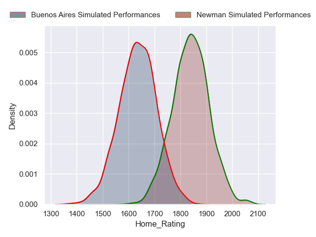

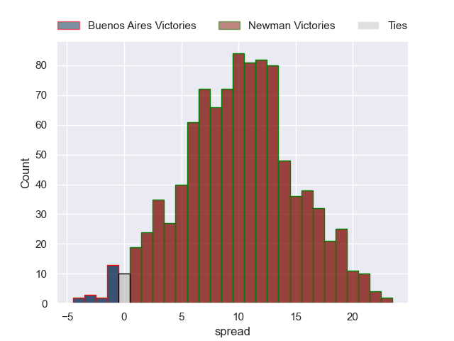

### CUBA V SIC on 2023/08/19

Average Margin: SIC by 1.8

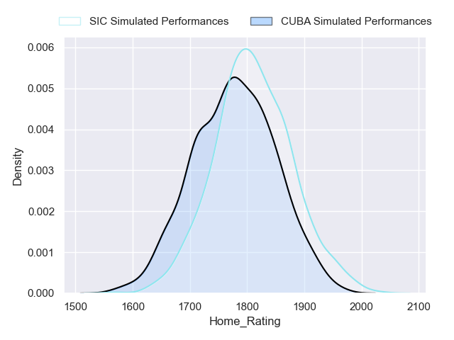

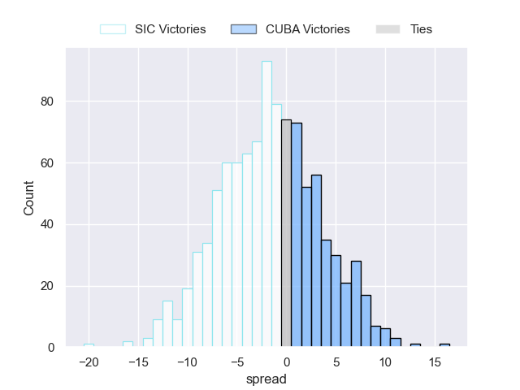

### CASI V Atlético del Rosario on 2023/08/19

Average Margin: CASI by 3.4

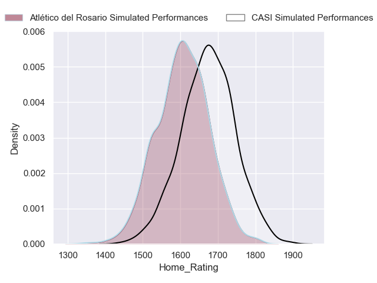
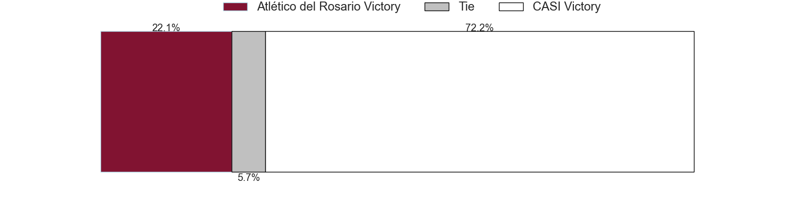
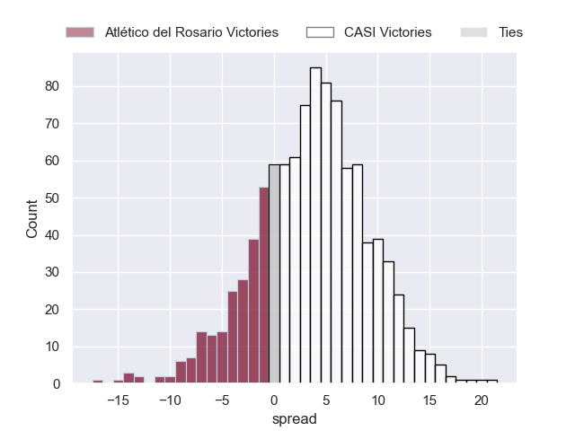

### Pucara V La Plata on 2023/08/19

Average Margin: La Plata by 6.0

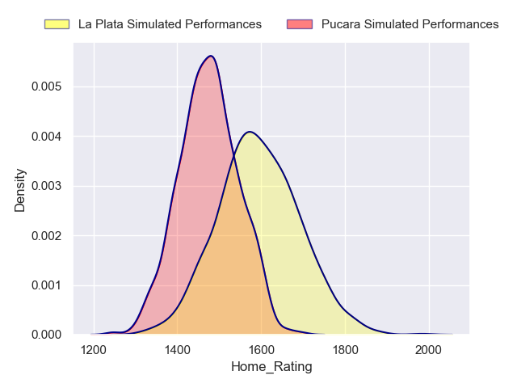
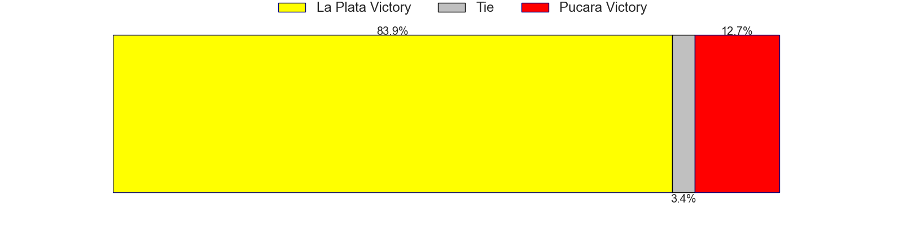
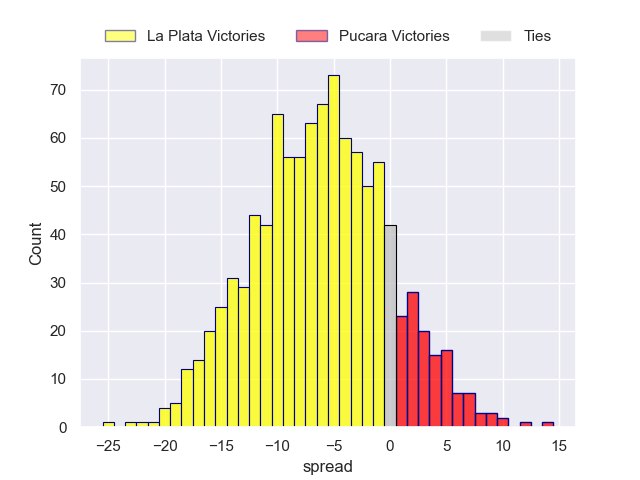

### San Luis V Hindu on 2023/08/19

Average Margin: Hindu by 5.9

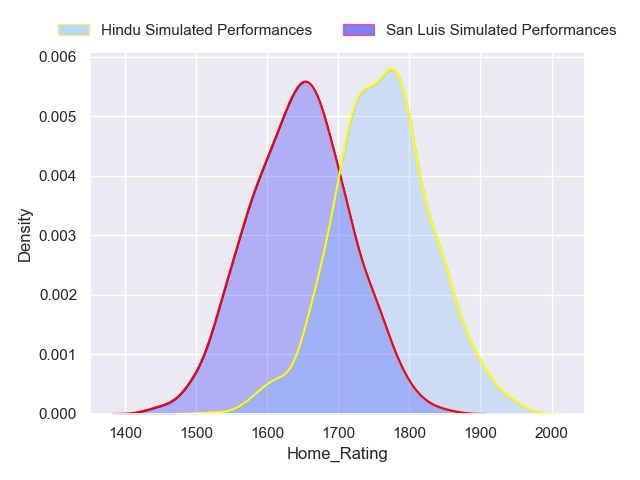

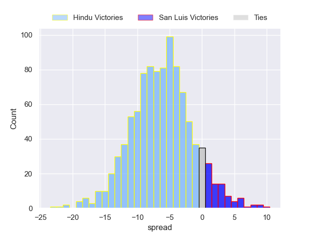

### Belgrano V Alumni on 2023/08/19

Average Margin: Belgrano by 2.0

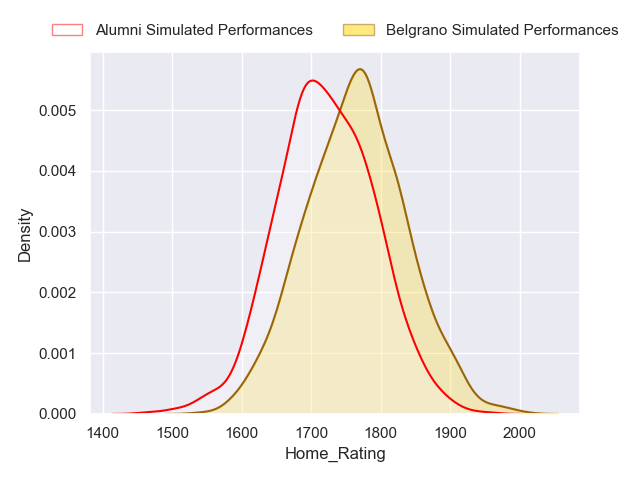

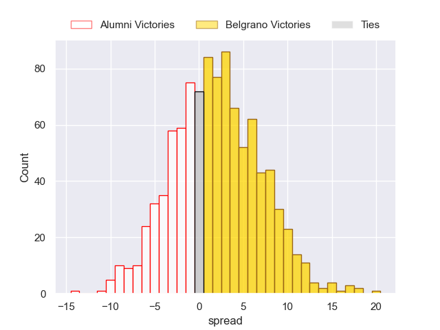

## Week 7

### SIC V Pucara on 2023/08/26

Average Margin: SIC by 23.7

### Alumni V Newman on 2023/08/26

Average Margin: Alumni by 1.0

### Buenos Aires V CUBA on 2023/08/26

Average Margin: CUBA by 0.8

### La Plata V CASI on 2023/08/26

Average Margin: La Plata by 2.7

### Hindu V Atlético del Rosario on 2023/08/26

Average Margin: Hindu by 11.6

### San Luis V Belgrano on 2023/08/26

Average Margin: Belgrano by 2.9

## Week 8

### CASI V SIC on 2023/09/02

Average Margin: SIC by 6.6

### Atlético del Rosario V La Plata on 2023/09/02

Average Margin: Atlético del Rosario by 3.9

### Pucara V Buenos Aires on 2023/09/02

Average Margin: Buenos Aires by 8.0

### CUBA V Alumni on 2023/09/02

Average Margin: CUBA by 2.5

### Newman V San Luis on 2023/09/02

Average Margin: Newman by 13.0

### Belgrano V Hindu on 2023/09/02

Average Margin: Hindu by 0.2

## Week 9

### Hindu V La Plata on 2023/09/16

Average Margin: Hindu by 11.5

### SIC V Atlético del Rosario on 2023/09/16

Average Margin: SIC by 13.5

### Buenos Aires V CASI on 2023/09/16

Average Margin: Buenos Aires by 4.5

### Alumni V Pucara on 2023/09/16

Average Margin: Alumni by 19.3

### Belgrano V Newman on 2023/09/16

Average Margin: Newman by 0.1

### San Luis V CUBA on 2023/09/16

Average Margin: CUBA by 3.2

## Week 10

### La Plata V SIC on 2023/09/23

Average Margin: SIC by 7.7

### Pucara V San Luis on 2023/09/23

Average Margin: San Luis by 5.3

### Atlético del Rosario V Buenos Aires on 2023/09/23

Average Margin: Atlético del Rosario by 2.2

### CASI V Alumni on 2023/09/23

Average Margin: Alumni by 2.4

### Newman V Hindu on 2023/09/23

Average Margin: Newman by 3.7

### CUBA V Belgrano on 2023/09/23

Average Margin: CUBA by 4.3

## Week 11

### Alumni V Atlético del Rosario on 2023/09/30

Average Margin: Alumni by 9.0

### San Luis V CASI on 2023/09/30

Average Margin: San Luis by 1.8

### Belgrano V Pucara on 2023/09/30

Average Margin: Belgrano by 18.1

### Hindu V SIC on 2023/09/30

Average Margin: Hindu by 1.1

### Newman V CUBA on 2023/09/30

Average Margin: Newman by 6.3

### Buenos Aires V La Plata on 2023/09/30

Average Margin: Buenos Aires by 5.6

## Week 12

### Atlético del Rosario V San Luis on 2023/10/21

Average Margin: Atlético del Rosario by 4.8

### La Plata V Alumni on 2023/10/21

Average Margin: Alumni by 3.1

### Pucara V Newman on 2023/10/21

Average Margin: Newman by 15.1

### CUBA V Hindu on 2023/10/21

Average Margin: CUBA by 0.9

### SIC V Buenos Aires on 2023/10/21

Average Margin: SIC by 12.3

### CASI V Belgrano on 2023/10/21

Average Margin: Belgrano by 0.9

