---  
title: "URBA Top 13 2023 Status"  
date: 2023-09-13 6:00:00 -0500  
categories: model review projection  
layout: article  
aside:  
    toc: true  
---
# Current Team Rankings

# Standings

## Current Standings

| Club                 |   Played |   Wins |   Point Differential |   Losing Bonus Points |   Try Bonus Points |   Competition Points |
|:---------------------|---------:|-------:|---------------------:|----------------------:|-------------------:|---------------------:|
| SIC                  |        5 |      5 |                  117 |                     0 |                nan |                   23 |
| Newman               |        4 |      4 |                   55 |                     0 |                  4 |                   20 |
| Alumni               |        5 |      4 |                    8 |                     0 |                  0 |                   16 |
| Hindu                |        5 |      3 |                   48 |                     1 |                nan |                   15 |
| CUBA                 |        4 |      2 |                   26 |                     1 |                  3 |                   12 |
| Belgrano             |        5 |      2 |                  -30 |                     0 |                  2 |                   12 |
| CASI                 |        4 |      2 |                   18 |                     0 |                  1 |                   11 |
| San Luis             |        4 |      2 |                  -33 |                     0 |                  1 |                    9 |
| Atlético del Rosario |        4 |      1 |                  -26 |                     1 |                  3 |                    8 |
| Buenos Aires         |        4 |      0 |                  -28 |                     2 |                  1 |                    3 |
| La Plata             |        4 |      0 |                  -40 |                     2 |                  1 |                    3 |
| Pucara               |        4 |      0 |                 -115 |                     0 |                  1 |                    1 |

## Projected Remaining Table

| Club                 |   Matches Remaining |   Wins |   Point Differential |   Losing Bonus Points |   Try Bonus Points |   Competition Points |
|:---------------------|--------------------:|-------:|---------------------:|----------------------:|-------------------:|---------------------:|
| Alumni               |                   4 |    3.3 |                 33   |                   0.6 |                3.2 |                 17.1 |
| SIC                  |                   4 |    3.3 |                 31.4 |                   0.6 |                3.2 |                 16.9 |
| Newman               |                   4 |    3.2 |                 24.4 |                   0.7 |                3   |                 16.4 |
| Belgrano             |                   4 |    2.3 |                 14.7 |                   1.3 |                2.2 |                 12.7 |
| Hindu                |                   4 |    2.3 |                  8.3 |                   1.3 |                2.1 |                 12.4 |
| CUBA                 |                   4 |    2.2 |                  1.4 |                   1.3 |                2   |                 11.9 |
| San Luis             |                   4 |    1.9 |                 -1.6 |                   1.4 |                1.8 |                 10.8 |
| Buenos Aires         |                   4 |    2   |                 -3.9 |                   1   |                1.9 |                 10.8 |
| Atlético del Rosario |                   4 |    1.5 |                -15.5 |                   0.9 |                1.5 |                  8.4 |
| CASI                 |                   4 |    1.3 |                 -9   |                   1.9 |                1.1 |                  8.3 |
| La Plata             |                   4 |    0.6 |                -26.6 |                   1.4 |                0.6 |                  4.6 |
| Pucara               |                   4 |    0.2 |                -56.9 |                   0.6 |                0.2 |                  1.4 |

## Projected Total Table

| Club                 |   Total Matches |   Wins |   Point Differential |   Losing Bonus Points |   Try Bonus Points |   Competition Points |
|:---------------------|----------------:|-------:|---------------------:|----------------------:|-------------------:|---------------------:|
| SIC                  |               9 |    8.3 |                148.4 |                   0.6 |                3.2 |                 39.9 |
| Newman               |               8 |    7.2 |                 79.4 |                   0.7 |                7   |                 36.4 |
| Alumni               |               9 |    7.3 |                 41   |                   0.6 |                3.2 |                 33.1 |
| Hindu                |               9 |    5.3 |                 56.3 |                   2.3 |                2.1 |                 27.4 |
| Belgrano             |               9 |    4.3 |                -15.3 |                   1.3 |                4.2 |                 24.7 |
| CUBA                 |               8 |    4.2 |                 27.4 |                   2.3 |                5   |                 23.9 |
| San Luis             |               8 |    3.9 |                -34.6 |                   1.4 |                2.8 |                 19.8 |
| CASI                 |               8 |    3.3 |                  9   |                   1.9 |                2.1 |                 19.3 |
| Atlético del Rosario |               8 |    2.5 |                -41.5 |                   1.9 |                4.5 |                 16.4 |
| Buenos Aires         |               8 |    2   |                -31.9 |                   3   |                2.9 |                 13.8 |
| La Plata             |               8 |    0.6 |                -66.6 |                   3.4 |                1.6 |                  7.6 |
| Pucara               |               8 |    0.2 |               -171.9 |                   0.6 |                1.2 |                  2.4 |

# Completed Match Review

| Model | Percent Correct Predictions | Spread Error |
| ------ | ------ | ------ |
| Club Level | 61.5% | 10.8 |
| Player Level: Lineup | 60.0% | 12.9 |
| Player Level: Minutes | 64.0% | 13.1 |

# Future Predictions

## Week 6

### Hindu V La Plata on 2023/09/16

Average Margin: Hindu by 11.8

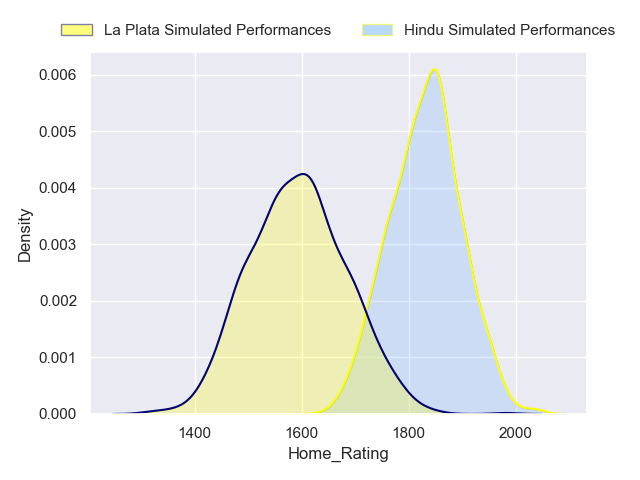

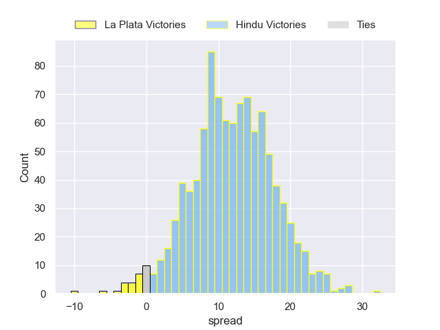

### SIC V Atlético del Rosario on 2023/09/16

Average Margin: SIC by 13.8

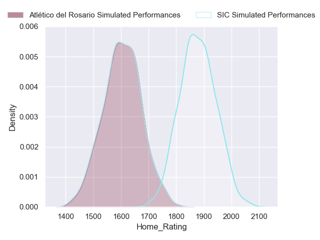
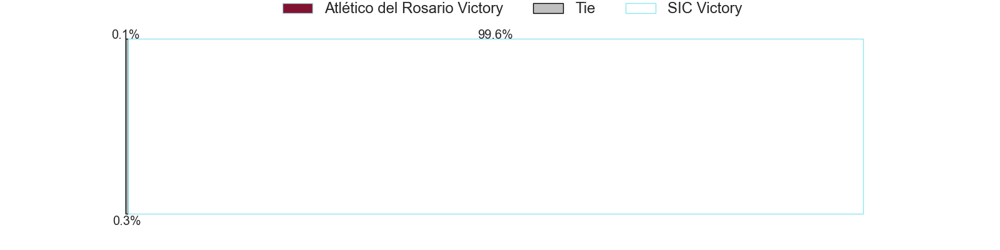
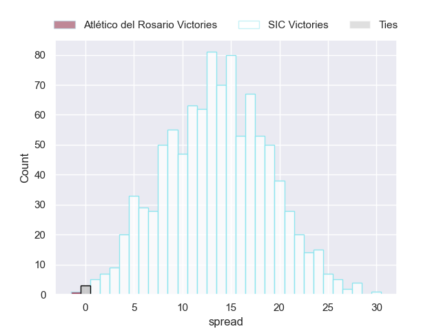

### Alumni V Pucara on 2023/09/16

Average Margin: Alumni by 19.4

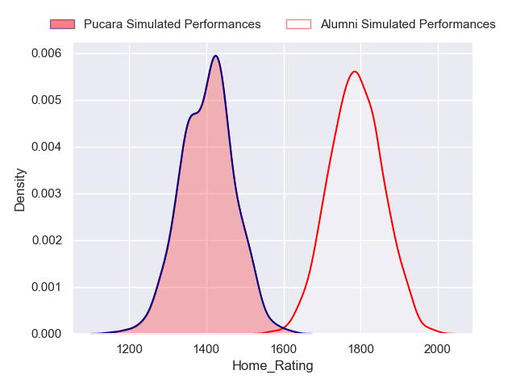
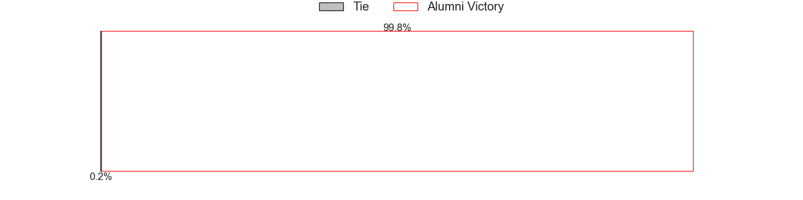
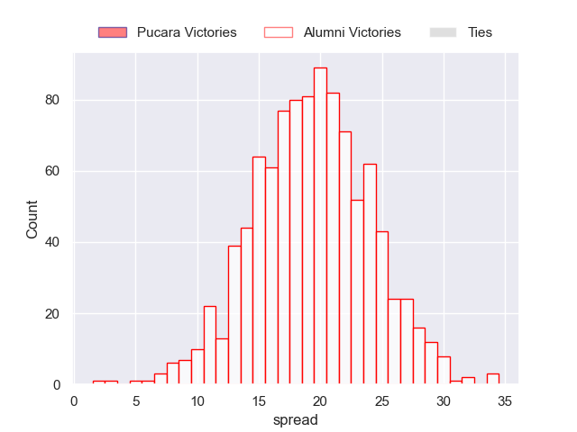

### Buenos Aires V CASI on 2023/09/16

Average Margin: Buenos Aires by 4.7

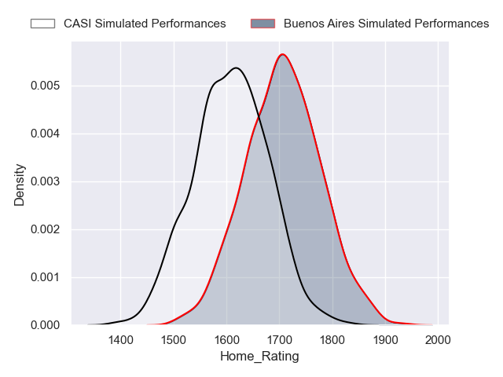

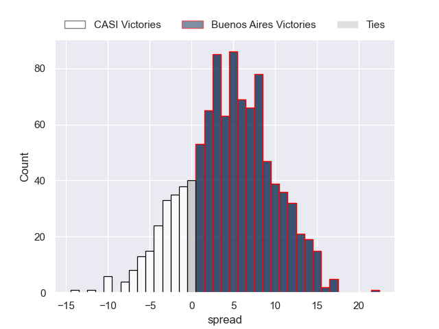

### Belgrano V Newman on 2023/09/16

Average Margin: Newman by 0.1

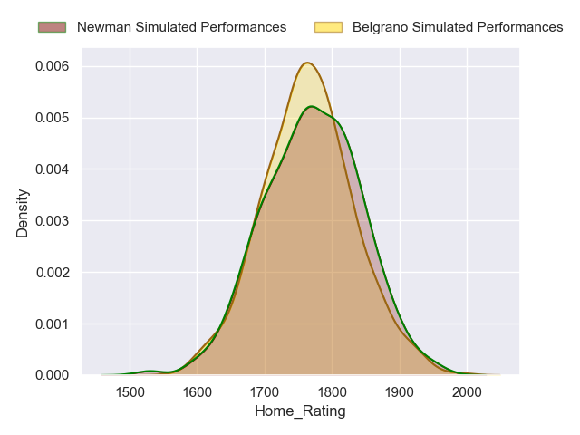

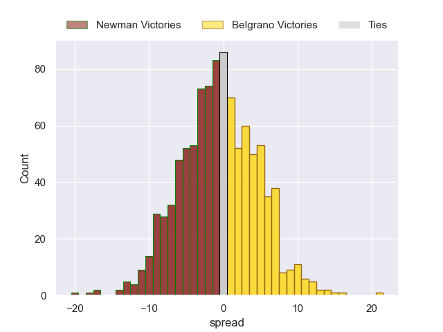

### San Luis V CUBA on 2023/09/16

Average Margin: CUBA by 3.4

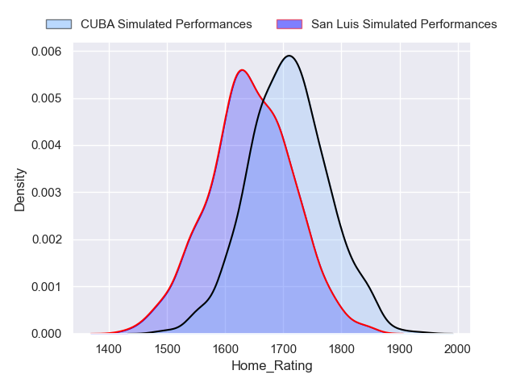
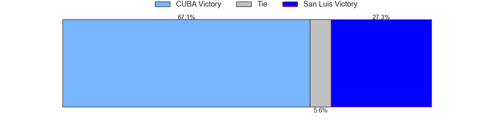
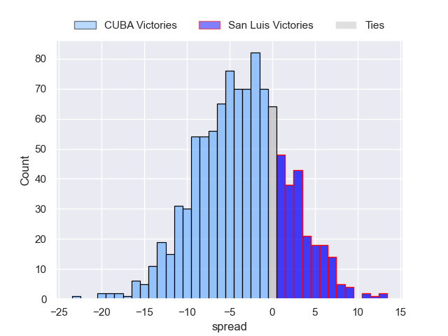

## Week 7

### La Plata V SIC on 2023/09/23

Average Margin: SIC by 7.3

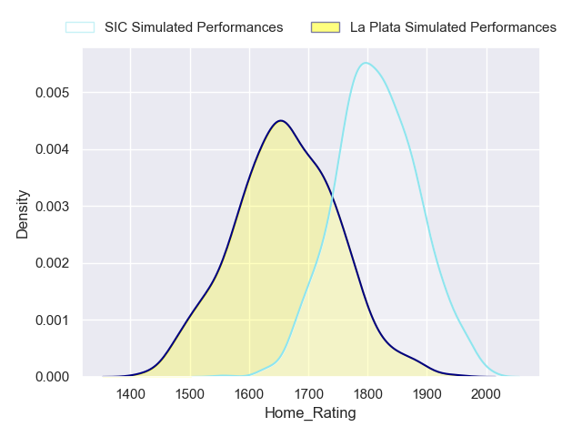
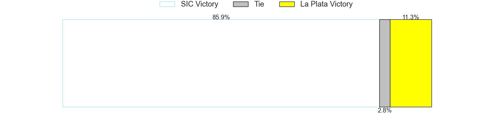
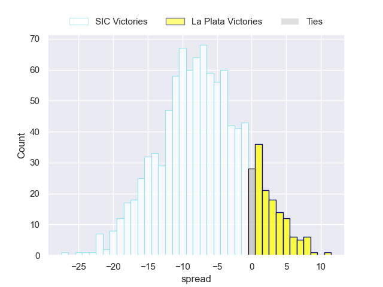

### Atlético del Rosario V Buenos Aires on 2023/09/23

Average Margin: Atlético del Rosario by 2.1

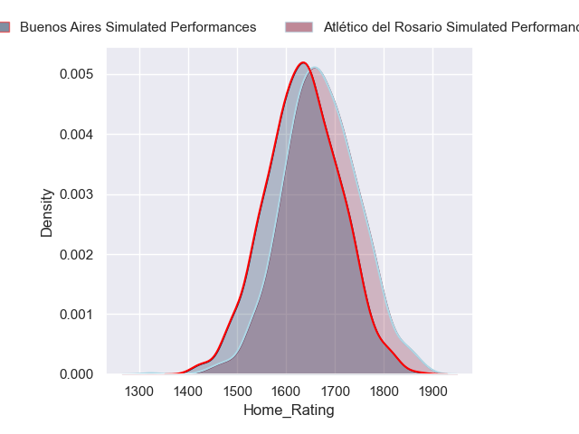
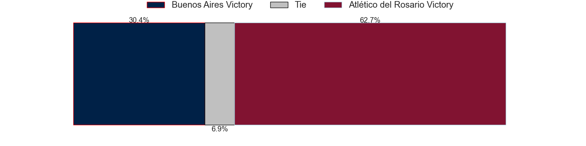
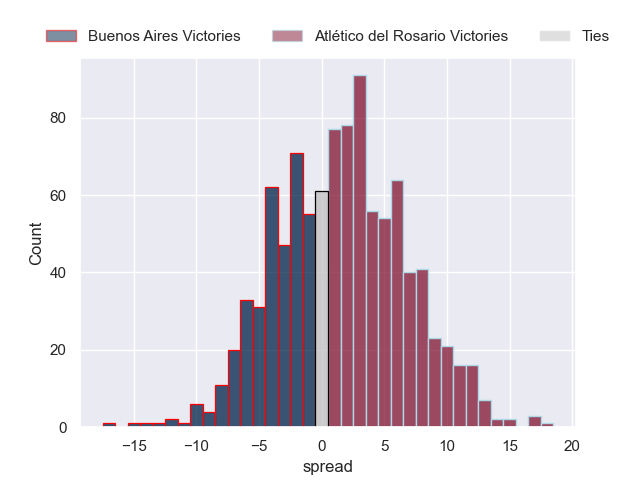

### Pucara V San Luis on 2023/09/23

Average Margin: San Luis by 5.2

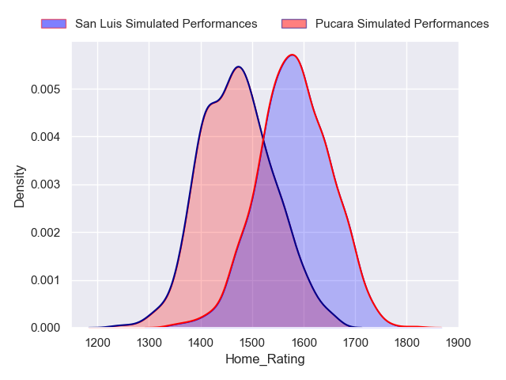
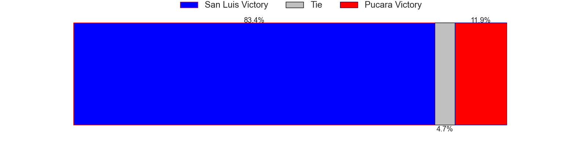
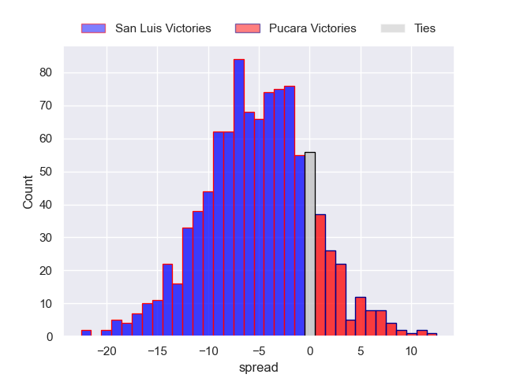

### Newman V Hindu on 2023/09/23

Average Margin: Newman by 3.6

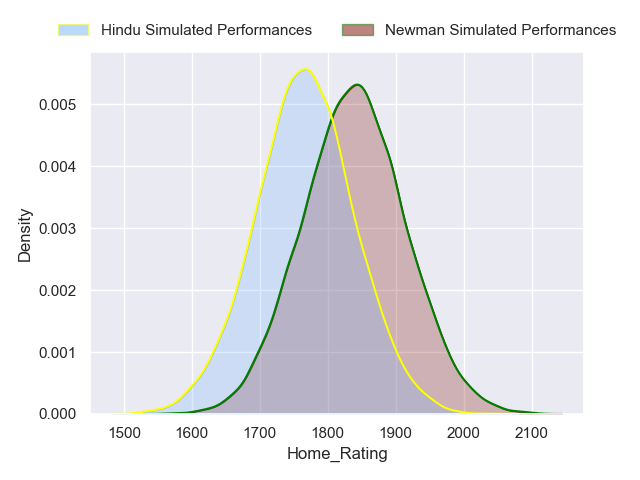

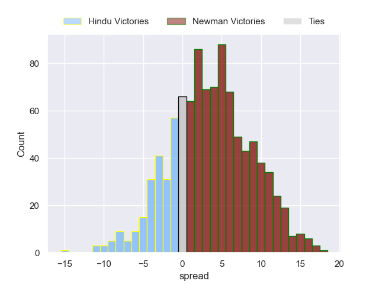

### CASI V Alumni on 2023/09/23

Average Margin: Alumni by 2.0

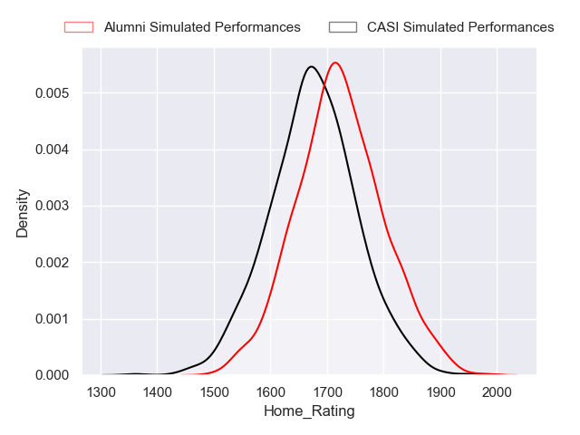
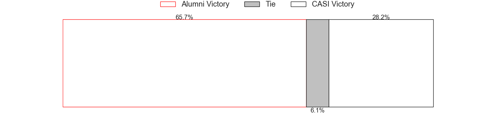
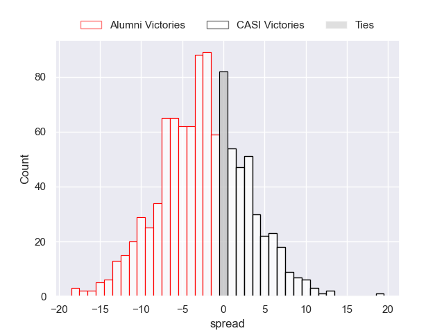

### CUBA V Belgrano on 2023/09/23

Average Margin: CUBA by 3.8

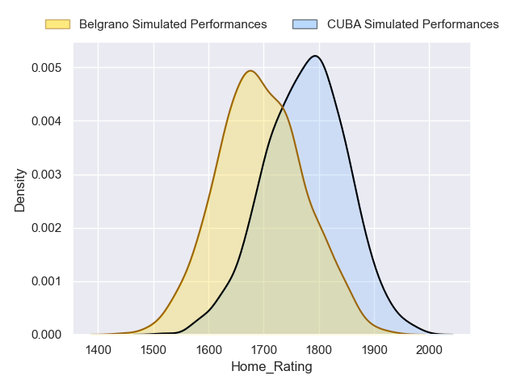

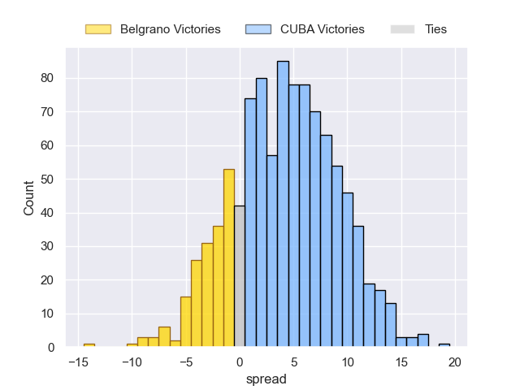

## Week 8

### Hindu V SIC on 2023/09/30

Average Margin: Hindu by 1.0

### Buenos Aires V La Plata on 2023/09/30

Average Margin: Buenos Aires by 5.3

### Alumni V Atlético del Rosario on 2023/09/30

Average Margin: Alumni by 9.2

### San Luis V CASI on 2023/09/30

Average Margin: San Luis by 1.6

### Belgrano V Pucara on 2023/09/30

Average Margin: Belgrano by 18.0

### Newman V CUBA on 2023/09/30

Average Margin: Newman by 6.4

## Week 9

### CUBA V Hindu on 2023/10/21

Average Margin: CUBA by 0.6

### Pucara V Newman on 2023/10/21

Average Margin: Newman by 14.8

### Atlético del Rosario V San Luis on 2023/10/21

Average Margin: Atlético del Rosario by 5.0

### La Plata V Alumni on 2023/10/21

Average Margin: Alumni by 2.8

### CASI V Belgrano on 2023/10/21

Average Margin: Belgrano by 1.0

### SIC V Buenos Aires on 2023/10/21

Average Margin: SIC by 11.9

